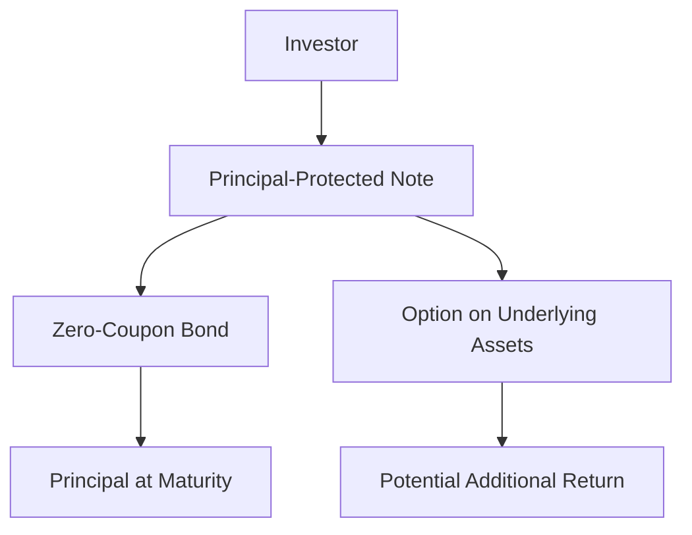

## 23.8 Principal-Protected Notes (PPN)

Principal-Protected Notes (PPNs) are a unique type of investment product that combines the security of a debt instrument with the potential for higher returns linked to the performance of underlying assets. In this section, we will delve into the features, structure, and strategic considerations of PPNs, particularly within the Canadian financial context.

### What are Principal-Protected Notes?

Principal-Protected Notes are structured financial products that guarantee the return of the investor's principal at maturity, regardless of the performance of the underlying assets. This feature makes PPNs an attractive option for risk-averse investors who seek exposure to potentially higher returns without risking their initial investment.

#### Basic Features of PPNs

1. **Principal Protection**: The defining characteristic of PPNs is the protection of the principal amount. This means that investors are assured of receiving at least the amount they initially invested when the note matures.

2. **Maturity Date**: PPNs have a specified maturity date, typically ranging from 3 to 10 years. The principal protection applies only if the note is held until maturity.

3. **Underlying Assets**: PPNs are linked to the performance of underlying assets, which can include equity indexes, mutual funds, or other financial instruments. The return on the PPN is contingent upon the performance of these assets.

4. **Potential for Higher Returns**: While the principal is protected, the return on investment can vary based on the performance of the underlying assets. This provides the potential for higher returns compared to traditional fixed-income securities.

### The Debt Instrument Nature of PPNs

PPNs are essentially debt instruments issued by financial institutions, such as banks. As debt instruments, they carry a credit risk associated with the issuer. This means that the principal protection is contingent upon the issuer's ability to meet its financial obligations. In Canada, major banks like RBC and TD are common issuers of PPNs, providing a level of confidence due to their strong credit ratings.

### Linking PPNs to Underlying Assets

The performance of PPNs is linked to various underlying assets, which can include:

- **Equity Indexes**: Many PPNs are tied to the performance of major equity indexes, such as the S&P/TSX Composite Index. This allows investors to benefit from potential equity market gains.

- **Mutual Funds**: Some PPNs are linked to the performance of specific mutual funds, offering exposure to diversified portfolios managed by professional fund managers.

- **Other Financial Instruments**: PPNs can also be linked to commodities, currencies, or a basket of assets, providing a wide range of investment opportunities.

### Analyzing the Structure of PPNs

The structure of PPNs is typically based on a combination of a zero-coupon bond and an option. This structure is designed to provide principal protection while allowing for participation in the performance of the underlying assets.

#### Zero-Coupon Bond Component

The zero-coupon bond component of a PPN is responsible for the principal protection. A zero-coupon bond is a type of bond that does not pay periodic interest but is issued at a discount to its face value. At maturity, the bond pays its face value, which is used to return the investor's principal.

#### Option Component

The option component of a PPN provides the potential for higher returns. This component is typically an option or a series of options on the underlying assets. The performance of these options determines the additional return that the investor may receive at maturity.

### Visualizing the Structure of PPNs

Below is a diagram illustrating the basic structure of a Principal-Protected Note:

### Practical Example: Canadian PPN Linked to the S&P/TSX Composite Index

Consider a PPN issued by a major Canadian bank, linked to the S&P/TSX Composite Index, with a maturity of 5 years. The investor's principal is protected, and the potential return is based on the performance of the index over the investment period. If the index performs well, the investor receives a return in addition to the principal. If the index performs poorly, the investor still receives the principal amount at maturity.

### Best Practices and Considerations

- **Issuer Creditworthiness**: Evaluate the creditworthiness of the issuer, as the principal protection is dependent on the issuer's ability to meet its obligations.

- **Investment Horizon**: Ensure that the investment horizon aligns with the maturity date of the PPN, as early redemption may not guarantee principal protection.

- **Diversification**: Consider PPNs as part of a diversified investment portfolio to balance risk and return.

- **Regulatory Compliance**: Stay informed about Canadian financial regulations affecting PPNs, such as disclosure requirements and investor protections.

### Common Pitfalls and Challenges

- **Complexity**: PPNs can be complex financial instruments, and investors should fully understand the terms and conditions before investing.

- **Limited Liquidity**: PPNs may have limited liquidity, making it difficult to sell before maturity without incurring losses.

- **Market Risk**: While the principal is protected, the potential return is subject to market risk, and there is no guarantee of additional returns.

### Conclusion

Principal-Protected Notes offer a compelling investment option for those seeking capital preservation with the potential for higher returns. By understanding their structure and features, investors can make informed decisions and effectively incorporate PPNs into their investment strategies.

## Quiz Time!



### What is the primary feature of Principal-Protected Notes (PPNs)?

- [x] Principal protection at maturity
- [ ] Guaranteed high returns
- [ ] Monthly interest payments
- [ ] No credit risk

> **Explanation:** The primary feature of PPNs is the protection of the principal amount at maturity, ensuring that investors receive at least their initial investment back.

### What type of financial instrument are PPNs?

- [x] Debt instrument
- [ ] Equity instrument
- [ ] Derivative
- [ ] Mutual fund

> **Explanation:** PPNs are debt instruments issued by financial institutions, carrying credit risk associated with the issuer.

### Which component of a PPN provides the principal protection?

- [x] Zero-coupon bond
- [ ] Equity index
- [ ] Option
- [ ] Mutual fund

> **Explanation:** The zero-coupon bond component of a PPN is responsible for the principal protection, as it matures at face value.

### What determines the potential additional return of a PPN?

- [x] Performance of the underlying assets
- [ ] Fixed interest rate
- [ ] Issuer's credit rating
- [ ] Maturity date

> **Explanation:** The potential additional return of a PPN is determined by the performance of the underlying assets, such as equity indexes or mutual funds.

### Which of the following is a common underlying asset for PPNs?

- [x] Equity indexes
- [ ] Real estate
- [x] Mutual funds
- [ ] Government bonds

> **Explanation:** Common underlying assets for PPNs include equity indexes and mutual funds, providing exposure to market performance.

### What is a potential challenge of investing in PPNs?

- [x] Limited liquidity
- [ ] Guaranteed high returns
- [ ] No credit risk
- [ ] High interest rates

> **Explanation:** A potential challenge of investing in PPNs is limited liquidity, as they may be difficult to sell before maturity without incurring losses.

### How can investors mitigate the complexity of PPNs?

- [x] Fully understand terms and conditions
- [ ] Ignore issuer creditworthiness
- [x] Diversify their portfolio
- [ ] Focus only on potential returns

> **Explanation:** Investors can mitigate the complexity of PPNs by fully understanding the terms and conditions and diversifying their portfolio.

### What is the role of the option component in a PPN?

- [x] Provides potential for higher returns
- [ ] Guarantees principal protection
- [ ] Determines maturity date
- [ ] Pays periodic interest

> **Explanation:** The option component of a PPN provides the potential for higher returns based on the performance of the underlying assets.

### Why is issuer creditworthiness important for PPNs?

- [x] Principal protection depends on issuer's ability to meet obligations
- [ ] It affects the maturity date
- [ ] It guarantees high returns
- [ ] It determines the underlying assets

> **Explanation:** Issuer creditworthiness is important for PPNs because the principal protection is contingent upon the issuer's ability to meet its financial obligations.

### True or False: PPNs guarantee high returns regardless of market performance.

- [ ] True
- [x] False

> **Explanation:** False. PPNs do not guarantee high returns; the potential return is contingent upon the performance of the underlying assets.


