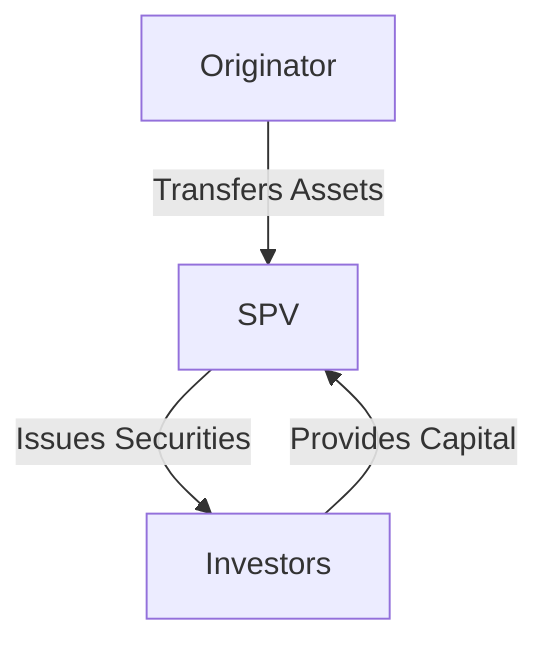

## 23.7 Asset-Backed Securities

Asset-Backed Securities (ABS) play a pivotal role in modern financial markets by transforming illiquid assets into tradable securities. This section delves into the definition, structure, and benefits of ABS, with a focus on the Canadian financial landscape.

### Understanding Asset-Backed Securities

**Asset-Backed Securities (ABS)** are financial instruments backed by a pool of assets, typically loans or receivables. These assets can range from credit card receivables and auto loans to more complex structures like Mortgage-Backed Securities (MBS). ABS provide a mechanism for financial institutions to convert illiquid assets into liquid securities, enhancing market liquidity and offering investors diversified risk exposure.

### The Securitization Process

The creation of ABS involves a process known as **securitization**, which includes several key participants and steps:

1. **Originators**: These are typically financial institutions that generate loans or receivables. For example, a bank issuing credit card loans acts as the originator.

2. **Special Purpose Vehicles (SPVs)**: An SPV is a subsidiary created to isolate financial risk. The originator transfers the pool of assets to the SPV, which then holds these assets. This separation ensures that the assets are bankruptcy-remote, protecting investors from the originator's financial troubles.

3. **Issuers**: The SPV issues securities backed by the asset pool. These securities are then sold to investors in the financial markets.

The following diagram illustrates the securitization process:

### Structure of Asset-Backed Securities

ABS are structured into **tranches**, each with distinct risk and return profiles. Tranches are designed to cater to different investor risk appetites:

- **Senior Tranches**: These have the highest credit rating and are the first to receive payments. They offer lower yields due to their lower risk.

- **Mezzanine Tranches**: These carry moderate risk and offer higher yields compared to senior tranches.

- **Equity Tranches**: Also known as junior tranches, these are the riskiest and last to receive payments. They offer the highest potential returns.

This tranching system allows investors to choose securities that align with their risk tolerance and investment goals.

### Examples of Asset-Backed Securities

1. **Mortgage-Backed Securities (MBS)**: These are ABS backed by mortgage loans. In Canada, MBS are often issued by the Canada Mortgage and Housing Corporation (CMHC), providing a government-backed guarantee.

2. **Asset-Backed Commercial Paper (ABCP)**: Short-term securities backed by various assets, including trade receivables and auto loans. ABCP provides liquidity to financial institutions and is a popular investment for money market funds.

### Benefits of Asset-Backed Securities

ABS offer several advantages to both financial institutions and investors:

- **Liquidity**: By converting illiquid assets into tradable securities, ABS enhance market liquidity, allowing institutions to free up capital for further lending.

- **Risk Distribution**: Securitization spreads risk across a broad base of investors, reducing the concentration of risk on the originator's balance sheet.

- **Diversification**: Investors gain access to a diversified pool of assets, which can improve portfolio risk-adjusted returns.

### Canadian Context and Regulations

In Canada, the regulation of ABS falls under the purview of the Canadian Securities Administrators (CSA) and the Office of the Superintendent of Financial Institutions (OSFI). These bodies ensure transparency and stability in the securitization market.

### Additional Resources

For those interested in further exploration of ABS, consider the following resources:

- **Books**: *"Asset Securitization: Theory and Practice"* by David Lando provides an in-depth look at the theoretical and practical aspects of securitization.

- **Online Resources**: The CFA Institute offers a comprehensive overview of ABS basics, accessible at [CFA Institute: Asset-Backed Securities Basics](https://www.cfainstitute.org/en/research/foundation/2018/asset-backed-securities-basics).

### Conclusion

Asset-Backed Securities are a cornerstone of modern financial markets, offering liquidity, risk distribution, and diversification benefits. Understanding the securitization process and the structure of ABS is crucial for finance professionals navigating the Canadian investment landscape.

### **Ready to Test Your Knowledge?**

**Practice 10 Essential CSC Exam Questions to Master Your Certification**



### What is an Asset-Backed Security (ABS)?

- [x] A security backed by a pool of assets, such as loans or receivables.
- [ ] A security backed by government bonds.
- [ ] A security backed by corporate stocks.
- [ ] A security backed by foreign exchange reserves.

> **Explanation:** An ABS is a financial instrument backed by a pool of assets, typically loans or receivables, providing liquidity and risk distribution.

### What is the role of a Special Purpose Vehicle (SPV) in securitization?

- [x] To isolate financial risk and hold securitized assets.
- [ ] To manage the originator's daily operations.
- [ ] To provide insurance for the securities.
- [ ] To act as a regulatory body.

> **Explanation:** An SPV is created to isolate financial risk and hold the securitized assets, ensuring they are bankruptcy-remote.

### Which tranche in an ABS structure is considered the riskiest?

- [x] Equity Tranche
- [ ] Senior Tranche
- [ ] Mezzanine Tranche
- [ ] Junior Tranche

> **Explanation:** The Equity Tranche, also known as the junior tranche, is the riskiest and last to receive payments.

### What type of assets back Mortgage-Backed Securities (MBS)?

- [x] Mortgage loans
- [ ] Credit card receivables
- [ ] Auto loans
- [ ] Trade receivables

> **Explanation:** MBS are backed by mortgage loans, providing a government-backed guarantee in Canada.

### What is a key benefit of Asset-Backed Securities for investors?

- [x] Diversification
- [ ] Increased tax liability
- [ ] Higher transaction costs
- [ ] Limited market access

> **Explanation:** ABS offer diversification by providing access to a diversified pool of assets, improving portfolio risk-adjusted returns.

### Which Canadian institution often issues Mortgage-Backed Securities?

- [x] Canada Mortgage and Housing Corporation (CMHC)
- [ ] Bank of Canada
- [ ] Toronto Stock Exchange
- [ ] Canadian Imperial Bank of Commerce

> **Explanation:** The CMHC often issues MBS, providing a government-backed guarantee.

### What is Asset-Backed Commercial Paper (ABCP)?

- [x] Short-term securities backed by various assets.
- [ ] Long-term bonds backed by government guarantees.
- [ ] Equity securities backed by corporate stocks.
- [ ] Derivatives based on foreign exchange rates.

> **Explanation:** ABCP are short-term securities backed by various assets, providing liquidity to financial institutions.

### What is the primary regulatory body for ABS in Canada?

- [x] Canadian Securities Administrators (CSA)
- [ ] Financial Transactions and Reports Analysis Centre of Canada (FINTRAC)
- [ ] Canada Revenue Agency (CRA)
- [ ] Investment Industry Regulatory Organization of Canada (IIROC)

> **Explanation:** The CSA is the primary regulatory body ensuring transparency and stability in the Canadian securitization market.

### How does securitization benefit financial institutions?

- [x] By enhancing liquidity and freeing up capital for further lending.
- [ ] By increasing their tax liabilities.
- [ ] By reducing their market presence.
- [ ] By limiting their investment options.

> **Explanation:** Securitization enhances liquidity, allowing institutions to free up capital for further lending.

### True or False: Asset-Backed Securities are only backed by mortgage loans.

- [ ] True
- [x] False

> **Explanation:** ABS can be backed by a variety of assets, including credit card receivables, auto loans, and trade receivables, not just mortgage loans.


