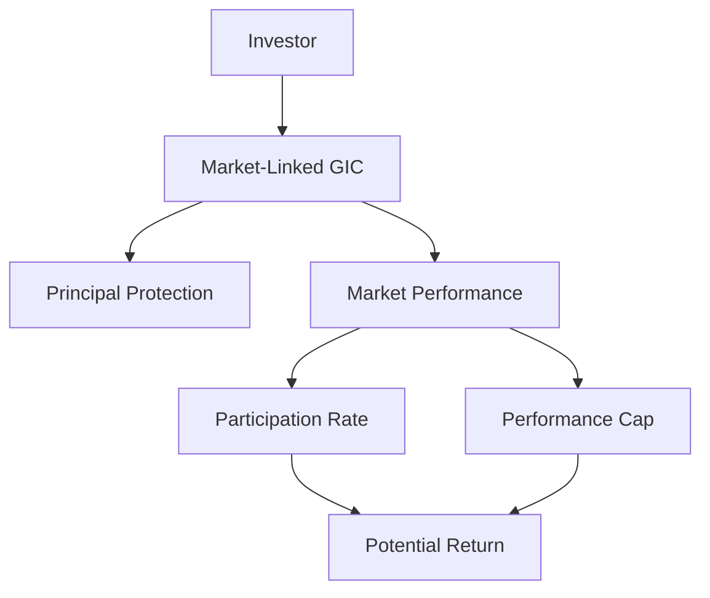

## 23.9 Market-Linked Guaranteed Investment Certificates (GIC)

Market-Linked Guaranteed Investment Certificates (GICs) represent a unique investment vehicle that combines the security of traditional GICs with the growth potential of equity markets. This section delves into the intricacies of Market-Linked GICs, exploring their structure, benefits, and tax implications within the Canadian financial landscape.

### Understanding Market-Linked GICs

Market-Linked GICs are hybrid investment products that offer a blend of principal protection and market-linked returns. Unlike traditional GICs, which provide a fixed interest rate, Market-Linked GICs tie their returns to the performance of a specific stock index, basket of stocks, or other market indicators. This linkage allows investors to benefit from potential market gains while ensuring that their initial investment is protected.

#### Role in Investment Portfolios

Market-Linked GICs serve as a strategic component in diversified investment portfolios. They are particularly appealing to risk-averse investors who seek exposure to equity markets without the risk of losing their principal. By offering a balance between safety and growth, these GICs can enhance portfolio returns while maintaining a conservative risk profile.

### Structure of Market-Linked GICs

The structure of Market-Linked GICs is designed to provide both security and growth potential. Key components include:

#### Principal Protection

The principal amount invested in a Market-Linked GIC is guaranteed, meaning that investors will not lose their initial investment regardless of market performance. This feature makes them an attractive option for conservative investors.

#### Growth Potential

The growth potential of Market-Linked GICs is linked to the performance of a specified market index or basket of assets. The return is typically calculated based on the percentage change in the index over the term of the GIC.

#### Participation Rates

Participation rates determine the extent to which investors benefit from the market's performance. For example, if a Market-Linked GIC has a participation rate of 75%, and the linked index increases by 10%, the investor would receive a 7.5% return on their investment.

#### Performance Caps

Many Market-Linked GICs include a performance cap, which limits the maximum return an investor can earn. This cap is set by the issuing financial institution and is a trade-off for the principal protection feature. For instance, if the cap is 8% and the index gains 12%, the investor's return would be limited to 8%.

### Tax Implications of Market-Linked GICs

Understanding the tax implications of Market-Linked GICs is crucial for effective financial planning. In Canada, the returns from these GICs are typically considered interest income and are taxed at the investor's marginal tax rate. This can impact the overall return on investment, especially for individuals in higher tax brackets.

#### Tax-Deferred Accounts

Investors can mitigate tax liabilities by holding Market-Linked GICs within tax-deferred accounts such as Registered Retirement Savings Plans (RRSPs) or Tax-Free Savings Accounts (TFSAs). These accounts allow for tax-free growth or tax-deferred growth, enhancing the net return on investment.

### Practical Example: Canadian Market-Linked GIC

Consider a Market-Linked GIC offered by a major Canadian bank, such as RBC. Suppose the GIC is linked to the S&P/TSX 60 Index with a 5-year term, a participation rate of 80%, and a performance cap of 10%. If the index grows by 15% over the term, the investor would receive an 8% return (80% of 10%, due to the cap), while the principal remains protected.

### Visualizing Market-Linked GICs

Below is a diagram illustrating the flow of investment in a Market-Linked GIC:

### Best Practices and Common Pitfalls

#### Best Practices

- **Diversification:** Use Market-Linked GICs as part of a diversified portfolio to balance risk and return.
- **Tax Planning:** Consider holding these GICs in tax-advantaged accounts to maximize after-tax returns.
- **Understand Terms:** Carefully review the terms, including participation rates and caps, to align with investment goals.

#### Common Pitfalls

- **Overlooking Caps:** Investors may underestimate the impact of performance caps on potential returns.
- **Ignoring Tax Implications:** Failing to account for tax liabilities can reduce net returns significantly.

### Conclusion

Market-Linked GICs offer a compelling investment option for those seeking principal protection with the potential for market-linked growth. By understanding their structure, tax implications, and role in a diversified portfolio, investors can effectively incorporate these products into their financial strategies.

For further exploration, consider resources such as the Canadian Securities Administrators (CSA) website and financial planning courses that delve deeper into structured products and tax strategies.

## Quiz Time!



### What is a key feature of Market-Linked GICs?

- [x] Principal protection
- [ ] Guaranteed high returns
- [ ] No tax implications
- [ ] Unlimited growth potential

> **Explanation:** Market-Linked GICs offer principal protection, ensuring that the initial investment is not lost.

### How do Market-Linked GICs differ from traditional GICs?

- [x] They offer returns linked to market performance.
- [ ] They guarantee a fixed interest rate.
- [ ] They have no participation rates.
- [ ] They are not available in Canada.

> **Explanation:** Market-Linked GICs provide returns based on market performance, unlike traditional GICs with fixed rates.

### What is a participation rate in the context of Market-Linked GICs?

- [x] The percentage of market gains passed on to the investor
- [ ] The maximum return an investor can earn
- [ ] The tax rate applied to returns
- [ ] The interest rate guaranteed by the GIC

> **Explanation:** The participation rate determines how much of the market's gains are passed on to the investor.

### What is the purpose of a performance cap in Market-Linked GICs?

- [x] To limit the maximum return an investor can earn
- [ ] To guarantee a minimum return
- [ ] To increase the participation rate
- [ ] To reduce tax liabilities

> **Explanation:** A performance cap limits the maximum return, balancing the risk and reward of the investment.

### How are returns from Market-Linked GICs typically taxed in Canada?

- [x] As interest income
- [ ] As capital gains
- [ ] As dividend income
- [ ] They are not taxed

> **Explanation:** Returns are taxed as interest income at the investor's marginal tax rate.

### What is a benefit of holding Market-Linked GICs in a TFSA?

- [x] Tax-free growth
- [ ] Higher participation rates
- [ ] Guaranteed returns
- [ ] No performance caps

> **Explanation:** TFSAs allow for tax-free growth, enhancing the net return on investment.

### Which account type allows for tax-deferred growth of Market-Linked GICs?

- [x] RRSP
- [ ] Non-registered account
- [ ] RESP
- [ ] Checking account

> **Explanation:** RRSPs provide tax-deferred growth, delaying taxes until withdrawal.

### What should investors consider when choosing a Market-Linked GIC?

- [x] Participation rates and performance caps
- [ ] The issuing bank's logo
- [ ] The color of the GIC certificate
- [ ] The number of pages in the contract

> **Explanation:** Understanding participation rates and caps is crucial for aligning with investment goals.

### True or False: Market-Linked GICs guarantee unlimited growth potential.

- [ ] True
- [x] False

> **Explanation:** Market-Linked GICs often have performance caps, limiting growth potential.

### True or False: Market-Linked GICs are suitable for risk-averse investors.

- [x] True
- [ ] False

> **Explanation:** They offer principal protection, making them suitable for risk-averse investors.


