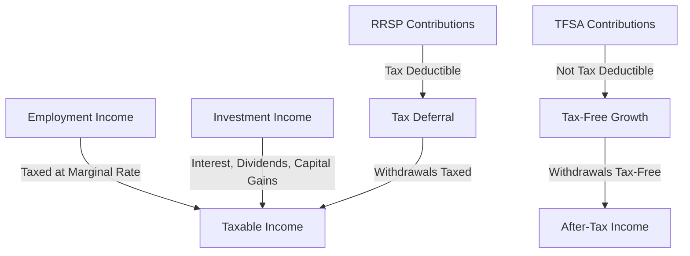

## 24.1 Chapter Overview

In Chapter 24 of the CSC® Exam Prep Guide: Volume 2, we delve into the intricate world of Canadian taxation, a critical component for anyone involved in financial services and investment planning. This chapter provides a comprehensive exploration of the tax features associated with pension income and various savings plans, offering insights into how these elements can be leveraged to optimize financial outcomes. Understanding the nuances of taxation is essential for developing effective investment strategies and ensuring compliance with Canadian tax laws.

### Key Topics Covered

#### Tax Features of Pension Income and Savings Plans

One of the primary focuses of this chapter is the tax treatment of pension income and savings plans. In Canada, pension income can come from various sources, including employer-sponsored pension plans, Registered Retirement Savings Plans (RRSPs), and government pensions like the Canada Pension Plan (CPP) and Old Age Security (OAS). Each of these income sources has unique tax implications that must be understood to effectively manage retirement income.

- **Employer-Sponsored Pension Plans:** Contributions to these plans are typically tax-deductible, and the income received upon retirement is taxable. Understanding the tax brackets and how pension income fits into them is crucial for effective tax planning.

- **RRSPs:** Contributions to RRSPs are tax-deductible, and the funds grow tax-deferred until withdrawal. This deferral can be a powerful tool for managing taxable income over time.

- **Tax-Free Savings Accounts (TFSAs):** Unlike RRSPs, contributions to TFSAs are not tax-deductible, but withdrawals are tax-free. This feature makes TFSAs an excellent vehicle for tax-free growth and income.

#### Distinction Between Different Types of Income

Understanding the different types of income and their respective tax implications is vital for effective financial planning. In Canada, income is generally categorized into several types, each with distinct tax treatments:

- **Employment Income:** Subject to regular income tax rates, with potential deductions for expenses related to earning this income.

- **Investment Income:** Includes interest, dividends, and capital gains, each taxed differently. For example, dividends may qualify for a dividend tax credit, while capital gains are taxed at a lower rate than regular income.

- **Rental Income:** Taxed as regular income, but property owners can deduct expenses related to the property, such as mortgage interest and maintenance costs.

- **Business Income:** Subject to income tax, with allowable deductions for business expenses.

#### Importance of Tax Deferral and Tax-Free Plans

Tax deferral and tax-free plans are essential components of strategic investment planning. By deferring taxes, investors can potentially reduce their current tax liability and allow their investments to grow more efficiently over time. Tax-free plans, like TFSAs, offer the advantage of tax-free growth and withdrawals, providing flexibility and tax efficiency.

- **Tax Deferral:** Allows individuals to delay paying taxes on income or gains until a later date, often when they are in a lower tax bracket. RRSPs are a prime example of a tax-deferral vehicle.

- **Tax-Free Plans:** TFSAs provide a means to grow investments without the burden of taxes on withdrawals, making them ideal for both short-term and long-term financial goals.

#### Basic Tax Planning Strategies

Effective tax planning involves a combination of strategies aimed at minimizing tax liability while maximizing after-tax income. Some basic strategies include:

- **Income Splitting:** Shifting income to family members in lower tax brackets to reduce overall tax liability.

- **Utilizing Tax Credits:** Taking advantage of available tax credits, such as the dividend tax credit or charitable donation credit, to reduce taxable income.

- **Timing of Income and Deductions:** Strategically timing the receipt of income and the payment of deductible expenses to optimize tax outcomes.

- **Maximizing Contributions to Tax-Advantaged Accounts:** Ensuring full utilization of RRSP and TFSA contribution limits to benefit from tax deferral and tax-free growth.

### Practical Examples and Case Studies

To illustrate these concepts, consider the following example involving a Canadian investor:

**Case Study: Maximizing Retirement Income**

John, a 55-year-old Canadian, is planning for retirement. He has an employer-sponsored pension plan, an RRSP, and a TFSA. By understanding the tax implications of each, John can strategically withdraw from these accounts to minimize his tax liability:

- **RRSP Withdrawals:** John plans to withdraw from his RRSP during years when his taxable income is lower, taking advantage of lower tax brackets.

- **TFSA Withdrawals:** He uses his TFSA for tax-free withdrawals, providing flexibility and reducing his taxable income.

- **Pension Income:** John coordinates his pension income with other sources to avoid pushing himself into a higher tax bracket.

### Diagrams and Visual Aids

To further enhance understanding, consider the following diagram illustrating the flow of income and tax implications for different types of accounts:

### Best Practices and Common Pitfalls

- **Best Practices:** Regularly review and adjust your tax strategy to reflect changes in income, tax laws, and personal circumstances. Stay informed about new tax credits and deductions.

- **Common Pitfalls:** Failing to maximize contributions to tax-advantaged accounts or neglecting to consider the impact of withdrawals on overall tax liability.

### References and Additional Resources

For further exploration of Canadian taxation, consider the following resources:

- **Canada Revenue Agency (CRA):** Official guidelines and updates on tax regulations.
- **Books:** "The Canadian Taxpayer's Guide" by Evelyn Jacks for in-depth tax strategies.
- **Online Courses:** The Canadian Securities Institute offers courses on taxation and financial planning.

### Encouragement for Application

As you progress through this chapter, consider how these taxation principles can be applied to your own financial planning or client advisory services. By mastering these concepts, you can enhance your ability to develop tax-efficient investment strategies and provide valuable guidance in the Canadian financial landscape.

## Quiz Time!



### What is a key advantage of RRSPs in Canada?

- [x] Tax deferral on contributions
- [ ] Tax-free withdrawals
- [ ] Contributions are not tax-deductible
- [ ] Immediate tax credit

> **Explanation:** RRSPs allow for tax deferral on contributions, meaning taxes are paid upon withdrawal, typically at retirement when income may be lower.

### Which type of income is eligible for a dividend tax credit in Canada?

- [ ] Employment income
- [x] Dividend income
- [ ] Rental income
- [ ] Business income

> **Explanation:** Dividend income is eligible for a dividend tax credit, which reduces the effective tax rate on dividends received from Canadian corporations.

### What is the primary benefit of a TFSA?

- [ ] Tax-deductible contributions
- [x] Tax-free growth and withdrawals
- [ ] Higher contribution limits than RRSPs
- [ ] Mandatory withdrawals at retirement

> **Explanation:** The primary benefit of a TFSA is that both the growth and withdrawals are tax-free, providing flexibility and tax efficiency.

### What strategy involves shifting income to family members in lower tax brackets?

- [x] Income splitting
- [ ] Tax deferral
- [ ] Tax-free growth
- [ ] Capital gains harvesting

> **Explanation:** Income splitting involves shifting income to family members in lower tax brackets to reduce overall tax liability.

### Which of the following is a tax-advantaged account in Canada?

- [x] RRSP
- [x] TFSA
- [ ] Regular savings account
- [ ] Business account

> **Explanation:** Both RRSPs and TFSAs are tax-advantaged accounts in Canada, offering tax deferral and tax-free growth, respectively.

### What is a common pitfall in tax planning?

- [x] Failing to maximize contributions to tax-advantaged accounts
- [ ] Utilizing tax credits
- [ ] Timing income and deductions
- [ ] Income splitting

> **Explanation:** A common pitfall is failing to maximize contributions to tax-advantaged accounts, missing out on potential tax benefits.

### Which income type is taxed at a lower rate than regular income?

- [x] Capital gains
- [ ] Employment income
- [ ] Rental income
- [ ] Business income

> **Explanation:** Capital gains are taxed at a lower rate than regular income, as only 50% of the gain is taxable in Canada.

### What is the tax treatment of withdrawals from a TFSA?

- [x] Tax-free
- [ ] Taxed at marginal rate
- [ ] Tax-deferred
- [ ] Subject to dividend tax credit

> **Explanation:** Withdrawals from a TFSA are tax-free, making it an attractive option for tax-efficient savings.

### What is the benefit of tax deferral?

- [x] Delaying taxes until a potentially lower tax bracket
- [ ] Immediate tax credit
- [ ] Tax-free withdrawals
- [ ] Higher contribution limits

> **Explanation:** Tax deferral allows individuals to delay paying taxes until a later date, often when they are in a lower tax bracket, optimizing tax efficiency.

### True or False: Contributions to a TFSA are tax-deductible.

- [ ] True
- [x] False

> **Explanation:** Contributions to a TFSA are not tax-deductible, but the growth and withdrawals are tax-free, offering a different type of tax advantage.


