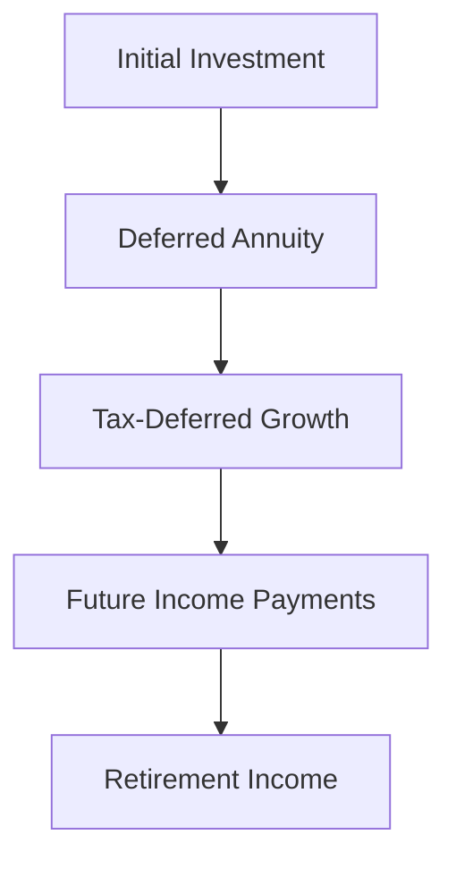

## 24.9 Deferred Annuities

Deferred annuities are a pivotal component in the landscape of retirement planning, offering a unique blend of investment growth and future income security. In this section, we delve into the intricacies of deferred annuities, distinguishing them from immediate annuities, exploring their tax implications, and highlighting their strategic benefits for Canadian investors.

### Understanding Deferred Annuities

A deferred annuity is a financial contract between an individual and an insurance company, designed to provide income payments at a future date. This type of annuity allows the investor's funds to grow tax-deferred until the payout phase begins, typically during retirement. Deferred annuities are particularly attractive for individuals seeking to secure a steady income stream in their later years.

#### Immediate vs. Deferred Annuities

The primary distinction between immediate and deferred annuities lies in the timing of income payments:

- **Immediate Annuities:** These annuities begin paying out income almost immediately after a lump sum investment is made. They are suitable for individuals who require an immediate income stream, often used by retirees who need to convert their savings into regular payments.

- **Deferred Annuities:** In contrast, deferred annuities delay income payments until a specified future date. This delay allows the investment to grow over time, benefiting from compounding interest and tax deferral. Deferred annuities are ideal for individuals who are still in their working years and wish to accumulate wealth for future retirement income.

### Tax Implications of Deferred Annuities

Deferred annuities offer significant tax advantages, particularly when integrated within Registered Retirement Savings Plans (RRSPs). The key tax implications include:

- **Tax-Deferred Growth:** The funds within a deferred annuity grow tax-deferred, meaning that taxes on investment gains are not paid until withdrawals begin. This allows the investment to compound more effectively over time.

- **RRSP Integration:** When a deferred annuity is held within an RRSP, contributions are tax-deductible, and the investment grows tax-free until withdrawal. Upon retirement, withdrawals are taxed as ordinary income, potentially at a lower rate if the retiree's income is reduced.

- **Taxation at Withdrawal:** Once the annuity enters the payout phase, the income received is subject to taxation. However, the tax treatment can be advantageous if the retiree's income is lower, resulting in a reduced tax burden.

### Benefits of Deferred Annuities for Retirement Planning

Deferred annuities offer several strategic benefits for retirement planning:

- **Guaranteed Income Stream:** One of the most compelling features of deferred annuities is the guarantee of a steady income stream during retirement. This can provide financial security and peace of mind, knowing that a portion of retirement income is assured.

- **Inflation Protection:** Some deferred annuities offer options for inflation protection, ensuring that the purchasing power of the income stream is maintained over time.

- **Flexibility and Customization:** Deferred annuities can be tailored to meet individual needs, with options for different payout schedules, beneficiary designations, and additional riders for enhanced benefits.

- **Estate Planning Benefits:** Deferred annuities can also play a role in estate planning, allowing for the transfer of wealth to beneficiaries in a tax-efficient manner.

### Practical Example: Deferred Annuity in Action

Consider a 45-year-old Canadian investor, Jane, who decides to purchase a deferred annuity with a $100,000 investment. She plans to retire at age 65 and wants to ensure a steady income stream during her retirement years. By choosing a deferred annuity, Jane allows her investment to grow tax-deferred for 20 years. Upon retirement, she begins receiving regular income payments, supplementing her other retirement savings and providing financial stability.

### Visualizing Deferred Annuities

To better understand the flow of funds in a deferred annuity, consider the following diagram:

### Best Practices and Considerations

When considering deferred annuities, it's essential to:

- **Evaluate Financial Goals:** Assess your retirement income needs and determine if a deferred annuity aligns with your financial objectives.

- **Understand the Terms:** Carefully review the terms and conditions of the annuity contract, including fees, payout options, and any additional features.

- **Consult a Financial Advisor:** Seek advice from a financial advisor to ensure that a deferred annuity fits within your overall retirement strategy and tax planning.

- **Stay Informed:** Keep abreast of changes in Canadian tax laws and regulations that may impact the benefits of deferred annuities.

### Additional Resources

For further exploration of deferred annuities and their role in retirement planning, consider the following resources:

- [CRA Guide on Annuities](https://www.canada.ca/en/revenue-agency/services/forms-publications/publications/t4037.html)
- **Books:**
  - "The New Retirement" by Robert C. Carlson

### Glossary

- **Annuity:** A financial product that provides regular payments to an individual, typically used for retirement income.
- **Deferred Annuity:** An annuity contract where income payments begin at a future date, allowing funds to grow tax-deferred.

### **Ready to Test Your Knowledge?**

**Practice 10 Essential CSC Exam Questions to Master Your Certification**



### What is a deferred annuity?

- [x] An investment contract that provides income payments at a future date
- [ ] An investment contract that provides immediate income payments
- [ ] A type of mutual fund
- [ ] A savings account with a fixed interest rate

> **Explanation:** A deferred annuity is an investment contract designed to provide income payments at a future date, allowing funds to grow tax-deferred.

### How do deferred annuities differ from immediate annuities?

- [x] Deferred annuities delay income payments to a future date
- [ ] Deferred annuities provide immediate income payments
- [ ] Deferred annuities are only available to retirees
- [ ] Deferred annuities do not offer tax-deferred growth

> **Explanation:** Deferred annuities delay income payments to a future date, allowing for tax-deferred growth, unlike immediate annuities, which begin payments almost immediately.

### What is a key tax advantage of deferred annuities?

- [x] Tax-deferred growth
- [ ] Tax-free withdrawals
- [ ] Immediate tax deductions
- [ ] No taxation at withdrawal

> **Explanation:** Deferred annuities offer tax-deferred growth, meaning taxes on investment gains are not paid until withdrawals begin.

### How are deferred annuities treated within RRSPs?

- [x] Contributions are tax-deductible, and growth is tax-free until withdrawal
- [ ] Contributions are not tax-deductible, but growth is tax-free
- [ ] Contributions are tax-deductible, but growth is taxed annually
- [ ] Contributions and growth are both taxed annually

> **Explanation:** Within RRSPs, contributions to deferred annuities are tax-deductible, and the investment grows tax-free until withdrawal.

### What is a benefit of using deferred annuities for retirement planning?

- [x] Guaranteed income stream
- [ ] Immediate liquidity
- [ ] High-risk investment returns
- [ ] Tax-free income

> **Explanation:** Deferred annuities provide a guaranteed income stream during retirement, offering financial security and stability.

### What should you consider when evaluating a deferred annuity?

- [x] Your retirement income needs and financial goals
- [ ] Only the initial investment amount
- [ ] The current stock market trends
- [ ] The annuity's past performance

> **Explanation:** When evaluating a deferred annuity, consider your retirement income needs and financial goals to ensure it aligns with your overall strategy.

### What is a potential challenge of deferred annuities?

- [x] Understanding the terms and conditions
- [ ] Immediate taxation on growth
- [ ] Lack of customization options
- [ ] No tax advantages

> **Explanation:** A potential challenge is understanding the terms and conditions of the annuity contract, including fees and payout options.

### How can deferred annuities benefit estate planning?

- [x] Allowing for tax-efficient wealth transfer to beneficiaries
- [ ] Providing immediate cash for heirs
- [ ] Avoiding all estate taxes
- [ ] Eliminating the need for a will

> **Explanation:** Deferred annuities can benefit estate planning by allowing for tax-efficient wealth transfer to beneficiaries.

### What is a common feature of some deferred annuities?

- [x] Inflation protection options
- [ ] Guaranteed high returns
- [ ] Immediate payout options
- [ ] No fees or charges

> **Explanation:** Some deferred annuities offer inflation protection options to maintain the purchasing power of the income stream.

### True or False: Deferred annuities can only be purchased by individuals over 60.

- [ ] True
- [x] False

> **Explanation:** False. Deferred annuities can be purchased by individuals at various ages, not just those over 60, to plan for future retirement income.


