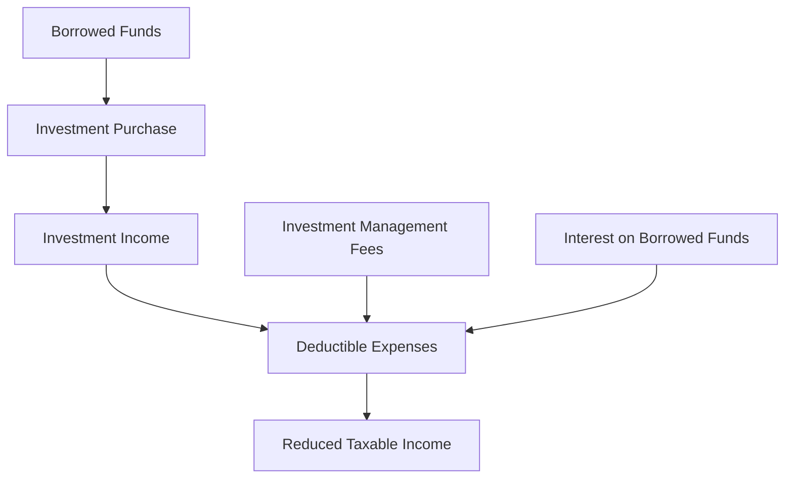

## 24.16 Paying Expenses

In the realm of Canadian taxation, understanding how to effectively manage and claim expenses related to investment income can significantly impact your financial strategy. This section delves into the intricacies of maximizing deductible expenses, focusing on allowable carrying charges and investment management fees, and provides practical guidance on distinguishing between personal and business-related expenses for tax purposes.

### Strategies for Maximizing Deductible Expenses

When it comes to investment income, the Canada Revenue Agency (CRA) allows taxpayers to deduct certain expenses, known as carrying charges, from their taxable income. These deductions can be a powerful tool for investors seeking to optimize their tax liabilities.

#### Key Deductible Expenses

1. **Interest on Borrowed Funds**: If you borrow money to earn investment income, the interest paid on these funds is generally deductible. This includes loans taken to purchase stocks, bonds, or other income-generating investments.

2. **Investment Management Fees**: Fees paid to manage your investment portfolio are considered carrying charges and can be deducted from your investment income. This includes fees for financial advisors or portfolio managers.

3. **Accounting Fees**: Fees paid for accounting services related to your investment income can also be deducted. This includes costs incurred for preparing financial statements or tax returns that include investment income.

4. **Safety Deposit Box Charges**: If you use a safety deposit box to store investment-related documents or securities, the rental fees may be deductible.

### Allowable Carrying Charges

Carrying charges are expenses incurred to earn investment income, and they play a crucial role in reducing taxable income. The CRA provides specific guidelines on what constitutes allowable carrying charges.

#### Interest on Funds Borrowed for Investment Purposes

Interest expenses are one of the most significant carrying charges. To qualify for a deduction, the borrowed funds must be used to earn income from a business or property. It's essential to maintain clear records demonstrating the purpose of the borrowed funds.

#### Investment Management Fees

Investment management fees are another common deductible expense. These fees must be directly related to the management of your investments. It's important to differentiate between fees for investment management and those for financial planning or advisory services, as the latter may not be deductible.

### Distinguishing Between Personal and Business-Related Expenses

For tax purposes, it's crucial to distinguish between personal and business-related expenses. Only expenses directly related to earning investment income are deductible. Personal expenses, even if they indirectly relate to investments, are not eligible.

#### Practical Example

Consider an investor who borrows $50,000 to purchase dividend-paying stocks. The interest paid on this loan is deductible as a carrying charge. Additionally, if the investor pays a financial advisor to manage this portfolio, those fees are also deductible.

### Claiming Investment-Related Expenses

Properly claiming investment-related expenses requires meticulous record-keeping and a clear understanding of CRA guidelines. Here are steps to ensure compliance:

1. **Maintain Detailed Records**: Keep all receipts, invoices, and statements related to your investment expenses. This documentation is crucial for substantiating your claims.

2. **Separate Personal and Investment Expenses**: Clearly distinguish between personal and investment-related expenses. Use separate accounts or credit cards for investment activities to simplify tracking.

3. **Consult with a Tax Professional**: Given the complexity of tax regulations, consulting with a tax professional can help ensure that you maximize your deductions while remaining compliant with CRA rules.

### Real-World Examples

#### Case Study: Canadian Pension Fund

A Canadian pension fund invests in a diversified portfolio of equities and fixed income. The fund incurs significant management fees, which are deducted as carrying charges, effectively reducing its taxable income and enhancing returns for its beneficiaries.

#### Case Study: Individual Investor

An individual investor in Toronto borrows funds to invest in a mix of Canadian and international stocks. By deducting the interest on the borrowed funds and the fees paid to a portfolio manager, the investor reduces their taxable income, optimizing their overall financial strategy.

### Diagrams and Visual Aids

To further illustrate these concepts, consider the following diagram showing the flow of deductible expenses:

### Best Practices and Common Pitfalls

- **Best Practices**: Regularly review your investment expenses to ensure they are categorized correctly. Stay informed about changes in tax regulations that may affect your deductions.

- **Common Pitfalls**: Failing to maintain adequate records or incorrectly categorizing expenses can lead to disallowed deductions and potential penalties.

### Additional Resources

For further exploration, consider the following resources:

- [CRA Guide on Carrying Charges](https://www.canada.ca/en/revenue-agency/services/forms-publications/publications/t4037.html)
- [Deductible vs. Non-Deductible Expenses](https://www.investopedia.com/articles/tax/08/deductible-expenses.asp)

### Conclusion

Understanding and effectively managing deductible expenses related to investment income is a critical component of financial planning in Canada. By leveraging allowable carrying charges and investment management fees, investors can optimize their tax liabilities and enhance their overall financial strategy. Remember to maintain detailed records, consult with professionals, and stay informed about regulatory changes to maximize your deductions.

### **Ready to Test Your Knowledge?**

**Practice 10 Essential CSC Exam Questions to Master Your Certification**



### Which of the following is considered a deductible carrying charge for investment income in Canada?

- [x] Interest on borrowed funds for investment purposes
- [ ] Personal travel expenses
- [ ] Home office expenses
- [ ] Entertainment expenses

> **Explanation:** Interest on borrowed funds used for investment purposes is a deductible carrying charge, while personal travel, home office, and entertainment expenses are not directly related to earning investment income.

### What is a key requirement for interest expenses to be deductible as carrying charges?

- [x] The borrowed funds must be used to earn investment income.
- [ ] The borrowed funds must be used for personal expenses.
- [ ] The borrowed funds must be used for home renovations.
- [ ] The borrowed funds must be used for travel expenses.

> **Explanation:** For interest expenses to be deductible, the borrowed funds must be used to earn investment income, such as purchasing stocks or bonds.

### Which of the following fees are potentially deductible as carrying charges?

- [x] Investment management fees
- [ ] Financial planning fees
- [ ] Personal advisory fees
- [ ] Travel planning fees

> **Explanation:** Investment management fees are deductible as carrying charges, while financial planning, personal advisory, and travel planning fees are not directly related to managing investments.

### How can an investor ensure compliance when claiming investment-related expenses?

- [x] Maintain detailed records and consult with a tax professional.
- [ ] Use a single account for all personal and investment expenses.
- [ ] Estimate expenses without documentation.
- [ ] Ignore CRA guidelines.

> **Explanation:** Maintaining detailed records and consulting with a tax professional ensures compliance with CRA guidelines when claiming investment-related expenses.

### What is a common pitfall when claiming investment-related expenses?

- [x] Failing to maintain adequate records
- [ ] Overestimating income
- [ ] Underestimating expenses
- [ ] Ignoring investment opportunities

> **Explanation:** Failing to maintain adequate records can lead to disallowed deductions and potential penalties, making it a common pitfall.

### Which of the following is NOT a deductible carrying charge?

- [x] Personal travel expenses
- [ ] Interest on borrowed funds for investment
- [ ] Investment management fees
- [ ] Accounting fees related to investment income

> **Explanation:** Personal travel expenses are not deductible as carrying charges, while interest on borrowed funds, investment management fees, and accounting fees related to investment income are.

### What should an investor do to separate personal and investment expenses?

- [x] Use separate accounts or credit cards for investment activities.
- [ ] Combine all expenses into one account.
- [ ] Use personal accounts for investment activities.
- [ ] Ignore the distinction between personal and investment expenses.

> **Explanation:** Using separate accounts or credit cards for investment activities helps clearly distinguish between personal and investment expenses.

### Which document is essential for substantiating claims of investment-related expenses?

- [x] Receipts, invoices, and statements
- [ ] Personal diary
- [ ] Travel itinerary
- [ ] Grocery list

> **Explanation:** Receipts, invoices, and statements are essential for substantiating claims of investment-related expenses.

### What is the primary benefit of deducting carrying charges from investment income?

- [x] Reducing taxable income
- [ ] Increasing personal expenses
- [ ] Enhancing personal lifestyle
- [ ] Ignoring tax regulations

> **Explanation:** Deducting carrying charges from investment income reduces taxable income, optimizing the investor's overall financial strategy.

### True or False: Investment management fees are always deductible as carrying charges.

- [x] True
- [ ] False

> **Explanation:** Investment management fees are considered carrying charges and are generally deductible when directly related to managing investments.


