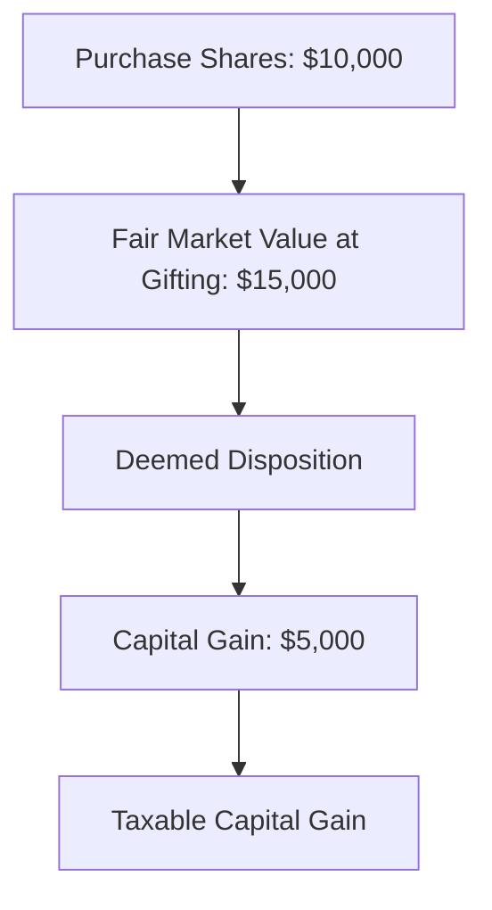

## 24.20 Gifting and Contributions Tax Rules

In the realm of Canadian taxation, understanding the rules surrounding gifting and contributions is crucial for effective financial planning and wealth management. This section delves into the tax implications of gifting investments and making contributions to registered plans, providing a comprehensive guide to navigating these complex regulations.

### Understanding Gifting in the Canadian Tax Context

Gifting, particularly of investments, is a common strategy used to transfer wealth, support family members, or contribute to charitable causes. However, the Canadian tax system imposes specific rules that must be adhered to when making such gifts.

#### Deemed Dispositions

One of the key concepts in the taxation of gifts is the **deemed disposition**. When you gift an asset, the Canada Revenue Agency (CRA) treats it as if you have sold the asset at its fair market value (FMV) at the time of the gift. This can trigger capital gains or losses, which must be reported on your tax return.

For example, if you purchased shares for $10,000 and their FMV is $15,000 at the time of gifting, you would have a deemed disposition resulting in a capital gain of $5,000. This gain is subject to capital gains tax.

#### Attribution Rules

The **attribution rules** are designed to prevent taxpayers from avoiding taxes by shifting income or capital gains to family members in lower tax brackets. When you gift an asset to a spouse or minor child, any income or capital gains generated by that asset may be attributed back to you, the original owner, for tax purposes.

For instance, if you gift shares to your minor child and those shares generate dividends, the dividends may be attributed back to you, and you would be responsible for the tax liability.

### Tax Implications of Gifting to Minors and Family Members

Transferring assets to minors or other family members can have significant tax implications. It's essential to understand these implications to avoid unintended tax consequences.

#### Gifting to Minors

When gifting to minors, the attribution rules are particularly relevant. Income generated from gifted assets is typically attributed back to the donor. However, capital gains realized by the minor are not subject to attribution, providing a potential tax planning opportunity.

#### Gifting to Spouses

Gifting to a spouse also triggers attribution rules. Any income or capital gains from the gifted asset will be attributed back to the donor spouse. However, there are strategies to mitigate this, such as using a spousal loan at the prescribed interest rate.

### Strategic Gifting for Tax Optimization

Strategic gifting can be an effective way to optimize tax outcomes while adhering to legal requirements. Here are some strategies to consider:

1. **Utilize the Lifetime Capital Gains Exemption (LCGE):** If gifting qualified small business corporation shares or farm property, consider utilizing the LCGE to shelter capital gains from tax.

2. **Gift Appreciated Securities to Charities:** Donating appreciated securities directly to a charity can eliminate the capital gains tax and provide a charitable donation tax credit.

3. **Use Trusts for Gifting:** Establishing a trust can provide more control over the distribution of assets and may offer tax advantages, especially when planning for minors.

4. **Consider Spousal Loans:** To avoid attribution, consider a spousal loan at the CRA's prescribed interest rate, ensuring the interest is paid annually.

### Practical Examples and Case Studies

#### Case Study: Gifting Shares to a Minor

Consider a scenario where a parent gifts $20,000 worth of shares to their minor child. The shares generate $1,000 in dividends annually. Under attribution rules, the $1,000 dividend income would be attributed back to the parent, who would be responsible for the tax. However, if the shares are sold and result in a capital gain, the gain is taxed in the child's hands, potentially at a lower rate.

#### Case Study: Charitable Gifting of Securities

A taxpayer donates $50,000 worth of publicly traded securities to a registered charity. The securities were originally purchased for $30,000. By donating the securities directly, the taxpayer avoids the capital gains tax on the $20,000 gain and receives a charitable donation tax credit.

### Best Practices and Common Pitfalls

- **Best Practices:**
  - Plan gifts strategically to maximize tax benefits.
  - Keep detailed records of the FMV of gifted assets.
  - Consult with a tax professional to navigate complex situations.

- **Common Pitfalls:**
  - Failing to account for deemed dispositions can lead to unexpected tax liabilities.
  - Ignoring attribution rules may result in higher tax bills.
  - Overlooking the benefits of gifting appreciated securities to charities.

### References and Additional Resources

- [CRA Rules on Gifts and Loans](https://www.canada.ca/en/revenue-agency/services/tax/businesses/topics/gifts-donations.html)
- **Books:**
  - "Tax-Efficient Gifting: Strategies for Family Wealth Transfer" by Susan Brown.
- **Online Articles:**
  - [Understanding Attribution Rules in Gifting](https://www.robertson.ca/blog/attribution-rules-in-gifting/)

### Glossary

- **Deemed Disposition:** A tax rule treating a transfer as a sale, triggering capital gains or losses.
- **Attribution Rules:** Tax provisions preventing taxpayers from shifting income or capital gains to family members to minimize tax liability.

### **Ready to Test Your Knowledge?**

**Practice 10 Essential CSC Exam Questions to Master Your Certification**



### What is a deemed disposition in the context of gifting?

- [x] A tax rule treating a transfer as a sale, triggering capital gains or losses.
- [ ] A method of avoiding taxes by transferring assets.
- [ ] A strategy for minimizing tax liability.
- [ ] A type of charitable donation.

> **Explanation:** A deemed disposition is a tax rule that treats the transfer of an asset as if it were sold at its fair market value, which can trigger capital gains or losses.

### What do attribution rules prevent?

- [x] Shifting income or capital gains to family members to minimize tax liability.
- [ ] Gifting assets to charities.
- [ ] Selling assets at a loss.
- [ ] Investing in foreign markets.

> **Explanation:** Attribution rules are designed to prevent taxpayers from shifting income or capital gains to family members in lower tax brackets to avoid taxes.

### When gifting to a minor, which type of income is typically attributed back to the donor?

- [x] Dividend income.
- [ ] Capital gains.
- [ ] Interest income.
- [ ] Rental income.

> **Explanation:** Dividend income generated from gifted assets to a minor is typically attributed back to the donor, while capital gains are not.

### What is one strategy to avoid attribution when gifting to a spouse?

- [x] Use a spousal loan at the prescribed interest rate.
- [ ] Gift cash instead of securities.
- [ ] Transfer assets to a trust.
- [ ] Donate to a charity.

> **Explanation:** Using a spousal loan at the prescribed interest rate can help avoid attribution when gifting to a spouse.

### What is the benefit of donating appreciated securities to a charity?

- [x] Eliminates capital gains tax and provides a charitable donation tax credit.
- [ ] Increases the fair market value of the securities.
- [ ] Reduces the donor's income tax rate.
- [ ] Allows the donor to retain ownership of the securities.

> **Explanation:** Donating appreciated securities directly to a charity eliminates the capital gains tax and provides a charitable donation tax credit.

### What is the Lifetime Capital Gains Exemption (LCGE) used for?

- [x] Sheltering capital gains from tax on qualified small business corporation shares or farm property.
- [ ] Reducing income tax on dividends.
- [ ] Avoiding attribution rules.
- [ ] Increasing the fair market value of assets.

> **Explanation:** The LCGE can be used to shelter capital gains from tax on qualified small business corporation shares or farm property.

### What is a common pitfall when gifting investments?

- [x] Failing to account for deemed dispositions.
- [ ] Overestimating the fair market value.
- [ ] Underestimating the capital gains tax.
- [ ] Ignoring the benefits of charitable donations.

> **Explanation:** Failing to account for deemed dispositions can lead to unexpected tax liabilities when gifting investments.

### How can trusts be used in gifting?

- [x] Provide more control over asset distribution and offer tax advantages.
- [ ] Increase the fair market value of assets.
- [ ] Avoid all tax liabilities.
- [ ] Guarantee income for the donor.

> **Explanation:** Trusts can provide more control over the distribution of assets and may offer tax advantages, especially when planning for minors.

### What should be considered when planning gifts to optimize tax outcomes?

- [x] Strategic timing and understanding of tax rules.
- [ ] The recipient's income level.
- [ ] The donor's age.
- [ ] The type of asset being gifted.

> **Explanation:** Strategic timing and a thorough understanding of tax rules are crucial when planning gifts to optimize tax outcomes.

### True or False: Capital gains from gifted assets to minors are attributed back to the donor.

- [ ] True
- [x] False

> **Explanation:** Capital gains from gifted assets to minors are not attributed back to the donor; they are taxed in the minor's hands.


