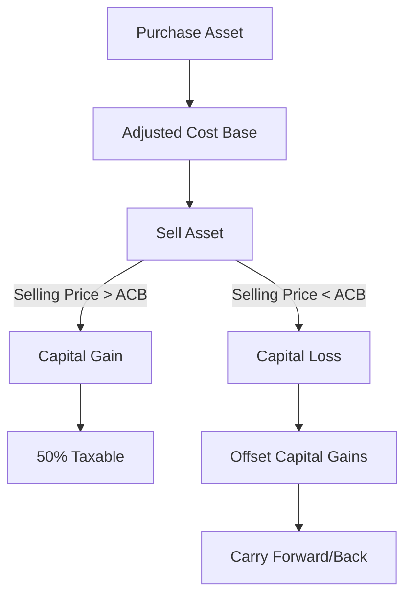

## 24.4.2.4 Capital Gains and Losses

Capital gains and losses are pivotal concepts in the realm of Canadian taxation, particularly for investors and financial professionals. Understanding these concepts is crucial for effective tax planning and investment strategy. This section delves into the definitions, tax implications, and strategic considerations surrounding capital gains and losses in Canada.

### Understanding Capital Gains

**Capital Gains** are the profits realized from the sale of a capital asset, such as stocks, bonds, or real estate, when the selling price exceeds the asset's adjusted cost base (ACB). The ACB is essentially the original purchase price of the asset, adjusted for factors such as additional costs or improvements.

For example, if an investor purchases shares of a Canadian company for $10,000 and later sells them for $15,000, the capital gain is $5,000. In Canada, only 50% of this gain is subject to taxation, known as the "taxable capital gain." Therefore, in this scenario, $2,500 would be included in the investor's taxable income.

### Understanding Capital Losses

Conversely, **Capital Losses** occur when an asset is sold for less than its ACB. These losses can be used to offset capital gains, thereby reducing the taxable amount. However, capital losses cannot generally be used to offset other types of income, such as employment or interest income.

Consider an investor who sells a property for $8,000, which was originally purchased for $10,000. The capital loss here is $2,000. This loss can be applied against any capital gains realized in the same tax year, or it can be carried back up to three years or carried forward indefinitely to offset future capital gains.

### Taxation of Capital Gains and Losses

In Canada, the taxation of capital gains is favorable compared to other income types. As mentioned, only 50% of capital gains are taxable. This preferential treatment encourages investment in capital markets and real estate, contributing to economic growth.

#### Example: Calculating Taxable Capital Gains

Let's illustrate this with a practical example involving a Canadian investor:

1. **Initial Investment**: $20,000 in shares.
2. **Selling Price**: $30,000.
3. **Capital Gain**: $30,000 - $20,000 = $10,000.
4. **Taxable Capital Gain**: 50% of $10,000 = $5,000.

If the investor's marginal tax rate is 30%, the tax payable on the capital gain would be $5,000 x 30% = $1,500.

### Offsetting Capital Gains with Capital Losses

Capital losses provide a strategic tool for investors to manage their tax liabilities. By offsetting capital gains with capital losses, investors can effectively reduce their taxable income. This strategy is particularly useful in years when significant gains are realized.

#### Example: Offsetting Gains with Losses

Suppose an investor has a capital gain of $10,000 and a capital loss of $3,000 in the same tax year. The net capital gain would be $10,000 - $3,000 = $7,000. The taxable capital gain would then be 50% of $7,000, resulting in $3,500 being added to the investor's taxable income.

### Deemed Disposition

The concept of "deemed disposition" is crucial for understanding capital gains and losses in certain scenarios. A deemed disposition occurs when the Canada Revenue Agency (CRA) considers an asset to have been sold, even if no actual sale has taken place. This can happen in situations such as:

- The death of a taxpayer.
- Emigration from Canada.
- Changes in the use of property (e.g., converting a personal residence to a rental property).

In these cases, the asset is deemed to be disposed of at its fair market value, and any resulting capital gain or loss must be reported.

### Practical Applications and Strategies

Investors can employ various strategies to optimize their capital gains and losses:

- **Tax-Loss Harvesting**: This involves selling securities at a loss to offset capital gains, thereby reducing tax liability.
- **Timing of Sales**: By strategically timing the sale of assets, investors can manage the realization of gains and losses to align with their overall tax strategy.
- **Utilizing Carry-Forwards**: Investors can carry forward unused capital losses to future years, providing flexibility in managing tax obligations.

### Visualizing Capital Gains and Losses

Below is a simple diagram illustrating the flow of capital gains and losses:

### Conclusion

Understanding capital gains and losses is essential for effective tax planning and investment strategy in Canada. By leveraging the favorable tax treatment of capital gains and strategically managing capital losses, investors can optimize their financial outcomes. As you continue to explore the Canadian taxation landscape, consider how these principles can be applied to your own financial planning and investment decisions.

For further exploration, refer to the glossary for detailed definitions of capital gains and losses terminology. Additionally, consult resources such as the Canada Revenue Agency's official guidelines and financial planning courses to deepen your understanding.

## Quiz Time!



### What is a capital gain?

- [x] Profit from selling an asset for more than its adjusted cost base
- [ ] Loss from selling an asset for less than its adjusted cost base
- [ ] Income from dividends
- [ ] Interest earned on savings

> **Explanation:** A capital gain is the profit realized when an asset is sold for more than its adjusted cost base.

### How much of a capital gain is taxable in Canada?

- [ ] 100%
- [x] 50%
- [ ] 75%
- [ ] 25%

> **Explanation:** In Canada, only 50% of capital gains are taxable.

### What is a capital loss?

- [ ] Profit from selling an asset for more than its adjusted cost base
- [x] Loss from selling an asset for less than its adjusted cost base
- [ ] Income from dividends
- [ ] Interest earned on savings

> **Explanation:** A capital loss occurs when an asset is sold for less than its adjusted cost base.

### Can capital losses be used to offset other types of income?

- [ ] Yes, they can offset any type of income
- [x] No, they can generally only offset capital gains
- [ ] Yes, but only employment income
- [ ] Yes, but only interest income

> **Explanation:** Capital losses can generally only be used to offset capital gains, not other types of income.

### What is a deemed disposition?

- [x] A situation where an asset is considered sold for tax purposes without an actual sale
- [ ] A mandatory sale of an asset
- [ ] A voluntary sale of an asset
- [ ] A transfer of an asset to a family member

> **Explanation:** A deemed disposition occurs when the CRA considers an asset to have been sold for tax purposes, even if no actual sale has taken place.

### What is the adjusted cost base (ACB)?

- [x] The original purchase price of an asset, adjusted for factors like improvements
- [ ] The selling price of an asset
- [ ] The market value of an asset
- [ ] The tax value of an asset

> **Explanation:** The adjusted cost base is the original purchase price of an asset, adjusted for factors such as additional costs or improvements.

### How can capital losses be carried?

- [x] Carried back up to three years or forward indefinitely
- [ ] Only carried forward for one year
- [ ] Only carried back for one year
- [ ] Cannot be carried at all

> **Explanation:** Capital losses can be carried back up to three years or carried forward indefinitely to offset future capital gains.

### What is tax-loss harvesting?

- [x] Selling securities at a loss to offset capital gains
- [ ] Buying securities to increase capital gains
- [ ] Selling securities at a profit to increase capital gains
- [ ] Holding securities to avoid capital gains

> **Explanation:** Tax-loss harvesting involves selling securities at a loss to offset capital gains, thereby reducing tax liability.

### Which of the following is a strategy to manage capital gains and losses?

- [x] Timing of sales
- [ ] Ignoring market conditions
- [ ] Investing only in bonds
- [ ] Avoiding all stock investments

> **Explanation:** Timing the sale of assets is a strategy to manage the realization of gains and losses to align with overall tax strategy.

### True or False: Capital gains are always taxed at the same rate as employment income in Canada.

- [ ] True
- [x] False

> **Explanation:** False. In Canada, only 50% of capital gains are taxable, which often results in a lower effective tax rate compared to employment income.


