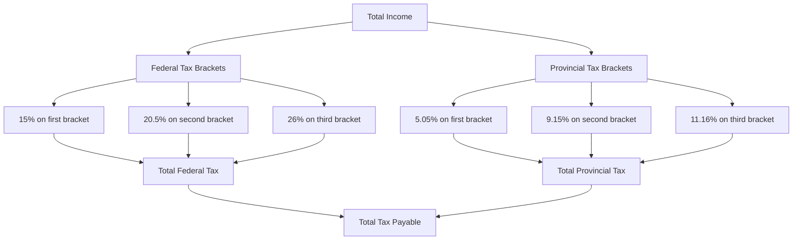

---

linkTitle: "24.4.3 Taxation of Income"
title: "Taxation of Income: Understanding Federal and Provincial Tax Rates in Canada"
description: "Explore the intricacies of the Canadian taxation system, focusing on how federal and provincial taxes are applied to different income brackets. Learn about the progressive tax system and calculate taxes using real-world examples."
categories:
- Canadian Taxation
- Financial Education
- Investment Strategies
tags:
- Canadian Tax System
- Federal Tax Rates
- Provincial Taxes
- Income Tax
- Tax Calculation
date: 2024-10-25
type: docs
nav_weight: 1243000
---

## 24.4.3 Taxation of Income

Understanding the taxation of income in Canada is crucial for anyone involved in financial planning, investment, or personal finance management. The Canadian tax system is designed to be progressive, meaning that individuals with higher incomes pay a higher percentage of their income in taxes. This section will delve into the mechanics of how federal and provincial taxes are applied to different income brackets, providing you with the knowledge to calculate taxes accurately and understand their impact on financial decisions.

### The Progressive Nature of the Canadian Tax System

The Canadian tax system is structured to ensure that individuals contribute to the country's revenue based on their ability to pay. This is achieved through a progressive tax system, where tax rates increase as income increases. The federal government sets basic tax rates, which are then integrated with provincial tax rates to determine the overall marginal tax rate for individuals.

#### Federal Tax Rates

Federal tax rates in Canada are applied to different income brackets. As of the latest tax year, the federal tax brackets are as follows:

- **15%** on the first $53,359 of taxable income
- **20.5%** on the next $53,359 (on the portion of taxable income over $53,359 up to $106,717)
- **26%** on the next $64,077 (on the portion of taxable income over $106,717 up to $170,754)
- **29%** on the next $70,000 (on the portion of taxable income over $170,754 up to $220,000)
- **33%** on the portion of taxable income over $220,000

These rates are subject to change, so it's important to refer to the latest tax tables provided by the Canada Revenue Agency (CRA) for the most accurate information.

#### Provincial Tax Rates

In addition to federal taxes, each province in Canada has its own tax rates and brackets. These provincial taxes are integrated with federal taxes to calculate the total tax payable. For example, Ontario's provincial tax rates for the same income brackets might look like this:

- **5.05%** on the first $47,630 of taxable income
- **9.15%** on the next $47,629 (on the portion of taxable income over $47,630 up to $95,259)
- **11.16%** on the next $12,820 (on the portion of taxable income over $95,259 up to $108,079)
- **12.16%** on the next $22,000 (on the portion of taxable income over $108,079 up to $150,000)
- **13.16%** on the portion of taxable income over $150,000

### Calculating the Overall Marginal Tax Rate

To determine the overall marginal tax rate, you must combine both federal and provincial tax rates. This combined rate is what affects the last dollar of income earned, influencing financial decisions such as investments and savings.

#### Example Calculation

Let's consider an example to illustrate how these rates are applied:

**Scenario:** Jane, a resident of Ontario, has a taxable income of $120,000.

1. **Federal Tax Calculation:**
   - 15% on the first $53,359 = $8,003.85
   - 20.5% on the next $53,359 = $10,934.60
   - 26% on the remaining $13,282 ($120,000 - $106,717) = $3,453.32

   **Total Federal Tax = $22,391.77**

2. **Provincial Tax Calculation (Ontario):**
   - 5.05% on the first $47,630 = $2,405.32
   - 9.15% on the next $47,629 = $4,359.00
   - 11.16% on the remaining $24,741 ($120,000 - $95,259) = $2,762.12

   **Total Provincial Tax = $9,526.44**

3. **Total Tax Payable:**
   - Total Federal Tax + Total Provincial Tax = $22,391.77 + $9,526.44 = $31,918.21

Jane's overall marginal tax rate would be determined by the highest rate applied to her last dollar of income, which in this case would be the combined federal and provincial rates on her income over $106,717.

### Practical Implications and Strategies

Understanding your marginal tax rate is essential for effective financial planning. It influences decisions such as:

- **Investment Choices:** Tax-efficient investments can reduce taxable income.
- **Retirement Planning:** Contributions to Registered Retirement Savings Plans (RRSPs) can lower taxable income.
- **Income Splitting:** Strategies to distribute income among family members can reduce overall tax liability.

### Visualizing Taxation

To better understand how taxes are applied, consider the following diagram illustrating the flow of income through federal and provincial tax brackets:

### Best Practices and Common Pitfalls

- **Stay Updated:** Tax rates and brackets can change annually. Always refer to the latest CRA publications.
- **Plan Ahead:** Use tax-efficient strategies to manage your income and investments.
- **Avoid Overlooking Deductions:** Ensure you claim all eligible deductions and credits to minimize tax liability.

### Further Resources

For more detailed information on Canadian taxation, consider exploring the following resources:

- Canada Revenue Agency (CRA) website: [CRA](https://www.canada.ca/en/revenue-agency.html)
- Books such as "The Canadian Tax System: A Comprehensive Guide" by John Doe
- Online courses on Canadian taxation available through platforms like Coursera or Udemy

By understanding the taxation of income in Canada, you can make informed financial decisions that optimize your tax situation and enhance your overall financial well-being.

## Quiz Time!



### What is the nature of the Canadian tax system?

- [x] Progressive
- [ ] Regressive
- [ ] Flat
- [ ] Proportional

> **Explanation:** The Canadian tax system is progressive, meaning higher income is taxed at higher rates.

### Which federal tax rate applies to income over $220,000?

- [ ] 29%
- [x] 33%
- [ ] 26%
- [ ] 20.5%

> **Explanation:** The federal tax rate for income over $220,000 is 33%.

### How are provincial taxes integrated with federal taxes?

- [x] To determine the overall marginal tax rate
- [ ] To replace federal taxes
- [ ] To reduce federal taxes
- [ ] To increase federal taxes

> **Explanation:** Provincial taxes are integrated with federal taxes to determine the overall marginal tax rate.

### What is the federal tax rate on the first $53,359 of taxable income?

- [x] 15%
- [ ] 20.5%
- [ ] 26%
- [ ] 29%

> **Explanation:** The federal tax rate on the first $53,359 of taxable income is 15%.

### Which of the following is a strategy to reduce taxable income?

- [x] Contributing to an RRSP
- [ ] Earning more income
- [ ] Spending more
- [ ] Ignoring tax credits

> **Explanation:** Contributing to an RRSP can reduce taxable income.

### What is the provincial tax rate in Ontario for income over $150,000?

- [x] 13.16%
- [ ] 11.16%
- [ ] 9.15%
- [ ] 5.05%

> **Explanation:** The provincial tax rate in Ontario for income over $150,000 is 13.16%.

### How often do tax rates and brackets typically change?

- [x] Annually
- [ ] Monthly
- [ ] Weekly
- [ ] Every decade

> **Explanation:** Tax rates and brackets typically change annually.

### What is the purpose of income splitting?

- [x] To reduce overall tax liability
- [ ] To increase taxable income
- [ ] To avoid paying taxes
- [ ] To simplify tax filing

> **Explanation:** Income splitting is used to reduce overall tax liability.

### What is the total federal tax payable for an income of $120,000?

- [x] $22,391.77
- [ ] $31,918.21
- [ ] $9,526.44
- [ ] $15,000.00

> **Explanation:** The total federal tax payable for an income of $120,000 is $22,391.77.

### True or False: The overall marginal tax rate affects the last dollar of income earned.

- [x] True
- [ ] False

> **Explanation:** The overall marginal tax rate affects the last dollar of income earned, influencing financial decisions.


