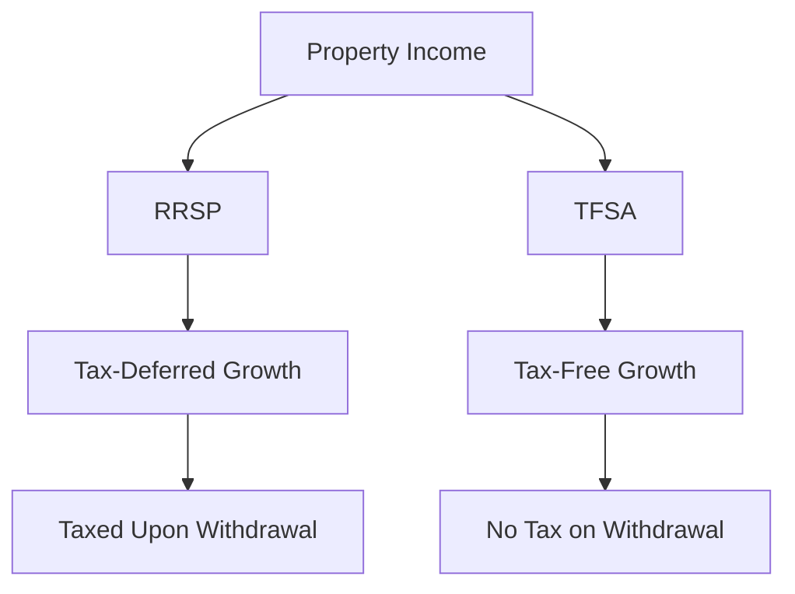

## 24.4.4 Taxation of Income from Property

In the realm of Canadian finance, understanding the taxation of income from property is crucial for both individual investors and financial professionals. This section delves into the nuances of how property income is taxed, the role of registered plans like RRSPs and TFSAs, and the importance of recognizing income for tax purposes.

### Understanding Property Income Taxation

Property income in Canada is generally taxed on an accrual basis. This means that income is recognized for tax purposes when it is earned, not necessarily when it is received. This principle applies to various forms of property income, including interest, dividends, and rental income.

#### Accrual Basis Taxation

The accrual basis of taxation requires taxpayers to report income in the fiscal period it is earned, regardless of when the cash is actually received. For example, if you own a rental property and a tenant pays rent for December in January, the income is still considered earned in December for tax purposes.

This approach ensures that income is matched with the period in which it is generated, providing a more accurate reflection of financial performance. However, it also means that taxpayers must be diligent in tracking and reporting income, even if cash flow does not align with income recognition.

### Impact of Registered Plans: RRSPs and TFSAs

Registered plans like the Registered Retirement Savings Plan (RRSP) and the Tax-Free Savings Account (TFSA) play a significant role in the taxation of property income. These plans offer tax advantages that can impact how property income is taxed.

#### RRSPs and Property Income

Contributions to an RRSP are tax-deductible, and the income earned within the plan is not taxed until it is withdrawn. This allows for tax-deferred growth, meaning that property income, such as interest or dividends, can accumulate without immediate tax implications. Upon withdrawal, the income is taxed at the individual's marginal tax rate.

For example, if you invest in a bond within your RRSP, the interest income generated is not subject to tax until you withdraw funds from the RRSP. This deferral can be advantageous for long-term growth, as it allows the investment to compound without the drag of annual taxation.

#### TFSAs and Property Income

The TFSA offers a different tax advantage. Contributions to a TFSA are not tax-deductible, but the income earned within the account is completely tax-free, even upon withdrawal. This means that property income, such as dividends from stocks held in a TFSA, is not subject to taxation at any point.

For instance, if you hold shares of a Canadian bank in your TFSA and receive dividends, those dividends are not taxed, and any capital gains realized upon selling the shares are also tax-free. This makes the TFSA an attractive option for holding income-generating investments.

### Recognizing Income in Registered Plans

While RRSPs and TFSAs offer tax advantages, it is important to recognize the income earned within these accounts for tax planning purposes. Understanding the timing and nature of income recognition can help optimize tax strategies and ensure compliance with Canadian tax laws.

#### Exceptions to Immediate Taxation

One of the key benefits of registered plans is the ability to defer or eliminate taxation on income. However, it is crucial to be aware of exceptions and conditions that may affect this benefit. For example, over-contributions to an RRSP can result in penalties, and certain foreign investments in a TFSA may be subject to withholding taxes.

### Practical Examples and Case Studies

To illustrate the concepts discussed, consider the following examples:

#### Example 1: RRSP Investment

Imagine you invest $10,000 in a corporate bond within your RRSP, earning 5% annual interest. Over five years, the bond generates $2,500 in interest income. This income is not taxed during the investment period, allowing the full amount to compound. Upon withdrawal, the $2,500 is taxed at your marginal rate.

#### Example 2: TFSA Investment

Suppose you invest $10,000 in shares of a Canadian dividend-paying stock within your TFSA. Over five years, you receive $1,500 in dividends and realize a $2,000 capital gain. None of this income is taxed, maximizing your after-tax return.

### Diagrams and Visual Aids

To further clarify these concepts, consider the following diagram illustrating the flow of income and taxation in RRSPs and TFSAs:

### Best Practices and Common Pitfalls

When managing property income and registered plans, consider the following best practices:

- **Track Income Accurately:** Ensure all property income is accurately tracked and reported, even if not immediately received.
- **Maximize Registered Plan Contributions:** Utilize RRSPs and TFSAs to defer or eliminate taxes on property income.
- **Be Aware of Contribution Limits:** Avoid over-contributions to registered plans to prevent penalties.
- **Consider Tax Implications of Withdrawals:** Plan withdrawals from RRSPs to minimize tax impact, especially in retirement.

### Conclusion

Understanding the taxation of income from property is essential for effective financial planning and investment management in Canada. By leveraging registered plans like RRSPs and TFSAs, investors can optimize their tax strategies and enhance their financial outcomes. As you navigate the complexities of property income taxation, remember to stay informed about regulatory changes and seek professional advice when needed.

## Quiz Time!



### Which basis is used for taxing property income in Canada?

- [x] Accrual basis
- [ ] Cash basis
- [ ] Modified cash basis
- [ ] Hybrid basis

> **Explanation:** Property income in Canada is taxed on an accrual basis, meaning income is recognized when it is earned, not when it is received.

### What is the tax treatment of income earned within an RRSP?

- [x] Tax-deferred until withdrawal
- [ ] Tax-free
- [ ] Taxed annually
- [ ] Taxed at a reduced rate

> **Explanation:** Income earned within an RRSP is tax-deferred, meaning it is not taxed until funds are withdrawn from the account.

### How does a TFSA affect the taxation of property income?

- [x] Income is tax-free
- [ ] Income is tax-deferred
- [ ] Income is taxed annually
- [ ] Income is taxed at a reduced rate

> **Explanation:** Income earned within a TFSA is completely tax-free, both during the investment period and upon withdrawal.

### What happens if you over-contribute to an RRSP?

- [x] Penalties may apply
- [ ] No penalties, but income is taxed
- [ ] Contributions are refunded
- [ ] Contributions are automatically transferred to a TFSA

> **Explanation:** Over-contributions to an RRSP can result in penalties, emphasizing the importance of adhering to contribution limits.

### Which of the following is a benefit of using a TFSA for property income?

- [x] Tax-free growth
- [ ] Tax-deferred growth
- [x] No tax on withdrawals
- [ ] Reduced tax rate on income

> **Explanation:** A TFSA offers tax-free growth and no tax on withdrawals, making it an attractive option for holding income-generating investments.

### What is the impact of withdrawing funds from an RRSP?

- [x] Income is taxed at the marginal rate
- [ ] Income is tax-free
- [ ] Income is taxed at a reduced rate
- [ ] Income is not taxed

> **Explanation:** Withdrawals from an RRSP are taxed at the individual's marginal tax rate, impacting the net amount received.

### Which registered plan allows for tax-free withdrawals?

- [x] TFSA
- [ ] RRSP
- [x] RESP
- [ ] LIRA

> **Explanation:** Both TFSAs and RESPs allow for tax-free withdrawals, though they serve different purposes.

### What is a common pitfall when managing property income?

- [x] Failing to track income accurately
- [ ] Over-contributing to a TFSA
- [ ] Under-reporting expenses
- [ ] Investing in foreign stocks

> **Explanation:** Failing to track income accurately can lead to compliance issues and potential penalties.

### How can investors optimize their tax strategies with registered plans?

- [x] Maximize contributions
- [ ] Avoid using registered plans
- [ ] Only invest in foreign assets
- [ ] Withdraw funds annually

> **Explanation:** Maximizing contributions to registered plans like RRSPs and TFSAs can optimize tax strategies and enhance financial outcomes.

### True or False: Income earned within a TFSA is taxed upon withdrawal.

- [ ] True
- [x] False

> **Explanation:** Income earned within a TFSA is not taxed upon withdrawal, providing a tax-free benefit to investors.


