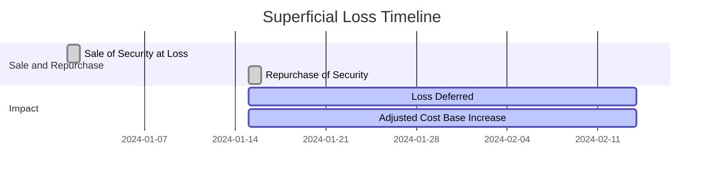

## 24.4.8.2 Rules Around Superficial Losses

In the realm of Canadian taxation, understanding the rules around superficial losses is crucial for investors aiming to optimize their tax strategies. Superficial losses can significantly impact how capital gains and losses are calculated and reported, affecting an investor's overall tax liability. This section delves into the definition of superficial losses, the conditions under which they occur, and their implications on tax calculations and future capital gains.

### Understanding Superficial Losses

A **superficial loss** occurs when an investor sells a security at a loss and then repurchases the same or an identical security within a specific timeframe. According to the Canada Revenue Agency (CRA), this timeframe is 30 days before or after the sale. The purpose of these rules is to prevent taxpayers from claiming a tax deduction for a loss on a security while still maintaining ownership of that security.

#### Conditions for Superficial Losses

Superficial losses are triggered under the following conditions:

1. **Sale of a Security at a Loss**: The investor sells a security and incurs a loss.
2. **Repurchase of the Same or Identical Security**: The investor repurchases the same security, or one that is identical, within 30 days before or after the sale.
3. **Ownership by Affiliated Persons**: The repurchase can be made by the investor or an affiliated person, such as a spouse or a corporation controlled by the investor.

### Treatment of Superficial Losses

When a superficial loss occurs, the loss is deemed non-deductible for tax purposes. Instead, the amount of the loss is added to the adjusted cost base (ACB) of the repurchased security. This adjustment effectively defers the recognition of the loss until the security is sold again, without triggering the superficial loss rules.

#### Example of Superficial Loss Application

Consider the following scenario:

- **Day 1**: An investor sells 100 shares of XYZ Corporation at a loss of $1,000.
- **Day 15**: The investor repurchases 100 shares of XYZ Corporation.

In this case, the $1,000 loss is considered a superficial loss and is not immediately deductible. Instead, the $1,000 is added to the ACB of the repurchased shares. If the investor later sells these shares without triggering another superficial loss, the adjusted ACB will reduce the capital gain or increase the capital loss recognized at that time.

### Impact on Tax Calculations and Future Capital Gains

The superficial loss rules can have significant implications for tax calculations and future capital gains:

- **Deferral of Loss Recognition**: By adding the superficial loss to the ACB of the repurchased security, the recognition of the loss is deferred. This can impact the timing of tax deductions and the investor's overall tax strategy.
- **Potential for Future Deductions**: When the repurchased security is eventually sold without triggering another superficial loss, the previously deferred loss can be recognized, potentially reducing future capital gains.
- **Strategic Considerations**: Investors must carefully consider the timing of security sales and repurchases to avoid triggering superficial losses inadvertently. This requires strategic planning, especially in volatile markets where frequent trading may occur.

### Practical Considerations and Best Practices

Investors should be mindful of the following best practices to navigate superficial loss rules effectively:

- **Monitor Trading Activity**: Keep a close watch on trading activity, especially during periods of market volatility, to avoid unintentional superficial losses.
- **Plan for Tax Efficiency**: Consider the timing of sales and repurchases in the context of overall tax planning to maximize tax efficiency.
- **Consult with Tax Professionals**: Given the complexity of tax regulations, consulting with a tax professional can provide valuable insights and help optimize investment strategies.

### Visualizing Superficial Loss Scenarios

Below is a diagram illustrating the timeline and impact of a superficial loss scenario:

### Conclusion

Understanding the rules around superficial losses is essential for Canadian investors seeking to optimize their tax strategies. By recognizing the conditions that trigger superficial losses and their impact on tax calculations, investors can make informed decisions that align with their financial goals. Strategic planning and professional guidance can further enhance the effectiveness of these strategies, ensuring compliance with Canadian tax regulations.

## Quiz Time!



### What is a superficial loss?

- [x] A loss on a security sale that is not immediately deductible due to repurchase within 30 days.
- [ ] A gain on a security sale that is not taxable.
- [ ] A loss on a security sale that is immediately deductible.
- [ ] A loss on a security sale that is never deductible.

> **Explanation:** A superficial loss occurs when a security is sold at a loss and repurchased within 30 days, making the loss non-deductible immediately.

### How is a superficial loss treated for tax purposes?

- [x] It is added to the adjusted cost base of the repurchased security.
- [ ] It is deducted from the adjusted cost base of the repurchased security.
- [ ] It is immediately deductible.
- [ ] It is ignored for tax purposes.

> **Explanation:** The superficial loss is added to the adjusted cost base of the repurchased security, deferring the loss recognition.

### What is the timeframe for triggering a superficial loss?

- [x] 30 days before or after the sale.
- [ ] 60 days before or after the sale.
- [ ] 90 days before or after the sale.
- [ ] 120 days before or after the sale.

> **Explanation:** The superficial loss rules apply if the same or identical security is repurchased within 30 days before or after the sale.

### Who can trigger a superficial loss?

- [x] The investor or an affiliated person.
- [ ] Only the investor.
- [ ] Only a spouse.
- [ ] Only a corporation.

> **Explanation:** A superficial loss can be triggered by the investor or an affiliated person, such as a spouse or a corporation controlled by the investor.

### What happens to the loss amount in a superficial loss scenario?

- [x] It is added to the adjusted cost base of the repurchased security.
- [ ] It is subtracted from the adjusted cost base of the repurchased security.
- [ ] It is immediately recognized as a capital gain.
- [ ] It is ignored for future calculations.

> **Explanation:** The loss amount is added to the adjusted cost base of the repurchased security, deferring the loss recognition.

### Why are superficial loss rules in place?

- [x] To prevent tax deductions while maintaining ownership of the security.
- [ ] To encourage frequent trading.
- [ ] To simplify tax calculations.
- [ ] To increase tax revenue.

> **Explanation:** Superficial loss rules prevent taxpayers from claiming a deduction for a loss while still maintaining ownership of the security.

### What is the impact of superficial losses on future capital gains?

- [x] They can reduce future capital gains when the security is sold.
- [ ] They increase future capital gains.
- [ ] They have no impact on future capital gains.
- [ ] They eliminate future capital gains.

> **Explanation:** When the repurchased security is sold without triggering another superficial loss, the previously deferred loss can reduce future capital gains.

### How can investors avoid triggering superficial losses?

- [x] By carefully timing the sale and repurchase of securities.
- [ ] By selling securities at a gain.
- [ ] By not selling securities at all.
- [ ] By repurchasing securities immediately.

> **Explanation:** Investors can avoid triggering superficial losses by carefully timing the sale and repurchase of securities.

### What should investors do to manage superficial losses effectively?

- [x] Consult with tax professionals and plan for tax efficiency.
- [ ] Ignore tax implications.
- [ ] Avoid selling securities.
- [ ] Only invest in non-taxable accounts.

> **Explanation:** Consulting with tax professionals and planning for tax efficiency can help investors manage superficial losses effectively.

### True or False: Superficial losses are immediately deductible.

- [ ] True
- [x] False

> **Explanation:** Superficial losses are not immediately deductible; they are added to the adjusted cost base of the repurchased security.


