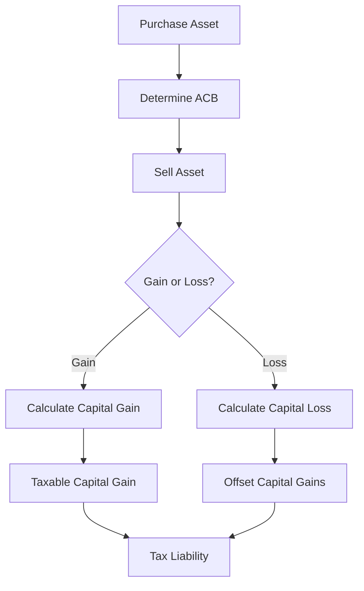

## 24.4.8 Capital Gains and Losses

Capital gains and losses are fundamental concepts in the realm of investment and taxation, particularly within the Canadian financial landscape. Understanding these concepts is crucial for investors, financial planners, and anyone involved in managing investment portfolios. This section delves into the definitions, calculations, and tax implications of capital gains and losses, providing a comprehensive guide to navigating these financial elements.

### Understanding Capital Gains and Losses

**Capital Gains** occur when an asset is sold for more than its purchase price. This gain represents the increase in value of the asset over time and is a key component of investment returns. Conversely, **Capital Losses** arise when an asset is sold for less than its purchase price, indicating a decrease in value.

#### Definitions and Distinctions

- **Capital Gain:** The profit realized from the sale of a capital asset, such as stocks, bonds, or real estate, when the selling price exceeds the original purchase price.
- **Capital Loss:** The loss incurred when a capital asset is sold for less than its original purchase price.

These definitions highlight the importance of accurately tracking the purchase and sale prices of assets to determine the resulting gain or loss.

### Calculating Capital Gains

The calculation of capital gains is a straightforward process, yet it requires careful attention to detail. The formula for calculating capital gains is as follows:

 \text{Capital Gain} = \text{Sale Price} - \text{Adjusted Cost Base (ACB)} - \text{Selling Expenses} 

- **Sale Price:** The amount received from selling the asset.
- **Adjusted Cost Base (ACB):** The original purchase price of the asset, adjusted for any additional costs or improvements.
- **Selling Expenses:** Costs associated with selling the asset, such as brokerage fees or legal expenses.

#### Example Calculation

Consider an investor who purchased shares in a Canadian company for $10,000. Over time, the value of these shares increased, and the investor sold them for $15,000. The selling expenses amounted to $500. The capital gain calculation would be:

 \text{Capital Gain} = \$15,000 - \$10,000 - \$500 = \$4,500 

This $4,500 represents the capital gain, which is subject to taxation.

### Preferential Tax Treatment of Capital Gains

In Canada, capital gains benefit from preferential tax treatment, which is a significant advantage for investors. Only 50% of the capital gain is taxable, known as the **taxable capital gain**. This means that if an investor realizes a capital gain of $4,500, only $2,250 is subject to tax.

This preferential treatment encourages investment by reducing the tax burden on gains, making it an attractive option for long-term wealth accumulation.

### Utilizing Capital Losses

Capital losses can be strategically used to offset capital gains, thereby reducing the overall tax liability. However, it's important to note that capital losses can only be used to offset capital gains and cannot be applied to reduce other types of income, such as employment or business income.

#### Carrying Capital Losses

Capital losses can be carried back up to three years or carried forward indefinitely to offset capital gains in other years. This flexibility allows investors to manage their tax liabilities effectively over time.

### Specific Tax Rules

#### Superficial Losses

A **superficial loss** occurs when an asset is sold at a loss and repurchased within 30 days before or after the sale. In such cases, the loss is not deductible for tax purposes. This rule prevents investors from selling assets solely to realize a tax loss while maintaining their investment position.

#### Worthless Securities

In situations where securities become worthless, investors may claim a capital loss. However, specific criteria must be met, and the loss must be reported in the tax year in which the securities became worthless.

### Practical Applications and Strategies

Understanding capital gains and losses is essential for effective financial planning and investment strategy. Here are some practical applications and strategies:

- **Tax-Loss Harvesting:** This strategy involves selling securities at a loss to offset capital gains, thereby reducing the overall tax liability.
- **Portfolio Rebalancing:** Regularly reviewing and adjusting the asset allocation in a portfolio can help manage capital gains and losses, optimizing tax efficiency.
- **Long-Term Investment:** Taking advantage of the preferential tax treatment of capital gains encourages long-term investment, aligning with wealth accumulation goals.

### Diagrams and Visual Aids

To further illustrate these concepts, consider the following diagram depicting the flow of capital gains and losses:

### Best Practices and Common Pitfalls

- **Accurate Record-Keeping:** Maintain detailed records of purchase prices, selling prices, and associated expenses to ensure accurate capital gain or loss calculations.
- **Awareness of Tax Rules:** Stay informed about specific tax rules, such as superficial losses, to avoid unintended tax consequences.
- **Strategic Planning:** Incorporate capital gains and losses into broader financial planning to optimize tax efficiency and investment returns.

### Conclusion

Capital gains and losses are integral to the Canadian taxation system, offering both opportunities and challenges for investors. By understanding the calculations, tax implications, and strategic applications, investors can effectively manage their portfolios and optimize their financial outcomes.

For further exploration, consider reviewing official resources such as the Canada Revenue Agency (CRA) guidelines on capital gains and losses, as well as consulting with financial advisors to tailor strategies to individual circumstances.

## Quiz Time!



### What is a capital gain?

- [x] The profit realized from selling an asset for more than its purchase price
- [ ] The loss incurred from selling an asset for less than its purchase price
- [ ] The original purchase price of an asset
- [ ] The amount of tax paid on an asset

> **Explanation:** A capital gain is the profit realized when an asset is sold for more than its purchase price.

### How is a capital gain calculated?

- [x] Sale price minus adjusted cost base minus selling expenses
- [ ] Sale price plus adjusted cost base plus selling expenses
- [ ] Adjusted cost base minus sale price minus selling expenses
- [ ] Sale price minus adjusted cost base plus selling expenses

> **Explanation:** The capital gain is calculated by subtracting the adjusted cost base and selling expenses from the sale price.

### What percentage of capital gains is taxable in Canada?

- [x] 50%
- [ ] 100%
- [ ] 75%
- [ ] 25%

> **Explanation:** In Canada, only 50% of capital gains are taxable, providing preferential tax treatment.

### Can capital losses be used to offset other types of income?

- [x] No
- [ ] Yes
- [ ] Only if carried forward
- [ ] Only if carried back

> **Explanation:** Capital losses can only be used to offset capital gains, not other types of income.

### What is a superficial loss?

- [x] A loss that occurs when an asset is sold and repurchased within 30 days
- [ ] A loss that occurs when an asset is sold for less than its purchase price
- [ ] A loss that is not deductible for tax purposes
- [ ] A loss that can be carried forward indefinitely

> **Explanation:** A superficial loss occurs when an asset is sold at a loss and repurchased within 30 days, making the loss non-deductible.

### How long can capital losses be carried forward?

- [x] Indefinitely
- [ ] Up to 3 years
- [ ] Up to 5 years
- [ ] Up to 10 years

> **Explanation:** Capital losses can be carried forward indefinitely to offset future capital gains.

### What is the adjusted cost base (ACB)?

- [x] The original purchase price of an asset, adjusted for additional costs
- [ ] The selling price of an asset
- [ ] The profit from selling an asset
- [ ] The tax paid on a capital gain

> **Explanation:** The adjusted cost base is the original purchase price of an asset, adjusted for any additional costs or improvements.

### What is tax-loss harvesting?

- [x] Selling securities at a loss to offset capital gains
- [ ] Buying securities to increase capital gains
- [ ] Selling securities at a gain to offset capital losses
- [ ] Holding securities to avoid taxes

> **Explanation:** Tax-loss harvesting involves selling securities at a loss to offset capital gains, reducing tax liability.

### What happens to a capital loss if there are no capital gains to offset?

- [x] It can be carried forward or back to offset gains in other years
- [ ] It is lost and cannot be used
- [ ] It can be used to offset other types of income
- [ ] It must be claimed in the current year

> **Explanation:** If there are no capital gains to offset, a capital loss can be carried forward indefinitely or carried back up to three years.

### True or False: Capital gains and losses are integral to the Canadian taxation system.

- [x] True
- [ ] False

> **Explanation:** Capital gains and losses are indeed integral to the Canadian taxation system, affecting investment strategies and tax liabilities.


