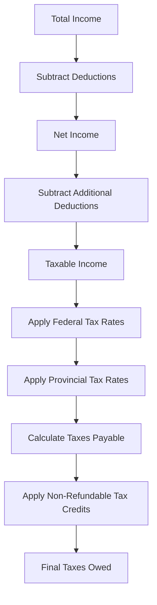

## 24.4 The Canadian Taxation System

The Canadian taxation system is a complex framework designed to collect revenue to fund public services and infrastructure. It operates on multiple levels, involving both federal and provincial governments, each with distinct responsibilities. Understanding this system is crucial for financial professionals and investors operating within Canada. This section will delve into the structure of the Canadian taxation system, the taxation of residents and non-residents, corporate taxation, and the annual income tax calculation process.

### Structure of the Canadian Taxation System

The Canadian taxation system is structured to allocate responsibilities between the federal and provincial governments. This dual-level system ensures that both levels of government can levy taxes to fund their respective services and programs.

#### Federal Responsibilities

The federal government, through the Canada Revenue Agency (CRA), is responsible for collecting taxes on income, goods and services, and other federal levies. Key federal taxes include:

- **Income Tax**: Levied on individuals and corporations, calculated based on taxable income.
- **Goods and Services Tax (GST)**: A value-added tax applied to most goods and services sold in Canada.
- **Excise Taxes and Duties**: Applied to specific goods, such as alcohol and tobacco.

#### Provincial Responsibilities

Each province and territory in Canada has the authority to levy its own taxes. These can vary significantly across regions, reflecting local economic conditions and policy priorities. Common provincial taxes include:

- **Provincial Income Tax**: Similar to federal income tax but with rates and brackets set by each province.
- **Provincial Sales Tax (PST)**: Applied to goods and services, with rates and exemptions varying by province.
- **Property Taxes**: Levied on real estate by municipalities, often collected by provincial authorities.

### Taxation of Residents and Non-Residents

Canada's taxation system distinguishes between residents and non-residents, with different rules applying to each group.

#### Taxation of Residents

Canadian residents are taxed on their worldwide income, meaning they must report all income earned both within and outside Canada. Residency is determined by several factors, including:

- **Residential Ties**: Such as owning a home, having a spouse or dependents in Canada, and maintaining personal property.
- **Physical Presence**: Spending 183 days or more in Canada during a calendar year typically establishes residency for tax purposes.

#### Taxation of Non-Residents

Non-residents are taxed only on their Canadian-source income. This includes:

- **Employment Income**: Earned from working in Canada.
- **Business Income**: From business activities conducted in Canada.
- **Investment Income**: Such as dividends, interest, and rental income from Canadian sources.

Non-residents may be subject to withholding taxes on certain types of income, typically at a rate of 25%, though tax treaties can reduce this rate.

### Corporate Taxation and Residency Criteria

Corporations in Canada are subject to taxation based on their residency status and source of income.

#### Criteria for Corporate Residency

A corporation is considered a resident of Canada if it is incorporated in Canada or if its central management and control are exercised in Canada. This typically means that the corporation's board of directors meets in Canada.

#### Corporate Taxation

Canadian corporations are taxed on their worldwide income, similar to individual residents. Key aspects of corporate taxation include:

- **Federal and Provincial Corporate Income Tax**: Corporations pay both federal and provincial income taxes, with rates varying by province.
- **Small Business Deduction**: Available to Canadian-controlled private corporations (CCPCs), reducing the tax rate on active business income up to a certain threshold.
- **Integration Mechanism**: Designed to prevent double taxation of corporate income distributed as dividends to shareholders.

### Annual Income Tax Calculation Process

The process of calculating annual income tax involves several steps for both individuals and corporations.

#### Individual Income Tax Calculation

1. **Determine Total Income**: Sum all sources of income, including employment, business, investment, and other income.
2. **Calculate Net Income**: Subtract allowable deductions, such as RRSP contributions and union dues, from total income.
3. **Determine Taxable Income**: Apply additional deductions, such as the basic personal amount, to net income.
4. **Calculate Federal and Provincial Taxes**: Apply the respective tax rates to taxable income, considering any applicable credits.
5. **Apply Non-Refundable Tax Credits**: Reduce taxes payable by claiming credits for eligible expenses, such as charitable donations and medical expenses.

#### Corporate Income Tax Calculation

1. **Determine Total Revenue**: Sum all revenue streams, including sales and investment income.
2. **Calculate Net Income for Tax Purposes**: Subtract allowable business expenses and deductions from total revenue.
3. **Apply Corporate Tax Rates**: Calculate federal and provincial taxes based on net income, considering any applicable deductions and credits.
4. **File Corporate Tax Return**: Submit the T2 Corporation Income Tax Return to the CRA, along with any provincial returns if required.

### Practical Examples and Case Studies

To illustrate these concepts, consider the following examples:

#### Example 1: Individual Tax Calculation

Jane, a resident of Ontario, earns $80,000 annually from her job and $5,000 in investment income. She contributes $5,000 to her RRSP. Her taxable income is calculated as follows:

- Total Income: $85,000
- RRSP Deduction: $5,000
- Taxable Income: $80,000

Jane calculates her federal and provincial taxes using the respective tax brackets and claims credits for her RRSP contribution and other eligible expenses.

#### Example 2: Corporate Tax Calculation

XYZ Corp, a CCPC based in British Columbia, earns $500,000 in active business income. The corporation claims the small business deduction, reducing its federal tax rate. XYZ Corp calculates its taxes by applying the reduced rate to its income and filing the necessary returns.

### Diagrams and Visual Aids

To further clarify these processes, consider the following diagram illustrating the flow of income tax calculation for individuals:

### Best Practices and Common Pitfalls

When navigating the Canadian taxation system, consider the following best practices:

- **Stay Informed**: Tax laws and rates can change annually. Stay updated on current regulations and consult with tax professionals as needed.
- **Keep Accurate Records**: Maintain detailed records of income, expenses, and deductions to support your tax filings.
- **Plan for Tax Efficiency**: Utilize tax-advantaged accounts, such as RRSPs and TFSAs, to optimize your tax situation.

Common pitfalls include:

- **Overlooking Deductions and Credits**: Failing to claim all eligible deductions and credits can result in higher taxes.
- **Misunderstanding Residency Rules**: Incorrectly determining residency status can lead to improper tax filings and potential penalties.

### Additional Resources

For further exploration of the Canadian taxation system, consider the following resources:

- **Canada Revenue Agency (CRA) Website**: [CRA](https://www.canada.ca/en/revenue-agency.html) - Official source for tax information and resources.
- **Tax Planning for You and Your Family** by KPMG - A comprehensive guide to personal tax planning in Canada.
- **Canadian Tax Principles** by Byrd & Chen - A detailed textbook on Canadian tax principles and practices.

## Quiz Time!



### What is the primary responsibility of the federal government in the Canadian taxation system?

- [x] Collecting income taxes
- [ ] Collecting property taxes
- [ ] Collecting municipal taxes
- [ ] Collecting only provincial taxes

> **Explanation:** The federal government, through the CRA, is primarily responsible for collecting income taxes, among other federal taxes.

### How is residency for tax purposes determined in Canada?

- [x] Residential ties and physical presence
- [ ] Only physical presence
- [ ] Only residential ties
- [ ] Employment status

> **Explanation:** Residency is determined by residential ties and physical presence, such as spending 183 days or more in Canada.

### What is the tax rate typically applied to non-residents' Canadian-source income?

- [ ] 15%
- [ ] 20%
- [x] 25%
- [ ] 30%

> **Explanation:** Non-residents are typically subject to a 25% withholding tax on Canadian-source income, though tax treaties may reduce this rate.

### What is the purpose of the small business deduction for CCPCs?

- [x] To reduce the tax rate on active business income
- [ ] To increase the tax rate on passive income
- [ ] To eliminate all taxes for small businesses
- [ ] To apply only to non-resident corporations

> **Explanation:** The small business deduction reduces the tax rate on active business income for Canadian-controlled private corporations.

### Which of the following is a common provincial tax in Canada?

- [x] Provincial Income Tax
- [ ] Federal Income Tax
- [ ] Excise Tax
- [ ] Municipal Tax

> **Explanation:** Provincial Income Tax is a common tax levied by provinces, with rates and brackets set by each province.

### What is the first step in calculating individual income tax?

- [x] Determine Total Income
- [ ] Apply Tax Credits
- [ ] Calculate Net Income
- [ ] File Tax Return

> **Explanation:** The first step is to determine total income by summing all sources of income.

### What type of income are Canadian residents taxed on?

- [x] Worldwide income
- [ ] Only Canadian-source income
- [ ] Only foreign-source income
- [ ] Only employment income

> **Explanation:** Canadian residents are taxed on their worldwide income, including income earned both within and outside Canada.

### What is the role of the CRA in the Canadian taxation system?

- [x] Collecting federal taxes
- [ ] Setting provincial tax rates
- [ ] Collecting municipal taxes
- [ ] Only auditing corporations

> **Explanation:** The CRA is responsible for collecting federal taxes and administering tax laws for the Government of Canada.

### What is a key factor in determining corporate residency in Canada?

- [x] Central management and control
- [ ] Number of employees
- [ ] Amount of revenue
- [ ] Location of shareholders

> **Explanation:** Corporate residency is determined by where the central management and control of the corporation are exercised.

### True or False: Non-residents are taxed on their worldwide income in Canada.

- [ ] True
- [x] False

> **Explanation:** Non-residents are taxed only on their Canadian-source income, not their worldwide income.


