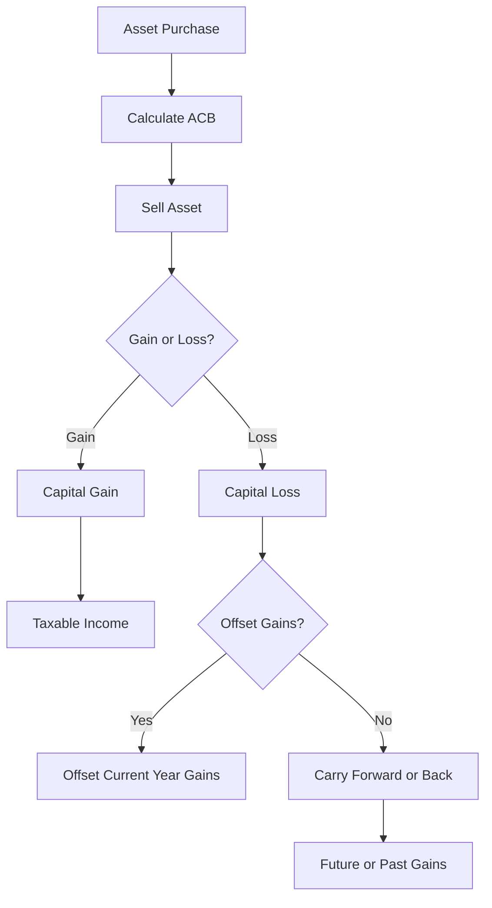

---

linkTitle: "24.5 Capital Gains and Losses"
title: "Capital Gains and Losses: Understanding, Calculating, and Managing"
description: "Explore the intricacies of capital gains and losses, their calculation, and strategies for effective management within the Canadian financial landscape."
categories:
- Canadian Taxation
- Investment Strategies
- Financial Planning
tags:
- Capital Gains
- Capital Losses
- Taxation
- Investment Management
- Canadian Finance
date: 2024-10-25
type: docs
nav_weight: 1250000
---

## 24.5 Capital Gains and Losses

Capital gains and losses are fundamental concepts in the realm of investment and taxation, particularly within the Canadian financial landscape. Understanding these concepts is crucial for effective financial planning and investment management. This section will delve into the practical applications of calculating capital gains and losses, explore strategies for managing them, and discuss the implications of carrying forward or carrying back capital losses. We will also refer to the glossary for reinforced understanding of key terms.

### Recap of Capital Gains and Capital Losses

**Capital Gains** occur when the selling price of an asset exceeds its purchase price. This gain is considered income and is subject to taxation. For example, if you purchase shares of a Canadian company like RBC for $10,000 and later sell them for $15,000, you realize a capital gain of $5,000.

**Capital Losses** arise when the selling price of an asset is less than its purchase price. These losses can be used to offset capital gains, thereby reducing taxable income. For instance, if you sell shares of TD Bank for $8,000 that you originally purchased for $10,000, you incur a capital loss of $2,000.

### Calculating Capital Gains and Losses

To calculate capital gains or losses, you need to determine the **Adjusted Cost Base (ACB)** of the asset, which includes the purchase price plus any associated costs such as commissions or fees. The formula is:

 \text{Capital Gain/Loss} = \text{Proceeds of Disposition} - \text{Adjusted Cost Base} - \text{Expenses of Disposition} 

#### Example Calculation

Imagine you bought 100 shares of a Canadian tech company at $50 per share, with a commission fee of $100. Your ACB would be:

 \text{ACB} = (100 \times 50) + 100 = 5,100 

If you sell these shares for $60 each, with a selling commission of $100, your proceeds would be:

 \text{Proceeds} = (100 \times 60) - 100 = 5,900 

Thus, your capital gain would be:

 \text{Capital Gain} = 5,900 - 5,100 = 800 

### Strategies for Managing Capital Gains

1. **Timing of Sales**: Consider the timing of asset sales to manage the tax impact. Selling assets in a year when you have lower income can reduce your overall tax burden.

2. **Tax-Loss Harvesting**: This involves selling securities at a loss to offset capital gains. It's a strategic move to minimize taxes, especially towards the end of the fiscal year.

3. **Utilizing Tax-Advantaged Accounts**: Use Registered Retirement Savings Plans (RRSPs) or Tax-Free Savings Accounts (TFSAs) to shelter investments from immediate taxation.

### Utilizing Capital Losses

Capital losses can be used to offset capital gains in the current year, carried back to offset gains from the previous three years, or carried forward indefinitely to offset future gains. This flexibility allows investors to strategically manage their tax liabilities.

#### Carrying Forward and Carrying Back Capital Losses

- **Carrying Forward**: If you have no capital gains in the current year, you can carry forward the losses to future years. This is beneficial if you anticipate higher gains in the future.

- **Carrying Back**: You can apply capital losses to capital gains reported in the previous three years. This can result in a tax refund if you paid taxes on those gains.

### Practical Example: Managing Capital Losses

Consider an investor who incurs a capital loss of $10,000 in 2023. They had capital gains of $5,000 in 2022 and $7,000 in 2021. The investor can carry back the loss to offset these gains, potentially receiving a tax refund for those years.

### Implications and Considerations

Understanding the tax implications of capital gains and losses is crucial for effective financial planning. Investors should be aware of the following:

- **Tax Rates**: In Canada, only 50% of capital gains are taxable, which can significantly impact investment strategies.
- **Superficial Loss Rule**: This rule prevents investors from claiming a capital loss on an asset if they repurchase the same or identical asset within 30 days before or after the sale.

### Visualizing Capital Gains and Losses

Below is a diagram illustrating the flow of capital gains and losses, including the options for carrying forward or carrying back losses.

### Best Practices and Common Pitfalls

- **Best Practices**: Regularly review your investment portfolio to identify opportunities for tax-loss harvesting. Keep detailed records of all transactions to accurately calculate ACB and capital gains or losses.

- **Common Pitfalls**: Failing to account for all transaction costs can lead to incorrect ACB calculations. Be mindful of the superficial loss rule to avoid disallowed losses.

### Conclusion

Capital gains and losses are integral to investment management and tax planning. By understanding how to calculate and manage these financial elements, investors can optimize their portfolios and minimize tax liabilities. Always consider consulting with a financial advisor or tax professional to tailor strategies to your specific financial situation.

### Further Resources

- **Canada Revenue Agency (CRA)**: [Capital Gains](https://www.canada.ca/en/revenue-agency/services/tax/individuals/topics/about-your-tax-return/tax-return/completing-a-tax-return/personal-income/line-12700-capital-gains.html)
- **Books**: "The Wealthy Barber Returns" by David Chilton for practical financial advice.
- **Online Courses**: Coursera offers courses on financial planning and investment strategies.

## Quiz Time!



### What is a capital gain?

- [x] The profit from selling an asset for more than its purchase price
- [ ] The loss from selling an asset for less than its purchase price
- [ ] The interest earned on a savings account
- [ ] The dividend received from a stock

> **Explanation:** A capital gain occurs when an asset is sold for more than its purchase price, resulting in a profit.

### How is the Adjusted Cost Base (ACB) calculated?

- [x] Purchase price plus associated costs
- [ ] Selling price minus associated costs
- [ ] Purchase price minus associated costs
- [ ] Selling price plus associated costs

> **Explanation:** The ACB is calculated by adding the purchase price and any associated costs such as commissions or fees.

### What is tax-loss harvesting?

- [x] Selling securities at a loss to offset capital gains
- [ ] Buying securities to increase capital gains
- [ ] Selling securities at a gain to offset capital losses
- [ ] Holding securities to avoid taxes

> **Explanation:** Tax-loss harvesting involves selling securities at a loss to offset capital gains, thereby reducing taxable income.

### How much of a capital gain is taxable in Canada?

- [x] 50%
- [ ] 100%
- [ ] 75%
- [ ] 25%

> **Explanation:** In Canada, only 50% of a capital gain is taxable.

### What is the superficial loss rule?

- [x] It disallows a capital loss if the same asset is repurchased within 30 days
- [ ] It allows a capital gain if the same asset is repurchased within 30 days
- [ ] It disallows a capital gain if the same asset is repurchased within 30 days
- [ ] It allows a capital loss if the same asset is repurchased within 30 days

> **Explanation:** The superficial loss rule disallows a capital loss if the same or identical asset is repurchased within 30 days before or after the sale.

### What can capital losses be used for?

- [x] Offsetting capital gains
- [ ] Increasing taxable income
- [ ] Reducing dividends
- [ ] Increasing interest income

> **Explanation:** Capital losses can be used to offset capital gains, thereby reducing taxable income.

### How long can capital losses be carried forward in Canada?

- [x] Indefinitely
- [ ] 3 years
- [ ] 5 years
- [ ] 10 years

> **Explanation:** In Canada, capital losses can be carried forward indefinitely to offset future capital gains.

### What is the benefit of carrying back capital losses?

- [x] It can result in a tax refund for previous years
- [ ] It increases current year taxable income
- [ ] It reduces future capital gains
- [ ] It increases future capital gains

> **Explanation:** Carrying back capital losses can offset gains from the previous three years, potentially resulting in a tax refund.

### What is the impact of selling assets in a year with lower income?

- [x] It can reduce overall tax burden
- [ ] It increases overall tax burden
- [ ] It has no impact on taxes
- [ ] It increases capital gains

> **Explanation:** Selling assets in a year with lower income can reduce the overall tax burden due to lower marginal tax rates.

### True or False: Only 50% of capital losses are deductible in Canada.

- [ ] True
- [x] False

> **Explanation:** In Canada, 100% of capital losses can be used to offset capital gains, but only 50% of the net capital gain is taxable.


