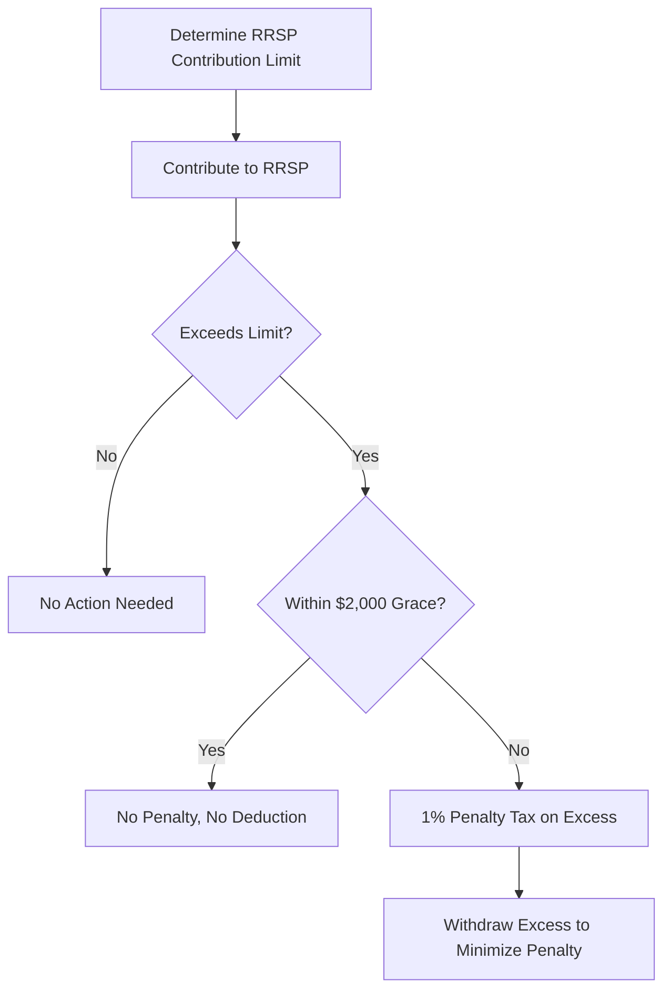

## 24.6.2.5 Over-Contributions

Registered Retirement Savings Plans (RRSPs) are a cornerstone of retirement planning in Canada, offering tax-deferred growth on investments. However, understanding the contribution limits and the implications of over-contributions is crucial for effective financial management. This section delves into the concept of over-contributions, the associated penalties, and strategies to manage and avoid them.

### Understanding Over-Contributions

An over-contribution occurs when an individual contributes more to their RRSP than the allowable limit set by the Canada Revenue Agency (CRA). Each year, the CRA determines the maximum amount you can contribute to your RRSP, which is based on your previous year's earned income and any unused contribution room carried forward from previous years.

### Penalties for Over-Contributions

The CRA allows a small buffer for over-contributions, recognizing that mistakes can happen. This buffer is set at $2,000 over the allowable contribution limit. Contributions exceeding this buffer are subject to a penalty tax.

#### The $2,000 Grace Amount

The CRA permits an over-contribution of up to $2,000 without incurring penalties. This grace amount acts as a cushion for taxpayers who inadvertently exceed their contribution limit. However, it's important to note that while this $2,000 is not penalized, it does not provide any additional tax deduction.

#### Penalty Tax on Excess Contributions

For contributions exceeding the $2,000 grace amount, a penalty tax of 1% per month is levied on the excess amount. This penalty can accumulate quickly, making it essential to address over-contributions promptly. For example, if you over-contribute by $5,000, the penalty tax would apply to $3,000 (the amount over the $2,000 grace), resulting in a monthly penalty of $30.

### Strategies for Managing and Avoiding Over-Contributions

To effectively manage and avoid over-contributions, consider the following strategies:

1. **Regularly Monitor Contribution Limits**: Keep track of your contribution room by reviewing your Notice of Assessment from the CRA, which details your available RRSP contribution room.

2. **Utilize Online Tools**: Use online calculators and tools provided by financial institutions to track your contributions and avoid exceeding limits.

3. **Adjust Contributions Based on Income Changes**: If your income changes significantly, adjust your contributions accordingly to prevent over-contributing.

4. **Withdraw Excess Contributions Promptly**: If you realize you've over-contributed, withdraw the excess amount as soon as possible to minimize penalty taxes. The CRA allows for the withdrawal of excess contributions without tax implications if done promptly.

5. **Consult a Financial Advisor**: A financial advisor can provide personalized advice and help you navigate complex situations involving RRSP contributions.

### Case Study: Managing Over-Contributions

Consider the case of John, a Canadian investor who inadvertently over-contributed to his RRSP by $4,000. Upon realizing his mistake, John promptly withdrew the excess $2,000 beyond the grace amount. By acting quickly, John minimized his penalty tax to $20 for the month the excess was in the account. This proactive approach saved him from further penalties and ensured compliance with CRA regulations.

### Diagram: RRSP Contribution and Over-Contribution Flow

Below is a diagram illustrating the flow of RRSP contributions and the impact of over-contributions:

### Best Practices and Common Pitfalls

**Best Practices:**
- Regularly update your financial plan to reflect changes in income and contribution limits.
- Use automated alerts from your financial institution to notify you of nearing contribution limits.

**Common Pitfalls:**
- Ignoring changes in income that affect contribution limits.
- Failing to act quickly upon discovering an over-contribution, leading to unnecessary penalties.

### Conclusion

Understanding and managing RRSP over-contributions is essential for maximizing the benefits of these retirement savings plans while avoiding costly penalties. By staying informed and proactive, you can ensure that your retirement savings strategy remains on track and compliant with Canadian tax regulations.

## Quiz Time!



### What is an over-contribution in the context of RRSPs?

- [x] Contributing more than the allowable limit set by the CRA
- [ ] Contributing less than the allowable limit set by the CRA
- [ ] Contributing exactly the allowable limit set by the CRA
- [ ] Not contributing to an RRSP at all

> **Explanation:** An over-contribution occurs when more than the allowable limit is contributed to an RRSP.

### What is the penalty for exceeding the $2,000 grace amount in RRSP contributions?

- [x] 1% per month on the excess amount
- [ ] 2% per month on the excess amount
- [ ] 5% per month on the excess amount
- [ ] No penalty

> **Explanation:** The CRA imposes a 1% per month penalty on the excess amount beyond the $2,000 grace.

### How much can you over-contribute to an RRSP without incurring penalties?

- [x] $2,000
- [ ] $1,000
- [ ] $5,000
- [ ] $10,000

> **Explanation:** The CRA allows a $2,000 over-contribution without penalties.

### What should you do if you realize you've over-contributed to your RRSP?

- [x] Withdraw the excess amount promptly
- [ ] Ignore it and hope for the best
- [ ] Contribute more to balance it out
- [ ] Wait until the end of the year to address it

> **Explanation:** Withdrawing the excess amount promptly minimizes penalty taxes.

### What is the primary document to check for your RRSP contribution room?

- [x] Notice of Assessment from the CRA
- [ ] Bank statement
- [ ] Pay stub
- [ ] Tax return from last year

> **Explanation:** The Notice of Assessment provides details on your RRSP contribution room.

### Which tool can help you track your RRSP contributions?

- [x] Online calculators from financial institutions
- [ ] A physical calculator
- [ ] A calendar
- [ ] A notebook

> **Explanation:** Online calculators from financial institutions help track contributions.

### What is a common pitfall in managing RRSP contributions?

- [x] Ignoring changes in income
- [ ] Regularly checking contribution limits
- [ ] Consulting a financial advisor
- [ ] Using online tools

> **Explanation:** Ignoring changes in income can lead to over-contributions.

### What is the benefit of consulting a financial advisor regarding RRSP contributions?

- [x] Personalized advice and navigation of complex situations
- [ ] Free financial services
- [ ] Guaranteed investment returns
- [ ] Exemption from penalties

> **Explanation:** Financial advisors provide personalized advice and help navigate complex situations.

### What happens if you contribute exactly the allowable limit to your RRSP?

- [x] No action needed
- [ ] Penalty tax applies
- [ ] Additional tax deduction
- [ ] Contribution is returned

> **Explanation:** Contributing exactly the allowable limit requires no further action.

### True or False: The $2,000 grace amount provides an additional tax deduction.

- [ ] True
- [x] False

> **Explanation:** The $2,000 grace amount does not provide an additional tax deduction.


