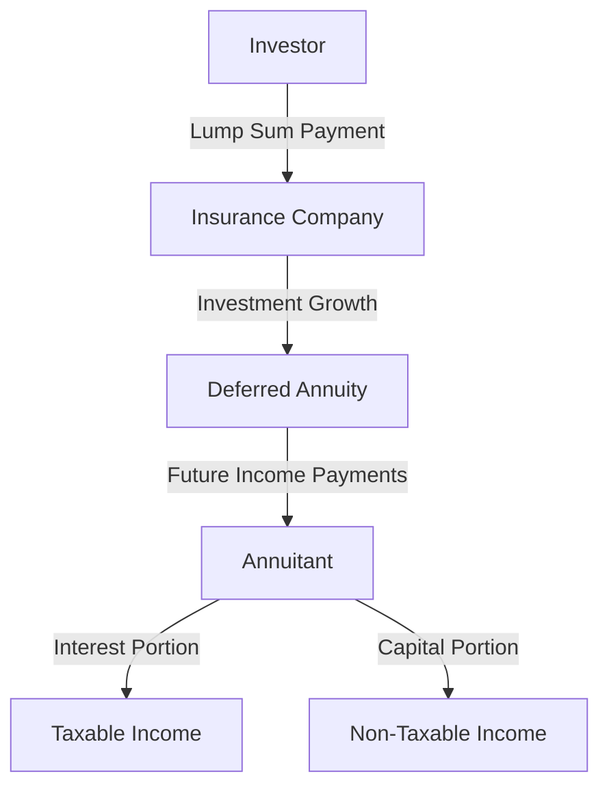

## 24.6.4 Deferred Annuities

Deferred annuities are a powerful financial tool for Canadians seeking to secure a stable income stream in the future while benefiting from tax deferral. These investment contracts are designed to provide income payments at a later date, making them an attractive option for retirement planning. In this section, we will delve into the mechanics of deferred annuities, their tax implications, and their integration with Registered Retirement Savings Plans (RRSPs).

### Understanding Deferred Annuities

A deferred annuity is a contract between an investor and an insurance company, where the investor makes a lump sum payment or a series of payments. In return, the insurance company agrees to provide income payments starting at a future date. This future income can be structured to last for a specific period or for the lifetime of the annuitant.

#### Immediate vs. Deferred Annuities

The primary distinction between immediate and deferred annuities lies in the timing of income payments:

- **Immediate Annuities**: These begin paying out income almost immediately after a lump sum investment is made. They are typically used by individuals who are already in retirement and need a steady income stream.

- **Deferred Annuities**: These delay income payments until a specified future date, allowing the investment to grow tax-deferred during the accumulation phase. This makes them ideal for individuals planning for retirement who do not need immediate income.

### Tax Treatment of Deferred Annuities

One of the key benefits of deferred annuities is their tax-deferred growth. During the accumulation phase, the investment grows without being subject to annual taxes. Taxes are only paid when withdrawals are made, typically during retirement when the annuitant may be in a lower tax bracket.

#### Interest vs. Capital Portions

When annuity payments begin, they are composed of two parts:

- **Interest Portion**: This is the earnings on the original investment and is taxable as income.

- **Capital Portion**: This represents the return of the original investment and is not taxable.

The tax treatment of these portions is crucial for financial planning, as it affects the net income received by the annuitant.

### Deferred Annuities and RRSPs

Deferred annuities can be registered as part of an RRSP, providing additional tax advantages. Contributions to an RRSP are tax-deductible, and the investment grows tax-free until withdrawal. When a deferred annuity is held within an RRSP, it benefits from these tax advantages, enhancing the potential for growth.

#### Conditions for RRSP Registration

To register a deferred annuity as an RRSP, certain conditions must be met:

1. **Eligibility**: The annuity must be purchased with RRSP funds, and the annuitant must be the RRSP account holder.

2. **Compliance**: The annuity contract must comply with RRSP regulations, including contribution limits and withdrawal rules.

3. **Conversion**: Upon reaching the age of 71, the RRSP must be converted into a Registered Retirement Income Fund (RRIF) or an annuity, at which point income payments will begin.

### Role of Insurance Companies

Insurance companies play a pivotal role in providing deferred annuities. They are responsible for managing the investment, ensuring the promised income payments, and maintaining the financial stability of the annuity contract. When selecting an insurance company, it's important to consider their financial strength, reputation, and the terms of the annuity contract.

### Practical Example: Deferred Annuity in Action

Consider a 45-year-old Canadian investor, Alex, who decides to purchase a deferred annuity with a $100,000 lump sum. Alex plans to retire at 65, allowing the annuity to grow for 20 years. During this accumulation phase, the investment grows tax-deferred. Upon retirement, Alex begins receiving monthly income payments, which include both interest and capital portions. By deferring taxes until retirement, Alex maximizes the growth potential of the investment while potentially benefiting from a lower tax rate on withdrawals.

### Visualizing Deferred Annuities

Below is a diagram illustrating the flow of funds in a deferred annuity:

### Best Practices and Common Pitfalls

#### Best Practices

- **Diversification**: Consider diversifying your retirement portfolio by combining deferred annuities with other investment vehicles like mutual funds or stocks.

- **Financial Strength**: Choose an insurance company with a strong financial rating to ensure the security of your annuity.

- **Tax Planning**: Work with a financial advisor to optimize the tax benefits of deferred annuities, especially when integrating them with RRSPs.

#### Common Pitfalls

- **Liquidity**: Deferred annuities are not easily liquidated, so ensure you have other accessible funds for emergencies.

- **Fees and Charges**: Be aware of any fees associated with the annuity contract, as they can impact the overall return on investment.

### Conclusion

Deferred annuities offer a strategic way to plan for retirement by providing tax-deferred growth and a future income stream. By understanding their tax implications and integration with RRSPs, investors can make informed decisions that align with their long-term financial goals. As with any investment, careful consideration of the terms and the financial strength of the insurance provider is essential.

For further exploration, consider reviewing the glossary for definitions related to deferred annuities and consult additional resources on Canadian taxation and retirement planning.

## Quiz Time!



### What is a deferred annuity?

- [x] An investment contract that provides future income payments
- [ ] An immediate payment plan for retirees
- [ ] A type of mutual fund
- [ ] A savings account with a fixed interest rate

> **Explanation:** A deferred annuity is an investment contract designed to provide income payments at a future date, allowing for tax-deferred growth.

### How do immediate annuities differ from deferred annuities?

- [x] Immediate annuities begin payments right away, while deferred annuities delay payments
- [ ] Deferred annuities provide higher returns than immediate annuities
- [ ] Immediate annuities are only available to retirees
- [ ] Deferred annuities are tax-free

> **Explanation:** Immediate annuities start paying out income almost immediately, whereas deferred annuities delay payments to a future date.

### What is the tax treatment of the interest portion of annuity payments?

- [x] It is taxable as income
- [ ] It is tax-free
- [ ] It is taxed at a lower rate than capital gains
- [ ] It is considered a capital gain

> **Explanation:** The interest portion of annuity payments is taxable as income, while the capital portion is not.

### Under what conditions can deferred annuities be registered as RRSPs?

- [x] When purchased with RRSP funds and complying with RRSP regulations
- [ ] When purchased with non-registered funds
- [ ] When the annuitant is over 65
- [ ] When the annuity is purchased from a bank

> **Explanation:** Deferred annuities can be registered as RRSPs if they are purchased with RRSP funds and comply with RRSP regulations.

### What role do insurance companies play in deferred annuities?

- [x] They manage the investment and ensure income payments
- [ ] They provide tax advice
- [ ] They offer immediate payouts
- [ ] They set government regulations

> **Explanation:** Insurance companies manage the investment, ensure the promised income payments, and maintain the financial stability of the annuity contract.

### What is a key benefit of deferred annuities?

- [x] Tax-deferred growth during the accumulation phase
- [ ] Immediate liquidity
- [ ] Guaranteed high returns
- [ ] No fees or charges

> **Explanation:** Deferred annuities offer tax-deferred growth, allowing the investment to grow without being subject to annual taxes until withdrawals are made.

### What should investors consider when selecting an insurance company for a deferred annuity?

- [x] The financial strength and reputation of the company
- [ ] The company's location
- [ ] The company's advertising
- [ ] The company's age

> **Explanation:** Investors should consider the financial strength and reputation of the insurance company to ensure the security of their annuity.

### What is a common pitfall of deferred annuities?

- [x] Lack of liquidity
- [ ] High immediate returns
- [ ] No tax benefits
- [ ] Easy access to funds

> **Explanation:** Deferred annuities are not easily liquidated, so investors should ensure they have other accessible funds for emergencies.

### Can deferred annuities be part of a diversified retirement portfolio?

- [x] Yes, they can be combined with other investment vehicles
- [ ] No, they must be the sole investment
- [ ] Only if purchased from a bank
- [ ] Only if registered as an RRSP

> **Explanation:** Deferred annuities can be part of a diversified retirement portfolio, complementing other investment vehicles like mutual funds or stocks.

### True or False: Deferred annuities provide immediate income payments.

- [ ] True
- [x] False

> **Explanation:** False. Deferred annuities delay income payments to a future date, allowing for tax-deferred growth during the accumulation phase.


