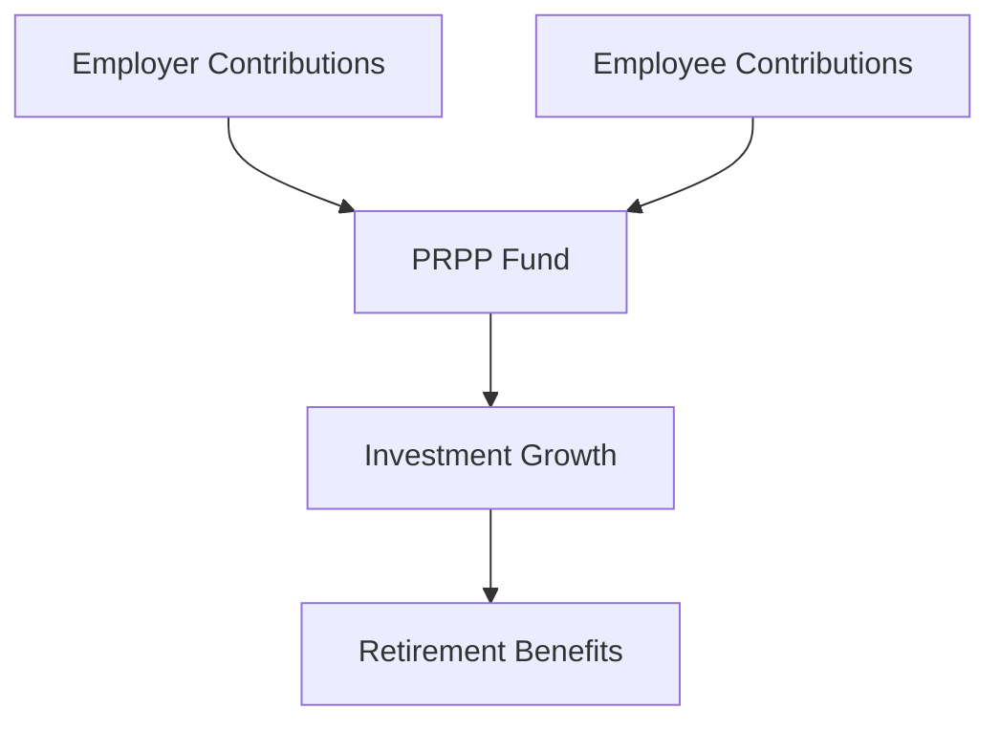

## 24.6.7 Pooled Registered Pension Plans (PRPPs)

Pooled Registered Pension Plans (PRPPs) are a significant innovation in the Canadian retirement savings landscape, designed to address the gap in employer pension plan coverage. These government-supported plans offer a streamlined, cost-effective way for employees and self-employed individuals to save for retirement. In this section, we will delve into the structure, benefits, and operational mechanics of PRPPs, providing a comprehensive understanding of how they function and their role in enhancing retirement security for Canadians.

### Understanding PRPPs

PRPPs are voluntary retirement savings plans that pool contributions from multiple employers and employees. This pooling mechanism allows for economies of scale, reducing administrative costs and providing access to a broader range of investment options. The primary goal of PRPPs is to extend pension plan coverage to employees who do not have access to a workplace pension plan, particularly in small and medium-sized enterprises (SMEs) and among self-employed individuals.

#### Key Features of PRPPs

1. **Government-Supported**: PRPPs are regulated by the federal government, with specific rules and guidelines to ensure transparency and security for participants.
2. **Cost-Effective**: By pooling resources, PRPPs reduce the per-member cost of managing retirement savings, making them an attractive option for employers and employees alike.
3. **Voluntary Participation**: Employers can choose to offer PRPPs, and employees can decide whether to participate, providing flexibility in retirement planning.

### Eligibility Criteria

Participation in PRPPs is subject to certain eligibility criteria, which vary by province and employment sector. Generally, the following groups are eligible:

- **Employees**: Individuals working for employers who offer PRPPs as part of their benefits package.
- **Self-Employed Individuals**: Those who do not have access to a workplace pension plan can opt into a PRPP independently.
- **Provincial Standards**: Each province may have specific regulations governing PRPPs, so it is essential to consult local guidelines to determine eligibility.

### Investment Flexibility and Management

PRPPs offer a range of investment options, allowing participants to tailor their portfolios to match their risk tolerance and retirement goals. The management of PRPPs is typically handled by licensed financial institutions, ensuring professional oversight and adherence to regulatory standards.

#### Investment Options

- **Diversified Portfolios**: PRPPs often include a mix of equities, bonds, and other financial instruments, providing diversification to mitigate risk.
- **Professional Management**: Financial institutions managing PRPPs employ experienced portfolio managers to optimize investment strategies and maximize returns.

### How PRPP Contributions and Benefits Work

Contributions to PRPPs are made by both employers and employees, with the option for additional voluntary contributions. These contributions are tax-deductible, providing immediate tax relief and enhancing the growth potential of the retirement fund.

#### Example Scenario

Consider a small business owner in Ontario who decides to offer a PRPP to their employees. The employer contributes 3% of each employee's salary to the PRPP, while employees can contribute an additional amount of their choosing. Over time, these contributions grow tax-free, and upon retirement, employees receive a steady income stream based on their accumulated savings.

### Diagram: PRPP Contribution and Benefit Flow

Below is a simplified diagram illustrating the flow of contributions and benefits in a PRPP:

### Best Practices and Common Challenges

**Best Practices:**

- **Regular Contributions**: Encourage consistent contributions to maximize the compounding effect over time.
- **Diversification**: Utilize the range of investment options to build a balanced portfolio.
- **Stay Informed**: Keep abreast of changes in PRPP regulations and market conditions.

**Common Challenges:**

- **Understanding Options**: Navigating the various investment choices can be complex; seek professional advice if needed.
- **Regulatory Compliance**: Ensure adherence to provincial and federal guidelines to avoid penalties.

### Conclusion

Pooled Registered Pension Plans (PRPPs) represent a vital tool in the Canadian retirement savings toolkit, offering a practical solution for individuals without access to traditional employer-sponsored pension plans. By understanding the structure, benefits, and operational dynamics of PRPPs, participants can make informed decisions to secure their financial future.

For further exploration, consider reviewing the glossary for PRPP-related terms and consulting additional resources on Canadian retirement planning.

## Quiz Time!



### What is the primary goal of PRPPs?

- [x] To extend pension plan coverage to employees without workplace pension plans
- [ ] To replace existing RRSPs
- [ ] To increase government revenue
- [ ] To provide tax-free savings accounts

> **Explanation:** PRPPs aim to extend pension plan coverage to employees who do not have access to a workplace pension plan.

### How do PRPPs achieve cost-effectiveness?

- [x] By pooling contributions from multiple employers and employees
- [ ] By offering high-risk investment options
- [ ] By eliminating employer contributions
- [ ] By reducing employee benefits

> **Explanation:** PRPPs pool contributions to reduce administrative costs and achieve economies of scale.

### Who can participate in PRPPs?

- [x] Employees and self-employed individuals
- [ ] Only government employees
- [ ] Only large corporation employees
- [ ] Only retirees

> **Explanation:** Both employees and self-employed individuals can participate in PRPPs.

### What type of management do PRPPs typically have?

- [x] Professional management by licensed financial institutions
- [ ] Self-management by employees
- [ ] Management by government officials
- [ ] Management by employers

> **Explanation:** PRPPs are managed by licensed financial institutions to ensure professional oversight.

### What is a common investment strategy within PRPPs?

- [x] Diversified portfolios
- [ ] Single stock investment
- [ ] Real estate only
- [ ] Cryptocurrency only

> **Explanation:** PRPPs typically offer diversified portfolios to mitigate risk.

### What is a benefit of PRPP contributions?

- [x] Tax-deductible contributions
- [ ] Immediate withdrawal options
- [ ] Guaranteed returns
- [ ] No management fees

> **Explanation:** Contributions to PRPPs are tax-deductible, providing immediate tax relief.

### What is a common challenge with PRPPs?

- [x] Understanding investment options
- [ ] High management fees
- [ ] Limited eligibility
- [ ] Lack of professional management

> **Explanation:** Navigating the various investment choices can be complex, requiring professional advice.

### What should participants do to maximize PRPP benefits?

- [x] Make regular contributions
- [ ] Withdraw funds frequently
- [ ] Avoid diversification
- [ ] Ignore market conditions

> **Explanation:** Regular contributions maximize the compounding effect over time.

### What is the role of provincial standards in PRPPs?

- [x] They determine eligibility criteria
- [ ] They set investment returns
- [ ] They manage individual accounts
- [ ] They provide direct contributions

> **Explanation:** Provincial standards may have specific regulations governing PRPP eligibility.

### True or False: PRPPs are mandatory for all Canadian employers.

- [ ] True
- [x] False

> **Explanation:** PRPPs are voluntary for employers to offer and for employees to participate in.


