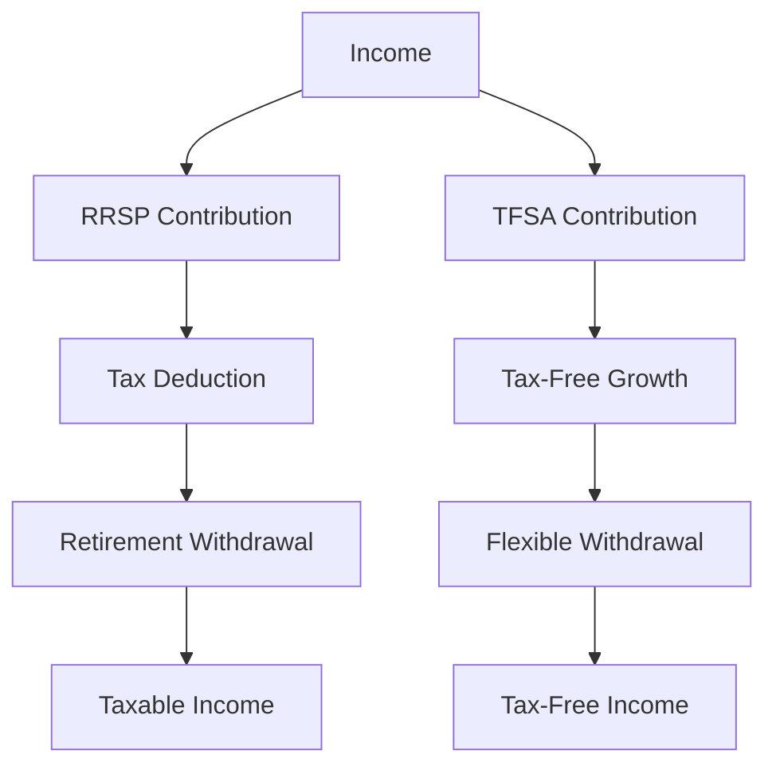

## 24.6 Tax Deferral and Tax-Free Plans

In the realm of Canadian financial planning, tax deferral and tax-free plans play a pivotal role in optimizing investment growth and retirement savings. Understanding the nuances of these plans can significantly impact your financial strategy, offering both immediate and long-term benefits. This section delves into the intricacies of these plans, providing a comprehensive guide to their strategic use.

### Understanding Tax Deferral and Tax-Free Plans

**Tax Deferral Plans** allow individuals to postpone the payment of taxes on income or investments until a later date, typically when they are in a lower tax bracket, such as during retirement. The primary benefit is the potential for investments to grow tax-free until withdrawal, maximizing the compounding effect.

**Tax-Free Plans**, on the other hand, enable individuals to earn investment income and capital gains without incurring taxes on withdrawals. The most prominent example in Canada is the Tax-Free Savings Account (TFSA), which offers flexibility and tax-free growth.

### Key Differences and Benefits

| Feature                | Tax Deferral Plans                     | Tax-Free Plans                        |
|------------------------|----------------------------------------|---------------------------------------|
| Taxation Timing        | Taxes are deferred until withdrawal    | No taxes on withdrawals               |
| Contribution Limits    | Often higher, with annual limits       | Lower annual limits                   |
| Withdrawal Flexibility | Penalties may apply for early withdrawal| Flexible, no penalties                |
| Growth Potential       | Tax-free growth until withdrawal       | Tax-free growth at all times          |

### Registered Plans Offering Tax Advantages

#### 1. Registered Retirement Savings Plan (RRSP)

The RRSP is a cornerstone of Canadian retirement planning. Contributions are tax-deductible, reducing taxable income in the year of contribution. Investments grow tax-free until withdrawal, typically during retirement when income and tax rates may be lower.

**Key Features:**
- Contribution room is based on 18% of the previous year's earned income, up to a maximum limit.
- Withdrawals are taxed as income.
- Spousal RRSPs allow for income splitting in retirement.

#### 2. Tax-Free Savings Account (TFSA)

The TFSA provides a flexible way to save and invest, with all earnings and withdrawals being tax-free. Contributions are not tax-deductible, but the tax-free nature of withdrawals offers significant long-term benefits.

**Key Features:**
- Annual contribution limits are set by the government.
- Unused contribution room carries forward indefinitely.
- Withdrawals do not affect eligibility for government benefits.

#### 3. Registered Education Savings Plan (RESP)

The RESP is designed to save for a child's post-secondary education, offering tax-deferred growth and government grants.

**Key Features:**
- Contributions are not tax-deductible, but growth is tax-deferred.
- Government grants, such as the Canada Education Savings Grant (CESG), enhance savings.
- Withdrawals for educational purposes are taxed in the student's hands, often at a lower rate.

### Non-Registered Plans with Tax Advantages

While non-registered plans do not offer the same tax benefits as registered plans, strategic use can still provide tax advantages.

#### 1. Investment Accounts

Non-registered investment accounts allow for greater contribution flexibility and can be used to hold a variety of assets. While income is taxable, capital gains are taxed at a lower rate, and dividends from Canadian corporations may qualify for the dividend tax credit.

#### 2. Universal Life Insurance

This product combines life insurance with investment opportunities, offering tax-deferred growth on the investment component. It can be a strategic tool for estate planning and wealth transfer.

### Strategic Use in Investment and Retirement Planning

The strategic use of tax deferral and tax-free plans can significantly enhance investment and retirement outcomes. Consider the following strategies:

- **Maximize RRSP Contributions:** Take advantage of tax deductions and defer taxes until retirement, when you may be in a lower tax bracket.
- **Utilize TFSAs for Flexibility:** Use TFSAs for emergency funds or short-term goals, benefiting from tax-free growth and withdrawals.
- **Combine Plans for Optimal Growth:** Balance contributions between RRSPs and TFSAs to optimize tax efficiency and growth potential.
- **Plan for Education with RESPs:** Leverage government grants and tax-deferred growth to save for children's education.

### Rules and Regulations

Understanding the rules governing these plans is crucial for compliance and maximizing benefits. Key regulations include:

- **Contribution Limits:** Adhere to annual limits to avoid penalties.
- **Withdrawal Rules:** Be aware of tax implications and penalties for early withdrawals from RRSPs.
- **Reporting Requirements:** Ensure accurate reporting of contributions and withdrawals to avoid tax issues.

### Practical Example: Case Study of a Canadian Family

Consider the Smith family, who strategically use a combination of RRSPs, TFSAs, and RESPs to achieve their financial goals. By maximizing RRSP contributions, they reduce their taxable income and defer taxes until retirement. Simultaneously, they utilize TFSAs for tax-free growth and flexibility, while contributing to RESPs to secure their children's education.

### Diagrams and Visual Aids

To better understand the flow of funds and tax implications, consider the following diagram illustrating the interaction between different plans:

### Best Practices and Common Pitfalls

**Best Practices:**
- Regularly review and adjust contributions based on income changes and financial goals.
- Stay informed about changes in contribution limits and tax regulations.
- Consider professional advice for complex financial situations.

**Common Pitfalls:**
- Over-contributing to RRSPs or TFSAs, resulting in penalties.
- Ignoring the impact of withdrawals on government benefits.
- Failing to diversify investments within these plans.

### Conclusion

Tax deferral and tax-free plans are powerful tools in the Canadian financial landscape, offering significant opportunities for growth and tax efficiency. By understanding and strategically utilizing these plans, individuals can enhance their investment and retirement outcomes, ensuring financial security and flexibility.

## Quiz Time!



### What is the primary benefit of a tax deferral plan?

- [x] Postponing taxes until a later date, potentially at a lower tax rate
- [ ] Paying taxes immediately to avoid future liabilities
- [ ] Eliminating taxes entirely
- [ ] Increasing taxable income in the current year

> **Explanation:** Tax deferral plans allow individuals to postpone taxes until a later date, often when they are in a lower tax bracket, maximizing the compounding effect of investments.

### Which of the following is a key feature of a TFSA?

- [x] Tax-free growth and withdrawals
- [ ] Tax-deductible contributions
- [ ] Mandatory withdrawals at retirement
- [ ] Limited to investment in Canadian stocks only

> **Explanation:** TFSAs offer tax-free growth and withdrawals, providing flexibility and long-term benefits without tax implications on withdrawals.

### What is the contribution limit for an RRSP based on?

- [x] 18% of the previous year's earned income, up to a maximum limit
- [ ] 10% of total income
- [ ] A fixed amount set by the government
- [ ] The total value of all investments

> **Explanation:** RRSP contribution room is based on 18% of the previous year's earned income, up to a government-set maximum limit.

### What is a common use of a TFSA?

- [x] Emergency fund or short-term savings goals
- [ ] Solely for retirement savings
- [ ] Only for purchasing Canadian stocks
- [ ] For mandatory government contributions

> **Explanation:** TFSAs are often used for emergency funds or short-term savings goals due to their flexibility and tax-free withdrawals.

### Which plan is specifically designed for saving for a child's education?

- [x] RESP
- [ ] RRSP
- [ ] TFSA
- [ ] Universal Life Insurance

> **Explanation:** The RESP is designed to save for a child's post-secondary education, offering tax-deferred growth and government grants.

### What is a potential pitfall of over-contributing to an RRSP or TFSA?

- [x] Penalties for excess contributions
- [ ] Immediate taxation of all contributions
- [ ] Loss of all investment gains
- [ ] Mandatory conversion to a non-registered account

> **Explanation:** Over-contributing to an RRSP or TFSA can result in penalties, emphasizing the importance of adhering to contribution limits.

### How can RRSPs and TFSAs be used together strategically?

- [x] Balancing contributions to optimize tax efficiency and growth potential
- [ ] Using only one plan to avoid complexity
- [ ] Contributing solely to RRSPs for retirement
- [ ] Investing only in foreign stocks

> **Explanation:** Balancing contributions between RRSPs and TFSAs can optimize tax efficiency and growth potential, leveraging the benefits of both plans.

### What is a benefit of using Universal Life Insurance in financial planning?

- [x] Tax-deferred growth on the investment component
- [ ] Guaranteed returns on all investments
- [ ] No need for life insurance premiums
- [ ] Immediate tax deductions

> **Explanation:** Universal Life Insurance offers tax-deferred growth on the investment component, making it a strategic tool for estate planning and wealth transfer.

### What should be considered when planning withdrawals from an RRSP?

- [x] Tax implications and potential penalties for early withdrawals
- [ ] Immediate reinvestment in a TFSA
- [ ] Conversion to a non-registered account
- [ ] Only withdrawing for educational purposes

> **Explanation:** When planning RRSP withdrawals, consider tax implications and potential penalties for early withdrawals to optimize financial outcomes.

### True or False: Withdrawals from a TFSA affect eligibility for government benefits.

- [ ] True
- [x] False

> **Explanation:** Withdrawals from a TFSA do not affect eligibility for government benefits, making them an attractive option for flexible savings.


