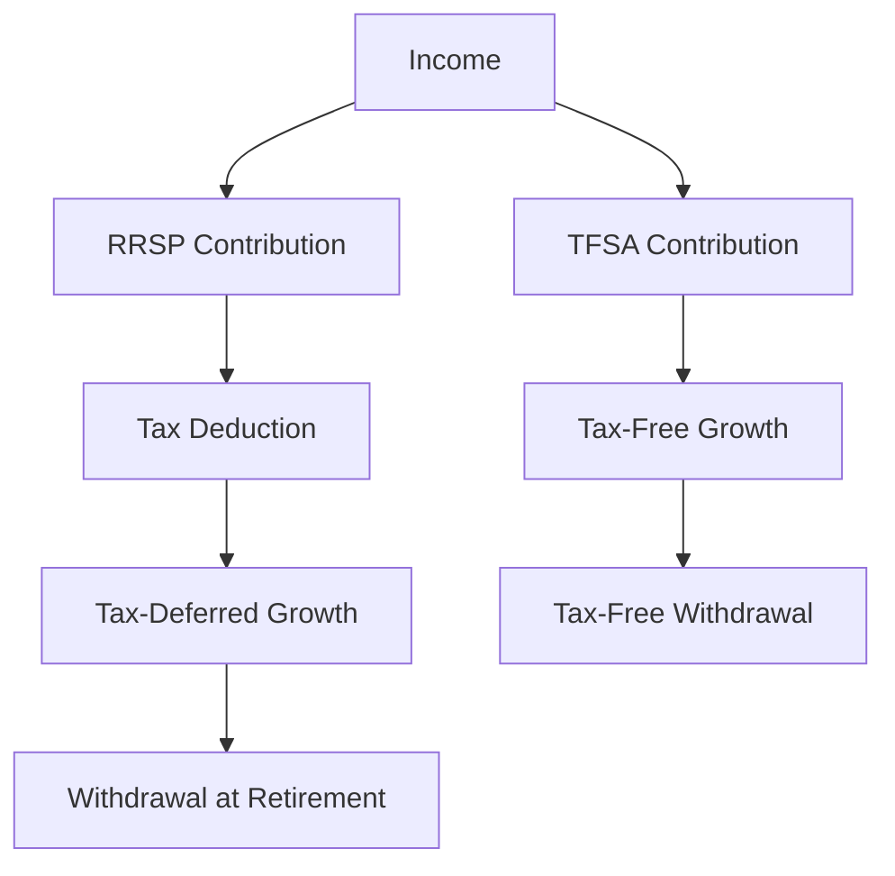

## 24.5 Tax Deferral and Tax-Free Plans

In the realm of Canadian financial planning, understanding tax deferral and tax-free plans is crucial for optimizing your investment strategy. These plans, including Registered Retirement Savings Plans (RRSPs), Registered Pension Plans (RPPs), and Tax-Free Savings Accounts (TFSAs), offer unique benefits that can significantly impact your financial future. This section delves into the intricacies of these plans, providing a comprehensive guide to their features, benefits, and strategic applications.

### Understanding Tax Deferral Plans

Tax deferral plans are designed to allow taxpayers to delay paying taxes on income until a later date, typically retirement. This strategy can be advantageous as individuals often find themselves in a lower tax bracket during retirement, thus reducing their overall tax burden. Two primary tax deferral plans in Canada are the RRSP and the RPP.

#### Registered Retirement Savings Plan (RRSP)

An RRSP is a retirement savings plan that provides tax advantages to individuals saving for retirement. Contributions to an RRSP are tax-deductible, meaning they can reduce your taxable income for the year in which the contribution is made. The investment income earned within the RRSP is tax-deferred, meaning you do not pay taxes on it until you withdraw the funds.

**Eligibility and Contribution Limits:**

- **Eligibility:** Canadian residents with earned income are eligible to contribute to an RRSP.
- **Contribution Limits:** The annual contribution limit is 18% of the previous year's earned income, up to a maximum dollar amount set by the Canada Revenue Agency (CRA). Unused contribution room can be carried forward indefinitely.

**Benefits of RRSPs:**

- **Tax Deduction:** Contributions reduce taxable income, providing immediate tax savings.
- **Tax-Deferred Growth:** Investments grow tax-free until withdrawal, allowing for compounding growth.
- **Income Smoothing:** Withdrawals during retirement are often taxed at a lower rate, reducing overall tax liability.

#### Registered Pension Plan (RPP)

An RPP is an employer-sponsored retirement plan that provides employees with a source of income during retirement. Contributions are made by both the employer and the employee, and like RRSPs, the investment income is tax-deferred.

**Eligibility and Contribution Limits:**

- **Eligibility:** Typically available to employees of companies offering RPPs.
- **Contribution Limits:** Contributions are subject to limits set by the plan and the CRA, often based on a percentage of salary.

**Benefits of RPPs:**

- **Employer Contributions:** Employers often match employee contributions, enhancing retirement savings.
- **Tax-Deferred Growth:** Similar to RRSPs, investment income grows tax-free until withdrawal.

### Exploring Tax-Free Plans

Tax-free plans, such as the TFSA, offer a different approach to tax-advantaged savings. Unlike tax deferral plans, TFSAs allow investment income to grow tax-free and be withdrawn without tax consequences.

#### Tax-Free Savings Account (TFSA)

A TFSA is a registered account that allows Canadians to earn investment income tax-free. Contributions to a TFSA are not tax-deductible, but withdrawals, including investment income, are tax-free.

**Eligibility and Contribution Limits:**

- **Eligibility:** Canadian residents aged 18 and older with a valid Social Insurance Number (SIN).
- **Contribution Limits:** The annual contribution limit is set by the CRA and can vary each year. Unused contribution room can be carried forward indefinitely.

**Benefits of TFSAs:**

- **Tax-Free Growth:** Investment income, including interest, dividends, and capital gains, is not taxed.
- **Flexible Withdrawals:** Funds can be withdrawn at any time without tax penalties, and withdrawn amounts can be re-contributed in future years.
- **No Impact on Benefits:** TFSA withdrawals do not affect eligibility for government benefits such as Old Age Security (OAS).

### Strategic Considerations

When deciding between tax deferral and tax-free plans, consider your current and expected future tax rates, retirement goals, and cash flow needs. Here are some strategic considerations:

- **Tax Rate Comparison:** If you expect to be in a lower tax bracket during retirement, RRSPs may offer greater tax savings. Conversely, if your tax rate is expected to remain the same or increase, TFSAs may be more advantageous.
- **Liquidity Needs:** TFSAs offer greater flexibility for withdrawals, making them suitable for both short-term and long-term savings goals.
- **Diversification:** Consider using a combination of RRSPs and TFSAs to diversify your tax strategy and maximize benefits.

### Practical Example: Maximizing Retirement Savings

Consider a scenario where a Canadian investor, Alex, earns $80,000 annually and is deciding how to allocate savings between an RRSP and a TFSA. Alex expects to retire in 20 years and anticipates a lower tax rate during retirement.

1. **RRSP Contribution:** Alex contributes $10,000 to an RRSP, reducing taxable income to $70,000. This results in immediate tax savings and allows the investment to grow tax-deferred.

2. **TFSA Contribution:** Alex also contributes $5,000 to a TFSA, allowing for tax-free growth and flexible withdrawals if needed.

By utilizing both plans, Alex benefits from immediate tax savings, tax-deferred growth, and tax-free withdrawals, optimizing the retirement savings strategy.

### Diagrams and Visual Aids

To further illustrate these concepts, consider the following diagram showing the flow of contributions and tax implications for RRSPs and TFSAs:

### Glossary

- **Tax Deferral Plan:** A retirement savings plan that allows investment income to grow tax-deferred until withdrawal.
- **Tax-Free Savings Account (TFSA):** A registered account where investment income is not taxed, and withdrawals are tax-free.

### Additional Resources

For further exploration of these topics, consider the following resources:

- [CRA TFSA Overview](https://www.canada.ca/en/revenue-agency/services/tax/individuals/topics/tax-free-savings-account.html)
- **Books:**
  - "Tax-Free Savings Accounts: How to Maximize Your Investment" by Gail Vaz-Oxlade.

### Conclusion

Understanding and effectively utilizing tax deferral and tax-free plans is essential for maximizing your investment strategy in Canada. By leveraging the benefits of RRSPs, RPPs, and TFSAs, you can optimize your savings, reduce your tax burden, and achieve your financial goals.

### **Ready to Test Your Knowledge?**

**Practice 10 Essential CSC Exam Questions to Master Your Certification**



### What is a key benefit of contributing to an RRSP?

- [x] Tax-deductible contributions
- [ ] Tax-free withdrawals
- [ ] No contribution limits
- [ ] Immediate liquidity

> **Explanation:** Contributions to an RRSP are tax-deductible, reducing taxable income for the year in which the contribution is made.

### Which plan allows for tax-free growth and withdrawals?

- [ ] RRSP
- [x] TFSA
- [ ] RPP
- [ ] RESP

> **Explanation:** A TFSA allows for investment income to grow tax-free and withdrawals to be made without tax consequences.

### What is the annual contribution limit for a TFSA based on?

- [ ] A percentage of earned income
- [x] A set amount determined by the CRA
- [ ] Employer contributions
- [ ] Previous year's tax return

> **Explanation:** The annual contribution limit for a TFSA is a set amount determined by the CRA and can vary each year.

### What happens to unused RRSP contribution room?

- [x] It can be carried forward indefinitely
- [ ] It is lost at the end of the year
- [ ] It is taxed
- [ ] It must be used within five years

> **Explanation:** Unused RRSP contribution room can be carried forward indefinitely, allowing for future contributions.

### Which of the following is a feature of an RPP?

- [x] Employer contributions
- [ ] Tax-free withdrawals
- [ ] No contribution limits
- [ ] Immediate liquidity

> **Explanation:** RPPs often include employer contributions, enhancing retirement savings for employees.

### What is a strategic consideration when choosing between RRSPs and TFSAs?

- [x] Expected future tax rates
- [ ] Current employer
- [ ] Age of retirement
- [ ] Number of dependents

> **Explanation:** Expected future tax rates are a strategic consideration when choosing between RRSPs and TFSAs, as they impact the overall tax savings.

### How does a TFSA impact government benefits?

- [x] It does not affect eligibility
- [ ] It reduces benefits
- [ ] It increases benefits
- [ ] It disqualifies you from benefits

> **Explanation:** TFSA withdrawals do not affect eligibility for government benefits such as Old Age Security (OAS).

### What is a benefit of tax-deferred growth in an RRSP?

- [x] Investments grow without being taxed until withdrawal
- [ ] Immediate tax-free withdrawals
- [ ] No contribution limits
- [ ] Employer matching

> **Explanation:** Tax-deferred growth means that investments in an RRSP grow without being taxed until they are withdrawn.

### What is the primary purpose of a tax deferral plan?

- [x] To delay paying taxes on income until a later date
- [ ] To provide immediate tax-free income
- [ ] To eliminate taxes entirely
- [ ] To increase current income

> **Explanation:** The primary purpose of a tax deferral plan is to delay paying taxes on income until a later date, typically retirement.

### True or False: Withdrawals from a TFSA are taxed.

- [ ] True
- [x] False

> **Explanation:** Withdrawals from a TFSA are not taxed, making it a tax-free savings option.


