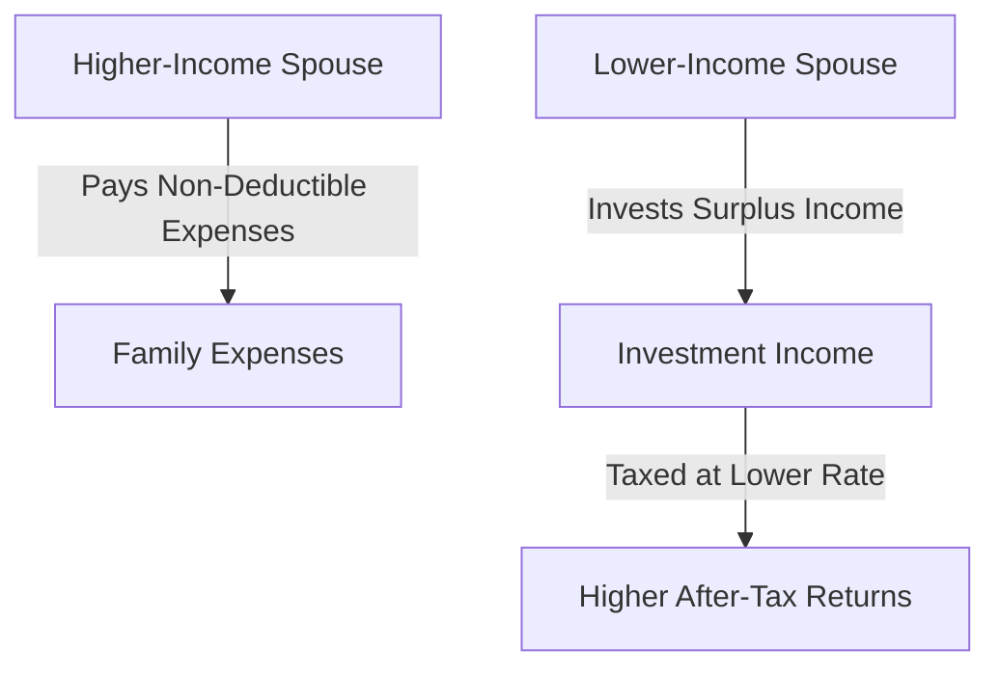

## 24.7.3 Paying Expenses

In the realm of Canadian taxation, strategic expense management can significantly impact a family's overall tax efficiency and investment returns. This section delves into the nuances of allocating non-deductible expenses between spouses to optimize tax outcomes, emphasizing the importance of income levels and investment strategies.

### Strategic Allocation of Non-Deductible Expenses

Non-deductible expenses, such as personal living costs, do not directly reduce taxable income. However, how these expenses are allocated between spouses can influence the family's overall tax burden. The key is to leverage the differences in marginal tax rates between spouses to maximize after-tax income.

#### Why Allocate Expenses?

By strategically allocating expenses, families can ensure that the spouse with the higher marginal tax rate bears the brunt of non-deductible expenses. This approach allows the lower-income spouse to retain more income for investment purposes, potentially yielding higher after-tax returns.

### Prioritizing Expense Payments by the Higher-Income Spouse

One effective strategy is for the higher-income spouse to prioritize paying family expenses. This tactic serves two primary purposes:

1. **Tax Efficiency**: The higher-income spouse, who is likely in a higher tax bracket, pays the non-deductible expenses, thereby freeing up the lower-income spouse's income for investment. This can lead to a more favorable tax situation, as the lower-income spouse's investment income is taxed at a lower rate.

2. **Maximizing Investment Income**: By freeing up the lower-income spouse's income for investment, the family can benefit from potentially higher after-tax returns. This is particularly advantageous if the investments generate income that is taxed at a lower rate, such as dividends or capital gains.

### Impact on After-Tax Investment Returns

The strategic allocation of expenses can have a profound impact on after-tax investment returns. Consider the following example:

#### Example: Effective Expense Allocation

Imagine a couple, Alex and Jamie. Alex earns $120,000 annually, placing them in a higher tax bracket, while Jamie earns $40,000. They have $20,000 in non-deductible family expenses annually.

- **Scenario 1**: Alex pays the $20,000 in expenses. Jamie invests their surplus income, generating $5,000 in investment income taxed at Jamie's lower rate.

- **Scenario 2**: Jamie pays the $20,000 in expenses. Alex invests their surplus income, generating $5,000 in investment income taxed at Alex's higher rate.

In Scenario 1, the family benefits from a lower overall tax burden on investment income, maximizing after-tax returns.

### Practical Considerations

When implementing this strategy, consider the following:

- **Income Splitting**: Ensure compliance with Canadian tax laws regarding income splitting. The Canada Revenue Agency (CRA) has specific rules to prevent income splitting that artificially reduces tax liability.

- **Investment Types**: Choose investment vehicles that align with the lower-income spouse's tax situation. For example, dividend-paying stocks or investments eligible for the capital gains exemption can be advantageous.

- **Documentation**: Maintain clear records of expenses and investments to substantiate the allocation strategy in case of a CRA audit.

### Diagram: Expense Allocation Strategy

Below is a visual representation of the expense allocation strategy:

### Best Practices and Common Pitfalls

- **Best Practices**: Regularly review income levels and tax brackets to adjust the strategy as needed. Consider consulting a tax professional to ensure compliance and optimize outcomes.

- **Common Pitfalls**: Avoid aggressive income splitting that may attract scrutiny from the CRA. Ensure that the strategy aligns with long-term financial goals and risk tolerance.

### Conclusion

Strategically allocating non-deductible expenses between spouses can be a powerful tool for optimizing tax efficiency and maximizing after-tax investment returns. By prioritizing expense payments by the higher-income spouse, families can leverage differences in tax rates to their advantage. As with any financial strategy, careful planning and adherence to regulatory guidelines are essential.

For further exploration, consider resources such as the CRA's guidelines on income splitting and investment taxation. Additionally, financial advisors and tax professionals can provide personalized advice tailored to individual circumstances.

## Quiz Time!



### Which spouse should prioritize paying non-deductible family expenses for tax efficiency?

- [x] The higher-income spouse
- [ ] The lower-income spouse
- [ ] Both spouses equally
- [ ] Neither spouse

> **Explanation:** The higher-income spouse should pay non-deductible expenses to free up the lower-income spouse's income for investment, optimizing tax efficiency.

### What is the main benefit of the higher-income spouse paying family expenses?

- [x] It frees up investment income for the lower-income spouse
- [ ] It increases the family's overall expenses
- [ ] It reduces the family's total income
- [ ] It complicates tax filing

> **Explanation:** By paying family expenses, the higher-income spouse allows the lower-income spouse to invest more, potentially yielding higher after-tax returns.

### How does strategic expense allocation impact after-tax investment returns?

- [x] It can increase after-tax returns by reducing the tax burden on investment income
- [ ] It decreases after-tax returns by increasing taxable income
- [ ] It has no impact on after-tax returns
- [ ] It complicates investment decisions

> **Explanation:** Strategic allocation can increase after-tax returns by ensuring investment income is taxed at the lower-income spouse's rate.

### What should families consider when implementing expense allocation strategies?

- [x] Compliance with CRA rules
- [ ] Increasing their expenses
- [ ] Reducing their income
- [ ] Avoiding investments

> **Explanation:** Families should ensure compliance with CRA rules to avoid penalties and optimize tax outcomes.

### What type of investment income is beneficial for the lower-income spouse to generate?

- [x] Dividends and capital gains
- [ ] Interest income
- [ ] Rental income
- [ ] Employment income

> **Explanation:** Dividends and capital gains are often taxed at a lower rate, making them beneficial for the lower-income spouse.

### Why is documentation important in expense allocation strategies?

- [x] To substantiate the strategy in case of a CRA audit
- [ ] To increase the complexity of tax filing
- [ ] To reduce the family's overall income
- [ ] To avoid paying taxes

> **Explanation:** Documentation is crucial to support the allocation strategy and ensure compliance with tax regulations.

### What is a common pitfall in expense allocation strategies?

- [x] Aggressive income splitting
- [ ] Paying too few expenses
- [ ] Investing too much
- [ ] Reducing income

> **Explanation:** Aggressive income splitting can attract CRA scrutiny and should be avoided.

### What should families regularly review to optimize their expense allocation strategy?

- [x] Income levels and tax brackets
- [ ] The number of expenses
- [ ] The amount of income
- [ ] The complexity of their investments

> **Explanation:** Regularly reviewing income levels and tax brackets ensures the strategy remains effective and compliant.

### What is the role of a tax professional in expense allocation strategies?

- [x] To provide personalized advice and ensure compliance
- [ ] To increase the family's expenses
- [ ] To reduce the family's income
- [ ] To complicate tax filing

> **Explanation:** Tax professionals can offer tailored advice and help families navigate tax regulations effectively.

### True or False: The lower-income spouse should always pay family expenses.

- [ ] True
- [x] False

> **Explanation:** The higher-income spouse should pay family expenses to free up the lower-income spouse's income for investment, optimizing tax efficiency.


