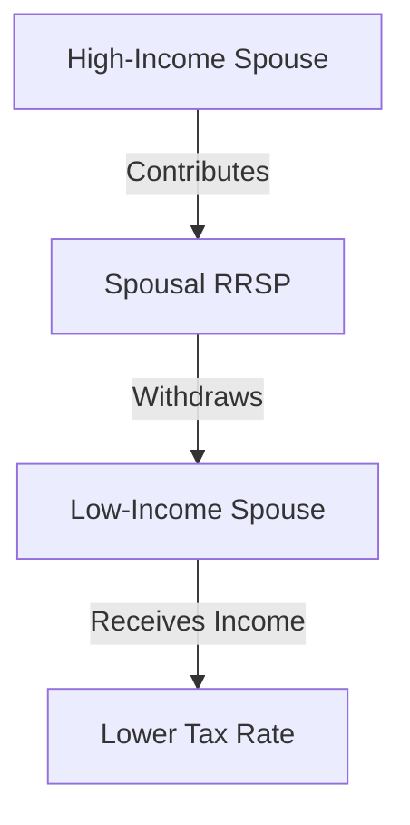

## 24.7 Tax Planning Strategies

In the realm of financial planning, tax strategies play a pivotal role in maximizing the efficiency of your financial portfolio. Effective tax planning is not merely about reducing taxes; it's about integrating tax considerations into your broader financial strategy to enhance overall wealth. This section delves into various tax planning strategies that can help you achieve your financial goals while minimizing tax liabilities within the Canadian context.

### The Importance of Tax Planning in Financial Strategies

Tax planning is a critical component of financial management. It involves analyzing your financial situation from a tax perspective to ensure that all elements work together to allow you to pay the lowest taxes possible. However, it's crucial to balance tax minimization with other financial objectives, such as growth, liquidity, and risk management.

#### Key Considerations:
- **Holistic Approach:** Tax planning should be integrated into your overall financial strategy, considering both short-term and long-term goals.
- **Compliance:** Ensure that all tax strategies comply with Canadian tax laws and regulations to avoid penalties.
- **Adaptability:** Tax laws change frequently, so strategies should be flexible to adapt to new regulations.

### Legitimate Methods to Reduce Taxes

There are several legitimate methods to reduce your tax liability in Canada. These methods focus on utilizing allowable deductions, credits, and income-splitting opportunities.

#### Allowable Deductions and Credits

1. **Registered Retirement Savings Plan (RRSP):** Contributions to an RRSP are tax-deductible, reducing your taxable income. The growth within the RRSP is tax-deferred until withdrawal, typically at retirement when you may be in a lower tax bracket.

2. **Tax-Free Savings Account (TFSA):** While contributions to a TFSA are not tax-deductible, the investment income earned within the account is tax-free, and withdrawals are not taxed.

3. **Home Buyers' Plan (HBP):** Allows first-time homebuyers to withdraw up to $35,000 from their RRSPs to buy or build a qualifying home without immediate tax consequences.

4. **Lifelong Learning Plan (LLP):** Permits withdrawals from RRSPs to finance full-time education or training for you or your spouse.

5. **Child Care Expenses:** Deductible expenses for child care services, which can significantly reduce taxable income.

#### Income Splitting

Income splitting involves transferring income from a high-income family member to a lower-income family member to reduce the overall tax burden. This can be achieved through:

- **Spousal RRSPs:** Contributions to a spousal RRSP can help balance retirement income between spouses, potentially lowering the family's overall tax rate.
- **Family Trusts:** Income can be distributed to beneficiaries in lower tax brackets.
- **Pension Income Splitting:** Allows seniors to split eligible pension income with their spouse or common-law partner.

### Strategies for Deferring Income

Deferring income can be an effective way to manage tax liabilities, especially if you expect to be in a lower tax bracket in the future.

1. **RRSP Contributions:** As mentioned, contributions to an RRSP defer taxes until withdrawal.
2. **Capital Gains Deferral:** By holding onto investments longer, you can defer capital gains taxes until the asset is sold.
3. **Incorporation:** For business owners, incorporating can allow for income deferral through retained earnings within the corporation.

### Selecting Tax-Efficient Investments

Choosing tax-efficient investments can significantly impact your after-tax returns. Consider the following:

- **Dividend-Paying Stocks:** Canadian dividends are eligible for the dividend tax credit, which can reduce the effective tax rate on dividend income.
- **Capital Gains:** Prefer investments that generate capital gains over interest income, as capital gains are taxed at a lower rate.
- **Municipal Bonds:** Interest from municipal bonds is often tax-exempt.

### Practical Examples and Case Studies

#### Example: RRSP vs. TFSA

Consider a scenario where an individual, Alex, is deciding between contributing to an RRSP or a TFSA. Alex is in a high tax bracket now but expects to be in a lower bracket upon retirement. Contributing to an RRSP would provide immediate tax relief and defer taxes until retirement, aligning with Alex's financial strategy.

#### Case Study: Income Splitting with Spousal RRSP

Emily and John are a married couple where Emily earns significantly more than John. By contributing to a spousal RRSP in John's name, Emily can reduce her taxable income now, and John can withdraw the funds in retirement when his income is lower, resulting in a lower overall tax rate for the couple.

### Diagrams and Visual Aids

To better understand these concepts, let's look at a diagram illustrating the flow of income splitting through a spousal RRSP:

### Best Practices and Common Pitfalls

#### Best Practices:
- **Stay Informed:** Keep up with changes in tax laws and regulations.
- **Consult Professionals:** Work with financial advisors or tax professionals to tailor strategies to your specific situation.
- **Review Annually:** Regularly review and adjust your tax strategies as your financial situation and tax laws change.

#### Common Pitfalls:
- **Overlooking Tax Implications:** Focusing solely on investment returns without considering tax implications can lead to suboptimal outcomes.
- **Non-Compliance:** Engaging in aggressive tax avoidance schemes can result in penalties and interest.

### Conclusion

Effective tax planning is an essential component of a comprehensive financial strategy. By understanding and implementing these strategies, you can minimize your tax liability while achieving your financial goals. Remember, the key is to integrate tax planning with your overall financial objectives, ensuring compliance and adaptability in the face of changing regulations.

## Quiz Time!



### Which of the following is a tax-deductible contribution in Canada?

- [x] RRSP
- [ ] TFSA
- [ ] RESP
- [ ] Non-Registered Account

> **Explanation:** Contributions to an RRSP are tax-deductible, reducing taxable income.

### What is a key benefit of a TFSA?

- [x] Tax-free growth and withdrawals
- [ ] Tax-deductible contributions
- [ ] Mandatory withdrawals at retirement
- [ ] Income splitting

> **Explanation:** TFSA allows for tax-free growth and withdrawals, though contributions are not tax-deductible.

### Which strategy involves transferring income to a lower-income family member?

- [x] Income Splitting
- [ ] Tax Deferral
- [ ] Capital Gains Harvesting
- [ ] Dividend Reinvestment

> **Explanation:** Income splitting involves transferring income to a lower-income family member to reduce overall tax liability.

### What is the primary advantage of deferring income?

- [x] Potentially lower tax rate in the future
- [ ] Immediate tax savings
- [ ] Increased liquidity
- [ ] Higher investment returns

> **Explanation:** Deferring income can result in a lower tax rate if you expect to be in a lower bracket in the future.

### Which of the following is an example of a tax-efficient investment?

- [x] Dividend-Paying Stocks
- [ ] High-Interest Savings Account
- [ ] GICs
- [ ] Corporate Bonds

> **Explanation:** Dividend-paying stocks are tax-efficient due to the dividend tax credit.

### What is a common pitfall in tax planning?

- [x] Overlooking tax implications
- [ ] Consulting professionals
- [ ] Staying informed
- [ ] Reviewing strategies annually

> **Explanation:** Overlooking tax implications can lead to suboptimal financial outcomes.

### Which account allows for tax-free withdrawals?

- [x] TFSA
- [ ] RRSP
- [ ] RESP
- [ ] Non-Registered Account

> **Explanation:** Withdrawals from a TFSA are tax-free.

### What is the benefit of a spousal RRSP?

- [x] Balances retirement income between spouses
- [ ] Provides immediate tax-free income
- [ ] Requires no contributions
- [ ] Offers higher interest rates

> **Explanation:** A spousal RRSP helps balance retirement income, potentially lowering the family's overall tax rate.

### Which of the following is a legitimate method to reduce taxes?

- [x] Allowable Deductions
- [ ] Tax Evasion
- [ ] Offshore Accounts
- [ ] Unreported Income

> **Explanation:** Allowable deductions are legitimate methods to reduce taxes.

### True or False: Tax planning should be separate from other financial strategies.

- [ ] True
- [x] False

> **Explanation:** Tax planning should be integrated into overall financial strategies to maximize efficiency.


