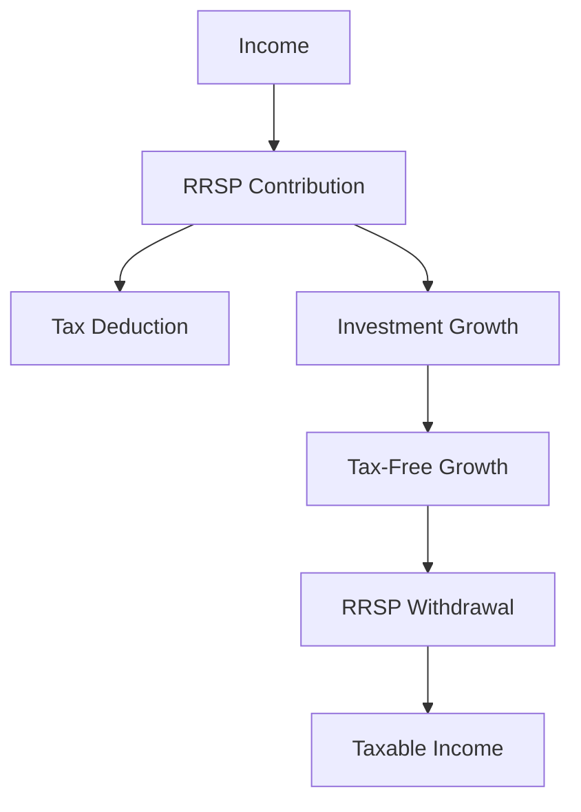

## 24.7 Registered Retirement Savings Plans (RRSPs)

Registered Retirement Savings Plans (RRSPs) are a cornerstone of retirement planning in Canada, offering significant tax advantages and a flexible framework for building a retirement nest egg. This section provides an in-depth exploration of RRSPs, their purpose, contribution rules, types, and the tax implications of withdrawals. Understanding these elements is crucial for financial professionals advising clients or managing their own retirement strategies.

### Purpose and Tax Benefits of RRSPs

RRSPs are designed to encourage Canadians to save for retirement by providing tax incentives. Contributions to an RRSP are tax-deductible, meaning they can reduce your taxable income for the year in which the contribution is made. Additionally, the investment income earned within an RRSP grows tax-free until it is withdrawn, typically during retirement when the individual may be in a lower tax bracket.

#### Key Tax Benefits:
- **Tax Deductibility:** Contributions reduce taxable income, providing immediate tax relief.
- **Tax-Deferred Growth:** Investment income, including interest, dividends, and capital gains, accumulates tax-free within the RRSP.
- **Potential for Lower Tax Rates on Withdrawal:** Withdrawals are taxed as income, which may be at a lower rate during retirement.

### Contribution Limits and Carry-Forward Rules

The Canada Revenue Agency (CRA) sets annual contribution limits for RRSPs, which are based on the individual's earned income. For 2023, the contribution limit is 18% of the previous year's earned income, up to a maximum of $30,780. Unused contribution room can be carried forward indefinitely, allowing individuals to maximize their contributions in future years.

#### Impact of Pension Adjustments (PA)

Pension Adjustments (PA) affect the amount of RRSP contribution room available to individuals who participate in employer-sponsored pension plans. The PA reflects the value of the pension benefits accrued during the year and reduces the RRSP contribution room accordingly.

### Types of RRSPs

There are two main types of RRSPs: Single Vendor Plans and Self-Directed Plans. Each type offers different levels of control and investment options.

#### Single Vendor Plans

Single Vendor Plans are managed by financial institutions, such as banks or insurance companies. These plans offer a limited selection of investment options, typically including mutual funds, GICs, and savings accounts. They are suitable for individuals who prefer a hands-off approach to investing.

#### Self-Directed RRSPs

Self-Directed RRSPs provide the account holder with the flexibility to choose and manage their own investments. This type of RRSP allows for a broader range of investment options, including stocks, bonds, ETFs, and real estate. Self-directed plans are ideal for experienced investors who wish to tailor their investment strategy to their specific financial goals.

### Taxation of RRSP Withdrawals and Conversion to RRIFs

Withdrawals from an RRSP are fully taxable as income in the year they are made. It is important to plan withdrawals carefully to minimize tax liabilities. By the end of the year in which an individual turns 71, they must convert their RRSP into a Registered Retirement Income Fund (RRIF) or purchase an annuity. RRIFs provide a structured way to withdraw funds during retirement, with mandatory minimum withdrawals each year.

### Practical Example: RRSP Strategy

Consider a 40-year-old Canadian, Alex, who earns $80,000 annually. Alex contributes $10,000 to their RRSP each year. This contribution reduces Alex's taxable income to $70,000, providing immediate tax savings. Over 25 years, assuming an average annual return of 5%, Alex's RRSP could grow significantly, providing a substantial retirement fund.

### Diagrams and Visual Aids

To better understand the flow of contributions and withdrawals in an RRSP, consider the following diagram:

### Best Practices and Common Pitfalls

- **Maximize Contributions:** Utilize the full contribution room each year to benefit from tax deductions and compound growth.
- **Plan Withdrawals:** Strategically plan withdrawals to minimize tax impact, especially during retirement.
- **Diversify Investments:** Use a mix of asset classes to manage risk and optimize returns within an RRSP.

### References and Additional Resources

- [CRA RRSP Overview](https://www.canada.ca/en/revenue-agency/services/tax/individuals/topics/rrsps-related-plans.html)
- [RRSP Contribution Room Calculator](https://www.canada.ca/en/revenue-agency/services/e-services/e-services-individuals/tax-return/line-2080.html)
- **Books:** "How to Pick & Manage Investments for Your RRSP" by Dan Borras.

### Glossary

- **Registered Retirement Savings Plan (RRSP):** A tax-deferred retirement savings plan where contributions are deductible, and investment income grows tax-free until withdrawal.
- **Self-Directed RRSP:** An RRSP that allows the holder to choose and manage their own investments.
- **Single Vendor RRSP:** An RRSP managed by a financial institution with predefined investment options.

### **Ready to Test Your Knowledge?**

**Practice 10 Essential CSC Exam Questions to Master Your Certification**



### What is the primary tax benefit of contributing to an RRSP?

- [x] Contributions are tax-deductible, reducing taxable income.
- [ ] Contributions are tax-free.
- [ ] Contributions are taxed at a lower rate.
- [ ] Contributions are exempt from all taxes.

> **Explanation:** Contributions to an RRSP are tax-deductible, meaning they reduce the contributor's taxable income for the year in which the contribution is made.

### What is the maximum RRSP contribution limit for 2023?

- [ ] $25,000
- [x] $30,780
- [ ] $35,000
- [ ] $40,000

> **Explanation:** The maximum RRSP contribution limit for 2023 is $30,780, or 18% of the previous year's earned income, whichever is lower.

### How does a Pension Adjustment (PA) affect RRSP contribution room?

- [x] It reduces the available RRSP contribution room.
- [ ] It increases the available RRSP contribution room.
- [ ] It has no effect on RRSP contribution room.
- [ ] It doubles the RRSP contribution room.

> **Explanation:** A Pension Adjustment (PA) reduces the available RRSP contribution room by reflecting the value of pension benefits accrued during the year.

### At what age must an RRSP be converted to a RRIF or annuity?

- [ ] 65
- [ ] 70
- [x] 71
- [ ] 75

> **Explanation:** By the end of the year in which an individual turns 71, they must convert their RRSP into a RRIF or purchase an annuity.

### What is a key feature of a Self-Directed RRSP?

- [x] It allows the holder to choose and manage their own investments.
- [ ] It offers only mutual funds as investment options.
- [ ] It is managed by a financial institution with limited choices.
- [ ] It requires mandatory withdrawals before age 65.

> **Explanation:** A Self-Directed RRSP allows the holder to choose and manage their own investments, offering a broader range of options compared to Single Vendor Plans.

### What happens to investment income within an RRSP?

- [x] It grows tax-free until withdrawal.
- [ ] It is taxed annually.
- [ ] It is taxed at a reduced rate.
- [ ] It is exempt from all taxes.

> **Explanation:** Investment income within an RRSP grows tax-free until it is withdrawn, at which point it is taxed as income.

### Which type of RRSP is managed by a financial institution with predefined investment options?

- [x] Single Vendor RRSP
- [ ] Self-Directed RRSP
- [ ] Group RRSP
- [ ] Locked-In RRSP

> **Explanation:** A Single Vendor RRSP is managed by a financial institution and offers predefined investment options.

### What is the tax treatment of RRSP withdrawals?

- [x] Withdrawals are fully taxable as income.
- [ ] Withdrawals are tax-free.
- [ ] Withdrawals are taxed at a reduced rate.
- [ ] Withdrawals are exempt from provincial taxes.

> **Explanation:** Withdrawals from an RRSP are fully taxable as income in the year they are made.

### Can unused RRSP contribution room be carried forward?

- [x] Yes, indefinitely.
- [ ] No, it expires after one year.
- [ ] Yes, but only for five years.
- [ ] No, it must be used within the current tax year.

> **Explanation:** Unused RRSP contribution room can be carried forward indefinitely, allowing individuals to maximize their contributions in future years.

### True or False: RRSP contributions are only beneficial for high-income earners.

- [ ] True
- [x] False

> **Explanation:** RRSP contributions are beneficial for individuals at various income levels due to the tax deduction and tax-deferred growth, not just high-income earners.



By understanding the intricacies of RRSPs, financial professionals and individuals alike can make informed decisions to optimize their retirement savings and tax strategies within the Canadian financial landscape.
