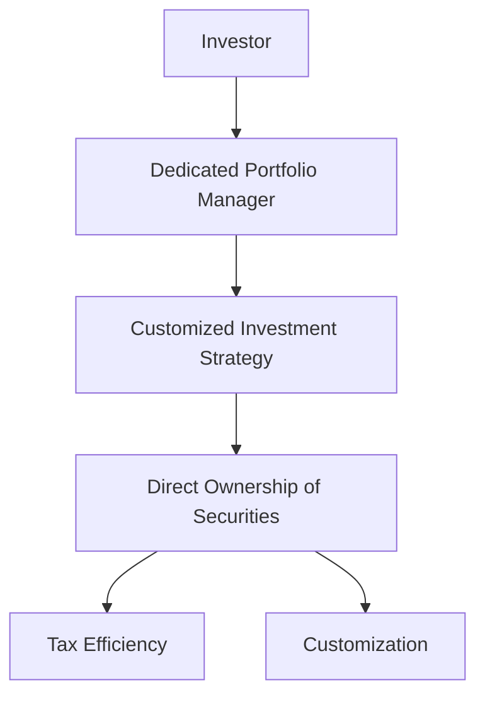

## 25.9 Separately Managed Accounts (SMA)

Separately Managed Accounts (SMAs) represent a sophisticated investment vehicle that offers personalized investment management tailored to the specific needs and objectives of individual investors. In the Canadian financial landscape, SMAs are increasingly popular among high-net-worth individuals seeking bespoke investment solutions. This section delves into the intricacies of SMAs, highlighting their benefits, customization capabilities, tax efficiency, and the strategic advantages they offer through access to dedicated portfolio managers.

### Understanding Separately Managed Accounts

An SMA is a portfolio of assets managed by a professional investment manager on behalf of an individual investor. Unlike mutual funds, where investors pool their money, SMAs provide direct ownership of securities, allowing for greater customization and control over investment decisions. This structure is particularly appealing to investors who desire a tailored approach to asset management.

### Benefits of Holding Assets Separately

#### Customization

One of the primary advantages of SMAs is the ability to customize investment strategies to align with the investor's specific financial goals, risk tolerance, and preferences. This customization extends to asset selection, sector allocation, and even ethical considerations, such as excluding certain industries or companies from the portfolio.

#### Tax Efficiency

SMAs offer significant tax efficiency benefits. Since investors directly own the underlying securities, they can manage capital gains and losses more effectively. This direct ownership allows for strategic tax-loss harvesting, where losses can be used to offset gains, thereby minimizing taxable income. Additionally, investors can control the timing of capital gains realization, optimizing their tax situation.

> **Glossary:**
> - **Tax Efficiency:** Strategies employed to minimize taxable income and capital gains.

### Advantages of SMAs

#### Access to Dedicated Portfolio Managers

Investors in SMAs benefit from the expertise of dedicated portfolio managers who actively manage the account. These professionals tailor investment strategies to meet the unique needs of each client, providing personalized advice and insights. This relationship fosters a deeper understanding of the investor's financial objectives and allows for proactive adjustments to the portfolio as market conditions change.

#### Tailored Investment Strategies

SMAs offer the flexibility to implement sophisticated investment strategies that may not be feasible in pooled investment vehicles. For example, a portfolio manager can employ specific hedging techniques, sector rotations, or thematic investing based on the investor's preferences and market outlook. This level of customization ensures that the investment strategy is aligned with the investor's long-term goals.

### Practical Example: Canadian Pension Fund Strategy

Consider a Canadian pension fund that opts for an SMA to manage its assets. The fund's investment committee works closely with a dedicated portfolio manager to develop a strategy that focuses on sustainable investments. The manager selects a mix of Canadian equities and fixed-income securities that align with the fund's ethical guidelines, while also employing tax-efficient strategies to maximize after-tax returns. This approach not only meets the fund's financial objectives but also adheres to its commitment to responsible investing.

### Real-World Scenario: Major Canadian Bank

A high-net-worth client of a major Canadian bank, such as RBC or TD, might choose an SMA to achieve a specific investment outcome. The client works with a portfolio manager to create a diversified portfolio that includes Canadian and international equities, bonds, and alternative investments. The manager actively monitors the portfolio, making adjustments to capitalize on market opportunities and manage risk. This hands-on approach ensures that the client's investment strategy remains aligned with their evolving financial goals.

### Diagram: SMA Structure

Below is a diagram illustrating the structure of an SMA, highlighting the relationship between the investor, portfolio manager, and the underlying securities.

### Best Practices and Common Pitfalls

#### Best Practices

- **Regular Communication:** Maintain open communication with the portfolio manager to ensure that the investment strategy remains aligned with your financial goals.
- **Performance Monitoring:** Regularly review the performance of the SMA to assess whether it meets your expectations and make adjustments as needed.
- **Tax Planning:** Work with a tax advisor to optimize the tax efficiency of your SMA, taking advantage of opportunities for tax-loss harvesting and strategic capital gains realization.

#### Common Pitfalls

- **Over-Customization:** While customization is a key benefit, over-customizing the portfolio can lead to increased complexity and higher management costs.
- **Neglecting Diversification:** Ensure that the SMA remains diversified to mitigate risk, even when pursuing specific investment themes or strategies.

### Additional Resources

For further exploration of SMAs, consider the following resources:

- **Institutions:**
  - Canadian SMA Providers Association
- **Articles:**
  - "The Benefits of Separately Managed Accounts" by Financial Advisor Today

### Encouragement for Application

As you explore the potential of SMAs, consider how these accounts can be integrated into your overall financial strategy. Whether you are managing your own investments or advising clients, the principles of customization, tax efficiency, and personalized management can enhance investment outcomes. Reflect on the examples provided and think critically about how SMAs can be tailored to meet specific financial objectives within the Canadian regulatory framework.

### **Ready to Test Your Knowledge?**

**Practice 10 Essential CSC Exam Questions to Master Your Certification**



### What is a primary benefit of Separately Managed Accounts (SMAs)?

- [x] Customization of investment strategies
- [ ] Pooling of investor funds
- [ ] Guaranteed returns
- [ ] Fixed investment options

> **Explanation:** SMAs allow for the customization of investment strategies to align with individual investor goals and preferences.

### How do SMAs offer tax efficiency?

- [x] By allowing direct ownership of securities
- [ ] By pooling investments with others
- [ ] By offering tax-free returns
- [ ] By eliminating capital gains

> **Explanation:** Direct ownership of securities in SMAs allows investors to manage capital gains and losses more effectively, optimizing their tax situation.

### What role does a dedicated portfolio manager play in an SMA?

- [x] Tailors investment strategies to individual needs
- [ ] Pools funds from multiple investors
- [ ] Guarantees investment returns
- [ ] Provides fixed investment options

> **Explanation:** A dedicated portfolio manager tailors investment strategies to meet the unique needs of each client in an SMA.

### Which of the following is a common pitfall of SMAs?

- [x] Over-customization leading to complexity
- [ ] Lack of tax efficiency
- [ ] Guaranteed losses
- [ ] Lack of professional management

> **Explanation:** Over-customization can lead to increased complexity and higher management costs in SMAs.

### What is a key advantage of SMAs over mutual funds?

- [x] Direct ownership of securities
- [ ] Lower management fees
- [x] Customization of investment strategies
- [ ] Guaranteed returns

> **Explanation:** SMAs offer direct ownership of securities and allow for the customization of investment strategies, unlike mutual funds.

### What is the role of tax-loss harvesting in SMAs?

- [x] To offset gains and minimize taxable income
- [ ] To increase taxable income
- [ ] To guarantee returns
- [ ] To pool investments

> **Explanation:** Tax-loss harvesting in SMAs involves using losses to offset gains, thereby minimizing taxable income.

### How can investors ensure their SMA remains aligned with their financial goals?

- [x] Regular communication with the portfolio manager
- [ ] Ignoring market changes
- [x] Performance monitoring
- [ ] Avoiding diversification

> **Explanation:** Regular communication with the portfolio manager and performance monitoring help ensure the SMA remains aligned with financial goals.

### What is a potential risk of neglecting diversification in an SMA?

- [x] Increased investment risk
- [ ] Guaranteed returns
- [ ] Lower management fees
- [ ] Tax inefficiency

> **Explanation:** Neglecting diversification can increase investment risk, as it may concentrate exposure to specific sectors or assets.

### Which Canadian institution can provide more information on SMAs?

- [x] Canadian SMA Providers Association
- [ ] Canadian Banking Association
- [ ] Canadian Mutual Fund Association
- [ ] Canadian Tax Authority

> **Explanation:** The Canadian SMA Providers Association is a resource for information on SMAs.

### SMAs allow for the pooling of investor funds. True or False?

- [ ] True
- [x] False

> **Explanation:** Unlike mutual funds, SMAs do not pool investor funds; they provide individualized management with direct ownership of securities.


