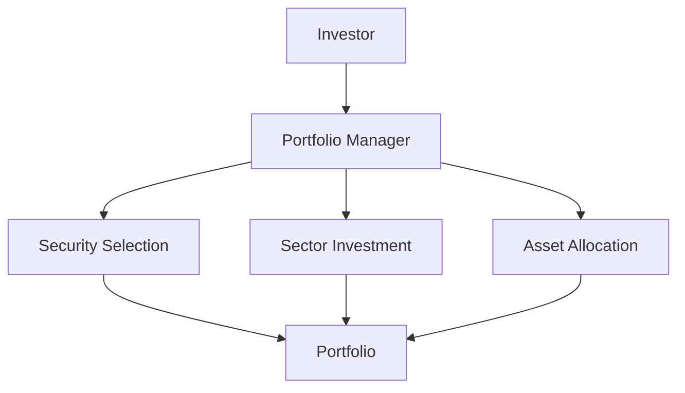

## 25.10 Single-Mandate Separately Managed Accounts

Single-Mandate Separately Managed Accounts (SMAs) represent a tailored investment approach where a portfolio is managed under a specific investment mandate by a dedicated portfolio manager or team. This section delves into the nuances of single-mandate SMAs, highlighting their structure, benefits, and challenges, particularly within the Canadian financial landscape.

### Understanding Single-Mandate SMAs

Single-Mandate SMAs are investment accounts managed according to a specific investment strategy or objective. Unlike multi-mandate accounts, which may involve multiple strategies or objectives, single-mandate SMAs focus on a singular approach, providing clarity and precision in investment management.

#### Key Features

- **Directed by a Single Portfolio Manager or Team:** The management of single-mandate SMAs is typically entrusted to a single portfolio manager or a cohesive team, ensuring a unified investment strategy.
- **Security Selection:** The portfolio manager selects securities that align with the mandate's objectives, whether it's growth, income, or a specific sector focus.
- **Sector Investment:** Investments may be concentrated in particular sectors to capitalize on market trends or economic conditions.
- **Optimal Asset Allocation:** The manager strategically allocates assets to optimize returns while managing risk, adhering to the mandate's guidelines.

### Advantages of Single-Mandate SMAs

Single-mandate SMAs offer several advantages, making them an attractive option for investors seeking specialized investment management.

#### Access to Sophisticated Portfolio Managers

Investors benefit from the expertise of seasoned portfolio managers who bring a wealth of knowledge and experience to the table. These professionals employ advanced analytical tools and strategies to enhance portfolio performance.

#### Tax Loss Selling

Single-mandate SMAs provide opportunities for tax loss selling, a strategy where underperforming securities are sold to realize losses that can offset capital gains. This can be particularly advantageous in the Canadian context, where tax efficiency is a critical consideration for investors.

#### Customization and Control

Investors enjoy a high degree of customization and control over their portfolios. The single-mandate approach allows for precise alignment with the investor's risk tolerance, investment horizon, and financial goals.

### Challenges of Managing Single-Mandate SMAs

Despite their benefits, single-mandate SMAs present certain challenges, particularly when managing multiple accounts with diverse investment objectives.

#### Complexity in Managing Multiple Mandates

For investors with multiple single-mandate SMAs, managing the interplay between different mandates can be complex. Each account may have distinct objectives, requiring careful coordination to ensure overall portfolio coherence.

#### Potential for Over-Concentration

Focusing on a single mandate can lead to over-concentration in specific sectors or asset classes, increasing exposure to sector-specific risks. Portfolio managers must balance the mandate's focus with diversification to mitigate these risks.

### Practical Example: Canadian Pension Fund Strategy

Consider a Canadian pension fund that employs single-mandate SMAs to manage its equity investments. The fund allocates a portion of its assets to a single-mandate SMA focused on Canadian technology stocks, managed by a team specializing in this sector. The portfolio manager selects high-growth technology companies, leveraging their expertise to optimize returns while managing sector-specific risks.

### Diagram: Single-Mandate SMA Structure

Below is a diagram illustrating the structure of a single-mandate SMA, highlighting the flow of investment decisions and asset allocation.

### Best Practices for Single-Mandate SMAs

- **Regular Review and Adjustment:** Regularly review the mandate's performance and adjust strategies as needed to align with changing market conditions and investor objectives.
- **Diversification Within the Mandate:** While focusing on a single mandate, ensure diversification within the selected sector or asset class to manage risk effectively.
- **Clear Communication:** Maintain clear communication between the investor and portfolio manager to ensure alignment of expectations and objectives.

### Glossary

- **Single-Mandate Managed Accounts:** SMAs managed under a single investment mandate tailored to specific objectives.

### Additional Resources

For those interested in further exploring single-mandate SMAs, consider the following resources:

- **Books:**
  - *Advanced Portfolio Management* by Richard C. Grinold
- **Online Articles:**
  - "Managing Single-Mandate Accounts" by Investment Insights Magazine

### Conclusion

Single-mandate SMAs offer a focused and sophisticated approach to investment management, providing access to expert portfolio managers and opportunities for tax efficiency. While they present certain challenges, particularly in managing multiple mandates, the benefits of customization and control make them a valuable tool for Canadian investors seeking tailored investment solutions.

### **Ready to Test Your Knowledge?**

**Practice 10 Essential CSC Exam Questions to Master Your Certification**



### What is a key feature of single-mandate SMAs?

- [x] Directed by a single portfolio manager or team
- [ ] Managed by multiple portfolio managers
- [ ] Focused on multiple investment strategies
- [ ] Primarily used for short-term trading

> **Explanation:** Single-mandate SMAs are directed by a single portfolio manager or team, focusing on a specific investment strategy.

### What is an advantage of single-mandate SMAs?

- [x] Access to sophisticated portfolio managers
- [ ] Guaranteed returns
- [ ] No risk of loss
- [ ] Unlimited diversification

> **Explanation:** Single-mandate SMAs provide access to experienced portfolio managers who use advanced strategies to manage investments.

### What is a potential challenge of single-mandate SMAs?

- [x] Complexity in managing multiple mandates
- [ ] Lack of professional management
- [ ] Inability to customize portfolios
- [ ] High liquidity risk

> **Explanation:** Managing multiple single-mandate SMAs can be complex due to the need to coordinate different investment objectives.

### How can single-mandate SMAs benefit from tax loss selling?

- [x] By offsetting capital gains with realized losses
- [ ] By avoiding all taxes
- [ ] By increasing taxable income
- [ ] By eliminating capital gains tax

> **Explanation:** Tax loss selling involves selling underperforming securities to realize losses that can offset capital gains, enhancing tax efficiency.

### What is a risk associated with single-mandate SMAs?

- [x] Over-concentration in specific sectors
- [ ] Lack of investment focus
- [ ] Excessive diversification
- [ ] Guaranteed losses

> **Explanation:** Focusing on a single mandate can lead to over-concentration in specific sectors, increasing exposure to sector-specific risks.

### What should investors regularly do with single-mandate SMAs?

- [x] Review and adjust strategies
- [ ] Ignore market conditions
- [ ] Avoid communication with managers
- [ ] Focus solely on short-term gains

> **Explanation:** Regularly reviewing and adjusting strategies ensures alignment with changing market conditions and investor objectives.

### What is a benefit of customization in single-mandate SMAs?

- [x] Alignment with investor's risk tolerance
- [ ] Guaranteed high returns
- [ ] Elimination of all risks
- [ ] Complete market control

> **Explanation:** Customization allows the portfolio to align with the investor's risk tolerance, investment horizon, and financial goals.

### What is a best practice for managing single-mandate SMAs?

- [x] Diversification within the mandate
- [ ] Focusing solely on one asset
- [ ] Ignoring market trends
- [ ] Avoiding communication with investors

> **Explanation:** Diversification within the mandate helps manage risk while maintaining focus on the specific investment strategy.

### What is a key consideration for Canadian investors using single-mandate SMAs?

- [x] Tax efficiency
- [ ] Guaranteed returns
- [ ] Unlimited diversification
- [ ] High liquidity

> **Explanation:** Tax efficiency is a critical consideration for Canadian investors, and single-mandate SMAs offer opportunities for tax loss selling.

### True or False: Single-mandate SMAs are managed under multiple investment mandates.

- [ ] True
- [x] False

> **Explanation:** Single-mandate SMAs are managed under a single investment mandate, focusing on a specific strategy or objective.


