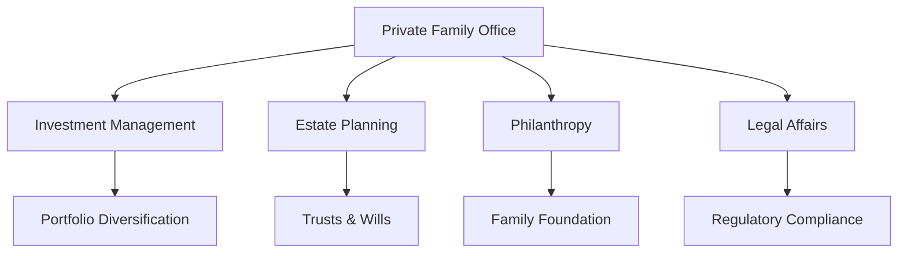

## 25.13 Private Family Office

In the realm of wealth management, the concept of a Private Family Office (PFO) stands out as a pinnacle of personalized financial service. Designed to cater to the unique needs of ultra-high-net-worth individuals and families, a PFO offers a comprehensive suite of services that extend beyond traditional financial planning. This section delves into the intricacies of private family offices, their roles, services, and the advantages they offer.

### Understanding Private Family Offices

A Private Family Office is a dedicated team of professionals tasked with managing the financial and personal affairs of a high-net-worth family. Unlike traditional wealth management services, which may cater to a broad clientele, a PFO provides bespoke solutions tailored to the specific needs and goals of a single family. This personalized approach ensures that all aspects of the family's wealth are managed cohesively and strategically.

### Core Services Offered by Private Family Offices

Private Family Offices offer a wide range of services, each designed to address different facets of wealth management. These services include:

#### Investment Management

Investment management is a cornerstone of the services provided by a PFO. This involves developing and executing investment strategies that align with the family's financial goals, risk tolerance, and time horizon. PFOs often employ a team of investment professionals who actively manage portfolios, ensuring diversification and optimizing returns. For example, a Canadian family office might invest in a mix of domestic equities, bonds, and alternative investments such as real estate or private equity.

#### Estate Planning

Estate planning is crucial for preserving wealth across generations. A PFO works closely with legal experts to develop comprehensive estate plans that minimize tax liabilities and ensure a smooth transfer of assets. This might involve setting up trusts, drafting wills, and establishing family governance structures. In Canada, this could include strategies to optimize the use of Registered Retirement Savings Plans (RRSPs) and Tax-Free Savings Accounts (TFSAs) in estate planning.

#### Philanthropy

Many ultra-high-net-worth families are deeply committed to philanthropy. A PFO can assist in developing and managing philanthropic initiatives, ensuring that charitable activities align with the family's values and objectives. This might involve setting up a family foundation or managing charitable donations in a tax-efficient manner.

#### Legal Affairs

Navigating the complex legal landscape is another critical function of a PFO. This includes managing legal risks, ensuring compliance with regulatory requirements, and handling any legal disputes that may arise. In Canada, this could involve ensuring compliance with the Canadian Investment Regulatory Organization (CIRO) regulations and provincial laws.

### Advantages of a Private Family Office

The advantages of establishing a Private Family Office are numerous, particularly for ultra-high-net-worth families seeking a centralized and cohesive approach to wealth management.

#### Centralized Professional Services

A PFO provides a centralized hub for all financial and personal affairs, ensuring that all aspects of wealth management are coordinated and aligned. This eliminates the need to engage multiple service providers, reducing complexity and enhancing efficiency.

#### Tailored Financial Strategies

With a PFO, families benefit from financial strategies that are specifically tailored to their unique needs and goals. This personalized approach ensures that investment strategies, estate plans, and philanthropic activities are all aligned with the family's overarching objectives.

#### Enhanced Privacy and Control

A PFO offers enhanced privacy and control over financial affairs. Families can maintain a high level of confidentiality, as the PFO operates exclusively for them. This is particularly important for families who value discretion and wish to keep their financial matters private.

### Practical Example: A Canadian Family Office Case Study

Consider a Canadian family with significant wealth derived from a successful business venture. The family establishes a PFO to manage their diverse financial needs. The PFO develops an investment strategy that includes Canadian equities, international bonds, and real estate investments. It also sets up a charitable foundation to support local educational initiatives, aligning with the family's philanthropic goals. Additionally, the PFO works with legal experts to create a comprehensive estate plan that minimizes tax liabilities and ensures a smooth transition of wealth to the next generation.

### Diagram: Structure of a Private Family Office

Below is a diagram illustrating the typical structure of a Private Family Office and the services it offers:

### Best Practices and Common Challenges

#### Best Practices

- **Holistic Approach:** Ensure that all aspects of wealth management are integrated and aligned with the family's goals.
- **Regular Reviews:** Conduct regular reviews of financial strategies to adapt to changing circumstances and market conditions.
- **Family Involvement:** Engage family members in the decision-making process to ensure that strategies reflect their values and objectives.

#### Common Challenges

- **Complexity Management:** Managing the complexity of diverse financial needs and goals can be challenging. A PFO must have robust systems and processes in place.
- **Succession Planning:** Ensuring a smooth transition of wealth to future generations requires careful planning and communication.

### Glossary

- **Private Family Office:** A dedicated team of professionals managing all financial and personal affairs of a high-net-worth family.

### Additional Resources

#### Books

- *Family Offices: Advising the Financial Elite* by Michael A. Jaques

#### Online Articles

- "Building an Effective Private Family Office" by Family Wealth Review

### Conclusion

Private Family Offices represent the pinnacle of personalized wealth management, offering a comprehensive suite of services tailored to the unique needs of ultra-high-net-worth families. By centralizing professional services and developing tailored financial strategies, PFOs provide families with the tools they need to preserve and grow their wealth across generations. As the financial landscape continues to evolve, the role of PFOs will remain crucial in helping families navigate the complexities of wealth management.

### **Ready to Test Your Knowledge?**

**Practice 10 Essential CSC Exam Questions to Master Your Certification**



### What is a Private Family Office?

- [x] A dedicated team of professionals managing all financial and personal affairs of a high-net-worth family.
- [ ] A public financial institution offering services to multiple clients.
- [ ] A government agency overseeing financial regulations.
- [ ] A non-profit organization providing financial education.

> **Explanation:** A Private Family Office is specifically designed to manage the financial and personal affairs of a single high-net-worth family, offering tailored services.

### Which of the following is a core service offered by a Private Family Office?

- [x] Investment Management
- [ ] Public Relations
- [ ] Retail Banking
- [ ] Real Estate Brokerage

> **Explanation:** Investment management is a key service provided by PFOs, focusing on developing and executing investment strategies for the family.

### How does a Private Family Office assist with estate planning?

- [x] By developing comprehensive estate plans that minimize tax liabilities and ensure smooth asset transfer.
- [ ] By providing retail banking services.
- [ ] By offering public investment advice.
- [ ] By managing real estate transactions.

> **Explanation:** Estate planning services in a PFO involve creating strategies to minimize taxes and facilitate the transfer of wealth across generations.

### What advantage does a Private Family Office offer in terms of privacy?

- [x] Enhanced privacy and control over financial affairs.
- [ ] Public disclosure of financial strategies.
- [ ] Mandatory reporting to government agencies.
- [ ] Open access to all financial records.

> **Explanation:** PFOs offer enhanced privacy, allowing families to maintain confidentiality over their financial matters.

### Which of the following is a common challenge faced by Private Family Offices?

- [x] Complexity Management
- [ ] Lack of investment opportunities
- [ ] Insufficient regulatory oversight
- [ ] Limited access to financial markets

> **Explanation:** Managing the complexity of diverse financial needs and goals is a common challenge for PFOs.

### What is a key benefit of centralized professional services in a Private Family Office?

- [x] Reduced complexity and enhanced efficiency.
- [ ] Increased public visibility.
- [ ] Higher regulatory costs.
- [ ] Limited investment options.

> **Explanation:** Centralized services reduce complexity and enhance efficiency by coordinating all aspects of wealth management.

### How can a Private Family Office support philanthropic efforts?

- [x] By developing and managing philanthropic initiatives aligned with the family's values.
- [ ] By investing in high-risk ventures.
- [ ] By providing retail banking services.
- [ ] By offering public financial advice.

> **Explanation:** PFOs assist in managing philanthropic activities, ensuring they align with the family's values and objectives.

### What role do legal affairs play in a Private Family Office?

- [x] Managing legal risks and ensuring compliance with regulatory requirements.
- [ ] Offering public legal advice.
- [ ] Conducting criminal investigations.
- [ ] Providing retail legal services.

> **Explanation:** Legal affairs in a PFO involve managing risks and ensuring compliance with relevant regulations.

### Which book is recommended for further reading on Private Family Offices?

- [x] *Family Offices: Advising the Financial Elite* by Michael A. Jaques
- [ ] *The Wealth of Nations* by Adam Smith
- [ ] *Rich Dad Poor Dad* by Robert Kiyosaki
- [ ] *The Intelligent Investor* by Benjamin Graham

> **Explanation:** This book provides insights into advising the financial elite through family offices.

### True or False: A Private Family Office can help with both investment management and estate planning.

- [x] True
- [ ] False

> **Explanation:** PFOs offer a comprehensive range of services, including investment management and estate planning, tailored to the family's needs.


