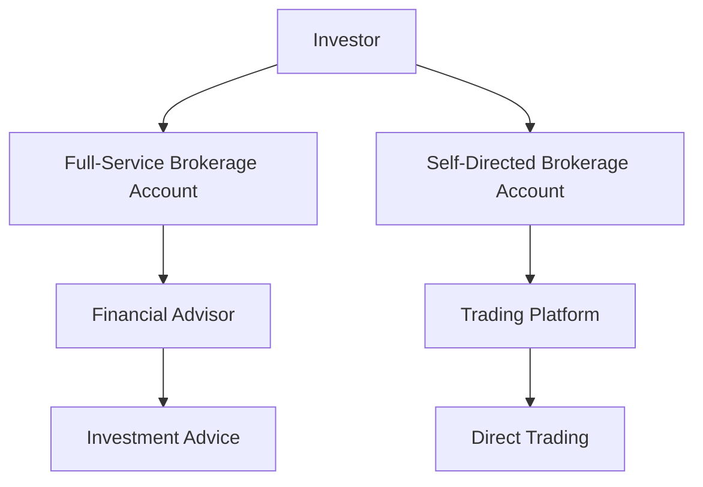

## 25.15 Non-Managed Fee-Based Accounts

In the realm of investment and financial planning, understanding the nuances of different account types is crucial for both investors and financial professionals. Non-managed fee-based accounts represent a significant category within this spectrum, offering unique benefits and considerations. This section delves into the definition, differentiation, and key features of non-managed fee-based accounts, providing a comprehensive overview for those navigating the Canadian financial landscape.

### Definition and Differentiation

**Non-Managed Fee-Based Accounts** are investment accounts where clients receive financial planning and trading services without the discretionary management of their assets by a financial advisor. Unlike managed accounts, where investment decisions are made by a portfolio manager on behalf of the client, non-managed accounts require the client to be actively involved in the decision-making process.

#### Key Differences from Managed Accounts

1. **Decision-Making Authority**: In non-managed accounts, clients retain control over investment decisions, whereas managed accounts involve a portfolio manager making decisions on behalf of the client.

2. **Fee Structure**: Non-managed accounts typically charge a flat fee or a percentage of assets under management (AUM) for advisory services, rather than transaction-based commissions. Managed accounts may have additional fees for active management.

3. **Level of Service**: Managed accounts often include comprehensive portfolio management services, while non-managed accounts focus on providing advice and execution services without direct management.

### Overview of Account Types

Non-managed fee-based accounts can be broadly categorized into two types: full-service brokerage accounts and self-directed brokerage accounts. Each type caters to different client needs and investment preferences.

#### Full-Service Brokerage Accounts

Full-service brokerage accounts offer a wide range of services, including investment advice, research, and personalized financial planning. These accounts are ideal for clients who seek professional guidance but prefer to make their own investment decisions.

- **Key Features**:
  - Access to a dedicated financial advisor.
  - Comprehensive financial planning and investment advice.
  - Research and analysis tools to aid decision-making.
  - A fee structure based on AUM or a flat fee, rather than per transaction.

- **Target Client Base**:
  - Investors who value professional advice but want to maintain control over their investment choices.
  - Individuals seeking a collaborative approach to financial planning.

#### Self-Directed Brokerage Accounts

Self-directed brokerage accounts empower clients to manage their own investments with minimal intervention from financial advisors. These accounts are suited for knowledgeable investors who prefer a hands-on approach.

- **Key Features**:
  - Direct access to trading platforms and investment tools.
  - Lower fees compared to full-service accounts, often with no advisory fees.
  - Flexibility to execute trades and manage portfolios independently.

- **Target Client Base**:
  - Experienced investors comfortable with making their own investment decisions.
  - Individuals seeking cost-effective investment solutions.

### Practical Financial Examples and Case Studies

To illustrate the application of non-managed fee-based accounts, consider the following scenarios:

#### Example 1: Full-Service Brokerage Account

Sarah, a Canadian investor, prefers to make her own investment decisions but values the insights of a financial advisor. She opts for a full-service brokerage account with RBC Dominion Securities, where she receives personalized advice and access to research reports. Sarah pays an annual fee based on her portfolio's value, allowing her to focus on long-term growth without worrying about transaction costs.

#### Example 2: Self-Directed Brokerage Account

John, an experienced investor, chooses a self-directed brokerage account with TD Direct Investing. He enjoys the autonomy to trade stocks, ETFs, and mutual funds using TD's online platform. With no advisory fees, John benefits from lower costs and the flexibility to implement his own investment strategies.

### Diagrams and Visual Aids

To better understand the structure and flow of non-managed fee-based accounts, consider the following diagram:

### Best Practices and Common Pitfalls

**Best Practices**:
- **Understand Your Needs**: Choose an account type that aligns with your investment knowledge and goals.
- **Evaluate Costs**: Consider the fee structure and ensure it provides value for the services received.
- **Stay Informed**: Regularly review account statements and stay updated on market trends.

**Common Pitfalls**:
- **Overconfidence**: Self-directed investors may overestimate their ability to manage investments, leading to poor decisions.
- **Neglecting Advice**: Full-service account holders should actively engage with their advisors to maximize the benefits of professional guidance.

### Additional Resources

For further exploration of non-managed fee-based accounts, consider the following resources:

- **Articles**:
  - "Exploring Non-Managed Fee-Based Accounts" by Brokerage Bulletin

- **Books**:
  - *Self-Directed Investing: A Guide to Non-Managed Accounts* by Laura F. Smith

### Conclusion

Non-managed fee-based accounts offer a flexible and cost-effective solution for investors seeking control over their financial decisions. By understanding the differences between full-service and self-directed brokerage accounts, investors can choose the option that best suits their needs and investment style. As the Canadian financial landscape continues to evolve, staying informed and adaptable is key to successful investing.

### **Ready to Test Your Knowledge?**

**Practice 10 Essential CSC Exam Questions to Master Your Certification**



### What is a key characteristic of non-managed fee-based accounts?

- [x] Clients retain control over investment decisions.
- [ ] Portfolio managers make all investment decisions.
- [ ] Fees are based solely on transaction volume.
- [ ] They offer discretionary management services.

> **Explanation:** Non-managed fee-based accounts allow clients to retain control over their investment decisions, unlike managed accounts where portfolio managers make decisions.

### Which type of account is best suited for experienced investors who prefer a hands-on approach?

- [ ] Full-Service Brokerage Account
- [x] Self-Directed Brokerage Account
- [ ] Managed Account
- [ ] Robo-Advisor Account

> **Explanation:** Self-directed brokerage accounts are ideal for experienced investors who want to manage their own investments with minimal advisor intervention.

### What is a common fee structure for full-service brokerage accounts?

- [x] A flat fee or percentage of assets under management
- [ ] Per transaction fee
- [ ] Subscription-based fee
- [ ] Performance-based fee

> **Explanation:** Full-service brokerage accounts typically charge a flat fee or a percentage of assets under management, rather than per transaction fees.

### What is a potential pitfall for self-directed investors?

- [x] Overconfidence in their investment abilities
- [ ] Lack of access to trading platforms
- [ ] High advisory fees
- [ ] Limited investment options

> **Explanation:** Self-directed investors may become overconfident in their abilities, leading to poor investment decisions.

### Which account type provides access to a dedicated financial advisor?

- [x] Full-Service Brokerage Account
- [ ] Self-Directed Brokerage Account
- [ ] Managed Account
- [ ] Discount Brokerage Account

> **Explanation:** Full-service brokerage accounts provide access to a dedicated financial advisor who offers personalized advice.

### What is a benefit of non-managed fee-based accounts over managed accounts?

- [x] Lower fees due to lack of discretionary management
- [ ] Guaranteed investment returns
- [ ] No need for client involvement
- [ ] Access to exclusive investment products

> **Explanation:** Non-managed fee-based accounts often have lower fees because they do not include discretionary management services.

### Which account type is likely to have lower fees?

- [ ] Full-Service Brokerage Account
- [x] Self-Directed Brokerage Account
- [ ] Managed Account
- [ ] Robo-Advisor Account

> **Explanation:** Self-directed brokerage accounts typically have lower fees as they do not include advisory services.

### What should investors consider when choosing a non-managed fee-based account?

- [x] Their investment knowledge and goals
- [ ] The number of transactions they plan to make
- [ ] The availability of robo-advisors
- [ ] The historical performance of the account

> **Explanation:** Investors should consider their investment knowledge and goals to choose the account type that best suits their needs.

### What is a key feature of self-directed brokerage accounts?

- [x] Direct access to trading platforms
- [ ] Access to a dedicated financial advisor
- [ ] Discretionary management services
- [ ] High advisory fees

> **Explanation:** Self-directed brokerage accounts provide direct access to trading platforms, allowing investors to manage their own portfolios.

### True or False: Non-managed fee-based accounts offer discretionary management services.

- [ ] True
- [x] False

> **Explanation:** Non-managed fee-based accounts do not offer discretionary management services; clients make their own investment decisions.


