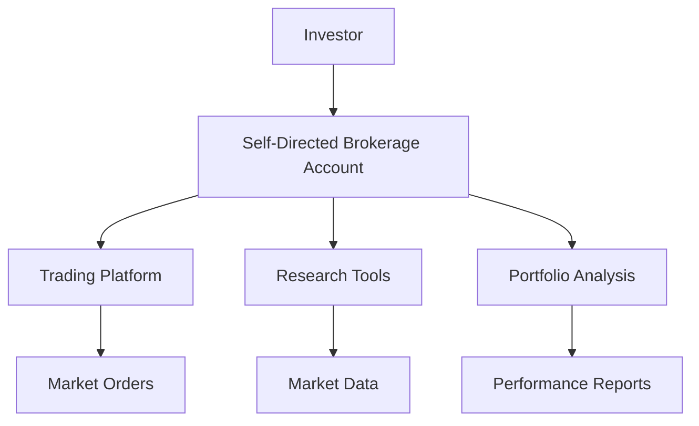

## 25.17 Self-Directed Brokerage Accounts

Self-directed brokerage accounts have transformed the landscape of personal investing by empowering individuals to take control of their financial futures. This section delves into the evolution of these accounts, their transition into fee-based models, the benefits they offer, and the emerging trends shaping their future.

### Evolution of Self-Directed Brokerage Accounts

Self-directed brokerage accounts have evolved significantly over the past few decades. Initially, these accounts were designed for investors who preferred to make their own trading decisions without the assistance of a financial advisor. The advent of the internet and digital trading platforms in the late 20th century democratized access to financial markets, allowing individual investors to trade securities with ease.

In recent years, the evolution of self-directed accounts has been marked by a shift towards fee-based models. Traditionally, brokerage firms earned revenue through commissions on trades. However, the rise of technology-driven advisory models and increased competition have led many firms to adopt fee-based structures. These models charge a flat fee or a percentage of assets under management, providing a more predictable cost structure for investors.

### Benefits of Self-Directed Brokerage Accounts

Self-directed brokerage accounts offer several advantages, particularly in the context of their evolution into fee-based models:

1. **Lower Minimum Account Sizes:** Many brokerage firms have reduced the minimum account size required to open a self-directed account. This change has made investing more accessible to a broader audience, including younger investors and those with limited capital.

2. **Reduced Costs:** The shift to fee-based models often results in lower overall costs for investors. By eliminating or reducing trading commissions, investors can execute trades without worrying about incurring high fees, which can erode investment returns over time.

3. **Technology-Driven Advisory Models:** The integration of technology into self-directed accounts has led to the development of sophisticated tools and platforms. These tools provide investors with access to real-time market data, research reports, and portfolio analysis, enabling them to make informed investment decisions.

4. **Greater Control and Flexibility:** Self-directed accounts empower investors to take control of their investment strategies. Investors can tailor their portfolios to align with their financial goals, risk tolerance, and investment preferences.

### Emerging Trends and Variations

The landscape of self-directed brokerage accounts is continually evolving, with several emerging trends and variations among different brokerage firms:

1. **Robo-Advisors and Hybrid Models:** Robo-advisors have gained popularity as a low-cost alternative to traditional financial advisors. These platforms use algorithms to create and manage investment portfolios based on an individual's risk profile and financial goals. Some firms offer hybrid models that combine robo-advisory services with access to human advisors for personalized guidance.

2. **Integration of ESG Investing:** Environmental, Social, and Governance (ESG) investing has become a significant trend in the financial industry. Many self-directed platforms now offer ESG-focused investment options, allowing investors to align their portfolios with their values.

3. **Enhanced User Experience:** Brokerage firms are investing in user-friendly interfaces and mobile applications to enhance the customer experience. Features such as intuitive dashboards, educational resources, and personalized insights are becoming standard offerings.

4. **Focus on Financial Literacy:** As more individuals take control of their investments, there is a growing emphasis on financial literacy. Brokerage firms are providing educational content and resources to help investors understand complex financial concepts and make informed decisions.

### Practical Example: Canadian Pension Funds

To illustrate the practical application of self-directed brokerage accounts, consider the investment strategies employed by Canadian pension funds. These funds often use a combination of active and passive management strategies to achieve their financial objectives. By leveraging self-directed accounts, individual investors can adopt similar strategies, such as diversifying their portfolios across various asset classes and employing a long-term investment horizon.

### Case Study: Major Canadian Banks

Major Canadian banks, such as RBC and TD, have embraced the trend towards self-directed brokerage accounts. These institutions offer robust platforms that cater to both novice and experienced investors. For example, RBC Direct Investing provides a comprehensive suite of tools and resources, including real-time quotes, research reports, and customizable watchlists. Similarly, TD Direct Investing offers a range of investment products and services, along with educational resources to support investors in their decision-making process.

### Diagram: Self-Directed Brokerage Account Flow

Below is a diagram illustrating the flow of a self-directed brokerage account, highlighting the key components and interactions within the system.

### Best Practices and Common Pitfalls

When managing a self-directed brokerage account, investors should consider the following best practices and be aware of common pitfalls:

- **Conduct Thorough Research:** Before making investment decisions, conduct thorough research and analysis. Utilize the research tools and resources provided by the brokerage platform to stay informed about market trends and opportunities.

- **Diversify Your Portfolio:** Diversification is a key strategy to mitigate risk. Consider spreading investments across different asset classes, sectors, and geographic regions to reduce exposure to any single market or security.

- **Monitor and Rebalance:** Regularly monitor your portfolio's performance and rebalance as needed to ensure alignment with your financial goals and risk tolerance.

- **Avoid Overtrading:** While self-directed accounts offer flexibility, avoid the temptation to overtrade. Frequent trading can lead to higher transaction costs and potential tax implications.

### Glossary

- **Self-Directed Brokerage Accounts:** Investment accounts where clients make their own trading decisions with minimal advisor intervention.

### Additional Resources

To further explore the topic of self-directed brokerage accounts, consider the following resources:

- **Online Tools:**
  - Self-Directed Account Platforms by [Questrade](https://www.questrade.com) and [Interactive Brokers](https://www.interactivebrokers.com)

- **Books:**
  - *The Self-Directed Investor* by Mark R. Howard

### Conclusion

Self-directed brokerage accounts have revolutionized the way individuals approach investing, offering greater control, flexibility, and cost efficiency. As these accounts continue to evolve, investors can expect to see further innovations and enhancements in the tools and services available. By staying informed and adopting best practices, investors can effectively leverage self-directed accounts to achieve their financial goals.

### **Ready to Test Your Knowledge?**

**Practice 10 Essential CSC Exam Questions to Master Your Certification**



### What is a self-directed brokerage account?

- [x] An investment account where clients make their own trading decisions with minimal advisor intervention.
- [ ] An account managed entirely by a financial advisor.
- [ ] A savings account with fixed interest rates.
- [ ] A type of mutual fund.

> **Explanation:** Self-directed brokerage accounts allow clients to make their own investment decisions with minimal advisor involvement.

### What is a key benefit of the fee-based model in self-directed accounts?

- [x] Reduced overall costs for investors.
- [ ] Increased trading commissions.
- [ ] Higher minimum account sizes.
- [ ] Limited access to trading platforms.

> **Explanation:** Fee-based models often result in lower overall costs by eliminating or reducing trading commissions.

### Which trend is NOT associated with self-directed brokerage accounts?

- [ ] Robo-advisors
- [ ] ESG investing
- [ ] Enhanced user experience
- [x] Increased reliance on physical branch visits

> **Explanation:** Self-directed accounts focus on digital platforms, reducing the need for physical branch visits.

### What is a common pitfall to avoid in self-directed investing?

- [x] Overtrading
- [ ] Conducting research
- [ ] Diversifying the portfolio
- [ ] Monitoring performance

> **Explanation:** Overtrading can lead to higher transaction costs and tax implications.

### Which Canadian bank offers self-directed brokerage accounts?

- [x] RBC
- [x] TD
- [ ] Bank of England
- [ ] Deutsche Bank

> **Explanation:** RBC and TD are major Canadian banks offering self-directed brokerage accounts.

### What is a benefit of technology-driven advisory models?

- [x] Access to real-time market data
- [ ] Increased trading fees
- [ ] Limited investment options
- [ ] Reduced portfolio analysis tools

> **Explanation:** Technology-driven models provide access to real-time data and analysis tools.

### What should investors do to mitigate risk in their portfolios?

- [x] Diversify across asset classes
- [ ] Focus on a single stock
- [x] Rebalance regularly
- [ ] Ignore market trends

> **Explanation:** Diversification and regular rebalancing help mitigate risk.

### What is a feature of enhanced user experience in brokerage platforms?

- [x] Intuitive dashboards
- [ ] Increased trading fees
- [ ] Limited research tools
- [ ] Complex interfaces

> **Explanation:** Enhanced user experience includes intuitive dashboards and user-friendly interfaces.

### What is the focus of financial literacy in self-directed investing?

- [x] Understanding complex financial concepts
- [ ] Increasing trading frequency
- [ ] Limiting investment options
- [ ] Reducing educational resources

> **Explanation:** Financial literacy focuses on helping investors understand complex financial concepts.

### True or False: Self-directed brokerage accounts require a financial advisor to make all investment decisions.

- [ ] True
- [x] False

> **Explanation:** Self-directed accounts allow clients to make their own investment decisions with minimal advisor intervention.


