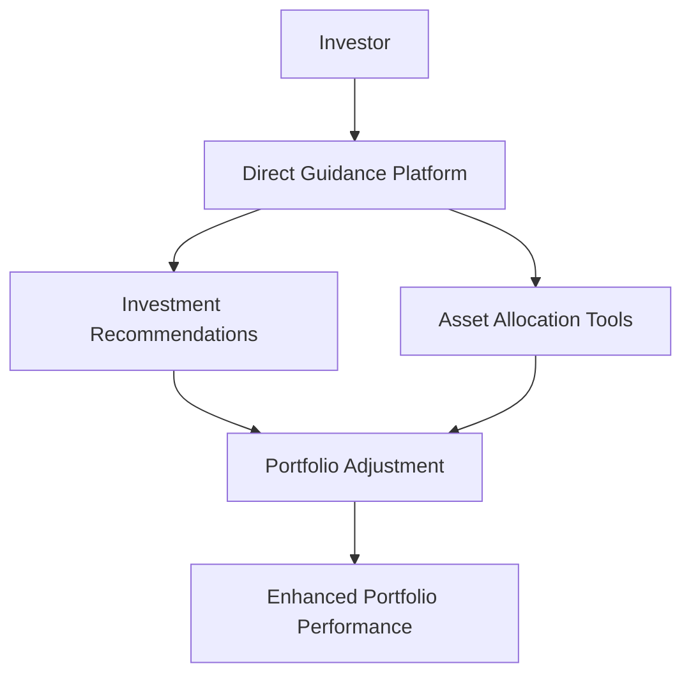

## 25.18 Direct Guidance in Self-Directed Accounts

In the evolving landscape of investment management, self-directed accounts have gained significant popularity among investors who prefer to take control of their financial destinies. However, navigating the complexities of the financial markets can be daunting, even for seasoned investors. This is where direct guidance services come into play, offering a middle ground between full-service advisory and complete independence. This section delves into the nuances of direct guidance in self-directed accounts, exploring its benefits, target audience, and cost considerations.

### Understanding Direct Guidance in Self-Directed Accounts

Direct guidance services provide investors with investment recommendations and asset allocation tools without the comprehensive financial planning typically associated with full-service advisory accounts. These services are designed to empower investors with the insights and tools they need to make informed decisions while maintaining control over their investment choices.

#### Key Features of Direct Guidance Services

1. **Unlimited Trading**: Many direct guidance services offer unlimited trading, allowing investors to execute trades without incurring additional fees. This feature is particularly attractive to active traders who frequently adjust their portfolios.

2. **Asset Allocation Tools**: Direct guidance services often include sophisticated asset allocation tools that help investors diversify their portfolios according to their risk tolerance and investment goals. These tools can provide recommendations based on market conditions and individual preferences.

3. **Investment Recommendations**: While not as comprehensive as full-service advisory, direct guidance provides tailored investment recommendations that align with the investor's objectives. These recommendations can include specific stocks, bonds, mutual funds, or ETFs.

4. **Educational Resources**: Many platforms offering direct guidance also provide educational resources to help investors understand market trends, investment strategies, and the implications of their financial decisions.

### Target Audience for Direct Guidance

Direct guidance services are ideally suited for investors who seek advisory input without the need for comprehensive financial planning. This includes:

- **Experienced Investors**: Individuals with a solid understanding of financial markets who desire occasional expert input to refine their strategies.
- **Active Traders**: Investors who frequently trade and require tools to optimize their asset allocation and trading strategies.
- **Cost-Conscious Investors**: Those who wish to avoid the higher fees associated with full-service advisory accounts while still benefiting from professional insights.

### Cost Considerations and Value-Added Benefits

The cost of direct guidance services can vary significantly depending on the provider and the level of service offered. Typically, these services are more affordable than full-service advisory accounts, making them an attractive option for cost-conscious investors.

#### Value-Added Benefits

1. **Cost Efficiency**: By bundling trading and advisory services, direct guidance platforms often offer competitive pricing structures that reduce overall investment costs.

2. **Flexibility**: Investors retain control over their investment decisions while benefiting from expert recommendations and tools.

3. **Enhanced Decision-Making**: Access to professional insights and asset allocation tools can lead to more informed investment decisions, potentially improving portfolio performance.

4. **Time Savings**: Direct guidance services streamline the investment process, saving investors time in researching and analyzing market data.

### Practical Example: Direct Guidance in Action

Consider a Canadian investor, Emily, who manages her RRSP through a self-directed account. Emily is knowledgeable about the markets but occasionally seeks expert advice to optimize her portfolio. By utilizing a direct guidance service, Emily receives tailored investment recommendations and access to advanced asset allocation tools. This allows her to adjust her portfolio in response to market changes without incurring high advisory fees.

### Diagram: Direct Guidance Workflow

Below is a simplified diagram illustrating the workflow of direct guidance in a self-directed account:

### Best Practices and Common Pitfalls

#### Best Practices

- **Regularly Review Recommendations**: Investors should regularly review the recommendations provided by direct guidance services to ensure alignment with their evolving financial goals.
- **Utilize Educational Resources**: Take advantage of the educational materials offered by the platform to enhance your understanding of market dynamics and investment strategies.
- **Monitor Costs**: Be aware of any fees associated with the service and ensure they align with the value provided.

#### Common Pitfalls

- **Over-Reliance on Recommendations**: While direct guidance offers valuable insights, investors should avoid over-relying on these recommendations and maintain their independent judgment.
- **Ignoring Market Conditions**: Failing to consider broader market conditions when implementing recommendations can lead to suboptimal investment decisions.

### Additional Resources

For those interested in exploring direct guidance further, consider the following resources:

- **Articles**: "Enhancing Self-Directed Accounts with Direct Guidance" by Financial Advisor Insights
- **Books**: *Guided Investing: Combining Technology and Personal Advice* by Susan P. Lee

These resources provide deeper insights into the integration of technology and personal advice in investment management.

### Glossary

- **Direct Guidance**: Advisory services that provide investment recommendations and asset allocation without full-scale financial planning.

By understanding the role of direct guidance in self-directed accounts, investors can leverage these services to enhance their investment strategies while maintaining control over their financial decisions. This approach offers a balanced solution for those seeking professional insights without the commitment of full-service advisory.

### **Ready to Test Your Knowledge?**

**Practice 10 Essential CSC Exam Questions to Master Your Certification**



### What is direct guidance in self-directed accounts?

- [x] Advisory services that provide investment recommendations and asset allocation without full-scale financial planning.
- [ ] Comprehensive financial planning services.
- [ ] A type of full-service advisory account.
- [ ] A trading platform with no advisory services.

> **Explanation:** Direct guidance offers investment recommendations and asset allocation tools without comprehensive financial planning.

### Who is the target audience for direct guidance services?

- [x] Experienced investors seeking occasional expert input.
- [ ] Investors looking for comprehensive financial planning.
- [ ] Individuals with no interest in managing their investments.
- [ ] Only high-net-worth individuals.

> **Explanation:** Direct guidance is suited for experienced investors who want advisory input without full-scale planning.

### What is a key feature of direct guidance services?

- [x] Unlimited trading.
- [ ] Comprehensive tax planning.
- [ ] Guaranteed investment returns.
- [ ] Real estate advisory.

> **Explanation:** Direct guidance often includes unlimited trading, allowing frequent portfolio adjustments.

### What is a common pitfall of using direct guidance services?

- [x] Over-reliance on recommendations.
- [ ] Paying too much for comprehensive planning.
- [ ] Lack of access to trading platforms.
- [ ] Inability to trade frequently.

> **Explanation:** Investors may over-rely on recommendations instead of maintaining independent judgment.

### What is a value-added benefit of direct guidance services?

- [x] Cost efficiency.
- [ ] Guaranteed returns.
- [ ] Comprehensive estate planning.
- [ ] Free tax advice.

> **Explanation:** Direct guidance services are typically more cost-efficient than full-service advisory accounts.

### What should investors do to enhance their understanding of market dynamics?

- [x] Utilize educational resources provided by the platform.
- [ ] Ignore market trends.
- [ ] Only follow recommendations without further research.
- [ ] Avoid learning about new investment strategies.

> **Explanation:** Educational resources help investors understand market trends and strategies.

### What is a practical example of direct guidance in action?

- [x] A Canadian investor using direct guidance to manage an RRSP.
- [ ] An investor using a full-service advisory for estate planning.
- [ ] A trader relying solely on automated trading algorithms.
- [ ] A high-net-worth individual using private banking services.

> **Explanation:** Direct guidance is suitable for managing accounts like RRSPs with expert input.

### What should investors regularly review in direct guidance services?

- [x] Recommendations provided by the service.
- [ ] Only their past performance.
- [ ] The number of trades executed.
- [ ] The color scheme of the trading platform.

> **Explanation:** Regularly reviewing recommendations ensures alignment with financial goals.

### What is a benefit of bundling trading and advisory services?

- [x] Reduced overall investment costs.
- [ ] Increased complexity in managing accounts.
- [ ] Limited access to trading tools.
- [ ] Higher fees than full-service accounts.

> **Explanation:** Bundling often leads to competitive pricing and reduced costs.

### True or False: Direct guidance services offer comprehensive financial planning.

- [ ] True
- [x] False

> **Explanation:** Direct guidance provides investment recommendations and asset allocation without comprehensive financial planning.


