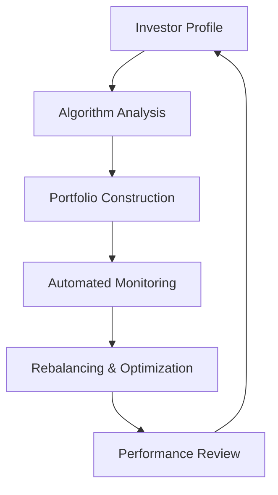

## 25.19 Robo-Advisory Services

Robo-advisory services have emerged as a transformative force in the investment management landscape, particularly in Canada. These automated platforms leverage sophisticated algorithms to manage client portfolios, offering a modern evolution of traditional ETF wraps. This section delves into the intricacies of robo-advisory services, examining their advantages, potential drawbacks, and their role in the broader financial ecosystem.

### The Evolution of Robo-Advisory Services

Robo-advisors represent a significant evolution from ETF wraps, which were among the first attempts to automate investment management. ETF wraps allowed investors to gain diversified exposure through a single investment vehicle, managed by professionals. Robo-advisors take this concept further by utilizing algorithms to create and manage portfolios based on individual investor profiles, risk tolerance, and financial goals.

The rise of robo-advisors can be attributed to advancements in technology, increased demand for cost-effective investment solutions, and a shift towards digital financial services. In Canada, platforms like Wealthsimple and Questrade have become popular, offering a range of services that cater to both novice and experienced investors.

### Advantages of Robo-Advisory Services

Robo-advisors offer several compelling advantages that have contributed to their growing popularity:

1. **Lower Costs**: One of the most significant benefits of robo-advisors is their cost-effectiveness. By minimizing human intervention, these platforms can offer lower management fees compared to traditional financial advisors. This makes investing more accessible to a broader audience, particularly those with smaller portfolios.

2. **Accessibility for Younger Investors**: Robo-advisors appeal to younger investors who are comfortable with technology and prefer digital solutions. The user-friendly interfaces and mobile accessibility make it easy for millennials and Gen Z to start investing early, fostering a culture of financial literacy and planning.

3. **Automated Portfolio Management**: Automation is at the core of robo-advisory services. These platforms continuously monitor and rebalance portfolios to align with the investor's goals and market conditions. This ensures that investments remain optimized without requiring constant oversight from the investor.

4. **Diversification and Risk Management**: Robo-advisors typically offer diversified portfolios that are tailored to an individual's risk tolerance. By spreading investments across various asset classes, these platforms help mitigate risk and enhance potential returns.

### Disadvantages of Robo-Advisory Services

Despite their advantages, robo-advisors also present certain challenges and limitations:

1. **Limited Personalization**: While robo-advisors can tailor portfolios based on general criteria, they may lack the nuanced understanding of a human advisor who can consider complex personal circumstances and provide bespoke financial advice.

2. **Reliance on Technology**: The effectiveness of robo-advisors hinges on the reliability of their algorithms and technology. Technical glitches or errors in the algorithm can lead to suboptimal investment decisions, potentially impacting returns.

3. **Nascent Market Stability**: As a relatively new market, robo-advisory services are still evolving. Regulatory frameworks are developing, and the long-term stability of these platforms remains to be fully tested, especially during periods of market volatility.

### Practical Examples and Case Studies

To illustrate the impact of robo-advisors, consider the following Canadian examples:

- **Wealthsimple**: As one of Canada's leading robo-advisors, Wealthsimple offers a range of investment options, including socially responsible investing (SRI) portfolios. Their platform provides automated rebalancing and tax-loss harvesting, making it an attractive option for investors seeking a hands-off approach.

- **Questrade Portfolio IQ**: This service offers a hybrid model, combining automated portfolio management with access to human advisors. It caters to investors who desire the benefits of automation but also value human insight for more complex financial decisions.

### Best Practices and Common Pitfalls

When considering robo-advisory services, investors should keep the following best practices in mind:

- **Understand Your Financial Goals**: Clearly define your investment objectives and risk tolerance before selecting a robo-advisor. This will ensure that the chosen platform aligns with your financial needs.

- **Regularly Review Performance**: While robo-advisors automate many aspects of portfolio management, it's essential to periodically review performance and make adjustments as needed.

- **Stay Informed About Fees**: Although robo-advisors generally offer lower fees, it's important to understand the fee structure and any additional costs that may apply.

Common pitfalls include over-reliance on automation and neglecting to stay informed about market trends and changes in personal financial circumstances.

### Diagrams and Visual Aids

To better understand the flow of robo-advisory services, consider the following diagram illustrating the typical process:

This diagram highlights the cyclical nature of robo-advisory services, emphasizing continuous monitoring and adjustment to maintain alignment with investor goals.

### Glossary

- **Robo-Advisor**: Automated investment platforms that use algorithms to manage client portfolios with minimal human intervention.

### Additional Resources

For those interested in further exploring robo-advisory services, consider the following resources:

- **Articles**:
  - "The Rise and Challenges of Robo-Advisors" by Fintech Journal

- **Books**:
  - *The Robo-Advisor Handbook: Automated Investing in the New Era* by Michael S. P. Chin

- **Online Courses**:
  - Introduction to Robo-Advisory Services on edX

### Conclusion

Robo-advisory services represent a significant shift in the investment management landscape, offering a blend of technology and finance that appeals to a diverse range of investors. By understanding their advantages and limitations, investors can make informed decisions about incorporating these platforms into their financial strategies.

### **Ready to Test Your Knowledge?**

**Practice 10 Essential CSC Exam Questions to Master Your Certification**



### What is a primary advantage of robo-advisory services?

- [x] Lower costs
- [ ] Higher returns
- [ ] Personalized advice
- [ ] Manual portfolio management

> **Explanation:** Robo-advisors offer lower costs due to minimal human intervention, making them accessible to a broader audience.

### Which Canadian platform is known for offering socially responsible investing portfolios?

- [x] Wealthsimple
- [ ] Questrade
- [ ] RBC Direct Investing
- [ ] TD Ameritrade

> **Explanation:** Wealthsimple provides socially responsible investing (SRI) portfolios, appealing to investors focused on ethical investments.

### What is a common disadvantage of robo-advisors?

- [ ] High fees
- [ ] Manual rebalancing
- [x] Limited personalization
- [ ] Lack of diversification

> **Explanation:** Robo-advisors may lack the nuanced understanding of a human advisor, leading to limited personalization.

### What is the role of algorithms in robo-advisory services?

- [x] To manage client portfolios
- [ ] To provide customer support
- [ ] To execute trades manually
- [ ] To offer tax advice

> **Explanation:** Algorithms are used to manage client portfolios, automating the investment process.

### What should investors regularly review when using robo-advisors?

- [x] Portfolio performance
- [ ] Customer service ratings
- [ ] Competitor platforms
- [ ] Marketing materials

> **Explanation:** Investors should regularly review portfolio performance to ensure alignment with their financial goals.

### Which of the following is a best practice when using robo-advisors?

- [x] Understand your financial goals
- [ ] Ignore market trends
- [ ] Rely solely on automation
- [ ] Avoid reviewing performance

> **Explanation:** Understanding financial goals ensures that the chosen robo-advisor aligns with the investor's needs.

### What is a potential pitfall of relying on robo-advisors?

- [ ] Over-diversification
- [x] Over-reliance on automation
- [ ] Excessive fees
- [ ] Frequent human intervention

> **Explanation:** Over-reliance on automation can lead to neglecting personal financial circumstances and market trends.

### What is the primary focus of robo-advisory services?

- [x] Automated portfolio management
- [ ] Manual trading
- [ ] Personalized financial planning
- [ ] High-frequency trading

> **Explanation:** Robo-advisory services focus on automated portfolio management using algorithms.

### How do robo-advisors typically manage risk?

- [x] Through diversified portfolios
- [ ] By investing in a single asset class
- [ ] By avoiding market exposure
- [ ] By frequent manual adjustments

> **Explanation:** Robo-advisors manage risk by offering diversified portfolios tailored to an individual's risk tolerance.

### True or False: Robo-advisors eliminate the need for human financial advisors.

- [ ] True
- [x] False

> **Explanation:** While robo-advisors automate many aspects of investment management, human advisors can provide personalized advice and address complex financial situations.


