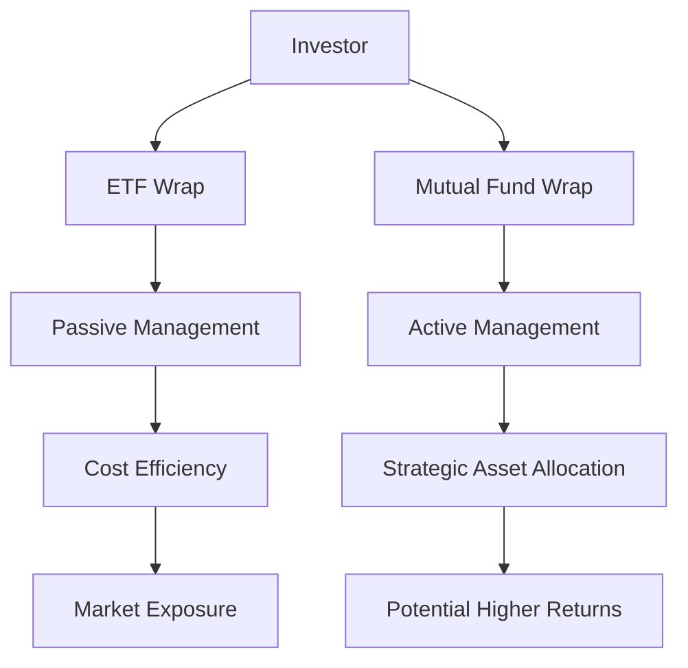

## 25.3.1 ETF Wraps and Mutual Fund Wraps

In the realm of managed fee-based accounts, ETF wraps and mutual fund wraps stand out as pivotal services that leverage the strengths of exchange-traded funds (ETFs) and mutual funds to craft comprehensive investment strategies. These wraps are designed to provide investors with a structured approach to asset management, offering both passive and active investment options tailored to meet diverse financial goals.

### Understanding ETF Wraps and Mutual Fund Wraps

**ETF Wraps** are managed account services that primarily utilize exchange-traded funds to build a diversified portfolio. ETFs are known for their passive investment approach, often tracking specific indices to achieve market-like returns. This passive strategy is cost-effective and provides broad market exposure, making ETF wraps an attractive option for investors seeking a hands-off investment experience.

**Mutual Fund Wraps**, on the other hand, involve actively managed mutual funds. These wraps employ sub-advisors who actively select securities, aiming to outperform market indices. This active management approach allows for strategic asset allocation and sector selection, potentially offering higher returns at the cost of higher fees compared to ETF wraps.

### Comparing Investment Approaches

The primary distinction between ETF wraps and mutual fund wraps lies in their investment strategies:

- **ETF Wraps**: Typically follow a passive investment strategy. They aim to replicate the performance of a specific index, such as the S&P/TSX Composite Index, by holding a similar portfolio of securities. This approach minimizes trading costs and management fees, offering a cost-efficient investment solution.

- **Mutual Fund Wraps**: Employ active management, where sub-advisors make investment decisions based on market analysis and forecasts. This strategy involves frequent trading and portfolio adjustments to capitalize on market opportunities, potentially leading to higher returns but also higher management fees.

### Advantages of Wrapper Services

Both ETF wraps and mutual fund wraps offer several advantages that enhance their appeal to investors:

1. **Asset Allocation**: Wrap services provide a systematic approach to asset allocation, ensuring that portfolios are diversified across various asset classes and sectors. This diversification reduces risk and enhances potential returns.

2. **Sector Selection**: Particularly in mutual fund wraps, active management allows for strategic sector selection, enabling investors to capitalize on emerging market trends and opportunities.

3. **Cost Efficiency**: ETF wraps are particularly known for their cost efficiency due to their passive management style, which results in lower management fees compared to actively managed funds.

4. **Convenience**: Wrap programs simplify the investment process by bundling multiple funds into a single account, making it easier for investors to manage their portfolios.

### Integration into Client Portfolios

Wrap programs are designed to seamlessly integrate into client portfolios, providing a comprehensive investment solution that enhances diversification and strategic asset management. By combining multiple funds into a single account, wrap services offer a holistic approach to investment management, aligning with clients' financial goals and risk tolerance.

For instance, a Canadian investor looking to diversify their retirement savings might opt for an ETF wrap within their Registered Retirement Savings Plan (RRSP). This choice provides broad market exposure with minimal management fees, aligning with long-term growth objectives.

### Practical Example: Canadian Pension Funds

Consider a Canadian pension fund that employs both ETF wraps and mutual fund wraps to manage its investment portfolio. The fund might use ETF wraps to gain exposure to broad market indices, ensuring cost-effective diversification. Simultaneously, it could utilize mutual fund wraps to actively manage specific sectors, such as technology or healthcare, where active management could yield higher returns.

### Visualizing the Concept

To better understand the structure and flow of ETF wraps and mutual fund wraps, consider the following diagram:

### Best Practices and Common Pitfalls

**Best Practices:**
- **Diversification**: Ensure that wrap services are used to achieve a well-diversified portfolio across different asset classes and sectors.
- **Cost Management**: Consider the cost implications of active versus passive management when selecting between ETF and mutual fund wraps.
- **Regular Review**: Periodically review the performance of wrap accounts to ensure alignment with financial goals and market conditions.

**Common Pitfalls:**
- **Over-reliance on Active Management**: While active management can offer higher returns, it also comes with higher fees and risks. Balance active and passive strategies to optimize returns.
- **Neglecting Fee Structures**: Be aware of the fee structures associated with wrap services, as high fees can erode investment returns over time.

### Conclusion

ETF wraps and mutual fund wraps offer investors a structured approach to asset management, combining the benefits of passive and active investment strategies. By understanding their unique characteristics and advantages, investors can make informed decisions that align with their financial goals and risk tolerance. As you explore these managed account services, consider how they can enhance your investment portfolio through strategic asset allocation and diversification.

## Quiz Time!



### What is the primary investment strategy used by ETF wraps?

- [x] Passive management
- [ ] Active management
- [ ] Hybrid management
- [ ] Tactical management

> **Explanation:** ETF wraps primarily use a passive management strategy, aiming to replicate the performance of specific indices.

### Which of the following is a key advantage of mutual fund wraps?

- [ ] Lower management fees
- [x] Strategic sector selection
- [ ] Guaranteed returns
- [ ] Tax-free growth

> **Explanation:** Mutual fund wraps offer strategic sector selection through active management, allowing investors to capitalize on market opportunities.

### How do wrap programs enhance client portfolios?

- [x] By providing diversification and strategic asset management
- [ ] By guaranteeing high returns
- [ ] By eliminating all investment risks
- [ ] By focusing solely on Canadian equities

> **Explanation:** Wrap programs enhance client portfolios by offering diversification and strategic asset management, aligning with clients' financial goals.

### What is a common pitfall when using mutual fund wraps?

- [ ] Over-diversification
- [x] Over-reliance on active management
- [ ] Ignoring passive strategies
- [ ] Focusing on low-risk investments

> **Explanation:** Over-reliance on active management can lead to higher fees and risks, making it important to balance strategies.

### Which of the following best describes the fee structure of ETF wraps?

- [x] Cost-efficient due to passive management
- [ ] High fees due to active management
- [ ] Variable fees based on performance
- [ ] No fees involved

> **Explanation:** ETF wraps are cost-efficient due to their passive management approach, resulting in lower fees.

### What role do sub-advisors play in mutual fund wraps?

- [x] They actively manage the funds
- [ ] They passively track indices
- [ ] They eliminate all investment risks
- [ ] They guarantee returns

> **Explanation:** Sub-advisors actively manage mutual fund wraps, making investment decisions to outperform market indices.

### How can ETF wraps benefit a Canadian investor's RRSP?

- [x] By providing broad market exposure with minimal fees
- [ ] By guaranteeing high returns
- [ ] By focusing solely on Canadian equities
- [ ] By eliminating all investment risks

> **Explanation:** ETF wraps offer broad market exposure with minimal fees, aligning with long-term growth objectives in an RRSP.

### What is a key consideration when choosing between ETF and mutual fund wraps?

- [x] Cost implications of active versus passive management
- [ ] The guarantee of high returns
- [ ] The elimination of all investment risks
- [ ] The focus on a single asset class

> **Explanation:** It's important to consider the cost implications of active versus passive management when choosing between ETF and mutual fund wraps.

### Which of the following is a benefit of using wrap services?

- [x] Simplified investment management
- [ ] Guaranteed returns
- [ ] Elimination of all investment risks
- [ ] Focus on a single asset class

> **Explanation:** Wrap services simplify investment management by bundling multiple funds into a single account.

### True or False: Mutual fund wraps are typically more cost-efficient than ETF wraps.

- [ ] True
- [x] False

> **Explanation:** Mutual fund wraps are generally less cost-efficient than ETF wraps due to their active management and higher fees.


