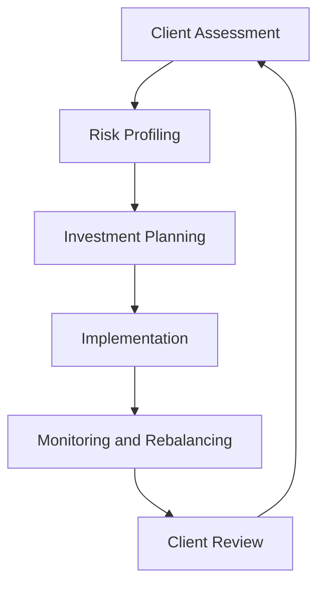

## 25.3.2 Advisor-Managed Accounts

Advisor-managed accounts represent a sophisticated and personalized approach to investment management, where licensed portfolio managers take an active role in overseeing and managing client investments. This section delves into the nuances of advisor-managed accounts, exploring their benefits, potential drawbacks, and the strategic methodologies employed by advisors to tailor investment strategies to individual client needs.

### Understanding Advisor-Managed Accounts

Advisor-managed accounts are investment portfolios that are actively managed by professional portfolio managers. These managers are typically licensed and possess the expertise to make informed investment decisions on behalf of their clients. The primary goal of these accounts is to provide a customized investment experience that aligns with the client's financial goals, risk tolerance, and investment horizon.

In Canada, advisor-managed accounts are regulated by the Canadian Investment Regulatory Organization (CIRO) and other provincial regulatory bodies, ensuring that portfolio managers adhere to strict standards of professionalism and fiduciary responsibility.

### Customization and Tailored Investment Strategies

One of the key features of advisor-managed accounts is the high degree of customization they offer. Portfolio managers work closely with clients to understand their unique financial situations, preferences, and objectives. This personalized approach allows managers to develop tailored investment strategies that are specifically designed to meet the client's needs.

#### Steps in Customizing Investment Strategies:

1. **Client Assessment:** The process begins with a comprehensive assessment of the client's financial situation, including their income, expenses, assets, liabilities, and overall financial goals.

2. **Risk Profiling:** Understanding the client's risk tolerance is crucial. This involves evaluating how much risk the client is willing to take and their capacity to absorb potential losses.

3. **Investment Planning:** Based on the assessment and risk profile, the portfolio manager devises a strategic investment plan. This plan outlines the asset allocation, investment vehicles, and specific securities to be included in the portfolio.

4. **Implementation:** The manager executes the investment plan, selecting securities and making trades to build the portfolio.

5. **Monitoring and Rebalancing:** Continuous monitoring of the portfolio's performance is essential. The manager regularly reviews the portfolio and makes adjustments as needed to ensure it remains aligned with the client's goals and market conditions.

### Advantages of Advisor-Managed Accounts

Advisor-managed accounts offer several advantages that make them an attractive option for many investors:

- **Personalized Investment Approach:** Clients benefit from a highly personalized investment strategy that is tailored to their specific needs and goals. This customization can lead to more effective portfolio management and potentially better investment outcomes.

- **Aligned Interests:** Since portfolio managers are often compensated based on the performance of the client's portfolio, their interests are aligned with those of the client. This alignment can foster trust and confidence in the investment process.

- **Expertise and Professional Management:** Clients gain access to the expertise of seasoned professionals who have the knowledge and experience to navigate complex financial markets. This can be particularly beneficial in volatile or uncertain market conditions.

- **Time Savings:** By delegating the management of their investments to a professional, clients can save time and focus on other aspects of their lives or businesses.

### Potential Limitations and Challenges

While advisor-managed accounts offer numerous benefits, there are also potential limitations and challenges to consider:

- **Dependency on Advisor's Expertise:** The success of an advisor-managed account largely depends on the skill and expertise of the portfolio manager. Clients must carefully select a manager with a proven track record and a strategy that aligns with their investment philosophy.

- **Cost:** Advisor-managed accounts often come with higher fees compared to self-managed accounts or passive investment strategies. These fees can impact overall investment returns, especially if the portfolio does not perform as expected.

- **Limited Control:** Clients relinquish a degree of control over their investment decisions, which may not be suitable for those who prefer a more hands-on approach to managing their finances.

### Practical Example: Canadian Pension Fund Strategy

Consider a Canadian pension fund that employs advisor-managed accounts to optimize its investment strategy. The fund's portfolio manager conducts a thorough analysis of the fund's liabilities, cash flow requirements, and risk tolerance. Based on this assessment, the manager develops a diversified portfolio that includes Canadian equities, fixed income securities, and alternative investments such as real estate and infrastructure.

The manager continuously monitors the portfolio, making adjustments to asset allocations in response to changing market conditions and economic forecasts. This proactive management approach helps the pension fund achieve its long-term objectives while managing risk effectively.

### Diagram: Advisor-Managed Account Process

Below is a visual representation of the advisor-managed account process, illustrating the key steps involved in customizing and managing an investment portfolio.

### Best Practices for Advisor-Managed Accounts

- **Select the Right Advisor:** Conduct thorough due diligence when selecting a portfolio manager. Consider their experience, investment philosophy, and past performance.

- **Regular Communication:** Maintain open lines of communication with your advisor to ensure your investment strategy remains aligned with your goals and any changes in your financial situation.

- **Understand the Fee Structure:** Be aware of the fees associated with advisor-managed accounts and how they may impact your investment returns.

- **Review Performance Regularly:** Regularly review the performance of your portfolio and discuss any concerns or adjustments with your advisor.

### Conclusion

Advisor-managed accounts offer a personalized and professional approach to investment management, providing clients with tailored strategies that align with their financial goals. While there are potential limitations, the benefits of expert management and aligned interests make these accounts a valuable option for many investors. By understanding the intricacies of advisor-managed accounts, investors can make informed decisions and optimize their financial outcomes within the Canadian market.

## Quiz Time!



### What is the primary goal of advisor-managed accounts?

- [x] To provide a customized investment experience that aligns with the client's financial goals
- [ ] To offer low-cost investment options
- [ ] To eliminate the need for professional management
- [ ] To focus solely on short-term gains

> **Explanation:** Advisor-managed accounts aim to provide a personalized investment strategy that aligns with the client's specific financial goals, risk tolerance, and investment horizon.

### Which of the following is a key advantage of advisor-managed accounts?

- [x] Personalized investment approach
- [ ] Guaranteed returns
- [ ] No fees
- [ ] Complete control over investment decisions

> **Explanation:** Advisor-managed accounts offer a personalized investment approach, tailored to the client's unique needs and goals, which is a significant advantage.

### What is a potential limitation of advisor-managed accounts?

- [x] Dependency on the advisor's expertise
- [ ] Lack of professional management
- [ ] High liquidity
- [ ] Guaranteed returns

> **Explanation:** A potential limitation is the dependency on the advisor's expertise, as the success of the account largely depends on the skill and experience of the portfolio manager.

### What is the first step in customizing an investment strategy for an advisor-managed account?

- [x] Client Assessment
- [ ] Implementation
- [ ] Monitoring and Rebalancing
- [ ] Investment Planning

> **Explanation:** The first step is a comprehensive assessment of the client's financial situation, which forms the basis for developing a tailored investment strategy.

### How do advisor-managed accounts align the interests of the advisor and the client?

- [x] Advisors are often compensated based on the performance of the client's portfolio
- [ ] Advisors charge a flat fee regardless of performance
- [ ] Advisors focus on short-term gains
- [ ] Advisors have no financial incentive

> **Explanation:** Advisors are often compensated based on the performance of the client's portfolio, aligning their interests with those of the client.

### What is a common practice in managing advisor-managed accounts?

- [x] Regular monitoring and rebalancing of the portfolio
- [ ] Ignoring market conditions
- [ ] Making no changes to the portfolio
- [ ] Focusing solely on one asset class

> **Explanation:** Regular monitoring and rebalancing are common practices to ensure the portfolio remains aligned with the client's goals and market conditions.

### Which regulatory body oversees advisor-managed accounts in Canada?

- [x] Canadian Investment Regulatory Organization (CIRO)
- [ ] Securities and Exchange Commission (SEC)
- [ ] Financial Conduct Authority (FCA)
- [ ] European Securities and Markets Authority (ESMA)

> **Explanation:** In Canada, advisor-managed accounts are regulated by the Canadian Investment Regulatory Organization (CIRO).

### What is the role of risk profiling in advisor-managed accounts?

- [x] To evaluate the client's risk tolerance and capacity to absorb potential losses
- [ ] To determine the client's income level
- [ ] To assess the client's tax situation
- [ ] To eliminate all investment risks

> **Explanation:** Risk profiling evaluates the client's risk tolerance and capacity to absorb potential losses, which is crucial for developing a suitable investment strategy.

### What should clients do to ensure their investment strategy remains aligned with their goals?

- [x] Maintain regular communication with their advisor
- [ ] Avoid discussing their financial situation
- [ ] Ignore changes in market conditions
- [ ] Focus solely on short-term gains

> **Explanation:** Regular communication with their advisor helps ensure that the investment strategy remains aligned with the client's goals and any changes in their financial situation.

### True or False: Advisor-managed accounts guarantee high returns.

- [ ] True
- [x] False

> **Explanation:** Advisor-managed accounts do not guarantee high returns. The success of the account depends on various factors, including market conditions and the advisor's expertise.


