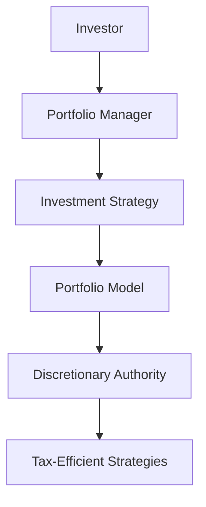

## 25.3.3.1 Single-Mandate SMAs

In the realm of fee-based accounts, Separately Managed Accounts (SMAs) offer a unique blend of personalized investment management and strategic financial planning. Among these, Single-Mandate SMAs stand out as a focused approach where a single portfolio manager is tasked with executing a specific investment strategy. This section delves into the nuances of Single-Mandate SMAs, exploring their structure, benefits, and strategic advantages, particularly within the Canadian financial landscape.

### Understanding Single-Mandate SMAs

Single-Mandate SMAs are investment accounts managed by a dedicated portfolio manager who adheres to a specific investment strategy. Unlike multi-mandate SMAs, which may involve multiple managers and diverse strategies, single-mandate SMAs concentrate on a singular approach, such as growth, value, or income generation. This focused strategy allows for a more streamlined and cohesive investment process.

#### The Investment Process

The investment process within a Single-Mandate SMA is characterized by the portfolio manager's discretionary authority. This means the manager has the autonomy to make investment decisions on behalf of the client, aligning with the predefined strategy. The process typically involves:

1. **Portfolio Models**: The manager develops a model portfolio that reflects the chosen investment strategy. For instance, a growth-focused SMA might prioritize equities with high potential for capital appreciation, while an income-focused SMA might emphasize dividend-paying stocks or bonds.

2. **Discretionary Authority**: The portfolio manager exercises discretion in selecting securities, adjusting allocations, and executing trades. This authority enables swift responses to market changes, optimizing the portfolio's performance in line with the strategy.

3. **Regular Reviews and Adjustments**: Continuous monitoring and periodic reviews ensure the portfolio remains aligned with the client's objectives and market conditions. Adjustments are made as necessary to maintain strategic alignment.

### Benefits of Single-Mandate SMAs

Single-Mandate SMAs offer several advantages, particularly for investors seeking a tailored investment experience:

- **Dedicated Portfolio Management**: Investors benefit from the expertise of a dedicated portfolio manager who is deeply familiar with the chosen strategy and market dynamics.

- **Personalized Investment Decisions**: The focused nature of single-mandate SMAs allows for personalized investment decisions that reflect the client's risk tolerance, financial goals, and preferences.

- **Tax-Efficient Strategies**: Single-Mandate SMAs provide opportunities for tax-efficient investing. For example, portfolio managers can implement tax loss selling strategies to offset capital gains, thereby reducing the investor's tax liability.

### Tax Efficiency in Single-Mandate SMAs

Tax efficiency is a critical consideration for Canadian investors. Single-Mandate SMAs offer several strategies to enhance tax efficiency:

- **Tax Loss Selling**: This involves selling securities at a loss to offset capital gains elsewhere in the portfolio. By strategically realizing losses, investors can reduce their taxable income.

- **Dividend Tax Credit**: In Canada, dividends from eligible Canadian corporations benefit from a dividend tax credit, which can lower the effective tax rate on dividend income. A portfolio manager might focus on dividend-paying stocks to leverage this advantage.

- **Registered Accounts**: Utilizing registered accounts like RRSPs (Registered Retirement Savings Plans) or TFSAs (Tax-Free Savings Accounts) can further enhance tax efficiency. While contributions to RRSPs are tax-deductible, TFSAs allow for tax-free growth and withdrawals.

### Practical Example: Canadian Pension Fund Strategy

Consider a Canadian pension fund utilizing a Single-Mandate SMA with a focus on growth equities. The portfolio manager, leveraging discretionary authority, selects a mix of Canadian and international stocks with strong growth potential. By actively managing the portfolio, the manager can capitalize on market opportunities and implement tax-efficient strategies, such as tax loss selling during market downturns, to optimize returns for the pension fund.

### Diagram: Single-Mandate SMA Structure

Below is a diagram illustrating the structure of a Single-Mandate SMA, highlighting the relationship between the investor, portfolio manager, and the investment strategy.

### Best Practices and Common Challenges

**Best Practices:**

- **Clear Communication**: Ensure clear communication between the investor and portfolio manager regarding investment objectives and risk tolerance.
- **Regular Monitoring**: Regularly monitor portfolio performance and market conditions to make informed adjustments.
- **Tax Planning**: Incorporate tax planning into the investment strategy to maximize after-tax returns.

**Common Challenges:**

- **Market Volatility**: Navigating market volatility requires a disciplined approach and the ability to adapt quickly.
- **Regulatory Compliance**: Adhering to Canadian regulatory requirements is essential to avoid legal and financial repercussions.

### Conclusion

Single-Mandate SMAs offer a focused and personalized approach to investment management, providing Canadian investors with the benefits of dedicated portfolio management and tax-efficient strategies. By understanding the structure and advantages of these accounts, investors can make informed decisions that align with their financial goals.

For further exploration, consider resources such as the Canadian Securities Administrators (CSA) website for regulatory insights, or books like "The Intelligent Investor" by Benjamin Graham for foundational investment principles.

## Quiz Time!



### What is a Single-Mandate SMA?

- [x] An account managed by a single portfolio manager focused on a specific investment strategy.
- [ ] An account managed by multiple portfolio managers with diverse strategies.
- [ ] A mutual fund with a single investment objective.
- [ ] A self-directed investment account.

> **Explanation:** Single-Mandate SMAs are managed by a single portfolio manager who follows a specific investment strategy.

### What authority does a portfolio manager have in a Single-Mandate SMA?

- [x] Discretionary authority to make investment decisions.
- [ ] Authority to only suggest investment options.
- [ ] No authority; decisions are made by the investor.
- [ ] Authority to manage multiple strategies simultaneously.

> **Explanation:** The portfolio manager has discretionary authority to make investment decisions within the framework of the chosen strategy.

### What is a key benefit of Single-Mandate SMAs?

- [x] Personalized investment decisions.
- [ ] Guaranteed returns.
- [ ] No management fees.
- [ ] Fixed asset allocation.

> **Explanation:** Single-Mandate SMAs offer personalized investment decisions tailored to the investor's goals and risk tolerance.

### How can Single-Mandate SMAs enhance tax efficiency?

- [x] Through strategies like tax loss selling.
- [ ] By avoiding all taxable events.
- [ ] By investing only in tax-free bonds.
- [ ] By holding assets indefinitely.

> **Explanation:** Tax loss selling is a strategy used to offset capital gains and enhance tax efficiency.

### What is a common challenge in managing Single-Mandate SMAs?

- [x] Navigating market volatility.
- [ ] Lack of investment options.
- [ ] High guaranteed returns.
- [ ] Fixed regulatory requirements.

> **Explanation:** Market volatility can impact portfolio performance, requiring adaptive management strategies.

### Which account type can enhance tax efficiency in Canada?

- [x] RRSPs and TFSAs.
- [ ] Regular savings accounts.
- [ ] Non-registered investment accounts.
- [ ] Foreign currency accounts.

> **Explanation:** RRSPs and TFSAs offer tax advantages that can enhance investment efficiency.

### What is the role of a portfolio model in a Single-Mandate SMA?

- [x] To reflect the chosen investment strategy.
- [ ] To determine the investor's risk tolerance.
- [ ] To guarantee returns.
- [ ] To eliminate market risks.

> **Explanation:** The portfolio model is designed to align with the specific investment strategy of the SMA.

### What is the dividend tax credit?

- [x] A credit that reduces the effective tax rate on eligible Canadian dividends.
- [ ] A tax applied to all dividends.
- [ ] A deduction for foreign dividends.
- [ ] A penalty for high dividend income.

> **Explanation:** The dividend tax credit reduces the tax burden on eligible Canadian dividends.

### What is the primary focus of a growth-focused Single-Mandate SMA?

- [x] Capital appreciation.
- [ ] Income generation.
- [ ] Fixed income securities.
- [ ] Currency hedging.

> **Explanation:** Growth-focused SMAs aim for capital appreciation through equities with high growth potential.

### True or False: Single-Mandate SMAs can only be used for equity investments.

- [ ] True
- [x] False

> **Explanation:** Single-Mandate SMAs can focus on various asset classes, including equities, fixed income, and more, depending on the investment strategy.


