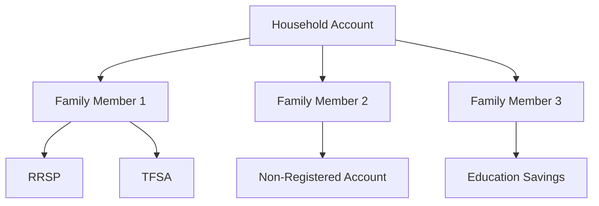

---

linkTitle: "25.3.4 Household Accounts"
title: "Household Accounts: Centralized Investment Strategies for Families"
description: "Explore the benefits of household accounts in fee-based investment management, focusing on tax efficiency, cohesive oversight, and estate planning within Canadian financial markets."
categories:
- Finance
- Investment Management
- Wealth Planning
tags:
- Household Accounts
- Fee-Based Accounts
- Investment Strategies
- Tax Management
- Estate Planning
date: 2024-10-25
type: docs
nav_weight: 1334000
---

## 25.3.4 Household Accounts

In the realm of fee-based investment management, household accounts stand out as a strategic tool for families looking to optimize their financial planning. These accounts are designed to coordinate investments across an entire family or household, offering a centralized approach to managing wealth. This section delves into the intricacies of household accounts, highlighting their benefits in tax management, investment planning, and estate planning within the Canadian financial landscape.

### Understanding Household Accounts

Household accounts are fee-based accounts that aggregate the financial assets of multiple family members under a single management umbrella. This approach allows for a unified investment strategy, where the financial goals of the entire household are considered collectively rather than individually. By pooling resources, families can achieve greater efficiency in managing their investments and financial planning.

### Enhancing Tax Management and Investment Planning

One of the primary advantages of household accounts is their ability to enhance tax management. By centralizing investments, families can strategically allocate assets to minimize tax liabilities. For instance, income-splitting strategies can be employed to distribute income among family members in lower tax brackets, thereby reducing the overall tax burden. Additionally, capital gains and losses can be managed more effectively across the household, optimizing tax outcomes.

In terms of investment planning, household accounts allow for a more cohesive approach. Investment decisions can be made with the entire family's financial goals in mind, ensuring that asset allocation is optimized for risk tolerance and time horizons. This centralized strategy can lead to more consistent and aligned investment outcomes, as all family members benefit from a unified plan.

### Benefits of Household Accounts

#### Cohesive Investment Oversight

Household accounts provide a comprehensive view of the family's financial landscape, enabling better oversight and management of investments. This holistic perspective allows for more informed decision-making, as financial advisors can consider the entire household's assets and liabilities when crafting investment strategies. This cohesive oversight ensures that all family members are working towards common financial objectives, reducing the risk of conflicting investment decisions.

#### Optimized Asset Allocation

By pooling resources, household accounts enable families to achieve a more diversified and balanced asset allocation. This can lead to improved risk management, as investments are spread across a wider range of asset classes and sectors. Additionally, families can take advantage of economies of scale, accessing investment opportunities that may not be available to individual investors.

#### Facilitating Estate Planning and Wealth Management

Household accounts also play a crucial role in estate planning and wealth management. By centralizing financial assets, families can streamline the process of transferring wealth to future generations. This can include setting up trusts, gifting strategies, and other mechanisms to ensure that wealth is preserved and passed on according to the family's wishes.

Moreover, household accounts can simplify the management of complex family dynamics, such as blended families or multi-generational households. By providing a clear and organized structure for managing wealth, these accounts can help mitigate potential conflicts and ensure that all family members are treated equitably.

### Practical Example: A Canadian Family's Household Account Strategy

Consider the case of the Smith family, a Canadian household with diverse financial goals. By establishing a household account, the Smiths were able to consolidate their investments, including RRSPs, TFSAs, and non-registered accounts. This allowed them to implement a tax-efficient strategy, where income was split between family members to minimize taxes.

The Smiths also benefited from a cohesive investment strategy, with a balanced asset allocation that reflected the family's risk tolerance and time horizons. This approach enabled them to achieve their financial goals, such as funding their children's education and planning for retirement, in a more coordinated manner.

### Diagram: Household Account Structure

Below is a diagram illustrating the structure of a household account, highlighting the flow of investments and the centralized management approach.

### Best Practices and Common Pitfalls

**Best Practices:**
- **Regular Reviews:** Conduct regular reviews of the household account to ensure that investment strategies remain aligned with the family's financial goals.
- **Professional Guidance:** Engage with financial advisors who specialize in household accounts to leverage their expertise in tax planning and investment management.
- **Clear Communication:** Maintain open communication among family members to ensure that everyone is aware of the financial strategies and objectives.

**Common Pitfalls:**
- **Overlooking Individual Needs:** While household accounts focus on collective goals, it's important not to overlook the individual needs and preferences of family members.
- **Complexity in Management:** Managing a household account can be complex, especially for larger families. It's crucial to have a clear structure and process in place to avoid confusion.

### Conclusion

Household accounts offer a powerful tool for families seeking to optimize their financial planning. By centralizing investments and adopting a unified strategy, families can enhance tax efficiency, improve investment outcomes, and facilitate effective estate planning. As the Canadian financial landscape continues to evolve, household accounts will remain a valuable resource for families looking to achieve their financial goals.

## Quiz Time!



### What is a household account?

- [x] A fee-based account that coordinates investments across an entire family or household
- [ ] An individual investment account for a single person
- [ ] A savings account for household expenses
- [ ] A checking account for daily transactions

> **Explanation:** Household accounts are designed to manage investments for an entire family, providing a centralized approach to financial planning.

### How do household accounts enhance tax management?

- [x] By centralizing investments and allowing for income-splitting strategies
- [ ] By increasing the tax rate for the household
- [ ] By eliminating all taxes on investments
- [ ] By providing tax credits for each family member

> **Explanation:** Household accounts enable families to use income-splitting strategies and manage capital gains and losses more effectively, optimizing tax outcomes.

### What is a key benefit of household accounts in investment planning?

- [x] Cohesive investment oversight
- [ ] Individualized investment strategies
- [ ] Higher risk investments
- [ ] Limited asset allocation

> **Explanation:** Household accounts provide a comprehensive view of the family's financial landscape, allowing for cohesive investment oversight and aligned financial goals.

### How do household accounts facilitate estate planning?

- [x] By centralizing financial assets and simplifying wealth transfer
- [ ] By increasing the complexity of estate management
- [ ] By reducing the amount of wealth transferred
- [ ] By eliminating the need for wills

> **Explanation:** Household accounts streamline the process of transferring wealth to future generations, making estate planning more efficient.

### What is a common pitfall of household accounts?

- [x] Overlooking individual needs
- [ ] Providing too much individual attention
- [ ] Simplifying financial management
- [ ] Reducing investment options

> **Explanation:** While focusing on collective goals, it's important not to overlook the individual needs and preferences of family members.

### What type of account is included in the household account structure?

- [x] RRSP
- [ ] Checking account
- [ ] Mortgage account
- [ ] Credit card account

> **Explanation:** RRSPs are commonly included in household accounts to optimize tax efficiency and retirement planning.

### What is a best practice for managing household accounts?

- [x] Regular reviews of the account
- [ ] Ignoring market trends
- [ ] Focusing only on short-term goals
- [ ] Avoiding professional guidance

> **Explanation:** Regular reviews ensure that investment strategies remain aligned with the family's financial goals.

### How can household accounts benefit multi-generational households?

- [x] By providing a clear structure for managing wealth
- [ ] By increasing financial conflicts
- [ ] By limiting financial resources
- [ ] By focusing only on one generation

> **Explanation:** Household accounts offer a clear and organized structure for managing wealth, helping to mitigate potential conflicts in multi-generational households.

### What is the role of financial advisors in household accounts?

- [x] To provide expertise in tax planning and investment management
- [ ] To make all financial decisions for the family
- [ ] To eliminate the need for family communication
- [ ] To increase the complexity of financial planning

> **Explanation:** Financial advisors offer valuable expertise in managing household accounts, particularly in areas like tax planning and investment management.

### True or False: Household accounts can only include registered accounts like RRSPs and TFSAs.

- [ ] True
- [x] False

> **Explanation:** Household accounts can include a variety of account types, including non-registered accounts, to provide a comprehensive financial strategy.


