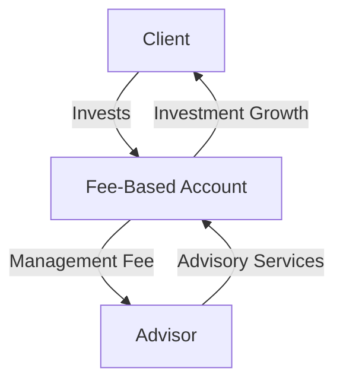

## 25.2 Advantages of Fee-Based Accounts

In the evolving landscape of financial advisory services, fee-based accounts have emerged as a preferred choice for many investors. These accounts offer a range of advantages that align the interests of financial advisors with those of their clients, fostering a relationship built on trust and transparency. This section delves into the primary benefits of fee-based accounts, highlighting how they reduce conflicts of interest, enhance transparency, and provide access to a broader array of investment opportunities.

### Reduced Conflict of Interest

One of the most significant advantages of fee-based accounts is the reduction of conflicts of interest. In traditional commission-based models, advisors might be incentivized to recommend products that offer higher commissions, potentially at the expense of the client's best interests. This scenario can lead to a misalignment between the advisor's financial incentives and the client's investment goals.

Fee-based accounts, however, charge a flat fee or a percentage of the assets under management (AUM), which aligns the advisor's compensation with the client's portfolio performance. This structure encourages advisors to focus on strategies that genuinely benefit the client, as their income is directly tied to the growth and success of the client's investments.

### Enhanced Transparency

Transparency is a cornerstone of the fee-based model. Clients are provided with clear and detailed disclosures of all fees associated with their accounts, eliminating hidden charges and unexpected costs. This openness fosters a sense of trust between clients and advisors, as clients can see exactly what they are paying for and how their advisor is compensated.

For example, a Canadian investor working with a fee-based advisor at a major bank like RBC can expect to receive a comprehensive breakdown of fees, including management fees, administrative costs, and any additional charges. This level of transparency allows clients to make informed decisions about their investments and ensures that they understand the value they are receiving from their advisor.

### Alignment of Advisor Incentives with Client Interests

The alignment of advisor incentives with client interests is another critical advantage of fee-based accounts. Since advisors earn a percentage of the assets they manage, they are motivated to grow the client's portfolio. This alignment encourages advisors to adopt a long-term perspective, focusing on sustainable growth and risk management rather than short-term gains.

Consider a scenario where a Canadian pension fund manager utilizes a fee-based structure. The manager's goal is to maximize the fund's returns while minimizing risk, ensuring that the pensioners receive stable and reliable income. This alignment of interests leads to investment strategies that prioritize the fund's long-term health over short-term profits.

### Increased Trust and Client Satisfaction

The combination of reduced conflicts of interest and enhanced transparency naturally leads to increased trust and client satisfaction. Clients feel more confident in their advisor's recommendations, knowing that their advisor's success is tied to their own. This trust is further reinforced by the clear communication of fees and the advisor's commitment to acting in the client's best interests.

A study conducted by a Canadian financial institution found that clients with fee-based accounts reported higher levels of satisfaction and trust in their advisors compared to those with commission-based accounts. This trust translates into stronger client-advisor relationships and higher client retention rates.

### Access to a Broader Range of Investment Options

Fee-based accounts often provide clients with access to a wider array of investment options and diversification opportunities. Advisors are not limited to recommending products that offer commissions, allowing them to explore a broader range of investment vehicles, including mutual funds, ETFs, and alternative investments.

For instance, a fee-based advisor at TD Bank might recommend a diversified portfolio that includes Canadian equities, international bonds, and alternative assets such as real estate investment trusts (REITs). This diversified approach helps clients achieve their financial goals while managing risk effectively.

### Practical Example: Implementing a Fee-Based Strategy

To illustrate the practical application of fee-based accounts, consider the following example:

A Canadian investor, Jane, decides to work with a fee-based advisor to manage her retirement savings. Her advisor charges a 1% annual fee based on the assets under management. Jane's portfolio includes a mix of Canadian and international stocks, bonds, and alternative investments.

Over the course of a year, Jane's portfolio grows by 8%. Her advisor's fee is calculated as 1% of the total portfolio value, aligning the advisor's compensation with Jane's investment performance. This structure incentivizes the advisor to continue optimizing Jane's portfolio for growth and risk management, ensuring that both parties benefit from the portfolio's success.

### Diagram: Fee-Based Account Structure

Below is a diagram illustrating the flow of a fee-based account structure:

### Best Practices and Common Pitfalls

While fee-based accounts offer numerous advantages, it is essential to be aware of best practices and potential challenges:

- **Best Practices:**
  - Ensure clear communication of all fees and services provided.
  - Regularly review and adjust investment strategies to align with client goals.
  - Maintain transparency in all client interactions.

- **Common Pitfalls:**
  - Failing to disclose all fees can erode trust.
  - Overlooking the importance of regular portfolio reviews may lead to suboptimal performance.

### Glossary

- **Conflict of Interest:** Situations where advisors might prioritize their own financial gain over clients’ best interests.
- **Transparency:** Openness in disclosing fee structures and investment strategies to clients.

### Additional Resources

For those interested in exploring fee-based accounts further, consider the following resources:

- **Books:**
  - *The Honest Advisor* by Michael Kitces
- **Online Courses:**
  - Fee-Based Advisory Strategies on Coursera

By understanding the advantages of fee-based accounts, investors can make informed decisions that align with their financial goals and foster a trusting relationship with their advisors.

### **Ready to Test Your Knowledge?**

**Practice 10 Essential CSC Exam Questions to Master Your Certification**



### What is a primary advantage of fee-based accounts?

- [x] Reduced conflict of interest
- [ ] Higher commission rates
- [ ] Limited investment options
- [ ] Increased hidden fees

> **Explanation:** Fee-based accounts reduce conflicts of interest by aligning advisor compensation with client portfolio performance.

### How do fee-based accounts enhance transparency?

- [x] By providing clear fee disclosures
- [ ] By offering higher returns
- [ ] By limiting investment choices
- [ ] By increasing commission rates

> **Explanation:** Fee-based accounts enhance transparency through clear and detailed disclosures of all fees associated with the account.

### What motivates advisors in a fee-based account structure?

- [x] Growth of the client's portfolio
- [ ] Selling high-commission products
- [ ] Reducing client assets
- [ ] Increasing transaction frequency

> **Explanation:** Advisors are motivated to grow the client's portfolio as their compensation is tied to the assets under management.

### What is a common pitfall of fee-based accounts?

- [x] Failing to disclose all fees
- [ ] Offering too many investment options
- [ ] Charging high commissions
- [ ] Providing limited advisory services

> **Explanation:** Failing to disclose all fees can erode trust between the client and advisor.

### Which of the following is a benefit of fee-based accounts?

- [x] Access to a broader range of investment options
- [ ] Higher transaction fees
- [x] Enhanced client trust
- [ ] Limited transparency

> **Explanation:** Fee-based accounts provide access to a broader range of investment options and enhance client trust through transparency.

### What is the role of transparency in fee-based accounts?

- [x] To build trust with clients
- [ ] To increase transaction fees
- [ ] To limit investment options
- [ ] To reduce advisor compensation

> **Explanation:** Transparency builds trust with clients by clearly disclosing all fees and investment strategies.

### How do fee-based accounts align advisor incentives with client interests?

- [x] By tying compensation to portfolio performance
- [ ] By offering higher commissions
- [x] By focusing on long-term growth
- [ ] By limiting investment choices

> **Explanation:** Fee-based accounts align incentives by tying advisor compensation to portfolio performance and focusing on long-term growth.

### What is a best practice for fee-based advisors?

- [x] Regularly reviewing investment strategies
- [ ] Charging hidden fees
- [ ] Limiting client communication
- [ ] Prioritizing high-commission products

> **Explanation:** Regularly reviewing investment strategies ensures alignment with client goals and optimal portfolio performance.

### What is a key feature of fee-based accounts?

- [x] Clear fee disclosures
- [ ] High transaction costs
- [ ] Limited investment options
- [ ] Increased advisor commissions

> **Explanation:** Clear fee disclosures are a key feature of fee-based accounts, enhancing transparency and trust.

### Fee-based accounts typically offer a broader range of investment options than commission-based accounts.

- [x] True
- [ ] False

> **Explanation:** Fee-based accounts often provide access to a wider array of investment options, as advisors are not limited to recommending products that offer commissions.


