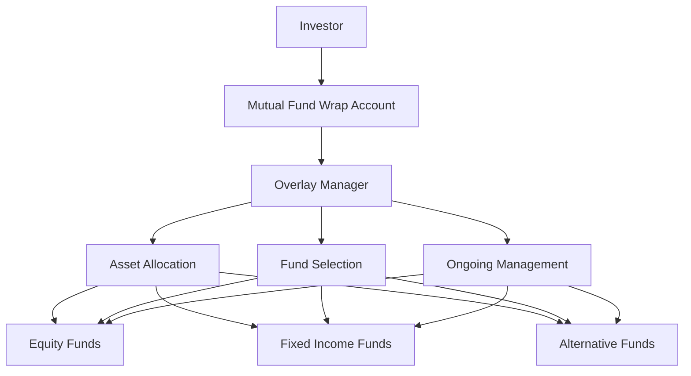

## 25.7 Mutual Fund Wraps

Mutual fund wraps have become an increasingly popular investment vehicle for Canadian investors seeking a comprehensive and managed approach to their portfolios. This section delves into the structure, benefits, and management of mutual fund wraps, distinguishing them from similar investment products like funds of funds. We will explore the critical role of overlay managers, the advantages of mutual fund wraps, and provide practical examples to illustrate their application in real-world scenarios.

### Understanding Mutual Fund Wraps

A mutual fund wrap account is a professionally managed investment portfolio that combines multiple mutual funds into a single, cohesive investment strategy. Unlike a fund of funds, which invests in a collection of mutual funds and charges an additional layer of fees, a mutual fund wrap account typically offers a more integrated approach with a focus on personalized asset allocation and active management.

#### Key Differences from Funds of Funds

- **Fee Structure:** Mutual fund wraps often have a more transparent fee structure, with fees based on the overall assets under management rather than additional layers of fees typical in funds of funds.
- **Customization:** Wrap accounts allow for greater customization in asset allocation and investment strategy, tailored to the investor's risk tolerance and financial goals.
- **Management Approach:** While funds of funds rely on the performance of underlying funds, wrap accounts benefit from active oversight by an overlay manager who adjusts the portfolio as needed.

### The Role of Overlay Managers

Overlay managers are pivotal in the management of mutual fund wrap accounts. They are responsible for the overall strategy and management, ensuring that the portfolio aligns with the client's investment objectives. Their duties include:

- **Asset Allocation:** Determining the optimal mix of asset classes to achieve the desired balance of risk and return.
- **Fund Selection:** Choosing the individual mutual funds that best fit the portfolio's strategy, considering factors such as performance history, management style, and fees.
- **Ongoing Management:** Continuously monitoring the portfolio and making adjustments to respond to market changes, economic conditions, and shifts in the client's financial situation.

### Advantages of Mutual Fund Wraps

Mutual fund wraps offer several advantages that make them an attractive option for investors seeking a managed investment solution:

1. **Optimized Asset Allocation:** By leveraging the expertise of overlay managers, mutual fund wraps provide a strategic asset allocation that aligns with the investor's goals and risk tolerance.

2. **Currency Hedging Options:** For Canadian investors with exposure to international markets, mutual fund wraps can include currency hedging strategies to mitigate the impact of currency fluctuations on investment returns.

3. **Ongoing Fund Oversight:** Continuous monitoring and rebalancing by overlay managers ensure that the portfolio remains aligned with the investor's objectives, adapting to market conditions and economic changes.

4. **Simplified Reporting:** Investors receive consolidated statements that provide a clear overview of their entire portfolio, simplifying the tracking of performance and fees.

### Practical Example: Canadian Pension Fund Strategy

Consider a Canadian pension fund that utilizes a mutual fund wrap account to manage its diversified investment portfolio. The overlay manager selects a mix of equity, fixed income, and alternative investment mutual funds to achieve a balanced risk-return profile. By incorporating currency hedging strategies, the pension fund mitigates the impact of foreign exchange volatility on its international investments. The ongoing oversight by the overlay manager ensures that the portfolio remains aligned with the pension fund's long-term objectives, adapting to changes in the economic landscape.

### Diagram: Structure of a Mutual Fund Wrap Account

Below is a diagram illustrating the structure of a mutual fund wrap account, highlighting the role of the overlay manager and the flow of investments.

### Best Practices and Common Pitfalls

**Best Practices:**
- **Regular Reviews:** Investors should regularly review their mutual fund wrap accounts with their financial advisors to ensure alignment with their financial goals.
- **Understanding Fees:** It's crucial to understand the fee structure and how it impacts overall returns.
- **Risk Assessment:** Regularly assess risk tolerance and adjust the portfolio accordingly.

**Common Pitfalls:**
- **Overlooking Fees:** Ignoring the impact of fees on long-term returns can significantly affect investment outcomes.
- **Inadequate Diversification:** Failing to diversify across asset classes and geographies can increase risk.
- **Neglecting Rebalancing:** Not rebalancing the portfolio in response to market changes can lead to unintended risk exposure.

### Glossary

- **Overlay Manager:** The portfolio manager responsible for the overall strategy and management of a mutual fund wrap account.

### Additional Resources

- **Articles:**
  - "Understanding Mutual Fund Wraps" by Canadian Mutual Fund Review
- **Regulations:**
  - CSA Guidelines on Mutual Fund Wraps

### Conclusion

Mutual fund wraps offer a sophisticated investment solution for Canadian investors seeking a managed approach to their portfolios. By leveraging the expertise of overlay managers, these accounts provide optimized asset allocation, currency hedging options, and ongoing oversight, making them a valuable tool for achieving financial goals. As with any investment, understanding the structure, fees, and management approach is crucial to maximizing returns and minimizing risks.

### **Ready to Test Your Knowledge?**

**Practice 10 Essential CSC Exam Questions to Master Your Certification**



### What is a mutual fund wrap account?

- [x] A professionally managed investment portfolio combining multiple mutual funds into a single strategy.
- [ ] A single mutual fund investing in various asset classes.
- [ ] An account that only invests in Canadian equities.
- [ ] A type of savings account with fixed interest rates.

> **Explanation:** A mutual fund wrap account is a managed portfolio that integrates multiple mutual funds into a cohesive investment strategy.

### How do mutual fund wraps differ from funds of funds?

- [x] They offer a more integrated approach with personalized asset allocation.
- [ ] They have higher fees than funds of funds.
- [ ] They invest only in international markets.
- [ ] They do not require active management.

> **Explanation:** Mutual fund wraps provide a more integrated and personalized approach compared to funds of funds, with active management and tailored asset allocation.

### What is the role of an overlay manager?

- [x] To manage the overall strategy and asset allocation of a mutual fund wrap account.
- [ ] To invest only in fixed income securities.
- [ ] To provide tax advice to investors.
- [ ] To manage individual stock portfolios.

> **Explanation:** An overlay manager is responsible for the overall strategy, asset allocation, and management of a mutual fund wrap account.

### Which of the following is an advantage of mutual fund wraps?

- [x] Optimized asset allocation.
- [ ] Guaranteed returns.
- [ ] No management fees.
- [ ] Limited investment options.

> **Explanation:** Mutual fund wraps offer optimized asset allocation, which is a key advantage for investors seeking a managed investment solution.

### What is a common pitfall when investing in mutual fund wraps?

- [x] Overlooking the impact of fees on long-term returns.
- [ ] Investing in too many asset classes.
- [ ] Having too much diversification.
- [ ] Only investing in domestic markets.

> **Explanation:** Overlooking fees can significantly impact long-term returns, making it a common pitfall for investors.

### What is a key benefit of currency hedging in mutual fund wraps?

- [x] It mitigates the impact of currency fluctuations on investment returns.
- [ ] It guarantees higher returns.
- [ ] It eliminates all investment risks.
- [ ] It increases the portfolio's exposure to foreign markets.

> **Explanation:** Currency hedging helps mitigate the impact of currency fluctuations, protecting investment returns from foreign exchange volatility.

### Why is ongoing fund oversight important in mutual fund wraps?

- [x] To ensure the portfolio remains aligned with the investor's objectives.
- [ ] To guarantee fixed returns.
- [ ] To eliminate the need for rebalancing.
- [ ] To reduce the number of funds in the portfolio.

> **Explanation:** Ongoing oversight ensures that the portfolio adapts to market conditions and remains aligned with the investor's goals.

### What should investors regularly review in their mutual fund wrap accounts?

- [x] Alignment with financial goals and risk tolerance.
- [ ] Only the performance of individual funds.
- [ ] The number of funds in the portfolio.
- [ ] The historical performance of the stock market.

> **Explanation:** Regular reviews help ensure that the portfolio aligns with the investor's financial goals and risk tolerance.

### What is a best practice for managing mutual fund wrap accounts?

- [x] Regularly assessing risk tolerance and adjusting the portfolio.
- [ ] Investing only in high-risk funds.
- [ ] Avoiding diversification.
- [ ] Ignoring market changes.

> **Explanation:** Regularly assessing risk tolerance and adjusting the portfolio is a best practice for managing mutual fund wrap accounts effectively.

### True or False: Mutual fund wraps provide simplified reporting for investors.

- [x] True
- [ ] False

> **Explanation:** Mutual fund wraps offer simplified reporting, providing investors with a clear overview of their entire portfolio.


