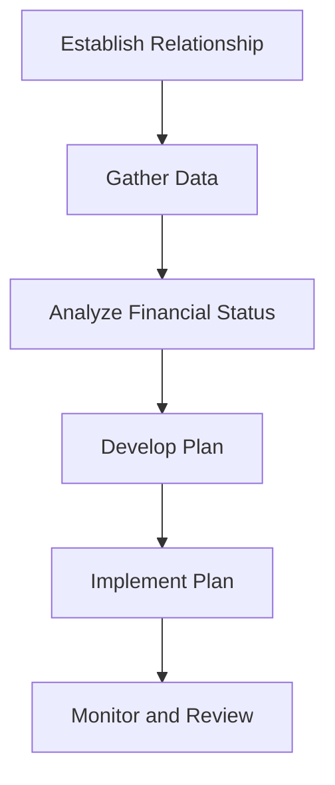

## Overview of Chapter 26

In Chapter 26, we delve into the intricacies of working with retail clients, focusing on the structured approach to financial planning tailored to individual needs. This chapter is designed to equip financial professionals with the knowledge and skills necessary to effectively guide clients through their financial journeys, emphasizing the importance of ethics and standards of conduct.

### Introduction to Financial Planning for Retail Clients

Financial planning is a comprehensive process that involves creating strategies to help clients achieve their financial goals. It is essential for financial advisors to understand the unique needs of retail clients and tailor their advice accordingly. This chapter provides a structured approach to financial planning, ensuring that advisors can offer personalized and effective solutions.

### The Financial Planning Process Stages

The financial planning process is typically divided into several stages, each corresponding to different phases of a client's life cycle. Understanding these stages is crucial for advisors to provide relevant and timely advice.

#### 1. **Establishing the Client-Advisor Relationship**

The first step in financial planning is to establish a strong relationship with the client. This involves understanding their financial goals, risk tolerance, and personal circumstances. Building trust is paramount, and this is achieved through open communication and transparency.

#### 2. **Gathering Client Data and Determining Goals**

Once the relationship is established, the next step is to gather detailed information about the client's financial situation. This includes income, expenses, assets, liabilities, and any existing financial plans. Advisors should also work with clients to clearly define their financial goals, both short-term and long-term.

#### 3. **Analyzing and Evaluating the Client’s Financial Status**

With the data collected, advisors can analyze the client's current financial status. This involves assessing their cash flow, net worth, and investment portfolio. Advisors should identify any gaps or areas for improvement and evaluate the feasibility of the client's goals.

#### 4. **Developing and Presenting Financial Plan Recommendations**

Based on the analysis, advisors develop a comprehensive financial plan tailored to the client's needs. This plan should include specific recommendations for investments, savings, insurance, and retirement planning. Advisors must present these recommendations clearly and ensure that clients understand the proposed strategies.

#### 5. **Implementing the Financial Plan**

Once the client agrees to the recommendations, the next step is implementation. Advisors should assist clients in executing the plan, which may involve opening new accounts, purchasing investments, or adjusting existing portfolios.

#### 6. **Monitoring and Reviewing the Financial Plan**

Financial planning is an ongoing process. Advisors must regularly review and update the financial plan to reflect changes in the client's circumstances or market conditions. This ensures that the plan remains aligned with the client's goals.

### The Life Cycle Hypothesis

The Life Cycle Hypothesis is a theory that suggests individuals plan their consumption and savings behavior over their life cycle. This concept is crucial for financial advisors as it helps them understand how clients' financial needs and strategies evolve over time.

#### **Early Career Stage**

In the early career stage, clients typically focus on building their careers and establishing a financial foundation. Advisors should emphasize budgeting, debt management, and the importance of starting to save for retirement early.

#### **Mid-Career Stage**

During the mid-career stage, clients often experience increased income and may have more complex financial needs. Advisors should focus on optimizing investment strategies, tax planning, and preparing for major life events such as buying a home or funding children's education.

#### **Pre-Retirement Stage**

As clients approach retirement, the focus shifts to ensuring financial security in retirement. Advisors should help clients maximize retirement savings, evaluate pension options, and develop a retirement income strategy.

#### **Retirement Stage**

In retirement, clients need to manage their assets to ensure they can sustain their lifestyle. Advisors should focus on income distribution strategies, estate planning, and managing healthcare costs.

### Importance of Ethics and Standards of Conduct

Ethics and standards of conduct are the foundation of a successful client-advisor relationship. Adhering to ethical principles and professional standards is crucial for building trust and maintaining long-term relationships with clients.

#### **Ethical Principles**

Ethical principles in financial planning include integrity, objectivity, competence, fairness, confidentiality, professionalism, and diligence. Advisors must prioritize their clients' interests and provide honest and transparent advice.

#### **Standards of Conduct**

Standards of conduct are prescribed guidelines and rules that professionals must follow to ensure ethical and responsible behavior. In Canada, financial advisors must adhere to regulations set by organizations such as the Canadian Investment Regulatory Organization (CIRO) and provincial regulatory bodies.

### Personal Circumstances and Life Stages Influence Investment Needs

Personal circumstances and life stages significantly influence a client's investment needs and strategies. Advisors must consider factors such as age, income, family situation, and risk tolerance when developing financial plans.

#### **Case Study: Canadian Pension Fund Strategy**

Consider a Canadian pension fund that adjusts its investment strategy based on the demographics of its members. Younger members may have a higher allocation to equities for growth, while older members may shift towards bonds for stability. This approach ensures that the fund meets the diverse needs of its members throughout their life cycles.

### Practical Examples and Real-World Scenarios

To illustrate the concepts discussed, let's explore a practical example involving a retail client:

#### **Scenario: Planning for Retirement**

John, a 45-year-old engineer, seeks advice on planning for retirement. He has a stable income, a mortgage, and two children. His goals include paying off his mortgage, funding his children's education, and retiring comfortably at 65.

**Step-by-Step Guidance:**

1. **Establish Relationship:** Build rapport with John and understand his financial goals and concerns.
2. **Gather Data:** Collect information on John's income, expenses, assets, liabilities, and existing retirement savings.
3. **Analyze Financial Status:** Evaluate John's cash flow, net worth, and investment portfolio.
4. **Develop Plan:** Recommend strategies for debt reduction, education savings plans, and retirement account contributions.
5. **Implement Plan:** Assist John in setting up automatic contributions to his RRSP and RESP.
6. **Monitor Plan:** Schedule annual reviews to adjust the plan as needed based on changes in John's circumstances or market conditions.

### Diagrams and Visual Aids

To enhance understanding, let's use a diagram to illustrate the financial planning process:

### Best Practices and Common Pitfalls

**Best Practices:**

- Maintain open communication with clients.
- Stay informed about changes in financial regulations.
- Continuously update your knowledge and skills.

**Common Pitfalls:**

- Failing to tailor advice to individual client needs.
- Neglecting to review and update financial plans regularly.
- Overlooking the importance of ethics and standards of conduct.

### References and Additional Resources

For further exploration, consider the following resources:

- **Books:** "The Wealthy Barber" by David Chilton, "Financial Planning for Canadians" by John E. Grable.
- **Articles:** "Understanding the Life Cycle Hypothesis" in the Journal of Economic Perspectives.
- **Online Courses:** "Financial Planning Fundamentals" on Coursera, "Ethics in Finance" on edX.

### Conclusion

Chapter 26 provides a comprehensive overview of working with retail clients, emphasizing the importance of a structured financial planning process and adherence to ethical standards. By understanding the unique needs of clients and tailoring advice accordingly, financial advisors can build lasting relationships and help clients achieve their financial goals.

### **Ready to Test Your Knowledge?**

**Practice 10 Essential CSC Exam Questions to Master Your Certification**



### What is the first step in the financial planning process?

- [x] Establishing the client-advisor relationship
- [ ] Gathering client data
- [ ] Analyzing the client's financial status
- [ ] Developing financial plan recommendations

> **Explanation:** Establishing the client-advisor relationship is the first step, as it sets the foundation for understanding the client's needs and building trust.

### Which theory helps understand how clients' financial needs evolve over time?

- [x] Life Cycle Hypothesis
- [ ] Efficient Market Hypothesis
- [ ] Modern Portfolio Theory
- [ ] Behavioral Finance Theory

> **Explanation:** The Life Cycle Hypothesis explains how individuals plan their consumption and savings behavior over their life cycle.

### What is a key ethical principle in financial planning?

- [x] Integrity
- [ ] Profitability
- [ ] Aggressiveness
- [ ] Exclusivity

> **Explanation:** Integrity is a fundamental ethical principle, ensuring honesty and transparency in client interactions.

### What should advisors focus on during the pre-retirement stage?

- [x] Maximizing retirement savings
- [ ] Building an emergency fund
- [ ] Increasing debt
- [ ] Speculative investments

> **Explanation:** During the pre-retirement stage, the focus is on maximizing retirement savings to ensure financial security in retirement.

### Which organization sets standards of conduct for financial advisors in Canada?

- [x] Canadian Investment Regulatory Organization (CIRO)
- [ ] Securities and Exchange Commission (SEC)
- [ ] Financial Conduct Authority (FCA)
- [ ] International Monetary Fund (IMF)

> **Explanation:** The Canadian Investment Regulatory Organization (CIRO) sets standards of conduct for financial advisors in Canada.

### What is a common pitfall in financial planning?

- [x] Failing to tailor advice to individual client needs
- [ ] Regularly reviewing financial plans
- [ ] Maintaining open communication
- [ ] Adhering to ethical standards

> **Explanation:** Failing to tailor advice to individual client needs is a common pitfall that can lead to ineffective financial planning.

### What should advisors do to ensure plans remain aligned with client goals?

- [x] Regularly review and update the financial plan
- [ ] Ignore changes in market conditions
- [ ] Focus solely on short-term goals
- [ ] Avoid client communication

> **Explanation:** Regularly reviewing and updating the financial plan ensures it remains aligned with the client's goals and circumstances.

### What is an example of a financial planning tool used in Canada?

- [x] RRSP (Registered Retirement Savings Plan)
- [ ] 401(k)
- [ ] ISA (Individual Savings Account)
- [ ] Superannuation

> **Explanation:** The RRSP is a Canadian financial planning tool used to save for retirement with tax advantages.

### What is the purpose of implementing a financial plan?

- [x] To execute the agreed-upon strategies
- [ ] To gather client data
- [ ] To establish the client-advisor relationship
- [ ] To analyze the client's financial status

> **Explanation:** Implementing a financial plan involves executing the strategies agreed upon with the client to achieve their financial goals.

### True or False: Ethics and standards of conduct are optional in financial planning.

- [ ] True
- [x] False

> **Explanation:** Ethics and standards of conduct are essential in financial planning to build trust and maintain professional relationships.


