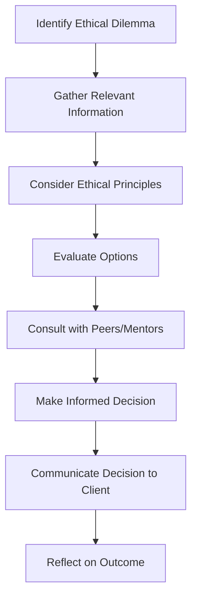

## 26.13 Review of Ethics

In the realm of financial advising, ethics serve as the cornerstone of professional practice. This section delves into the essential ethical principles that guide financial advisors, emphasizing the critical role these principles play in fostering and maintaining client trust. By understanding and applying these ethical standards, advisors can not only enhance their professional integrity but also ensure the long-term success of their client relationships.

### Key Ethical Principles in Financial Advising

Ethical principles in financial advising are designed to ensure that advisors act in the best interests of their clients. These principles include:

1. **Integrity**: Financial advisors must demonstrate honesty and transparency in all dealings. This involves providing accurate information and avoiding any actions that could mislead clients.

2. **Objectivity**: Advisors should offer unbiased advice, free from conflicts of interest. This requires a thorough understanding of the client's needs and objectives, ensuring that recommendations are based solely on the client's best interests.

3. **Competence**: Maintaining a high level of knowledge and skill is crucial. Advisors must stay informed about the latest developments in financial markets, products, and regulations to provide sound advice.

4. **Confidentiality**: Protecting client information is paramount. Advisors must ensure that all client data is handled with the utmost care and only shared with authorized parties.

5. **Fairness**: Treating all clients with respect and equity is essential. Advisors should ensure that their services are accessible and that all clients receive the same level of attention and care.

6. **Professionalism**: Advisors should conduct themselves in a manner that reflects positively on the profession. This includes adhering to industry standards and codes of conduct.

### Building and Sustaining Client Trust

Client trust is the foundation of a successful financial advising practice. To build and sustain this trust, advisors must consistently demonstrate ethical behavior. Here are some strategies to achieve this:

- **Transparent Communication**: Clearly explain financial products, strategies, and potential risks to clients. This transparency helps clients make informed decisions and reinforces their trust in the advisor's guidance.

- **Regular Updates**: Keep clients informed about changes in their portfolios and the market. Regular communication shows that the advisor is actively managing the client's interests.

- **Responsive Service**: Address client inquiries and concerns promptly. Being responsive demonstrates that the advisor values the client's needs and is committed to providing excellent service.

- **Ethical Decision-Making**: When faced with ethical dilemmas, advisors should consider the potential impact on the client and the advisor-client relationship. Seeking guidance from industry codes of ethics or consulting with peers can help navigate complex situations.

### Strategies for Continuous Ethical Improvement

Ethical improvement is an ongoing process that requires dedication and self-reflection. Advisors can enhance their ethical understanding and application through the following strategies:

- **Continuing Education**: Participate in workshops, seminars, and courses focused on ethics in financial advising. This ongoing education helps advisors stay current with ethical standards and best practices.

- **Peer Discussions**: Engage in discussions with colleagues about ethical challenges and solutions. Sharing experiences and insights can provide valuable perspectives and foster a culture of ethical awareness.

- **Self-Assessment**: Regularly evaluate personal ethical standards and practices. Identifying areas for improvement can lead to more effective and ethical client interactions.

- **Mentorship**: Seek guidance from experienced professionals who can provide advice and support in navigating ethical dilemmas.

### Practical Example: Ethical Dilemma in Financial Advising

Consider a scenario where a financial advisor at a major Canadian bank, such as RBC, is approached by a client interested in a high-risk investment product. The advisor knows that the product could potentially yield high returns but also carries significant risk that may not align with the client's risk tolerance and financial goals.

In this situation, the advisor must weigh the potential benefits against the ethical obligation to act in the client's best interest. By adhering to the principles of integrity and objectivity, the advisor should provide a balanced view of the product, highlighting both the risks and potential rewards, and ultimately recommend a strategy that aligns with the client's financial objectives and risk appetite.

### Diagram: Ethical Decision-Making Process

Below is a diagram illustrating the ethical decision-making process for financial advisors:

### Glossary

- **Ethical Improvement**: Ongoing efforts to enhance ethical understanding and application in professional practice.
- **Client Trust**: The confidence clients have in their advisor’s integrity and competence.

### Resources for Further Exploration

- **Book**: *Building Trust with Clients* by Robert J. Beshar
- **Online Resource**: [Ethics in Financial Planning](https://www.plannersearch.com/articles/ethics-in-financial-planning)

By integrating these ethical principles and strategies into their practice, financial advisors can build stronger, more trusting relationships with their clients, ultimately leading to greater client satisfaction and business success.

### **Ready to Test Your Knowledge?**

**Practice 10 Essential CSC Exam Questions to Master Your Certification**



### Which of the following is a key ethical principle in financial advising?

- [x] Integrity
- [ ] Profit Maximization
- [ ] Risk Aversion
- [ ] Market Timing

> **Explanation:** Integrity involves honesty and transparency, which are crucial in financial advising.

### What is the primary goal of maintaining high ethical standards in financial advising?

- [x] To build and sustain client trust
- [ ] To increase sales
- [ ] To reduce costs
- [ ] To comply with tax regulations

> **Explanation:** High ethical standards help build and sustain client trust, which is essential for long-term success.

### Which strategy can help financial advisors continuously improve their ethical standards?

- [x] Continuing Education
- [ ] Ignoring feedback
- [ ] Focusing solely on profits
- [ ] Avoiding difficult conversations

> **Explanation:** Continuing education keeps advisors updated on ethical standards and best practices.

### What should a financial advisor do when faced with an ethical dilemma?

- [x] Consider the potential impact on the client
- [ ] Make a decision based on personal gain
- [ ] Ignore the dilemma
- [ ] Consult only with clients

> **Explanation:** Considering the impact on the client ensures decisions are made in their best interest.

### How can financial advisors demonstrate transparency to clients?

- [x] Clearly explaining financial products and risks
- [ ] Withholding information
- [ ] Making decisions without client input
- [ ] Focusing on complex jargon

> **Explanation:** Transparency involves clear communication about products and risks.

### What is the role of confidentiality in financial advising?

- [x] Protecting client information
- [ ] Sharing client data with competitors
- [ ] Using client data for marketing
- [ ] Ignoring client privacy

> **Explanation:** Confidentiality ensures client information is protected and only shared with authorized parties.

### Which of the following is a benefit of regular communication with clients?

- [x] Reinforces trust and shows active management
- [ ] Reduces workload
- [ ] Increases complexity
- [ ] Limits client engagement

> **Explanation:** Regular communication reinforces trust and shows clients that their interests are actively managed.

### What is a potential outcome of ethical decision-making in financial advising?

- [x] Stronger client relationships
- [ ] Increased regulatory scrutiny
- [ ] Higher client turnover
- [ ] Reduced client satisfaction

> **Explanation:** Ethical decision-making leads to stronger client relationships and trust.

### How can peer discussions aid in ethical improvement?

- [x] By providing valuable perspectives and insights
- [ ] By creating competition
- [ ] By reducing collaboration
- [ ] By focusing on individual gain

> **Explanation:** Peer discussions offer valuable insights and foster a culture of ethical awareness.

### True or False: Ethical improvement is a one-time effort.

- [ ] True
- [x] False

> **Explanation:** Ethical improvement is an ongoing process that requires continuous effort and dedication.


