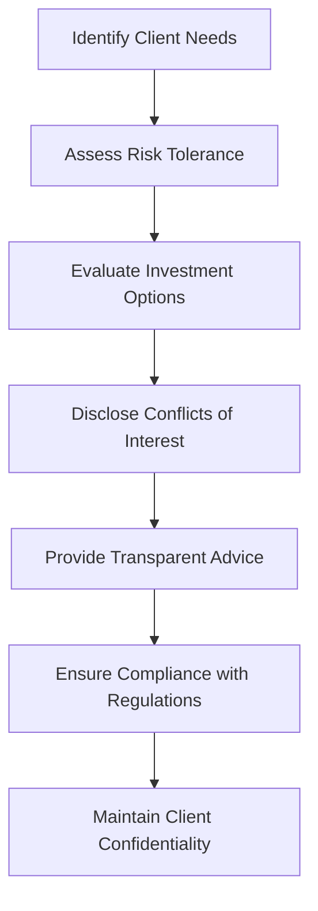

## 26.3 Ethics and the Advisor’s Standards of Conduct

In the realm of financial advising, ethics play a pivotal role in establishing and maintaining trust with retail clients. As a financial advisor, your conduct not only reflects on your personal reputation but also on the integrity of the entire financial services industry. This section delves into the principles of ethical decision-making and the standards of conduct that guide professional behavior in financial advising, particularly within the Canadian context.

### The Role of Ethics in Financial Advising

Ethics are the foundation upon which trust is built between advisors and clients. Trust is essential in financial advising because clients rely on advisors to manage their financial futures. Ethical behavior fosters confidence and ensures that clients feel secure in the knowledge that their advisor is acting in their best interests.

#### Principles of Ethical Decision-Making

Ethical decision-making in financial advising involves integrating several key principles into every client interaction:

- **Trust:** Building and maintaining trust requires consistent ethical behavior and transparency.
- **Integrity:** Acting with honesty and transparency in all dealings ensures that advisors are seen as reliable and trustworthy.
- **Justice and Fairness:** Treating all clients equitably and ensuring that advice is unbiased and impartial.
- **Honesty:** Providing truthful and accurate information to clients, avoiding misleading statements or omissions.
- **Responsibility:** Taking accountability for one's actions and decisions, and ensuring that client interests are prioritized.
- **Reliability:** Being dependable and consistent in delivering on promises and commitments.

### Five Primary Values Underpinning Ethical Behavior

The securities industry is guided by five primary values that underpin ethical behavior:

1. **Duty of Care:** Advisors must commit to understanding and prioritizing client needs. This involves conducting thorough assessments of a client's financial situation, goals, and risk tolerance before making recommendations.

2. **Integrity:** Advisors should act honestly and transparently in all dealings. This includes disclosing any conflicts of interest and ensuring that all advice is in the client's best interest.

3. **Professionalism:** Maintaining expertise and competence is crucial. Advisors should engage in continuous learning to stay updated on industry trends, regulations, and financial products.

4. **Compliance:** Adhering to laws, regulations, and industry standards is non-negotiable. Advisors must be familiar with Canadian regulatory bodies such as the Canadian Investment Regulatory Organization (CIRO) and ensure compliance with all relevant regulations.

5. **Confidentiality:** Protecting client information and privacy is paramount. Advisors must ensure that all client data is securely stored and only shared with authorized parties.

### Applying Ethical Standards in Client Scenarios

Applying ethical standards in various client scenarios ensures that advice is responsible and fair. Consider the following examples:

- **Scenario 1:** A client is interested in a high-risk investment. An ethical advisor would assess the client's risk tolerance and financial situation before recommending such an investment, ensuring that it aligns with the client's goals and risk profile.

- **Scenario 2:** A client asks about a financial product that offers high commissions to the advisor. An ethical advisor would disclose this potential conflict of interest and provide unbiased information about the product's suitability for the client.

- **Scenario 3:** A client shares sensitive financial information. An ethical advisor would ensure that this information is kept confidential and only used for the purpose of providing financial advice.

### Beyond Rule Compliance: Ethical Behavior Driven by Moral Principles

While compliance with laws and regulations is essential, true ethical behavior goes beyond mere rule-following. It involves a commitment to moral principles that guide decision-making and client interactions. Advisors should strive to embody these principles in all aspects of their professional conduct.

### Practical Example: Ethical Decision-Making in Action

Consider a scenario involving a Canadian pension fund manager who must decide whether to invest in a new financial product. The manager must evaluate the product's alignment with the fund's investment strategy, assess the potential risks and returns, and consider the ethical implications of the investment. By applying the principles of duty of care, integrity, and professionalism, the manager can make a decision that serves the best interests of the fund's beneficiaries.

### Diagrams and Visual Aids

To further illustrate the concepts discussed, consider the following diagram that outlines the ethical decision-making process for financial advisors:

This diagram highlights the step-by-step process advisors should follow to ensure ethical decision-making in client interactions.

### Best Practices, Common Pitfalls, and Challenges

**Best Practices:**
- Engage in continuous professional development to maintain expertise.
- Foster open and honest communication with clients.
- Regularly review and update compliance procedures.

**Common Pitfalls:**
- Failing to disclose conflicts of interest.
- Providing advice without fully understanding client needs.
- Neglecting to stay informed about regulatory changes.

**Challenges:**
- Balancing client interests with business objectives.
- Navigating complex regulatory environments.
- Maintaining client trust in the face of market volatility.

### Encouraging Continuous Learning and Application

Ethical behavior in financial advising is an ongoing commitment. Advisors should continuously seek to improve their understanding of ethical principles and apply them in their daily practice. By doing so, they can enhance their professional reputation and contribute to the integrity of the financial services industry.

### Additional Resources

For further exploration of ethics in financial advising, consider the following resources:

- **Books:** "The Trusted Advisor" by David H. Maister, Charles H. Green, and Robert M. Galford.
- **Online Courses:** Ethics in Finance courses offered by Canadian universities.
- **Regulatory Bodies:** Canadian Investment Regulatory Organization (CIRO) website for updates on regulations and compliance standards.

## Quiz Time!



### What is the primary role of ethics in financial advising?

- [x] To build and maintain trust with clients
- [ ] To increase sales and profits
- [ ] To comply with all legal regulations
- [ ] To reduce operational costs

> **Explanation:** Ethics are crucial in building and maintaining trust, which is essential for successful client-advisor relationships.

### Which principle involves acting honestly and transparently in all dealings?

- [ ] Duty of Care
- [x] Integrity
- [ ] Professionalism
- [ ] Confidentiality

> **Explanation:** Integrity involves acting honestly and transparently in all dealings.

### What does the Duty of Care require advisors to do?

- [x] Understand and prioritize client needs
- [ ] Maximize their own commissions
- [ ] Focus solely on high-risk investments
- [ ] Disregard client risk tolerance

> **Explanation:** Duty of Care requires advisors to understand and prioritize client needs, ensuring advice aligns with their goals and risk tolerance.

### Which value emphasizes maintaining expertise and competence?

- [ ] Integrity
- [ ] Confidentiality
- [x] Professionalism
- [ ] Compliance

> **Explanation:** Professionalism emphasizes maintaining expertise and competence in financial advising.

### What is essential for protecting client information and privacy?

- [ ] Duty of Care
- [ ] Integrity
- [ ] Professionalism
- [x] Confidentiality

> **Explanation:** Confidentiality is essential for protecting client information and privacy.

### How should advisors handle conflicts of interest?

- [x] Disclose them to clients
- [ ] Ignore them
- [ ] Prioritize personal gain
- [ ] Hide them from clients

> **Explanation:** Advisors should disclose conflicts of interest to clients to maintain transparency and trust.

### What is the difference between rule compliance and ethical behavior?

- [ ] Rule compliance is optional
- [x] Ethical behavior is driven by moral principles
- [ ] Rule compliance is more important
- [ ] Ethical behavior is only for senior advisors

> **Explanation:** Ethical behavior is driven by moral principles, going beyond mere rule compliance.

### Which regulatory body should Canadian advisors be familiar with?

- [ ] SEC
- [ ] FCA
- [x] CIRO
- [ ] FINRA

> **Explanation:** Canadian advisors should be familiar with the Canadian Investment Regulatory Organization (CIRO).

### What is a common pitfall in financial advising?

- [x] Failing to disclose conflicts of interest
- [ ] Providing transparent advice
- [ ] Understanding client needs
- [ ] Maintaining client confidentiality

> **Explanation:** Failing to disclose conflicts of interest is a common pitfall that can undermine trust.

### True or False: Ethical behavior in financial advising is a one-time commitment.

- [ ] True
- [x] False

> **Explanation:** Ethical behavior is an ongoing commitment that requires continuous learning and application.


