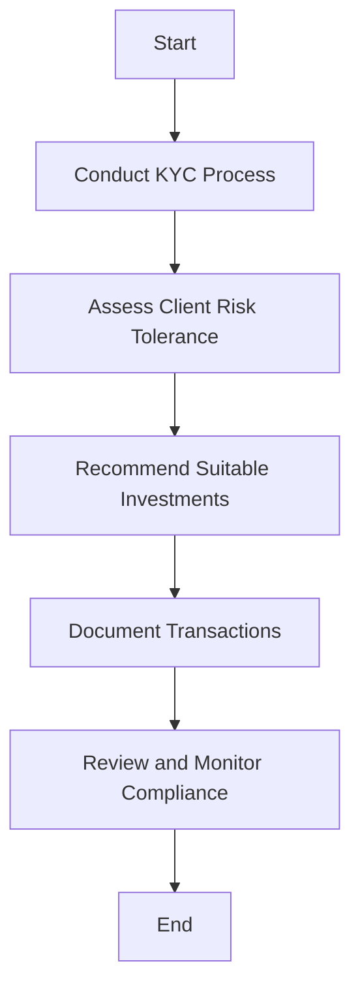

## 26.8 Compliance

In the dynamic world of Canadian securities, compliance is not just a legal obligation but a cornerstone of ethical and professional practice. This section delves into the importance of adhering to provincial securities laws and regulations, the role of Self-Regulatory Organizations (SROs) like the Investment Industry Regulatory Organization of Canada (IIROC), and the potential consequences of non-compliance. We will also explore practical strategies to ensure that all client transactions comply with legal requirements and firm policies.

### The Importance of Compliance

Compliance in the financial sector refers to the adherence to laws, regulations, and internal policies that govern professional conduct. In Canada, the securities industry is heavily regulated to protect investors, maintain fair markets, and reduce systemic risk. Compliance ensures that financial professionals operate within the legal framework, fostering trust and integrity in the financial markets.

#### Provincial Securities Laws

Each Canadian province has its own securities commission responsible for regulating the securities industry within its jurisdiction. These commissions establish rules and guidelines that financial professionals must follow. For example, the Ontario Securities Commission (OSC) and the British Columbia Securities Commission (BCSC) are pivotal in setting standards for market conduct, disclosure, and investor protection.

#### Self-Regulatory Organizations (SROs)

SROs like IIROC play a crucial role in the Canadian financial landscape. They have the authority to create and enforce industry regulations and standards. IIROC oversees all investment dealers and trading activity on debt and equity marketplaces in Canada. Compliance with IIROC's rules is mandatory for maintaining a license to operate in the securities industry.

### Consequences of Non-Compliance

Non-compliance with securities laws and SRO regulations can lead to severe consequences, including:

- **Fines:** Financial penalties can be imposed on individuals or firms for breaches of regulations.
- **Suspension:** Temporary suspension of licenses can occur, preventing professionals from conducting business.
- **Revocation of Licenses:** In severe cases, licenses can be permanently revoked, ending a professional's ability to work in the industry.

These consequences underscore the importance of maintaining rigorous compliance standards to avoid legal and financial repercussions.

### Ensuring Compliance in Client Transactions

Ensuring that all client transactions comply with legal requirements and firm policies is a fundamental aspect of a financial professional's role. Here are some strategies to achieve this:

#### 1. **Stay Informed**

Regularly update your knowledge of current laws and regulations. Attend workshops, seminars, and training sessions offered by regulatory bodies and industry associations.

#### 2. **Implement Robust Internal Controls**

Develop and maintain comprehensive internal policies and procedures that align with regulatory requirements. This includes regular audits and reviews to ensure adherence.

#### 3. **Utilize Technology**

Leverage compliance software and tools that automate monitoring and reporting processes. These tools can help identify potential compliance issues before they escalate.

#### 4. **Foster a Culture of Compliance**

Encourage a workplace culture that prioritizes ethical behavior and compliance. This involves training employees on the importance of compliance and the potential risks of non-compliance.

#### 5. **Document Everything**

Maintain detailed records of all client interactions and transactions. Proper documentation can serve as evidence of compliance in the event of an audit or investigation.

### Practical Example: Compliance in Action

Consider a scenario involving a Canadian investment advisor at a major bank like RBC. The advisor must ensure that all investment recommendations align with the client's risk tolerance and investment objectives. This involves conducting a thorough Know Your Client (KYC) process and documenting all interactions. By adhering to these compliance measures, the advisor not only protects the client but also mitigates the risk of regulatory penalties for the firm.

### Diagrams and Visual Aids

To further illustrate the compliance process, consider the following flowchart that outlines the steps involved in ensuring compliance in client transactions:

### Glossary

- **Compliance:** Adhering to laws, regulations, and internal policies governing professional conduct.
- **SRO (Self-Regulatory Organization):** An organization that has the power to create and enforce industry regulations and standards.

### Resources for Further Exploration

- [IIROC - Compliance Requirements](https://www.iiroc.ca/regulation-policy/compliance)
- Book: *Securities Law for Financial Professionals* by Stephen M. Shannon

### Conclusion

Compliance is a critical component of the Canadian securities industry, ensuring that financial professionals operate within a framework that protects investors and maintains market integrity. By understanding and adhering to provincial laws and SRO regulations, professionals can avoid the severe consequences of non-compliance and foster a culture of trust and ethical behavior.

### **Ready to Test Your Knowledge?**

**Practice 10 Essential CSC Exam Questions to Master Your Certification**



### What is the primary role of provincial securities commissions in Canada?

- [x] Regulating the securities industry within their jurisdiction
- [ ] Overseeing all investment dealers in Canada
- [ ] Setting international financial standards
- [ ] Managing the Canadian stock exchanges

> **Explanation:** Provincial securities commissions are responsible for regulating the securities industry within their respective jurisdictions.

### Which organization oversees investment dealers and trading activity in Canada?

- [ ] OSC
- [x] IIROC
- [ ] BCSC
- [ ] CSA

> **Explanation:** IIROC (Investment Industry Regulatory Organization of Canada) oversees investment dealers and trading activity in Canada.

### What can be a consequence of non-compliance with securities regulations?

- [x] Fines
- [x] Suspension
- [x] Revocation of licenses
- [ ] Promotion

> **Explanation:** Non-compliance can lead to fines, suspension, or revocation of licenses, but not promotion.

### What is a key strategy to ensure compliance in client transactions?

- [x] Conducting a thorough KYC process
- [ ] Ignoring client risk tolerance
- [ ] Avoiding documentation
- [ ] Relying solely on intuition

> **Explanation:** Conducting a thorough KYC process is essential for ensuring compliance in client transactions.

### What is the role of SROs like IIROC?

- [x] Creating and enforcing industry regulations
- [ ] Managing provincial securities commissions
- [ ] Setting global financial policies
- [ ] Conducting market research

> **Explanation:** SROs like IIROC create and enforce industry regulations and standards.

### What is a benefit of using compliance software?

- [x] Automating monitoring and reporting processes
- [ ] Eliminating the need for audits
- [ ] Reducing the need for employee training
- [ ] Guaranteeing compliance without oversight

> **Explanation:** Compliance software helps automate monitoring and reporting processes, making compliance more efficient.

### Why is fostering a culture of compliance important?

- [x] It prioritizes ethical behavior and compliance
- [ ] It reduces the need for documentation
- [ ] It eliminates the need for internal controls
- [ ] It guarantees financial success

> **Explanation:** Fostering a culture of compliance prioritizes ethical behavior and adherence to regulations.

### What should be documented to ensure compliance?

- [x] All client interactions and transactions
- [ ] Only successful transactions
- [ ] Only high-value transactions
- [ ] Only verbal agreements

> **Explanation:** Documenting all client interactions and transactions is crucial for ensuring compliance.

### What is the first step in the compliance process flowchart?

- [x] Conduct KYC Process
- [ ] Recommend Suitable Investments
- [ ] Document Transactions
- [ ] Review and Monitor Compliance

> **Explanation:** The first step in the compliance process flowchart is conducting the KYC process.

### True or False: Compliance is optional for financial professionals in Canada.

- [ ] True
- [x] False

> **Explanation:** Compliance is mandatory for financial professionals in Canada to ensure adherence to laws and regulations.


