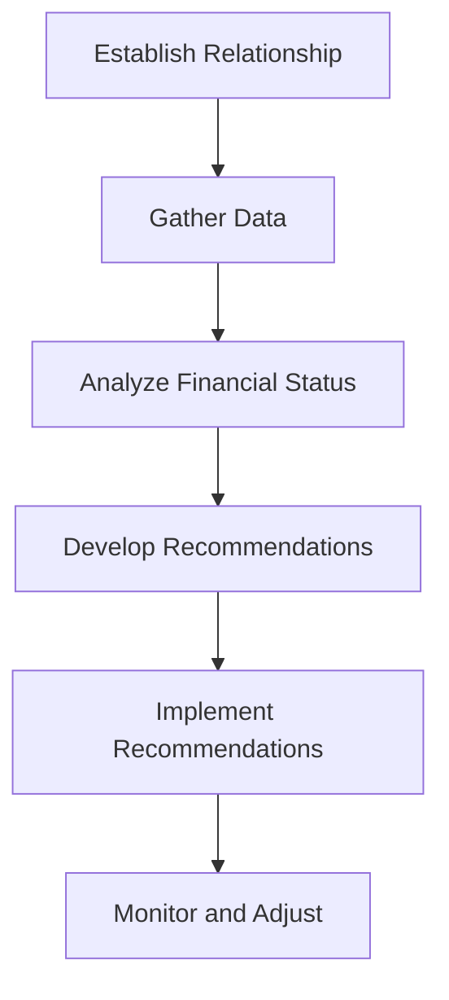

## Chapter 26: Working with the Retail Client

In the dynamic world of financial services, working effectively with retail clients requires a deep understanding of their unique needs and circumstances. This chapter delves into the structured financial planning approach, emphasizing the importance of tailoring strategies to the client's life cycle stage. We will explore the six-step financial planning process, apply the life cycle hypothesis, and underscore the significance of ethical decision-making to build and maintain trust with retail clients.

### Understanding the Structured Financial Planning Approach

Financial planning is not a one-size-fits-all endeavor. It requires a structured approach that considers the client's current life stage, financial goals, and risk tolerance. This approach ensures that the advice provided is relevant, comprehensive, and actionable.

#### Tailoring to the Client’s Life Cycle Stage

The life cycle stage of a client significantly influences their financial priorities and risk appetite. For instance, a young professional may prioritize saving for a home or paying off student loans, whereas a retiree might focus on preserving wealth and generating income. Understanding these stages allows financial advisors to tailor their strategies effectively.

**Key Life Cycle Stages:**

1. **Early Career:** Focus on debt management, emergency savings, and initial investments.
2. **Mid-Career:** Emphasize wealth accumulation, retirement planning, and education savings.
3. **Pre-Retirement:** Prioritize retirement income strategies, tax efficiency, and risk management.
4. **Retirement:** Concentrate on income sustainability, healthcare costs, and estate planning.

### Mastering the Six-Step Financial Planning Process

The six-step financial planning process is a cornerstone of delivering effective financial advice. This structured approach ensures that all aspects of a client's financial situation are considered, leading to comprehensive and personalized recommendations.

#### The Six Steps:

1. **Establishing and Defining the Client-Planner Relationship:**
   - Set clear expectations and define the scope of engagement.
   - Establish trust and open communication channels.

2. **Gathering Client Data and Determining Goals:**
   - Collect detailed financial information and understand the client's objectives.
   - Use questionnaires and interviews to gather qualitative and quantitative data.

3. **Analyzing and Evaluating the Client’s Financial Status:**
   - Assess the client's current financial situation, including assets, liabilities, income, and expenses.
   - Identify strengths, weaknesses, and potential opportunities.

4. **Developing and Presenting Financial Planning Recommendations:**
   - Create tailored strategies that align with the client's goals and risk tolerance.
   - Present recommendations clearly, using visual aids like charts and graphs for clarity.

5. **Implementing the Financial Planning Recommendations:**
   - Assist the client in executing the agreed-upon strategies.
   - Coordinate with other professionals, such as accountants or lawyers, if necessary.

6. **Monitoring the Financial Plan and Adjusting as Needed:**
   - Regularly review the plan's progress and make adjustments in response to changes in the client's life or economic conditions.
   - Maintain ongoing communication to ensure the plan remains relevant.

### Applying the Life Cycle Hypothesis

The life cycle hypothesis provides a framework for understanding how a client's investment needs and risk tolerance evolve over time. This theory suggests that individuals plan their consumption and savings behavior over their lifetime to achieve a smooth consumption pattern.

#### Key Concepts:

- **Consumption Smoothing:** Clients aim to maintain a stable standard of living throughout their life, adjusting savings and spending as needed.
- **Risk Tolerance:** Generally decreases with age as clients prioritize capital preservation over growth.
- **Investment Strategy:** Shifts from growth-oriented to income-focused as clients approach retirement.

**Example:** A young couple in their 30s might invest heavily in equities to maximize growth potential, while a couple in their 60s may shift towards bonds and dividend-paying stocks to ensure steady income.

### Embracing Ethical Decision-Making and Professional Standards

Ethical decision-making is paramount in financial planning. Adhering to professional standards not only builds trust with clients but also ensures compliance with regulatory requirements.

#### Key Ethical Principles:

1. **Integrity:** Always act in the client's best interest, maintaining honesty and transparency.
2. **Objectivity:** Provide unbiased advice based on thorough analysis and research.
3. **Confidentiality:** Protect client information and ensure privacy.
4. **Competence:** Continuously update skills and knowledge to provide the best possible advice.

### Building and Maintaining Trust with Retail Clients

Trust is the foundation of any successful client-advisor relationship. By consistently delivering on promises, communicating effectively, and demonstrating expertise, financial advisors can build lasting relationships with their clients.

#### Strategies for Building Trust:

- **Regular Communication:** Keep clients informed about their financial plan and any changes in the market.
- **Transparency:** Clearly explain fees, potential conflicts of interest, and the rationale behind recommendations.
- **Empathy:** Understand and respect the client's values, goals, and concerns.

### Practical Examples and Case Studies

#### Case Study: Investment Strategy for a Young Professional

**Scenario:** Sarah, a 28-year-old software engineer, seeks advice on building her investment portfolio. She has a stable income, minimal debt, and a long investment horizon.

**Approach:**
- **Life Cycle Stage:** Early Career
- **Risk Tolerance:** High, given her age and financial situation
- **Recommendation:** Allocate 80% to equities for growth potential and 20% to fixed income for stability.

#### Case Study: Retirement Planning for a Couple in Their 50s

**Scenario:** John and Mary, both 55, are planning for retirement in 10 years. They want to ensure they have enough income to maintain their lifestyle.

**Approach:**
- **Life Cycle Stage:** Pre-Retirement
- **Risk Tolerance:** Moderate, with a focus on capital preservation
- **Recommendation:** Shift towards a balanced portfolio with 60% in equities and 40% in bonds, emphasizing dividend-paying stocks and tax-efficient investments.

### Diagrams and Visual Aids

Below is a diagram illustrating the six-step financial planning process:

### Best Practices and Common Pitfalls

#### Best Practices:

- **Personalization:** Tailor advice to the client's unique circumstances and goals.
- **Education:** Empower clients by educating them about financial concepts and strategies.
- **Proactivity:** Anticipate changes in the client's life or the economic environment and adjust plans accordingly.

#### Common Pitfalls:

- **Overgeneralization:** Avoid using generic strategies that do not consider the client's specific needs.
- **Neglecting Communication:** Failing to maintain regular contact can erode trust and lead to client dissatisfaction.
- **Ignoring Ethical Standards:** Compromising on ethics can damage reputations and lead to regulatory penalties.

### References and Additional Resources

- **Canadian Securities Administrators (CSA):** [CSA Website](https://www.securities-administrators.ca/)
- **Financial Planning Standards Council (FPSC):** [FPSC Website](https://www.fpsc.ca/)
- **Books:** "The Wealthy Barber" by David Chilton, "The Intelligent Investor" by Benjamin Graham
- **Online Courses:** Coursera's "Financial Planning for Young Adults," Udemy's "Ethical Decision-Making in Finance"

### Summary

Working with retail clients requires a comprehensive understanding of their financial needs and life stages. By mastering the six-step financial planning process, applying the life cycle hypothesis, and adhering to ethical standards, financial advisors can deliver effective and personalized advice. Building trust through transparency, communication, and empathy is crucial for long-term client relationships.

## Quiz Time!



### What is the first step in the six-step financial planning process?

- [x] Establishing and defining the client-planner relationship
- [ ] Gathering client data and determining goals
- [ ] Analyzing and evaluating the client’s financial status
- [ ] Developing and presenting financial planning recommendations

> **Explanation:** The first step is to establish and define the client-planner relationship, setting clear expectations and communication channels.

### Which life cycle stage focuses on debt management and initial investments?

- [x] Early Career
- [ ] Mid-Career
- [ ] Pre-Retirement
- [ ] Retirement

> **Explanation:** The Early Career stage focuses on managing debt, building emergency savings, and starting investments.

### What does the life cycle hypothesis suggest about risk tolerance over time?

- [x] Risk tolerance generally decreases with age
- [ ] Risk tolerance remains constant throughout life
- [ ] Risk tolerance increases with age
- [ ] Risk tolerance is unrelated to age

> **Explanation:** The life cycle hypothesis suggests that risk tolerance generally decreases with age as individuals prioritize capital preservation.

### What is a key ethical principle in financial planning?

- [x] Integrity
- [ ] Profitability
- [ ] Aggressiveness
- [ ] Secrecy

> **Explanation:** Integrity is a key ethical principle, emphasizing honesty and acting in the client's best interest.

### What is the primary focus during the Pre-Retirement life cycle stage?

- [x] Retirement income strategies and tax efficiency
- [ ] Debt management and initial investments
- [ ] Wealth accumulation and education savings
- [ ] Income sustainability and healthcare costs

> **Explanation:** The Pre-Retirement stage focuses on preparing for retirement income and ensuring tax efficiency.

### Which of the following is a common pitfall in financial planning?

- [x] Overgeneralization
- [ ] Personalization
- [ ] Education
- [ ] Proactivity

> **Explanation:** Overgeneralization is a common pitfall, as it involves using generic strategies that do not consider the client's specific needs.

### What is an example of a strategy for building trust with clients?

- [x] Regular Communication
- [ ] Ignoring client concerns
- [ ] Withholding information
- [ ] Prioritizing sales over advice

> **Explanation:** Regular communication helps build trust by keeping clients informed and engaged.

### What is the focus of the Retirement life cycle stage?

- [x] Income sustainability and estate planning
- [ ] Debt management and initial investments
- [ ] Wealth accumulation and education savings
- [ ] Retirement income strategies and tax efficiency

> **Explanation:** The Retirement stage focuses on ensuring income sustainability and planning for estate distribution.

### Which organization provides ethical standards for financial planners in Canada?

- [x] Financial Planning Standards Council (FPSC)
- [ ] Canadian Securities Administrators (CSA)
- [ ] Investment Industry Regulatory Organization of Canada (IIROC)
- [ ] Bank of Canada

> **Explanation:** The Financial Planning Standards Council (FPSC) provides ethical standards for financial planners in Canada.

### True or False: The life cycle hypothesis suggests that individuals plan their consumption and savings behavior to achieve a smooth consumption pattern over their lifetime.

- [x] True
- [ ] False

> **Explanation:** True. The life cycle hypothesis suggests that individuals aim for a smooth consumption pattern by adjusting savings and spending over their lifetime.


