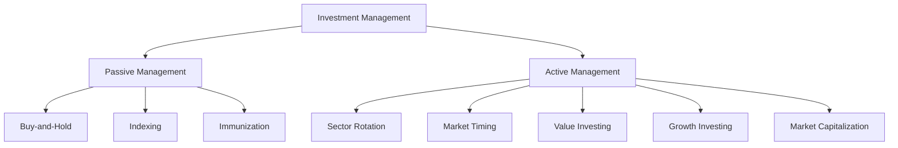

## 27.15 Investment Styles: Passive vs. Active

Investment management is a critical component of financial planning, and understanding the differences between passive and active investment styles is essential for both individual and institutional investors. This section delves into the intricacies of these two approaches, focusing on their application in both fixed-income and equity portfolios. We will explore various strategies, such as buy-and-hold, indexing, immunization, sector rotation, market timing, value, growth, and market capitalization, and discuss the implications of each style on portfolio performance and turnover rates.

### Passive Investment Management

Passive investment management is a strategy that aims to replicate the performance of a specific index or benchmark. This approach is characterized by low turnover rates and minimal trading activity, which can lead to lower transaction costs and tax liabilities. The primary goal of passive investing is to achieve market returns rather than outperform the market.

#### Key Strategies in Passive Investing

1. **Buy-and-Hold Strategy**: This involves purchasing securities and holding them over a long period, regardless of market fluctuations. The buy-and-hold strategy is based on the belief that markets will rise over time, and long-term investments will yield positive returns. This strategy is particularly popular among Canadian investors using Registered Retirement Savings Plans (RRSPs) and Tax-Free Savings Accounts (TFSAs), where long-term growth is a primary objective.

2. **Indexing**: Indexing involves creating a portfolio that mirrors the performance of a specific index, such as the S&P/TSX Composite Index in Canada. This strategy is popular among investors who seek to match market returns with minimal effort and cost. Exchange-Traded Funds (ETFs) are a common vehicle for indexing, offering diversification and liquidity.

3. **Immunization**: In fixed-income portfolios, immunization is a strategy used to protect against interest rate risk. By matching the duration of assets and liabilities, investors can ensure that changes in interest rates have a minimal impact on the portfolio's value. This strategy is particularly relevant for Canadian pension funds and insurance companies.

### Active Investment Management

Active investment management involves making investment decisions based on research, analysis, and forecasts to outperform a specific benchmark. This approach requires a more hands-on approach, with frequent trading and portfolio adjustments.

#### Key Strategies in Active Investing

1. **Sector Rotation**: This strategy involves shifting investments between different sectors based on expected performance. For example, an investor might increase exposure to the technology sector if they anticipate strong growth. Sector rotation requires a deep understanding of economic cycles and market trends.

2. **Market Timing**: Market timing involves making buy or sell decisions based on predictions of future market movements. While potentially lucrative, this strategy is challenging and requires accurate forecasts and quick decision-making.

3. **Value Investing**: Value investors seek stocks that are undervalued by the market. This strategy involves analyzing financial statements and market conditions to identify opportunities for growth. Canadian investors often look for value in sectors like energy and natural resources.

4. **Growth Investing**: Growth investors focus on companies with strong potential for future earnings growth. This strategy often involves investing in technology and innovation-driven sectors. In Canada, growth investing might focus on emerging industries like clean energy.

5. **Market Capitalization**: This strategy involves selecting investments based on the size of the company, measured by market capitalization. Investors might focus on large-cap, mid-cap, or small-cap stocks, each offering different risk and return profiles.

### Implications on Portfolio Performance and Turnover Rates

The choice between passive and active investment styles has significant implications for portfolio performance and turnover rates. Passive strategies typically result in lower turnover rates, reducing transaction costs and tax implications. However, they may limit the potential for outperforming the market.

Active strategies, on the other hand, offer the potential for higher returns but come with increased risk and higher turnover rates. Frequent trading can lead to higher transaction costs and tax liabilities, which can erode returns.

### Canadian Context and Regulatory Considerations

In Canada, investment management is subject to regulations by the Canadian Investment Regulatory Organization (CIRO) and provincial securities commissions. Investors must comply with regulations regarding disclosure, fiduciary duty, and ethical standards.

Canadian investors can leverage various financial instruments and accounts, such as RRSPs, TFSAs, and Registered Education Savings Plans (RESPs), to optimize their investment strategies. Understanding the tax implications and regulatory requirements of these accounts is crucial for effective portfolio management.

### Practical Examples and Case Studies

**Example 1: Canadian Pension Funds**  
Canadian pension funds often use a combination of passive and active strategies to achieve their investment objectives. For instance, they might use indexing for core equity holdings while employing active management for alternative investments like real estate and private equity.

**Example 2: Major Canadian Banks**  
Banks like RBC and TD employ both passive and active strategies in their wealth management divisions. They offer index funds and ETFs for passive investors while providing actively managed mutual funds and discretionary portfolio management services for those seeking active management.

### Diagrams and Visual Aids

Below is a diagram illustrating the differences between passive and active investment management:

### Best Practices and Common Pitfalls

**Best Practices:**
- Diversify investments to manage risk.
- Align investment strategies with financial goals and risk tolerance.
- Stay informed about market trends and economic indicators.

**Common Pitfalls:**
- Overtrading in active management can lead to high costs.
- Failing to rebalance passive portfolios can result in unintended risk exposure.
- Ignoring tax implications can reduce net returns.

### Additional Resources

For further exploration of investment styles and strategies, consider the following resources:

- **Books**: "The Intelligent Investor" by Benjamin Graham, "Common Sense on Mutual Funds" by John C. Bogle.
- **Articles**: "The Role of Passive and Active Management in Portfolio Construction" by the CFA Institute.
- **Online Courses**: "Investment Management" on Coursera, "Portfolio and Risk Management" on edX.

### Conclusion

Understanding the nuances of passive and active investment styles is crucial for effective portfolio management. By considering the strategies, implications, and regulatory context, investors can make informed decisions that align with their financial goals. Whether opting for the steady approach of passive investing or the dynamic nature of active management, the key is to remain informed and adaptable in the ever-evolving financial landscape.

### **Ready to Test Your Knowledge?**

**Practice 10 Essential CSC Exam Questions to Master Your Certification**



### Which investment strategy involves holding securities over a long period regardless of market fluctuations?

- [x] Buy-and-Hold Strategy
- [ ] Indexing
- [ ] Sector Rotation
- [ ] Market Timing

> **Explanation:** The buy-and-hold strategy involves purchasing securities and holding them over a long period, regardless of market fluctuations, based on the belief that markets will rise over time.

### What is the primary goal of passive investment management?

- [x] To achieve market returns
- [ ] To outperform the market
- [ ] To minimize risk
- [ ] To maximize turnover

> **Explanation:** The primary goal of passive investment management is to achieve market returns by replicating the performance of a specific index or benchmark.

### Which strategy involves creating a portfolio that mirrors the performance of a specific index?

- [x] Indexing
- [ ] Buy-and-Hold Strategy
- [ ] Sector Rotation
- [ ] Market Timing

> **Explanation:** Indexing involves creating a portfolio that mirrors the performance of a specific index, such as the S&P/TSX Composite Index.

### What is a key characteristic of active investment management?

- [x] Frequent trading and portfolio adjustments
- [ ] Low turnover rates
- [ ] Minimal trading activity
- [ ] Replicating market returns

> **Explanation:** Active investment management involves frequent trading and portfolio adjustments to outperform a specific benchmark.

### Which strategy involves shifting investments between sectors based on expected performance?

- [x] Sector Rotation
- [ ] Indexing
- [ ] Buy-and-Hold Strategy
- [ ] Growth Investing

> **Explanation:** Sector rotation involves shifting investments between different sectors based on expected performance.

### What is a common vehicle for indexing in passive investment management?

- [x] Exchange-Traded Funds (ETFs)
- [ ] Mutual Funds
- [ ] Bonds
- [ ] Real Estate Investment Trusts (REITs)

> **Explanation:** Exchange-Traded Funds (ETFs) are a common vehicle for indexing, offering diversification and liquidity.

### Which strategy focuses on companies with strong potential for future earnings growth?

- [x] Growth Investing
- [ ] Value Investing
- [ ] Market Timing
- [ ] Sector Rotation

> **Explanation:** Growth investing focuses on companies with strong potential for future earnings growth, often in technology and innovation-driven sectors.

### What is the primary risk associated with active investment management?

- [x] Increased transaction costs and tax liabilities
- [ ] Low returns
- [ ] Lack of diversification
- [ ] Minimal trading activity

> **Explanation:** Active investment management often involves increased transaction costs and tax liabilities due to frequent trading.

### Which Canadian financial instrument is commonly used for long-term growth in passive investing?

- [x] Registered Retirement Savings Plans (RRSPs)
- [ ] Guaranteed Investment Certificates (GICs)
- [ ] Corporate Bonds
- [ ] High-Interest Savings Accounts

> **Explanation:** Registered Retirement Savings Plans (RRSPs) are commonly used for long-term growth in passive investing.

### True or False: Passive investment management typically results in higher turnover rates than active management.

- [ ] True
- [x] False

> **Explanation:** False. Passive investment management typically results in lower turnover rates compared to active management, which involves frequent trading.


