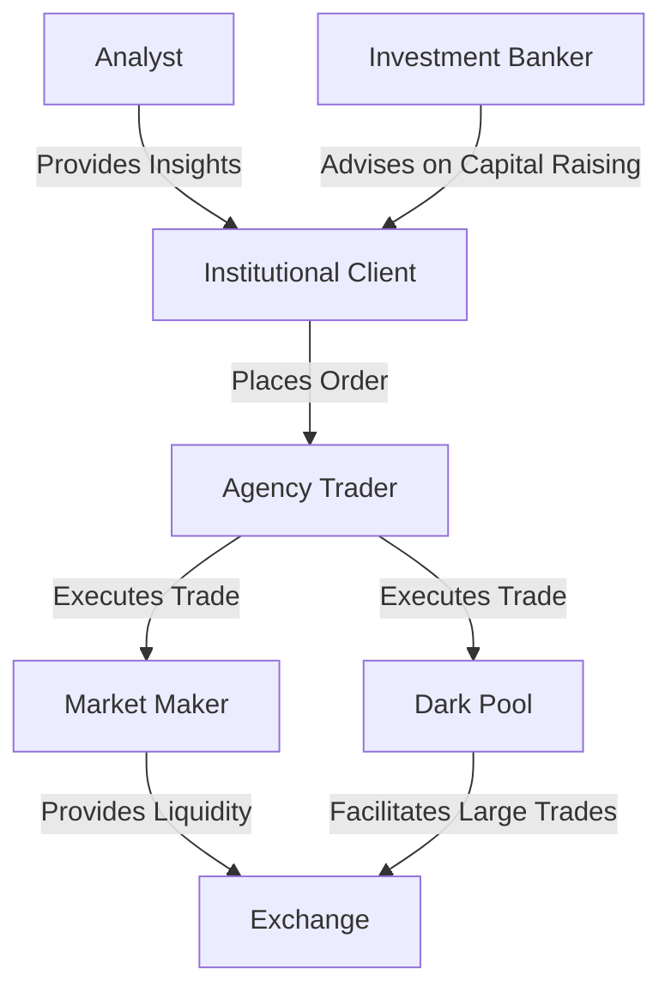

## Glossary for Chapter 27: Institutional Client Trading and Strategies

In the realm of institutional trading, understanding the terminology is crucial for navigating the complex landscape of financial markets. This glossary provides a comprehensive overview of key terms and concepts that are essential for professionals working with institutional clients. Each term is explained in detail, with practical examples and insights into how they apply within the Canadian financial context.

### Key Terms and Concepts

#### Agency Traders
Agency traders are professionals who execute trades on behalf of institutional clients without using the dealer's capital. They act as intermediaries, ensuring that trades are executed efficiently and at the best possible price. For example, an agency trader at a major Canadian bank like RBC might handle large orders for a pension fund, ensuring minimal market impact and optimal execution.

#### Market Makers
Market makers are traders who provide continuous bid and ask prices for securities to ensure liquidity in the market. They play a critical role in maintaining market stability by being ready to buy or sell securities at any time. In Canada, market makers are essential for the smooth functioning of exchanges like the Toronto Stock Exchange (TSX).

#### Algorithmic Trading
Algorithmic trading involves the use of mathematical models and automated systems to execute trades. This method allows for high-speed trading and the ability to process large volumes of orders with minimal human intervention. Canadian financial institutions often employ algorithmic trading to optimize execution strategies and reduce transaction costs.

#### Order Flow
Order flow refers to the incoming trades and orders from clients that traders manage. Understanding order flow is crucial for traders to anticipate market movements and adjust their strategies accordingly. For instance, a surge in buy orders for a particular stock might indicate bullish sentiment, prompting traders to adjust their positions.

#### Analyst
Analysts are experts who provide research and insights on specific companies or sectors. They play a vital role in informing investment decisions by evaluating financial statements, market trends, and economic indicators. In Canada, analysts often focus on key sectors such as energy, mining, and financial services.

#### Origination
Origination is the process of bringing new securities issues to the market. Investment bankers are typically involved in this process, working with companies to structure and price new offerings. In Canada, origination is a critical function for raising capital through equity or debt markets.

#### Axe Sheets
Axe sheets are lists of products a trader wishes to sell or buy quickly. These sheets help traders communicate their intentions to the market and manage their inventory effectively. For example, a trader at TD Securities might use an axe sheet to highlight a desire to offload a large position in government bonds.

#### Price Spread
The price spread is the difference between the bid and ask prices of a security. It is a key indicator of market liquidity and transaction costs. A narrow spread typically indicates a highly liquid market, while a wide spread may suggest limited trading activity or higher volatility.

#### Buy Side
The buy side refers to institutional and retail investors who buy securities. This group includes mutual funds, pension funds, and hedge funds, which are responsible for managing large pools of capital. In Canada, buy-side firms play a significant role in shaping market dynamics and investment trends.

#### Prime Brokerage
Prime brokerage encompasses comprehensive services provided to hedge funds, including trade execution, financing, and securities lending. Canadian banks offer prime brokerage services to facilitate the complex trading strategies employed by hedge funds and other institutional investors.

#### Clearing
Clearing involves confirming and matching the details of securities trades to ensure accurate settlement. This process is crucial for maintaining the integrity of financial markets and preventing settlement failures. In Canada, clearing is typically handled by organizations like the Canadian Depository for Securities (CDS).

#### Proprietary Traders
Proprietary traders use the firm's capital to trade securities for profit. Unlike agency traders, they take on risk with the aim of generating returns for the firm. Proprietary trading desks at Canadian banks often focus on exploiting market inefficiencies and arbitrage opportunities.

#### Coverage Traders
Coverage traders focus on specific sectors or products to manage client orders. They provide specialized expertise and insights, helping clients navigate complex markets. For instance, a coverage trader specializing in Canadian energy stocks might offer tailored advice to institutional clients interested in this sector.

#### Research Associate
A research associate is an entry-level position focused on building financial models and conducting research. These professionals support senior analysts by gathering data, analyzing trends, and preparing reports. In Canada, research associates often start their careers at major financial institutions or independent research firms.

#### Dark Pools
Dark pools are private marketplaces where large blocks of securities are traded without pre-trade transparency. These venues allow institutional investors to execute large trades without impacting market prices. In Canada, dark pools are used to facilitate block trading and reduce market impact.

#### High-Frequency Trading (HFT)
High-frequency trading (HFT) involves automated trading with very high speeds and large volumes of orders. HFT firms use sophisticated algorithms to capitalize on small price discrepancies across markets. In Canada, HFT is a controversial topic, with debates over its impact on market fairness and stability.

#### Straight-Through Processing (STP)
Straight-through processing (STP) refers to automated systems that handle trades from initiation to settlement. STP reduces manual intervention, minimizes errors, and speeds up the trading process. Canadian financial institutions leverage STP to enhance operational efficiency and reduce costs.

#### Universal Market Integrity Rules (UMIR)
The Universal Market Integrity Rules (UMIR) are regulations ensuring fair and orderly trading on Canadian exchanges. These rules are enforced by the Canadian Investment Regulatory Organization (CIRO) and aim to protect investors and maintain market integrity.

#### Investment Banker
Investment bankers are professionals who assist clients in raising capital, mergers and acquisitions (M&A), and other financial services. They play a crucial role in advising companies on strategic transactions and accessing capital markets. In Canada, investment bankers are key players in facilitating corporate growth and development.

#### Relative Value
Relative value trading strategies seek to exploit price differentials between related securities. These strategies involve identifying mispricings and taking positions to profit from their convergence. In Canada, relative value strategies are commonly used in fixed income and derivatives markets.

#### Event-Driven
Event-driven strategies seek to capitalize on corporate events like mergers, acquisitions, or bankruptcies. These strategies involve analyzing the potential impact of such events on security prices and positioning accordingly. Canadian hedge funds often employ event-driven strategies to generate alpha.

#### Directional Trading
Directional trading strategies take a position based on the anticipated movement of a security's price. These strategies involve forecasting market trends and making bets on price direction. In Canada, directional traders may focus on equities, commodities, or currencies, depending on their expertise and market outlook.

### Practical Examples and Case Studies

To illustrate these concepts, consider the following real-world scenarios:

- **Algorithmic Trading in Action:** A Canadian pension fund uses algorithmic trading to execute a large order of TSX-listed stocks. By breaking the order into smaller parts and executing them over time, the fund minimizes market impact and achieves a better average price.

- **Market Maker Role:** A market maker at a Canadian brokerage firm provides liquidity for a thinly traded mining stock. By continuously quoting bid and ask prices, the market maker facilitates trading and helps stabilize the stock's price.

- **Event-Driven Strategy:** A hedge fund anticipates a merger between two Canadian telecommunications companies. By analyzing the deal's terms and regulatory hurdles, the fund positions itself to profit from the expected price movements of the involved stocks.

### Diagrams and Visual Aids

To enhance understanding, consider the following diagram illustrating the relationship between key players in institutional trading:

### Best Practices and Common Pitfalls

- **Best Practices:**
  - Leverage technology, such as algorithmic trading and STP, to enhance efficiency.
  - Maintain compliance with UMIR and other regulatory frameworks to ensure fair trading practices.
  - Foster strong relationships with market makers and prime brokers to access liquidity and comprehensive services.

- **Common Pitfalls:**
  - Over-reliance on automated systems without adequate oversight can lead to significant losses.
  - Ignoring market signals and order flow dynamics may result in suboptimal trading decisions.
  - Failing to adapt to changing market conditions can undermine trading strategies.

### Additional Resources

For further exploration of these topics, consider the following resources:

- **Books:**
  - "Algorithmic Trading: Winning Strategies and Their Rationale" by Ernest P. Chan
  - "Market Liquidity: Theory, Evidence, and Policy" by Thierry Foucault, Marco Pagano, and Ailsa Röell

- **Online Courses:**
  - "Algorithmic Trading and Finance Models with Python, R, and Stata Essential Training" on LinkedIn Learning
  - "Financial Markets" by Yale University on Coursera

- **Regulatory References:**
  - Canadian Investment Regulatory Organization (CIRO) website for UMIR guidelines
  - Toronto Stock Exchange (TSX) resources for market maker roles and responsibilities

### **Ready to Test Your Knowledge?**

**Practice 10 Essential CSC Exam Questions to Master Your Certification**



### What is the primary role of agency traders?

- [x] Execute trades on behalf of institutional clients without using the dealer's capital
- [ ] Provide continuous bid and ask prices for securities
- [ ] Use the firm's capital to trade securities for profit
- [ ] Facilitate large trades in private marketplaces

> **Explanation:** Agency traders act as intermediaries, executing trades for clients without using the dealer's capital.

### Which of the following best describes market makers?

- [ ] Professionals who assist clients in raising capital
- [x] Traders who provide continuous bid and ask prices for securities
- [ ] Experts who provide research and insights on specific sectors
- [ ] Traders who use mathematical models to execute trades

> **Explanation:** Market makers ensure liquidity by continuously quoting bid and ask prices.

### What is the purpose of algorithmic trading?

- [ ] To provide research and insights on specific companies
- [x] To use mathematical models and automated systems to execute trades
- [ ] To confirm and match the details of securities trades
- [ ] To bring new securities issues to the market

> **Explanation:** Algorithmic trading uses automated systems to execute trades efficiently.

### What does order flow refer to?

- [ ] The process of bringing new securities issues to the market
- [ ] The difference between the bid and ask prices of a security
- [x] The incoming trades and orders from clients that traders manage
- [ ] The automated systems that handle trades from initiation to settlement

> **Explanation:** Order flow involves managing incoming trades and orders from clients.

### Which of the following is a key function of prime brokerage?

- [ ] Providing continuous bid and ask prices for securities
- [x] Offering comprehensive services to hedge funds, including trade execution and financing
- [ ] Executing trades on behalf of institutional clients
- [ ] Confirming and matching the details of securities trades

> **Explanation:** Prime brokerage services include trade execution and financing for hedge funds.

### What is the role of a research associate?

- [ ] To provide continuous bid and ask prices for securities
- [ ] To execute trades on behalf of institutional clients
- [x] To build financial models and conduct research
- [ ] To use the firm's capital to trade securities for profit

> **Explanation:** Research associates support analysts by building models and conducting research.

### What are dark pools used for?

- [ ] Providing continuous bid and ask prices for securities
- [ ] Executing trades on behalf of institutional clients
- [x] Facilitating large trades without pre-trade transparency
- [ ] Confirming and matching the details of securities trades

> **Explanation:** Dark pools allow large trades to be executed privately.

### What is the primary focus of event-driven strategies?

- [ ] To provide continuous bid and ask prices for securities
- [ ] To execute trades on behalf of institutional clients
- [ ] To use mathematical models and automated systems to execute trades
- [x] To capitalize on corporate events like mergers and acquisitions

> **Explanation:** Event-driven strategies focus on profiting from corporate events.

### What is the Universal Market Integrity Rules (UMIR) designed to ensure?

- [ ] The use of mathematical models and automated systems to execute trades
- [ ] The process of bringing new securities issues to the market
- [x] Fair and orderly trading on Canadian exchanges
- [ ] The continuous provision of bid and ask prices for securities

> **Explanation:** UMIR ensures fair and orderly trading on Canadian exchanges.

### True or False: High-frequency trading (HFT) involves manual intervention to execute trades.

- [ ] True
- [x] False

> **Explanation:** HFT involves automated trading with minimal manual intervention.



This glossary serves as a foundational resource for understanding the complex world of institutional trading. By familiarizing yourself with these terms and concepts, you will be better equipped to navigate the Canadian financial markets and make informed decisions in your professional endeavors.
