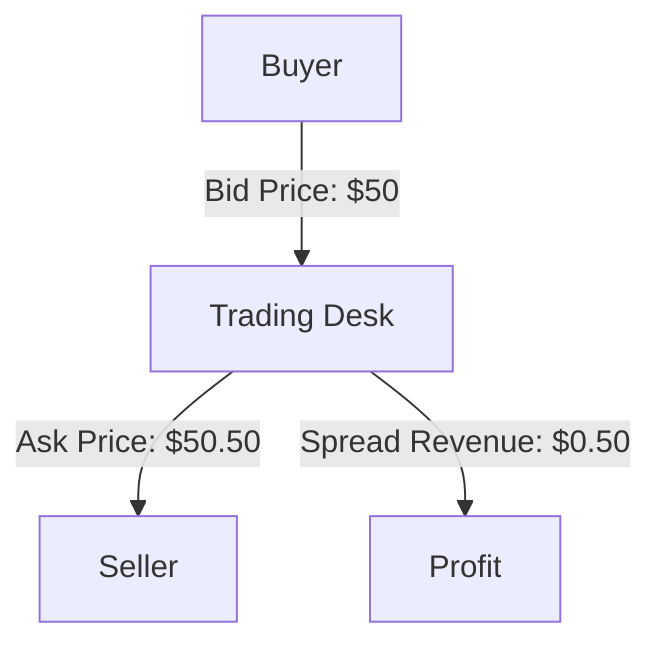

---

linkTitle: "27.3.1 Trading Revenue from Spreads"
title: "Trading Revenue from Spreads: Maximizing Profit from Bid-Ask Differentials"
description: "Explore how trading desks generate revenue through bid-ask spreads, proprietary trading, and client order flow. Learn strategies to enhance trading revenue in the Canadian financial market."
categories:
- Finance
- Trading
- Investment
tags:
- Bid-Ask Spread
- Trading Revenue
- Proprietary Trading
- Client Order Flow
- Canadian Financial Market
date: 2024-10-25
type: docs
nav_weight: 1531000
---

## 27.3.1 Trading Revenue from Spreads

In the world of financial trading, the bid-ask spread is a fundamental concept that serves as a primary source of revenue for sell-side trading firms. This section delves into the mechanics of how trading desks earn revenue through the spread between bid and ask prices, the role of proprietary trading, and the importance of client order flow in enhancing trading opportunities.

### Understanding the Bid-Ask Spread

The bid-ask spread is the difference between the highest price a buyer is willing to pay for an asset (the bid) and the lowest price a seller is willing to accept (the ask). This spread represents the cost of trading and is a key indicator of market liquidity. For trading desks, the spread is not just a cost but a source of revenue.

#### Definition and Significance

- **Bid Price:** The maximum price that a buyer is willing to pay for a security.
- **Ask Price:** The minimum price that a seller is willing to accept for a security.
- **Spread:** The difference between the bid and ask prices, which compensates market makers for providing liquidity.

In essence, trading desks earn revenue by capturing the spread. When a trading desk buys a security at the bid price and sells it at the ask price, the spread becomes their profit margin. This process is crucial for market makers who facilitate trading by providing liquidity and ensuring smooth market operations.

### The Role of Proprietary Trading

Proprietary trading involves trading financial instruments with a firm's own capital to generate profits. Traders engage in proprietary trading to capitalize on market inefficiencies and price movements. The goal is to buy low and sell high within the bid-ask spread, thereby maximizing revenue.

#### Profit Maximization through Price Spread

Proprietary traders leverage their market knowledge and analytical skills to identify opportunities where they can profit from the spread. By executing trades at advantageous prices, they can enhance their revenue. For instance, if a trader identifies that a stock is undervalued, they may purchase it at the bid price and sell it at a higher ask price, capturing the spread as profit.

### Client Order Flow and Trading Opportunities

Client order flow refers to the buying and selling orders placed by clients, which provide trading desks with valuable information about market demand and supply. This flow is crucial for identifying trading opportunities and optimizing spread revenue.

#### Enhancing Revenue through Client Orders

Trading desks use client order flow to gauge market sentiment and adjust their trading strategies accordingly. By understanding the direction and volume of client orders, traders can position themselves to capture spreads more effectively. For example, if a large number of buy orders are anticipated, a trading desk might increase their ask price slightly to capture a larger spread.

### Effective Trading and Market Knowledge

Successful trading desks rely on a deep understanding of market dynamics and effective trading strategies to enhance spread revenue. This involves continuous market analysis, risk management, and the use of advanced trading technologies.

#### Strategies for Maximizing Spread Revenue

1. **Market Analysis:** Regular analysis of market trends and economic indicators helps traders anticipate price movements and adjust their strategies.
2. **Risk Management:** Implementing robust risk management practices ensures that trading desks can sustain profitability even in volatile markets.
3. **Technology Utilization:** Leveraging trading algorithms and high-frequency trading systems can optimize trade execution and capture spreads efficiently.

### Practical Example: Canadian Financial Market

Consider a scenario involving a major Canadian bank, such as RBC. Suppose RBC's trading desk identifies an opportunity in the Canadian equity market where a particular stock is trading at a bid price of $50 and an ask price of $50.50. By purchasing the stock at $50 and selling it at $50.50, RBC captures a spread of $0.50 per share. If they execute this trade for 10,000 shares, the trading desk earns a revenue of $5,000 from the spread alone.

### Diagram: Bid-Ask Spread and Trading Revenue

Below is a simplified diagram illustrating how trading desks capture revenue from the bid-ask spread:

### Best Practices and Challenges

- **Best Practices:** Maintain a keen awareness of market conditions, utilize advanced trading tools, and foster strong client relationships to optimize order flow.
- **Common Challenges:** Market volatility, regulatory changes, and technological disruptions can impact spread revenue. Traders must remain adaptable and informed to navigate these challenges effectively.

### Conclusion

Trading revenue from spreads is a vital component of a trading desk's profitability. By understanding the intricacies of the bid-ask spread, leveraging proprietary trading, and capitalizing on client order flow, trading desks can enhance their revenue streams. As the Canadian financial market continues to evolve, staying informed and adaptable will be key to sustaining success.

## Quiz Time!



### What is the bid-ask spread?

- [x] The difference between the highest price a buyer is willing to pay and the lowest price a seller is willing to accept.
- [ ] The average price of a security over a period of time.
- [ ] The commission charged by brokers for executing trades.
- [ ] The total volume of trades executed in a market.

> **Explanation:** The bid-ask spread is the difference between the bid price and the ask price, representing the cost of trading and a source of revenue for trading desks.

### How do trading desks earn revenue from the bid-ask spread?

- [x] By buying at the bid price and selling at the ask price.
- [ ] By charging a commission on each trade.
- [ ] By holding securities for long-term appreciation.
- [ ] By investing in dividend-paying stocks.

> **Explanation:** Trading desks earn revenue by capturing the spread between the bid and ask prices, buying low and selling high.

### What is proprietary trading?

- [x] Trading with a firm's own capital to generate profits.
- [ ] Trading on behalf of clients for a commission.
- [ ] Trading in foreign exchange markets exclusively.
- [ ] Trading using only automated systems.

> **Explanation:** Proprietary trading involves using a firm's own capital to trade financial instruments and generate profits.

### Why is client order flow important for trading desks?

- [x] It provides information about market demand and supply.
- [ ] It determines the interest rates for loans.
- [ ] It sets the exchange rates for currencies.
- [ ] It dictates the dividend policies of companies.

> **Explanation:** Client order flow helps trading desks understand market sentiment and identify trading opportunities.

### What role does market analysis play in maximizing spread revenue?

- [x] It helps anticipate price movements and adjust trading strategies.
- [ ] It determines the legal requirements for trading.
- [ ] It sets the interest rates for financial products.
- [ ] It calculates the tax liabilities for traders.

> **Explanation:** Market analysis allows traders to anticipate price movements and optimize their strategies to capture spreads.

### How can technology enhance trading revenue from spreads?

- [x] By optimizing trade execution and capturing spreads efficiently.
- [ ] By reducing the need for human traders.
- [ ] By eliminating all trading risks.
- [ ] By setting fixed prices for all trades.

> **Explanation:** Technology, such as trading algorithms, can optimize trade execution and help capture spreads more efficiently.

### What is a common challenge in capturing spread revenue?

- [x] Market volatility.
- [ ] High fixed interest rates.
- [ ] Low dividend yields.
- [ ] Stable market conditions.

> **Explanation:** Market volatility can impact spread revenue, requiring traders to adapt their strategies.

### How does proprietary trading differ from client trading?

- [x] Proprietary trading uses the firm's own capital, while client trading involves executing trades on behalf of clients.
- [ ] Proprietary trading is risk-free, while client trading involves risk.
- [ ] Proprietary trading is only for stocks, while client trading is for all securities.
- [ ] Proprietary trading is regulated, while client trading is not.

> **Explanation:** Proprietary trading uses the firm's own capital, whereas client trading involves executing trades for clients.

### What is the significance of the ask price in trading?

- [x] It is the minimum price a seller is willing to accept for a security.
- [ ] It is the maximum price a buyer is willing to pay for a security.
- [ ] It is the average price of a security over a period.
- [ ] It is the price at which all trades are executed.

> **Explanation:** The ask price is the lowest price a seller is willing to accept, forming part of the bid-ask spread.

### True or False: The bid-ask spread is irrelevant to trading revenue.

- [ ] True
- [x] False

> **Explanation:** False. The bid-ask spread is a primary source of trading revenue for trading desks.


