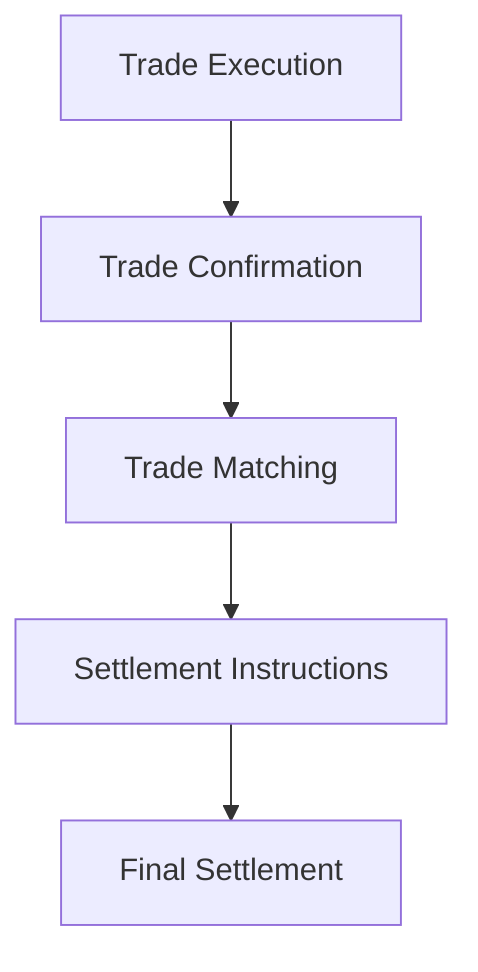

## 27.4.1 The Settlement Process

In the world of institutional finance, the settlement process is a critical component that ensures the smooth transfer of securities and funds between parties. This process involves multiple stakeholders, including portfolio managers, dealers, and custodians, each playing a vital role in ensuring that trades are executed, confirmed, and settled accurately and efficiently. Understanding this process is essential for anyone involved in institutional trading, as it mitigates risks and ensures compliance with regulatory standards.

### The Institutional Trade Settlement Process: Step-by-Step

The settlement process for institutional trades can be broken down into several key steps, each involving specific actions and responsibilities. Let's explore these steps in detail:

#### 1. Trade Execution

The settlement process begins with trade execution, where a portfolio manager decides to buy or sell a security based on investment strategies and market conditions. This decision is communicated to a dealer, who executes the trade on the market.

- **Role of Portfolio Managers:** Portfolio managers analyze market trends and make investment decisions to meet the objectives of the institutional client. They initiate the trade by instructing the dealer on the specifics of the transaction.

- **Role of Dealers:** Dealers are responsible for executing the trade on the market. They ensure that the trade is carried out at the best possible price and in compliance with market regulations.

#### 2. Trade Confirmation

Once the trade is executed, the next step is trade confirmation. This involves verifying the details of the trade to ensure accuracy and agreement between the parties involved.

- **Importance of Trade Confirmation:** Accurate trade confirmation is crucial as it prevents discrepancies that could lead to settlement failures. It involves checking the trade details such as the security type, quantity, price, and settlement date.

#### 3. Trade Matching

Trade matching is the process of comparing the trade details provided by the buyer and seller to ensure they match. This step is essential for the settlement process to proceed smoothly.

- **Trade-Matching Elements:** Key elements include the trade date, settlement date, security identifier, quantity, and price. Matching these elements helps in identifying any discrepancies early in the process.

- **Facilitating Settlement:** Trade matching ensures that both parties agree on the trade details, reducing the risk of settlement failures and ensuring compliance with regulatory requirements.

#### 4. Settlement Instructions

Once the trade is confirmed and matched, settlement instructions are sent to the custodian. These instructions detail how the securities and funds should be transferred between the parties.

- **Role of Custodians:** Custodians are responsible for holding and safeguarding the securities on behalf of the institutional client. They ensure that the securities are delivered to the buyer and the funds are transferred to the seller.

#### 5. Final Settlement

The final step in the process is the actual settlement, where the securities and funds are exchanged between the parties. This step marks the completion of the trade.

- **Mitigating Trading Risks:** Accurate settlement processes reduce the risk of failed trades, which can result in financial losses and regulatory penalties. By ensuring that all trade details are confirmed and matched, institutions can mitigate these risks effectively.

- **Ensuring Compliance:** Regulatory bodies require that trades are settled within a specific timeframe. Adhering to these timelines is essential for compliance and maintaining the integrity of the financial markets.

### Diagram: Institutional Trade Settlement Process

Below is a diagram illustrating the sequential steps of the institutional trade settlement process:

### Best Practices and Common Challenges

- **Best Practices:** Implementing automated systems for trade confirmation and matching can significantly reduce errors and improve efficiency. Regular audits and reconciliations are also recommended to ensure compliance and accuracy.

- **Common Challenges:** Discrepancies in trade details and delays in communication between parties can lead to settlement failures. Institutions should establish clear protocols and communication channels to address these challenges.

### Conclusion

The settlement process is a vital component of institutional trading, ensuring that trades are executed, confirmed, and settled accurately and efficiently. By understanding the roles of portfolio managers, dealers, and custodians, and the importance of trade confirmation and matching, institutions can mitigate risks and ensure compliance with regulatory standards. This knowledge is essential for anyone involved in institutional trading, as it provides the foundation for successful and compliant trading operations.

## Quiz Time!



### What is the first step in the institutional trade settlement process?

- [x] Trade Execution
- [ ] Trade Confirmation
- [ ] Trade Matching
- [ ] Final Settlement

> **Explanation:** The settlement process begins with trade execution, where a portfolio manager decides to buy or sell a security.

### Who is responsible for executing the trade on the market?

- [ ] Portfolio Managers
- [x] Dealers
- [ ] Custodians
- [ ] Regulators

> **Explanation:** Dealers are responsible for executing the trade on the market, ensuring it is carried out at the best possible price.

### Why is trade confirmation important?

- [x] It prevents discrepancies that could lead to settlement failures.
- [ ] It increases the trade volume.
- [ ] It reduces the trade cost.
- [ ] It speeds up the trade execution.

> **Explanation:** Trade confirmation is crucial as it verifies the trade details, preventing discrepancies that could lead to settlement failures.

### What is the role of custodians in the settlement process?

- [ ] Executing trades
- [ ] Analyzing market trends
- [x] Holding and safeguarding securities
- [ ] Regulating trade practices

> **Explanation:** Custodians are responsible for holding and safeguarding the securities on behalf of the institutional client.

### What are trade-matching elements?

- [x] Trade date, settlement date, security identifier, quantity, and price
- [ ] Trade volume, market trends, investment strategy
- [ ] Trade cost, execution speed, market volatility
- [ ] Trade location, broker fees, client details

> **Explanation:** Trade-matching elements include the trade date, settlement date, security identifier, quantity, and price, which are essential for ensuring both parties agree on the trade details.

### What is the final step in the settlement process?

- [ ] Trade Execution
- [ ] Trade Confirmation
- [ ] Trade Matching
- [x] Final Settlement

> **Explanation:** The final step is the actual settlement, where the securities and funds are exchanged between the parties.

### How can institutions mitigate trading risks?

- [x] By ensuring all trade details are confirmed and matched
- [ ] By increasing trade volume
- [ ] By reducing trade costs
- [ ] By speeding up trade execution

> **Explanation:** Accurate settlement processes, including confirming and matching trade details, reduce the risk of failed trades and mitigate trading risks.

### What is a common challenge in the settlement process?

- [ ] High trade volume
- [x] Discrepancies in trade details
- [ ] Low market volatility
- [ ] High regulatory fees

> **Explanation:** Discrepancies in trade details and delays in communication between parties can lead to settlement failures.

### Why is compliance important in the settlement process?

- [x] It ensures trades are settled within a specific timeframe and maintains market integrity.
- [ ] It increases trade volume.
- [ ] It reduces trade costs.
- [ ] It speeds up trade execution.

> **Explanation:** Compliance with regulatory timelines is essential for maintaining the integrity of the financial markets and avoiding penalties.

### True or False: Automated systems for trade confirmation can reduce errors and improve efficiency.

- [x] True
- [ ] False

> **Explanation:** Implementing automated systems for trade confirmation and matching can significantly reduce errors and improve efficiency.


