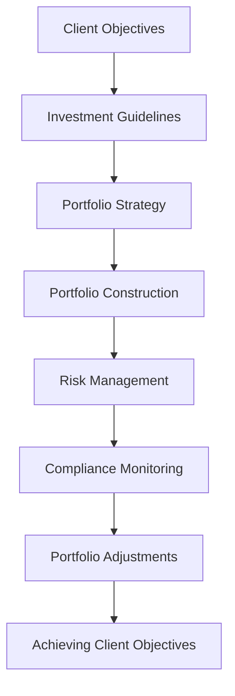

## 27.6.3 Investment Guidelines and Restrictions

Investment guidelines and restrictions are fundamental components of portfolio management, serving as the framework within which portfolio managers operate to achieve client objectives while managing risk. These guidelines are crucial for ensuring that investment strategies align with the client's risk tolerance, investment goals, and regulatory requirements.

### Understanding Investment Guidelines and Restrictions

Investment guidelines are a set of rules and objectives that dictate how a portfolio should be managed. They are designed to align the portfolio's strategy with the client's financial goals, risk tolerance, and time horizon. Restrictions, on the other hand, are specific limitations placed on the portfolio to mitigate risk and ensure compliance with legal and ethical standards.

#### Importance in Portfolio Management

Investment guidelines and restrictions are vital for several reasons:

- **Risk Management**: They help manage and mitigate risks by setting boundaries on investment activities.
- **Alignment with Objectives**: Ensure that the portfolio's strategy is aligned with the client's financial goals and risk tolerance.
- **Regulatory Compliance**: Ensure adherence to legal and regulatory requirements, which is particularly important in the heavily regulated financial industry.
- **Ethical Standards**: Uphold ethical standards by avoiding investments in sectors or companies that do not align with the client's values.

### Adhering to Guidelines: Meeting Client Objectives and Managing Risk

Portfolio managers must adhere to these guidelines to effectively meet client objectives and manage risk. This involves:

1. **Understanding Client Needs**: Thoroughly understanding the client's financial goals, risk tolerance, and investment horizon.
2. **Developing a Strategy**: Crafting an investment strategy that aligns with the guidelines and restrictions.
3. **Continuous Monitoring**: Regularly monitoring the portfolio to ensure compliance with the guidelines and making adjustments as necessary.
4. **Risk Assessment**: Continuously assessing risks and adjusting the portfolio to mitigate potential threats.

### Common Investment Restrictions

Investment restrictions are specific limitations that can be imposed on a portfolio. Common restrictions include:

- **Sector Exclusions**: Prohibiting investments in certain sectors, such as tobacco or firearms, to align with ethical considerations or client preferences.
- **Market Cap Limits**: Setting limits on investments in companies of certain market capitalizations to manage risk and ensure diversification.
- **Leverage Usage**: Restricting the use of leverage to prevent excessive risk-taking.
- **Diversification Requirements**: Mandating a certain level of diversification to reduce risk and prevent overexposure to any single asset or sector.

### The Role of Compliance

Compliance plays a critical role in ensuring that investment guidelines and restrictions are followed. This involves:

- **Establishing Policies**: Developing comprehensive policies and procedures to guide investment activities.
- **Monitoring and Reporting**: Implementing systems to monitor compliance and generate reports for stakeholders.
- **Training and Education**: Providing ongoing training to portfolio managers and staff to ensure they understand and adhere to guidelines.
- **Auditing**: Conducting regular audits to identify and address any compliance issues.

### Examples of Investment Guidelines in Action

Investment guidelines significantly shape portfolio construction and management. Here are some examples:

- **Canadian Pension Funds**: These funds often have strict guidelines regarding asset allocation, requiring a certain percentage of investments in Canadian equities, fixed income, and alternative assets to ensure diversification and stability.
- **Ethical Investment Funds**: These funds may exclude investments in companies that do not meet specific ethical criteria, such as those involved in fossil fuels or human rights violations.
- **Bank Portfolios**: Major Canadian banks like RBC or TD may have guidelines that limit exposure to high-risk assets or require a certain level of liquidity to meet regulatory requirements.

### Visualizing Investment Guidelines and Restrictions

Below is a diagram illustrating how investment guidelines and restrictions influence portfolio management:

### Best Practices and Common Challenges

**Best Practices:**

- **Clear Communication**: Ensure clear communication of guidelines and restrictions to all stakeholders.
- **Regular Reviews**: Conduct regular reviews of guidelines to ensure they remain relevant and effective.
- **Technology Utilization**: Leverage technology for monitoring and reporting compliance.

**Common Challenges:**

- **Changing Regulations**: Keeping up with changing regulations can be challenging and requires continuous monitoring.
- **Balancing Objectives and Restrictions**: Finding the right balance between achieving client objectives and adhering to restrictions can be complex.

### Encouraging Application and Continuous Learning

To effectively implement these principles, consider the following:

- **Analyze a Portfolio**: Evaluate a sample portfolio to identify how guidelines and restrictions are applied.
- **Scenario Analysis**: Conduct scenario analysis to understand the impact of different restrictions on portfolio performance.
- **Stay Informed**: Keep abreast of changes in regulations and best practices through continuous learning and professional development.

### Conclusion

Investment guidelines and restrictions are essential tools in portfolio management, providing a structured approach to achieving client objectives while managing risk. By understanding and adhering to these guidelines, portfolio managers can ensure compliance, uphold ethical standards, and deliver value to clients.

## Quiz Time!



### What is the primary purpose of investment guidelines?

- [x] To align the portfolio's strategy with the client's financial goals and risk tolerance
- [ ] To maximize short-term profits
- [ ] To ensure all investments are in high-risk sectors
- [ ] To focus solely on Canadian equities

> **Explanation:** Investment guidelines are designed to align the portfolio's strategy with the client's financial goals and risk tolerance, ensuring a balanced approach to risk and return.

### Which of the following is a common investment restriction?

- [x] Sector exclusions
- [ ] Unlimited leverage usage
- [ ] Investing only in foreign markets
- [ ] No diversification requirements

> **Explanation:** Sector exclusions are a common investment restriction, often used to align investments with ethical considerations or client preferences.

### How do portfolio managers ensure compliance with investment guidelines?

- [x] By continuously monitoring the portfolio and making necessary adjustments
- [ ] By ignoring market trends
- [ ] By focusing only on short-term gains
- [ ] By investing in high-risk assets

> **Explanation:** Portfolio managers ensure compliance by continuously monitoring the portfolio and making necessary adjustments to align with guidelines and manage risk.

### What role does compliance play in investment management?

- [x] Ensures that investment guidelines and restrictions are followed
- [ ] Focuses on maximizing profits at any cost
- [ ] Encourages high-risk investments
- [ ] Eliminates the need for diversification

> **Explanation:** Compliance ensures that investment guidelines and restrictions are followed, maintaining legal and ethical standards.

### Which of the following is an example of how investment guidelines shape portfolio management?

- [x] Canadian pension funds requiring specific asset allocations
- [ ] Investing solely in high-risk assets
- [ ] Ignoring client risk tolerance
- [ ] Focusing only on short-term profits

> **Explanation:** Canadian pension funds often have strict guidelines regarding asset allocation to ensure diversification and stability.

### What is a key challenge in adhering to investment guidelines?

- [x] Balancing objectives and restrictions
- [ ] Ignoring regulatory changes
- [ ] Focusing only on high-risk sectors
- [ ] Eliminating all diversification

> **Explanation:** Balancing objectives and restrictions is a key challenge, requiring careful consideration of client goals and risk management.

### Why is regular review of investment guidelines important?

- [x] To ensure they remain relevant and effective
- [ ] To focus solely on short-term gains
- [ ] To ignore market trends
- [ ] To eliminate all risk

> **Explanation:** Regular review of investment guidelines is important to ensure they remain relevant and effective in achieving client objectives.

### What is a benefit of using technology in compliance monitoring?

- [x] Improved monitoring and reporting
- [ ] Increased focus on high-risk investments
- [ ] Elimination of all guidelines
- [ ] Ignoring client objectives

> **Explanation:** Technology improves monitoring and reporting, enhancing compliance and ensuring adherence to guidelines.

### Which of the following is a best practice in managing investment guidelines?

- [x] Clear communication of guidelines to stakeholders
- [ ] Ignoring regulatory requirements
- [ ] Focusing only on short-term profits
- [ ] Eliminating all diversification

> **Explanation:** Clear communication of guidelines to stakeholders is a best practice, ensuring everyone understands and adheres to the rules.

### True or False: Investment guidelines are only concerned with maximizing profits.

- [ ] True
- [x] False

> **Explanation:** False. Investment guidelines are concerned with aligning the portfolio's strategy with the client's financial goals and risk tolerance, not just maximizing profits.


