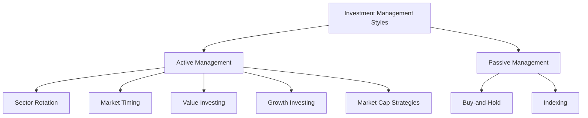

## 27.6 Investment Styles, Guidelines, and Restrictions

In the realm of institutional investing, understanding the nuances of investment styles, guidelines, and restrictions is crucial for crafting effective portfolio strategies. This section delves into the contrasting investment management styles on the buy side, exploring how they influence portfolio strategies, and examines the guidelines and restrictions that ensure alignment with client mandates.

### Investment Management Styles: Active vs. Passive

Investment management styles can broadly be categorized into active and passive approaches, each with distinct philosophies and methodologies.

#### Active Investment Management

Active management involves a hands-on approach where portfolio managers make specific investments with the goal of outperforming a benchmark index. This style is characterized by:

- **Sector Rotation**: This strategy involves shifting investments among different sectors to capitalize on expected sector performance. For example, a Canadian portfolio manager might increase exposure to the energy sector when oil prices are expected to rise.

- **Market Timing**: Managers attempt to predict market movements and make buy or sell decisions accordingly. This requires a deep understanding of market indicators and trends.

- **Value Investing**: This strategy focuses on identifying undervalued securities that are trading for less than their intrinsic value. Canadian investors might look for stocks with strong fundamentals but low price-to-earnings ratios.

- **Growth Investing**: In contrast to value investing, growth investing targets companies expected to grow at an above-average rate compared to their industry or the overall market. This might include investing in Canadian tech startups with innovative products.

- **Market Capitalization Strategies**: These involve focusing on companies of a specific size, such as small-cap or large-cap stocks, based on the belief that certain market caps offer better growth potential or stability.

Active management aims to outperform benchmarks through tactical trading, leveraging market inefficiencies and insights.

#### Passive Investment Management

Passive management, on the other hand, involves a more hands-off approach, aiming to replicate the performance of a specific index. Key techniques include:

- **Buy-and-Hold**: This strategy involves purchasing securities and holding them for a long period, regardless of market fluctuations. The idea is to benefit from the long-term appreciation of the market.

- **Indexing**: Managers construct a portfolio to mirror the performance of a market index, such as the S&P/TSX Composite Index. This approach minimizes transaction costs and capitalizes on the overall market trend.

Passive management focuses on minimizing costs and tracking market performance rather than outperforming it.

### Investment Guidelines and Restrictions

Investment guidelines and restrictions are essential components of portfolio construction and management. They ensure that investment strategies align with client mandates and regulatory requirements.

#### Guidelines

Investment guidelines provide a framework for decision-making, outlining acceptable asset classes, risk levels, and diversification strategies. For example, a Canadian pension fund might have guidelines specifying a maximum allocation to equities to manage risk.

#### Restrictions

Restrictions are specific limitations imposed on investment activities. These can include:

- **Asset Allocation Limits**: Restrictions on the percentage of the portfolio that can be invested in certain asset classes or sectors.

- **Geographic Restrictions**: Limits on investments in certain countries or regions, often due to political or economic risks.

- **Credit Quality Requirements**: Minimum credit ratings for fixed-income securities to ensure credit risk is managed.

- **Liquidity Constraints**: Requirements to maintain a certain level of liquidity to meet potential cash flow needs.

These guidelines and restrictions help manage risk, ensure compliance with regulatory standards, and align with the client's investment objectives.

### Practical Examples and Case Studies

To illustrate these concepts, consider the following examples:

- **Case Study: Canadian Pension Fund**: A Canadian pension fund might employ a mix of active and passive strategies. It could use passive management for its core equity holdings to minimize costs and active management for a portion of its fixed-income portfolio to capitalize on interest rate movements.

- **Example: RBC's Investment Strategy**: RBC might use sector rotation to adjust its equity portfolio, increasing exposure to financials when interest rates are expected to rise, while maintaining a passive approach for its international holdings to reduce currency risk.

### Diagrams and Visual Aids

To better understand the relationship between active and passive management, consider the following diagram:

This diagram illustrates the various strategies under active and passive management, highlighting their distinct approaches.

### Best Practices and Common Pitfalls

When implementing investment strategies, consider the following best practices:

- **Diversification**: Ensure portfolios are well-diversified to manage risk effectively.
- **Regular Review**: Continuously review and adjust portfolios to align with changing market conditions and client objectives.
- **Cost Management**: Be mindful of transaction costs and management fees, particularly in active management.

Common pitfalls include overconfidence in market timing and neglecting to adhere to established guidelines and restrictions.

### Conclusion

Understanding the intricacies of investment styles, guidelines, and restrictions is vital for effective portfolio management. By contrasting active and passive strategies and adhering to client mandates, financial professionals can craft portfolios that align with investment objectives and regulatory requirements.

## Quiz Time!



### Which of the following is a characteristic of active investment management?

- [x] Sector Rotation
- [ ] Indexing
- [ ] Buy-and-Hold
- [ ] Replicating a Benchmark

> **Explanation:** Active management involves strategies like sector rotation to outperform the market, unlike passive strategies like indexing.

### What is the primary goal of passive investment management?

- [ ] Outperform the market
- [x] Replicate market performance
- [ ] Minimize risk
- [ ] Maximize short-term gains

> **Explanation:** Passive management aims to replicate market performance, often through indexing, rather than outperforming it.

### Which strategy involves purchasing securities and holding them for a long period?

- [ ] Market Timing
- [ ] Sector Rotation
- [x] Buy-and-Hold
- [ ] Value Investing

> **Explanation:** Buy-and-hold is a passive strategy where securities are held long-term, regardless of market fluctuations.

### What is a common restriction in investment guidelines?

- [x] Asset Allocation Limits
- [ ] Unlimited Geographic Exposure
- [ ] No Credit Quality Requirements
- [ ] Unrestricted Liquidity

> **Explanation:** Asset allocation limits are common restrictions to manage risk and ensure diversification.

### Which investment style involves attempting to predict market movements?

- [x] Market Timing
- [ ] Indexing
- [ ] Buy-and-Hold
- [ ] Growth Investing

> **Explanation:** Market timing is an active strategy where managers try to predict and capitalize on market movements.

### What is a key benefit of passive management?

- [ ] High transaction costs
- [ ] Frequent trading
- [x] Lower management fees
- [ ] Outperforming benchmarks

> **Explanation:** Passive management typically involves lower management fees due to its hands-off approach.

### Which strategy focuses on companies expected to grow at an above-average rate?

- [ ] Value Investing
- [x] Growth Investing
- [ ] Sector Rotation
- [ ] Buy-and-Hold

> **Explanation:** Growth investing targets companies with high growth potential, often at a premium price.

### What is a potential pitfall of active management?

- [x] Overconfidence in market timing
- [ ] Low transaction costs
- [ ] Minimal research
- [ ] Lack of diversification

> **Explanation:** Overconfidence in market timing can lead to poor investment decisions and underperformance.

### Which of the following is a passive management technique?

- [ ] Sector Rotation
- [x] Indexing
- [ ] Market Timing
- [ ] Value Investing

> **Explanation:** Indexing is a passive technique that involves replicating a market index to match its performance.

### True or False: Investment guidelines and restrictions are optional for portfolio managers.

- [ ] True
- [x] False

> **Explanation:** Investment guidelines and restrictions are essential for ensuring portfolios align with client mandates and regulatory standards.


