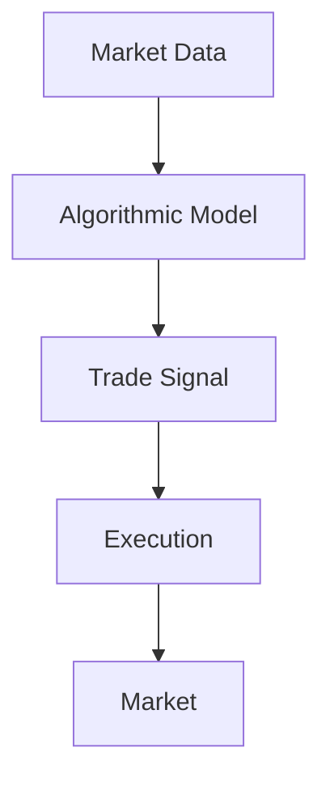
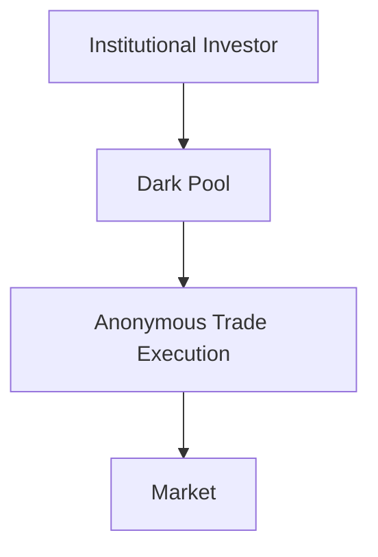

## 27.7 Algorithmic Trading, High Frequency Trading, and Dark Pools

In the rapidly evolving landscape of financial markets, algorithmic trading, high-frequency trading (HFT), and dark pools have emerged as pivotal components. These advanced trading strategies leverage technology to enhance efficiency, reduce costs, and optimize execution. This section delves into these concepts, examining their mechanisms, advantages, challenges, and regulatory considerations within the Canadian context.

### Understanding Algorithmic Trading

Algorithmic trading involves the use of computer programs to execute trades based on pre-defined criteria. These algorithms can process vast amounts of data and execute orders at speeds and frequencies that are impossible for human traders. The primary objective is to optimize trading strategies by minimizing costs, maximizing profits, and reducing market impact.

#### How Algorithmic Trading Works

Algorithmic trading relies on mathematical models and statistical analysis to make trading decisions. These models can incorporate various factors, such as price, timing, and volume, to determine the optimal execution strategy. For instance, a simple algorithm might be programmed to buy a stock when its price drops below a certain threshold and sell when it rises above another.

In this diagram, market data is fed into an algorithmic model, which generates trade signals. These signals are then executed in the market, completing the trading cycle.

### High-Frequency Trading (HFT)

High-frequency trading is a subset of algorithmic trading characterized by extremely high speeds and a large number of trades executed in fractions of a second. HFT firms use sophisticated algorithms to capitalize on small price discrepancies across different markets or securities.

#### Key Characteristics of HFT

- **Speed:** HFT relies on cutting-edge technology to execute trades in microseconds.
- **Volume:** HFT strategies involve executing thousands of trades per second.
- **Short Holding Periods:** Positions are typically held for very short durations, often seconds or milliseconds.

While both algorithmic trading and HFT use algorithms, HFT is distinguished by its focus on speed and volume, often requiring significant technological infrastructure and investment.

### Dark Pools

Dark pools are private trading venues where large institutional investors can execute trades anonymously. These platforms are designed to minimize the market impact of large trades, which could otherwise move prices unfavorably.

#### Role of Dark Pools

Dark pools provide a mechanism for executing large block trades without revealing the trade size or identity of the parties involved. This anonymity helps prevent market manipulation and reduces the risk of adverse price movements.

In this diagram, an institutional investor executes a trade through a dark pool, ensuring anonymity and minimizing market impact.

### Advantages and Disadvantages

#### Buy Side Perspective

**Advantages:**

- **Cost Efficiency:** Algorithmic trading and HFT can reduce transaction costs through optimal execution.
- **Anonymity:** Dark pools offer privacy, protecting trading strategies from competitors.
- **Speed and Precision:** Algorithms can execute trades quickly and accurately, capitalizing on fleeting market opportunities.

**Disadvantages:**

- **Complexity:** Developing and maintaining sophisticated algorithms requires significant expertise and resources.
- **Regulatory Scrutiny:** Increased regulation can limit flexibility and increase compliance costs.

#### Sell Side Perspective

**Advantages:**

- **Liquidity Provision:** HFT firms often provide liquidity, narrowing bid-ask spreads and improving market efficiency.
- **Revenue Generation:** Algorithmic trading can enhance profitability through efficient execution and arbitrage opportunities.

**Disadvantages:**

- **Market Impact:** Large trades, even when executed algorithmically, can still impact market prices.
- **Technological Dependence:** Reliance on technology increases vulnerability to system failures and cyber threats.

### Regulatory Considerations and Market Integrity

The rise of algorithmic trading, HFT, and dark pools has prompted regulatory bodies to address potential risks to market integrity. In Canada, the Canadian Investment Regulatory Organization (CIRO) and other provincial regulators oversee these activities to ensure fair and transparent markets.

#### Key Regulatory Concerns

- **Market Manipulation:** Regulators monitor for practices like spoofing and layering, where traders create false market signals.
- **Systemic Risk:** The interconnectedness of algorithmic systems can amplify market volatility and lead to systemic failures.
- **Transparency:** Dark pools, while providing anonymity, must balance this with the need for market transparency.

### Conclusion

Algorithmic trading, high-frequency trading, and dark pools are integral to modern financial markets, offering both opportunities and challenges. Understanding these strategies is crucial for navigating the complexities of today's trading environment. As technology continues to evolve, so too will the regulatory landscape, necessitating ongoing adaptation and vigilance.

## Quiz Time!



### What is the primary objective of algorithmic trading?

- [x] To optimize trading strategies by minimizing costs and maximizing profits
- [ ] To execute trades manually
- [ ] To increase market volatility
- [ ] To eliminate all human intervention in trading

> **Explanation:** Algorithmic trading aims to optimize trading strategies by using mathematical models to minimize costs and maximize profits.

### How does high-frequency trading differ from algorithmic trading?

- [x] HFT focuses on speed and volume, executing trades in microseconds
- [ ] HFT involves manual trade execution
- [ ] HFT is slower than traditional algorithmic trading
- [ ] HFT does not use algorithms

> **Explanation:** High-frequency trading is a subset of algorithmic trading that emphasizes executing a large number of trades at extremely high speeds.

### What is the primary benefit of using dark pools?

- [x] Anonymity and reduced market impact for large trades
- [ ] Increased market transparency
- [ ] Higher trading fees
- [ ] Slower trade execution

> **Explanation:** Dark pools provide anonymity and help minimize the market impact of large institutional trades.

### Which of the following is a disadvantage of algorithmic trading for the buy side?

- [x] Complexity and resource requirements
- [ ] Increased market transparency
- [ ] Reduced transaction costs
- [ ] Enhanced trading speed

> **Explanation:** Algorithmic trading requires significant expertise and resources to develop and maintain sophisticated algorithms.

### What is a key regulatory concern associated with high-frequency trading?

- [x] Market manipulation and systemic risk
- [ ] Increased transparency
- [ ] Reduced market efficiency
- [ ] Decreased trading volume

> **Explanation:** Regulators are concerned about market manipulation and systemic risk associated with high-frequency trading.

### What role do HFT firms play in the market from the sell side perspective?

- [x] Liquidity provision and narrowing bid-ask spreads
- [ ] Increasing market volatility
- [ ] Reducing market efficiency
- [ ] Eliminating all human traders

> **Explanation:** HFT firms often provide liquidity, which helps narrow bid-ask spreads and improve market efficiency.

### What is a common advantage of algorithmic trading for both buy and sell sides?

- [x] Cost efficiency and optimal execution
- [ ] Increased market manipulation
- [ ] Higher trading fees
- [ ] Slower trade execution

> **Explanation:** Both buy and sell sides benefit from cost efficiency and optimal execution through algorithmic trading.

### How do dark pools balance anonymity with market transparency?

- [x] By providing anonymous trade execution while adhering to regulatory requirements
- [ ] By revealing all trade details to the public
- [ ] By increasing market volatility
- [ ] By eliminating all regulatory oversight

> **Explanation:** Dark pools offer anonymous trade execution but must comply with regulatory requirements to maintain market transparency.

### What is a potential disadvantage of HFT for the sell side?

- [x] Market impact and technological dependence
- [ ] Increased market transparency
- [ ] Reduced trading volume
- [ ] Enhanced market efficiency

> **Explanation:** HFT can still impact market prices and relies heavily on technology, which poses risks.

### True or False: Algorithmic trading eliminates the need for human intervention in trading.

- [x] False
- [ ] True

> **Explanation:** While algorithmic trading automates many processes, human oversight is still necessary for strategy development and monitoring.


