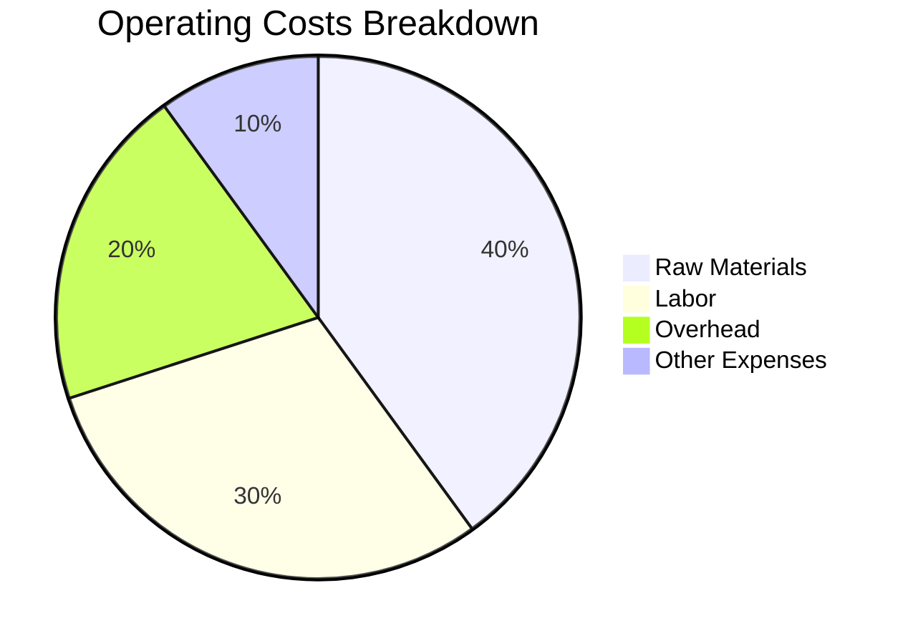

## 14.1.1 Statement of Comprehensive Income Analysis

The Statement of Comprehensive Income is a critical financial document that provides insights into a company's financial performance over a specific period. It encompasses various components, including revenue, operating costs, and dividend records, which are essential for evaluating a company's profitability and financial health. In this section, we will delve into these components, offering a comprehensive analysis to aid in informed investment decisions.

### Understanding the Components of the Statement of Comprehensive Income

#### Revenue Analysis

Revenue, often referred to as the top line, is the total income generated by a company from its business activities. It is a key indicator of a company's ability to grow and sustain its operations. When analyzing revenue, consider the following aspects:

- **Growth Drivers:** Evaluate how the company increases its revenue through price adjustments, volume growth, introduction of new products, market expansion, acquisitions, and market share gains. For instance, a Canadian tech company like Shopify might experience revenue growth by expanding its services globally or introducing new e-commerce solutions.

- **Trends and Sustainability:** Identify the reasons behind revenue growth or decline. Is the growth driven by one-time events, or is it sustainable over the long term? For example, a surge in revenue due to a temporary increase in demand might not be sustainable.

- **Market Conditions:** Consider external factors such as economic conditions, industry trends, and competitive landscape that could impact revenue. For instance, changes in consumer preferences or regulatory shifts in Canada can significantly affect revenue streams.

#### Operating Costs Analysis

Operating costs, including the cost of sales, are crucial for understanding a company's cost management effectiveness. Analyzing these costs involves:

- **Cost of Sales:** Calculate the cost of sales as a percentage of revenue to assess how efficiently a company manages its production or service delivery costs. A lower percentage indicates better cost management.

- **Gross Profit Margin Ratio:** This ratio is calculated by subtracting the cost of sales from revenue and dividing the result by revenue. It measures the profitability of a company after accounting for the cost of goods sold. A higher gross profit margin indicates a more profitable company.

- **Factors Affecting Costs:** Identify factors such as raw material costs, labor expenses, and operational efficiencies that influence operating costs. For example, a Canadian manufacturing firm might face increased costs due to rising raw material prices or labor shortages.

#### Dividend Record Analysis

Dividends are payments made to shareholders from a company's earnings. Analyzing a company's dividend record involves:

- **Dividend History:** Review the company's history of dividend payments to assess its commitment to returning value to shareholders. Consistent dividend payments can indicate financial stability.

- **Dividend Payout Ratio:** This ratio is calculated by dividing the total dividends paid by the net income. It shows the proportion of earnings distributed as dividends. A high payout ratio might indicate a generous dividend policy, but it could also suggest limited reinvestment in the business.

- **Sustainability of Dividends:** Assess the sustainability of dividend payments based on earnings stability and payout trends. For example, a company with volatile earnings might struggle to maintain consistent dividend payments.

### Practical Financial Examples and Case Studies

To illustrate these concepts, consider the following examples:

- **Revenue Growth Example:** A Canadian retailer like Loblaw Companies Limited might increase revenue by expanding its online grocery services, tapping into the growing e-commerce market.

- **Operating Costs Example:** A Canadian airline such as Air Canada could reduce operating costs by optimizing fuel efficiency and renegotiating supplier contracts, thereby improving its gross profit margin.

- **Dividend Record Example:** A major Canadian bank like RBC might maintain a stable dividend payout ratio, reflecting its strong earnings and commitment to shareholder returns.

### Best Practices and Common Pitfalls

- **Best Practices:** Regularly monitor revenue trends, cost management strategies, and dividend policies to ensure a comprehensive understanding of a company's financial health.

- **Common Pitfalls:** Avoid relying solely on revenue growth without considering cost management and dividend sustainability. A company with high revenue but poor cost control may not be financially healthy.

### Encouraging Critical Thinking and Continuous Learning

As you analyze the statement of comprehensive income, consider the broader economic and industry context. How do external factors influence a company's financial performance? Engage in continuous learning by exploring additional resources such as financial news, industry reports, and regulatory updates.

### Summary

The statement of comprehensive income provides valuable insights into a company's financial performance. By understanding the components of revenue, operating costs, and dividend records, you can make informed investment decisions. Apply these principles to your own financial analysis, considering best practices and potential challenges.

## Quiz Time!



### What is the primary purpose of analyzing revenue in the statement of comprehensive income?

- [x] To evaluate the company's ability to grow and sustain its operations
- [ ] To determine the company's tax obligations
- [ ] To assess the company's asset management
- [ ] To calculate the company's liabilities

> **Explanation:** Analyzing revenue helps evaluate a company's ability to grow and sustain its operations, which is crucial for assessing financial health.

### How is the gross profit margin ratio calculated?

- [x] (Revenue - Cost of Sales) / Revenue
- [ ] Revenue / Cost of Sales
- [ ] Net Income / Revenue
- [ ] Cost of Sales / Revenue

> **Explanation:** The gross profit margin ratio is calculated by subtracting the cost of sales from revenue and dividing the result by revenue.

### What does a high dividend payout ratio indicate?

- [x] A generous dividend policy
- [ ] High reinvestment in the business
- [ ] Low earnings stability
- [ ] Poor cost management

> **Explanation:** A high dividend payout ratio indicates a generous dividend policy, as a large proportion of earnings is distributed as dividends.

### Which factor is NOT typically considered when analyzing operating costs?

- [ ] Raw material costs
- [ ] Labor expenses
- [ ] Operational efficiencies
- [x] Market share

> **Explanation:** Market share is not typically considered when analyzing operating costs, as it relates more to revenue and competitive position.

### What is a potential risk of a company with a high dividend payout ratio?

- [x] Limited reinvestment in the business
- [ ] Increased market share
- [ ] Improved cost management
- [ ] Enhanced revenue growth

> **Explanation:** A high dividend payout ratio might indicate limited reinvestment in the business, which could affect long-term growth.

### Why is it important to assess the sustainability of revenue trends?

- [x] To determine if growth is driven by sustainable factors
- [ ] To calculate tax liabilities
- [ ] To evaluate asset depreciation
- [ ] To assess short-term profitability

> **Explanation:** Assessing the sustainability of revenue trends helps determine if growth is driven by sustainable factors, ensuring long-term financial health.

### What does a low cost of sales percentage indicate?

- [x] Better cost management
- [ ] Poor revenue growth
- [ ] High dividend payout
- [ ] Increased liabilities

> **Explanation:** A low cost of sales percentage indicates better cost management, as it reflects efficient production or service delivery.

### How can external factors impact a company's revenue?

- [x] By influencing market conditions and consumer preferences
- [ ] By determining tax obligations
- [ ] By affecting asset depreciation
- [ ] By increasing liabilities

> **Explanation:** External factors can impact a company's revenue by influencing market conditions and consumer preferences, affecting demand for products or services.

### What is a common pitfall when analyzing the statement of comprehensive income?

- [x] Relying solely on revenue growth without considering cost management
- [ ] Focusing on dividend history
- [ ] Ignoring market conditions
- [ ] Overemphasizing asset management

> **Explanation:** A common pitfall is relying solely on revenue growth without considering cost management, which can lead to an incomplete financial analysis.

### True or False: Consistent dividend payments can indicate financial stability.

- [x] True
- [ ] False

> **Explanation:** Consistent dividend payments can indicate financial stability, as they reflect a company's ability to generate sufficient earnings to return value to shareholders.


