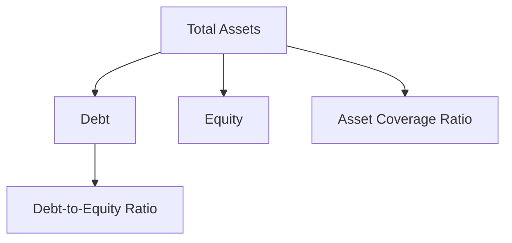

## 14.10 Risk Analysis Ratios

In the realm of financial analysis, understanding a company's risk profile is crucial for investors, analysts, and financial managers. Risk analysis ratios, such as the debt-to-equity ratio and asset coverage ratio, provide valuable insights into a company's financial leverage and solvency. This section delves into these ratios, their significance, and their implications for financial health and investment quality.

### Understanding Risk Analysis Ratios

Risk analysis ratios are tools used to evaluate the financial risk associated with a company's capital structure. They help assess how well a company can meet its long-term obligations and the extent to which it relies on debt financing. Two key ratios in this analysis are the debt-to-equity ratio and the asset coverage ratio.

#### Debt-to-Equity Ratio

The **Debt-to-Equity Ratio** is a measure of the degree to which a company is financing its operations through debt versus wholly-owned funds. It is calculated as:

 \text{Debt-to-Equity Ratio} = \frac{\text{Total Debt}}{\text{Total Equity}} 

This ratio indicates the relative proportion of shareholders' equity and debt used to finance a company's assets. A higher ratio suggests greater financial leverage, which can amplify returns but also increases risk. 

**Example:** Consider a Canadian company, MapleTech Inc., with total debt of CAD 500 million and total equity of CAD 250 million. The debt-to-equity ratio would be:

 \frac{500}{250} = 2.0 

This indicates that MapleTech Inc. uses twice as much debt as equity to finance its operations, highlighting a significant reliance on borrowed funds.

#### Asset Coverage Ratio

The **Asset Coverage Ratio** measures a company's ability to cover its debts with its assets. It is calculated as:

 \text{Asset Coverage Ratio} = \frac{\text{Total Assets} - \text{Intangible Assets} - \text{Current Liabilities}}{\text{Total Debt}} 

This ratio provides insight into the extent to which a company's assets can cover its outstanding debt obligations. A higher ratio indicates a stronger ability to meet debt obligations.

**Example:** Suppose MapleTech Inc. has total assets of CAD 1 billion, intangible assets of CAD 100 million, and current liabilities of CAD 200 million. The asset coverage ratio would be:

 \frac{1,000 - 100 - 200}{500} = 1.4 

This suggests that MapleTech Inc. has CAD 1.4 in assets for every CAD 1 of debt, indicating a reasonable level of asset coverage.

### Significance of Risk Analysis Ratios

Risk analysis ratios are vital for evaluating a company's financial leverage and solvency. They provide insights into the company's capital structure, risk exposure, and financial health.

#### Evaluating Financial Leverage

Financial leverage refers to the use of borrowed funds to increase the potential return on investment. While leverage can enhance returns, it also increases financial risk. The debt-to-equity ratio is a key indicator of financial leverage. A high ratio suggests that a company is heavily reliant on debt, which can lead to increased interest expenses and financial strain, especially in adverse economic conditions.

#### Assessing Solvency

Solvency is a company's ability to meet its long-term obligations. The asset coverage ratio is a critical measure of solvency, indicating whether a company's assets are sufficient to cover its debts. A low asset coverage ratio may signal potential solvency issues, raising concerns about the company's ability to sustain operations and meet debt obligations.

### Impact of Excessive Borrowing

Excessive borrowing can have significant implications for a company's financial health and investment quality. High levels of debt increase interest obligations, reduce financial flexibility, and elevate the risk of default. This can lead to a deterioration in credit ratings, increased borrowing costs, and reduced investor confidence.

**Case Study:** Consider the case of a major Canadian bank, such as the Royal Bank of Canada (RBC). If RBC were to significantly increase its debt levels without a corresponding increase in assets or equity, it could face heightened scrutiny from regulators and investors. This could result in a downgrade of its credit rating, higher interest rates on future borrowings, and a decline in stock price.

### Best Practices and Common Pitfalls

**Best Practices:**
- **Regular Monitoring:** Continuously monitor risk analysis ratios to assess changes in financial leverage and solvency.
- **Benchmarking:** Compare ratios against industry peers and historical performance to identify trends and potential risks.
- **Diversification:** Maintain a balanced capital structure to mitigate the risks associated with excessive leverage.

**Common Pitfalls:**
- **Overreliance on Debt:** Avoid excessive borrowing that can lead to financial distress and reduced flexibility.
- **Ignoring Asset Quality:** Ensure that asset valuations are realistic and account for potential impairments.

### Practical Application and Step-by-Step Guidance

To effectively utilize risk analysis ratios, follow these steps:

1. **Gather Financial Data:** Obtain the company's financial statements, including the balance sheet and income statement.
2. **Calculate Ratios:** Compute the debt-to-equity and asset coverage ratios using the formulas provided.
3. **Analyze Trends:** Evaluate the ratios over time to identify trends and assess financial health.
4. **Compare with Peers:** Benchmark the ratios against industry averages and competitors to gauge relative performance.
5. **Assess Implications:** Consider the implications of the ratios for financial leverage, solvency, and investment quality.

### Diagrams and Visual Aids

To enhance understanding, let's visualize the relationship between debt, equity, and assets using a simple diagram.

This diagram illustrates how total assets are divided into debt and equity, with the debt-to-equity ratio and asset coverage ratio providing insights into financial leverage and solvency.

### Resources for Further Exploration

For those interested in deepening their understanding of risk analysis ratios and financial leverage, consider the following resources:

- **Book:** *Corporate Debt Analysis* by Robert A. Kamil
- **Online Course:** [Risk Management and Financial Engineering](https://www.coursera.org/learn/financial-engineering-risk-management)

These resources offer comprehensive insights into corporate debt analysis and risk management strategies.

### Conclusion

Risk analysis ratios are essential tools for evaluating a company's financial leverage and solvency. By understanding and applying these ratios, investors and financial professionals can make informed decisions, assess risk exposure, and enhance investment quality. Regular monitoring, benchmarking, and prudent financial management are key to maintaining a healthy capital structure and ensuring long-term financial stability.

### **Ready to Test Your Knowledge?**

**Practice 10 Essential CSC Exam Questions to Master Your Certification**



### What does the debt-to-equity ratio measure?

- [x] The degree to which a company is financing its operations through debt versus equity
- [ ] The company's ability to cover its debts with its assets
- [ ] The company's profitability
- [ ] The company's liquidity

> **Explanation:** The debt-to-equity ratio measures the degree to which a company is financing its operations through debt versus equity.

### How is the asset coverage ratio calculated?

- [x] (Total Assets - Intangible Assets - Current Liabilities) / Total Debt
- [ ] Total Debt / Total Equity
- [ ] Total Assets / Total Liabilities
- [ ] Net Income / Total Assets

> **Explanation:** The asset coverage ratio is calculated as (Total Assets - Intangible Assets - Current Liabilities) / Total Debt.

### What does a high debt-to-equity ratio indicate?

- [x] Greater financial leverage
- [ ] Lower financial leverage
- [ ] Higher profitability
- [ ] Better liquidity

> **Explanation:** A high debt-to-equity ratio indicates greater financial leverage, meaning the company relies more on debt financing.

### What is the significance of the asset coverage ratio?

- [x] It measures a company's ability to cover its debts with its assets
- [ ] It measures a company's profitability
- [ ] It measures a company's liquidity
- [ ] It measures a company's market share

> **Explanation:** The asset coverage ratio measures a company's ability to cover its debts with its assets.

### What can excessive borrowing lead to?

- [x] Increased interest obligations
- [x] Reduced financial flexibility
- [ ] Improved credit ratings
- [ ] Higher stock prices

> **Explanation:** Excessive borrowing can lead to increased interest obligations and reduced financial flexibility.

### Why is regular monitoring of risk analysis ratios important?

- [x] To assess changes in financial leverage and solvency
- [ ] To increase profitability
- [ ] To improve market share
- [ ] To enhance customer satisfaction

> **Explanation:** Regular monitoring of risk analysis ratios is important to assess changes in financial leverage and solvency.

### What is a common pitfall in risk analysis?

- [x] Overreliance on debt
- [x] Ignoring asset quality
- [ ] Diversification
- [ ] Regular monitoring

> **Explanation:** Overreliance on debt and ignoring asset quality are common pitfalls in risk analysis.

### What does a low asset coverage ratio indicate?

- [x] Potential solvency issues
- [ ] High profitability
- [ ] Strong financial health
- [ ] High liquidity

> **Explanation:** A low asset coverage ratio may indicate potential solvency issues.

### How can companies mitigate the risks associated with excessive leverage?

- [x] Maintain a balanced capital structure
- [ ] Increase borrowing
- [ ] Focus solely on equity financing
- [ ] Ignore industry benchmarks

> **Explanation:** Companies can mitigate risks by maintaining a balanced capital structure.

### True or False: A higher asset coverage ratio indicates a stronger ability to meet debt obligations.

- [x] True
- [ ] False

> **Explanation:** A higher asset coverage ratio indicates a stronger ability to meet debt obligations.


