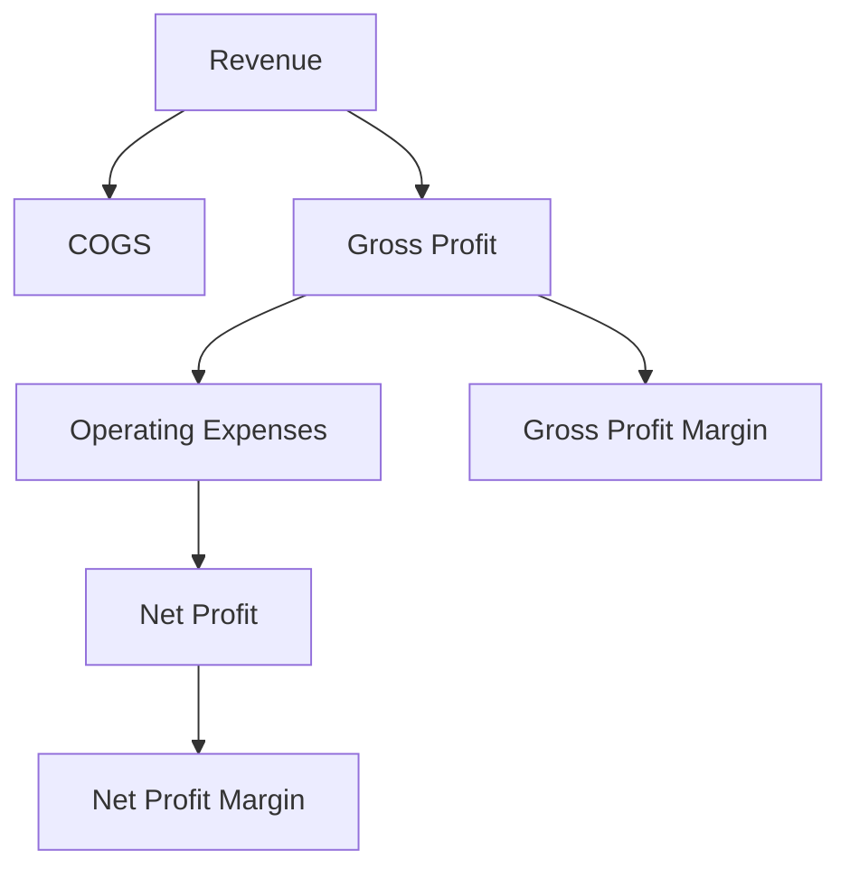

## 14.11 Operating Performance Ratios

In the realm of financial analysis, operating performance ratios serve as vital tools for assessing a company's efficiency in utilizing its resources. These ratios provide insights into how well management is converting inputs into profitable outputs, which is crucial for investors, analysts, and stakeholders. This section delves into key performance indicators such as the gross profit margin and net profit margin, offering a comprehensive understanding of their significance in evaluating profitability and operational efficiency.

### Understanding Operating Performance Ratios

Operating performance ratios are financial metrics that evaluate a company's ability to generate profits from its operations. These ratios are essential for understanding how effectively a company is managed and how well it is performing relative to its peers. By analyzing these ratios, investors can make informed decisions about the potential risks and returns associated with investing in a particular company.

### Key Performance Indicators

#### Gross Profit Margin

The **Gross Profit Margin** is a critical indicator of a company's financial health. It measures the proportion of revenue that exceeds the cost of goods sold (COGS), reflecting the efficiency of production and pricing strategies. The formula for calculating the gross profit margin is:

 \text{Gross Profit Margin} = \left( \frac{\text{Revenue} - \text{COGS}}{\text{Revenue}} \right) \times 100 

A higher gross profit margin indicates that a company retains more money from each dollar of sales, which can be used to cover other expenses and generate profits. For instance, if a Canadian retail company like Hudson's Bay reports a gross profit margin of 40%, it means that 40% of its revenue remains after accounting for the cost of goods sold.

#### Net Profit Margin

The **Net Profit Margin** is another crucial metric that measures the percentage of revenue that remains as profit after all expenses, including operating expenses, interest, taxes, and other costs, have been deducted. The formula for calculating the net profit margin is:

 \text{Net Profit Margin} = \left( \frac{\text{Net Profit}}{\text{Revenue}} \right) \times 100 

This ratio provides a comprehensive view of a company's overall profitability. A higher net profit margin indicates better control over costs and a more profitable operation. For example, if the Royal Bank of Canada (RBC) reports a net profit margin of 20%, it signifies that 20% of its total revenue is converted into net income.

### Assessing Profitability and Operational Efficiency

Operating performance ratios are instrumental in assessing a company's profitability and operational efficiency. By comparing these ratios across different periods or against industry benchmarks, investors can gauge how well a company is performing and identify trends or areas for improvement.

#### Case Study: Canadian Banking Sector

Consider the Canadian banking sector, where institutions like RBC and TD Bank are known for their robust financial performance. By analyzing their gross and net profit margins, investors can assess how efficiently these banks are managing their resources and generating profits. A consistent increase in these ratios over time may indicate effective management strategies and a strong competitive position.

#### Practical Example: Analyzing a Retail Portfolio

Imagine an investor evaluating a portfolio of Canadian retail stocks. By calculating and comparing the gross and net profit margins of companies like Canadian Tire and Loblaws, the investor can identify which companies are more efficient in converting sales into profits. This analysis can inform investment decisions and portfolio adjustments.

### Best Practices and Common Pitfalls

When analyzing operating performance ratios, it's important to consider the following best practices and potential challenges:

- **Benchmarking:** Compare ratios against industry averages or competitors to gain meaningful insights.
- **Trend Analysis:** Evaluate ratios over multiple periods to identify trends and assess consistency in performance.
- **Contextual Understanding:** Consider external factors such as economic conditions, regulatory changes, and market dynamics that may impact ratios.

Common pitfalls include relying solely on these ratios without considering qualitative factors or failing to account for one-time events that may skew results.

### Diagrams and Visual Aids

To enhance understanding, consider the following diagram illustrating the relationship between revenue, COGS, and profit margins:

This diagram visually represents the flow of revenue through a company's financial structure, highlighting the calculation of gross and net profit margins.

### Resources for Further Exploration

For those interested in deepening their understanding of operating performance ratios, consider exploring the following resources:

- Article: [Operating Performance Ratios](https://www.investopedia.com/terms/o/operatingmargin.asp)
- Book: *Measuring and Managing Performance in Organizations* by Robert D. Austin

These resources provide additional insights into the application and interpretation of performance ratios in various organizational contexts.

### Conclusion

Operating performance ratios are indispensable tools for evaluating a company's efficiency and profitability. By mastering these ratios, investors and analysts can make informed decisions and gain a competitive edge in the financial markets. As you continue to explore the intricacies of financial analysis, remember to apply these principles to real-world scenarios, leveraging Canadian financial instruments and regulations to optimize your investment strategies.

### **Ready to Test Your Knowledge?**

**Practice 10 Essential CSC Exam Questions to Master Your Certification**



### What does the Gross Profit Margin indicate?

- [x] The proportion of revenue that exceeds the cost of goods sold
- [ ] The total revenue generated by a company
- [ ] The amount of net profit after all expenses
- [ ] The company's total assets

> **Explanation:** The Gross Profit Margin indicates the proportion of revenue that exceeds the cost of goods sold, reflecting the efficiency of production and pricing strategies.

### How is the Net Profit Margin calculated?

- [x] (Net Profit / Revenue) x 100
- [ ] (Revenue - COGS) / Revenue
- [ ] (Operating Expenses / Revenue) x 100
- [ ] (Net Profit / Total Assets) x 100

> **Explanation:** The Net Profit Margin is calculated by dividing net profit by revenue and multiplying by 100 to get a percentage.

### Which ratio provides a comprehensive view of a company's overall profitability?

- [x] Net Profit Margin
- [ ] Gross Profit Margin
- [ ] Current Ratio
- [ ] Debt-to-Equity Ratio

> **Explanation:** The Net Profit Margin provides a comprehensive view of a company's overall profitability by considering all expenses.

### What does a higher gross profit margin indicate?

- [x] More money retained from each dollar of sales
- [ ] Higher total revenue
- [ ] Increased operating expenses
- [ ] Greater net profit

> **Explanation:** A higher gross profit margin indicates that a company retains more money from each dollar of sales, which can be used to cover other expenses and generate profits.

### Why is trend analysis important when evaluating operating performance ratios?

- [x] To identify trends and assess consistency in performance
- [ ] To calculate the total revenue
- [ ] To determine the company's market share
- [ ] To evaluate the company's asset allocation

> **Explanation:** Trend analysis is important to identify trends and assess consistency in performance over multiple periods.

### What is a common pitfall when analyzing operating performance ratios?

- [x] Relying solely on ratios without considering qualitative factors
- [ ] Comparing ratios to industry benchmarks
- [ ] Evaluating ratios over multiple periods
- [ ] Considering external factors

> **Explanation:** A common pitfall is relying solely on ratios without considering qualitative factors or external influences.

### Which Canadian financial institution is known for robust financial performance?

- [x] Royal Bank of Canada (RBC)
- [ ] Bank of America
- [ ] HSBC
- [ ] Deutsche Bank

> **Explanation:** The Royal Bank of Canada (RBC) is known for its robust financial performance and is a major player in the Canadian banking sector.

### What is the significance of benchmarking in ratio analysis?

- [x] To compare ratios against industry averages or competitors
- [ ] To calculate the company's total assets
- [ ] To determine the company's net profit
- [ ] To evaluate the company's debt levels

> **Explanation:** Benchmarking is significant in ratio analysis as it allows for comparison against industry averages or competitors to gain meaningful insights.

### What does the diagram illustrate in the context of operating performance ratios?

- [x] The flow of revenue through a company's financial structure
- [ ] The company's total liabilities
- [ ] The market share of the company
- [ ] The company's asset allocation

> **Explanation:** The diagram illustrates the flow of revenue through a company's financial structure, highlighting the calculation of gross and net profit margins.

### True or False: Operating performance ratios are only useful for large corporations.

- [ ] True
- [x] False

> **Explanation:** False. Operating performance ratios are useful for companies of all sizes as they provide insights into efficiency and profitability.


